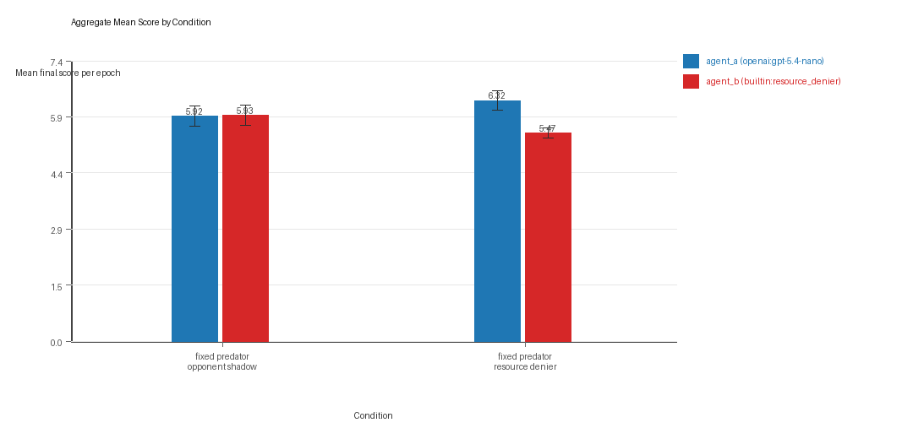
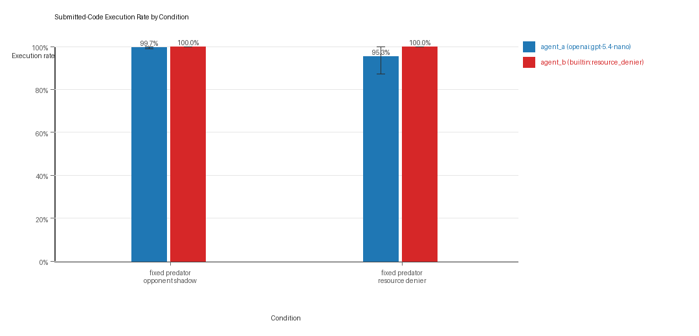
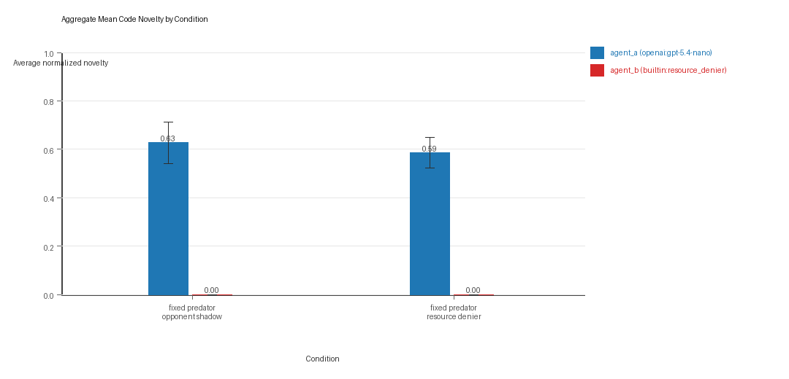
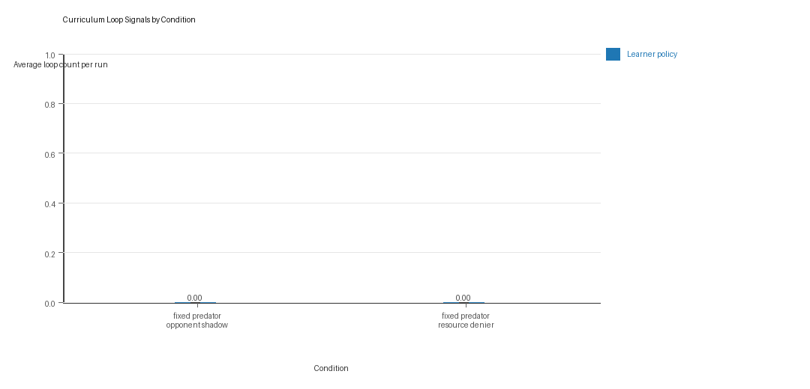
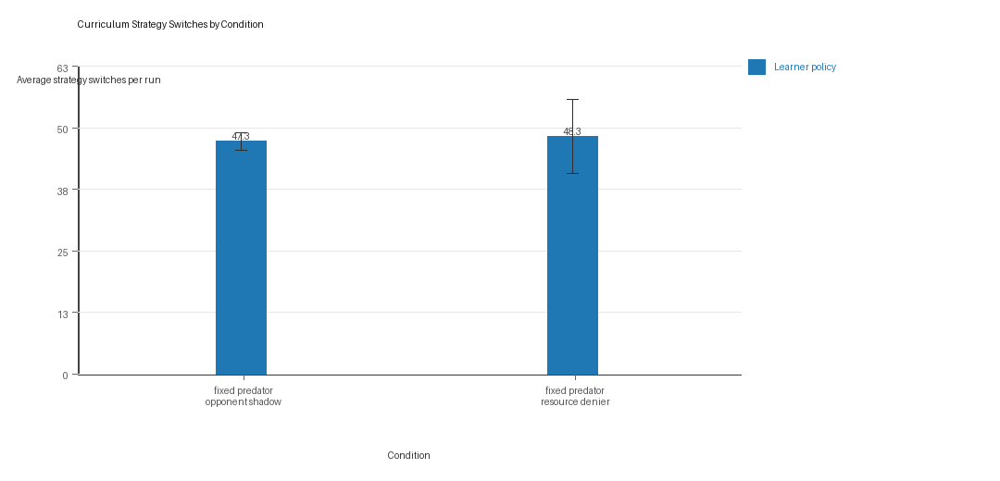

# Aggregate Research Report

## Included Runs
- Run count: 3.
- Conditions aggregated: 2.
- Runs: `run_20260505_145655_a`, `run_20260505_154134_b`, `run_20260505_161951_c`.

## Cross-Run Summary
- No same-model conditions were included in this aggregate.
- Cross-model novelty mean 0.6061 (std 0.014, 95% CI 0.5903 to 0.6219).
- No same-model rule-boundary indicator summary is available for this aggregate.
- Cross-model rule-boundary indicators mean 0.0 (std 0.0, 95% CI 0.0 to 0.0).
- Curriculum loop count mean 0.0 (std 0.0, 95% CI 0.0 to 0.0).
- Curriculum strategy switches mean 47.8333 (std 3.7528, 95% CI 43.5867 to 52.08).
- Curriculum post-loss novelty spikes mean 32.3333 (std 4.6458, 95% CI 27.0761 to 37.5905).
- Curriculum specific adaptation count mean 23.8333 (std 3.0551, 95% CI 20.3762 to 27.2904).
- Curriculum behavior-cell coverage mean 22.5 (std 2.5, 95% CI 19.671 to 25.329).

## Aggregate Charts
### Mean Score by Condition

- Each bar shows the mean final score per epoch for one agent role in that condition.
- Error bars show the 95% confidence interval across the included runs.

### Submitted-Code Execution Rate by Condition

- The y-axis is the percentage of epochs where submitted code executed instead of a fallback policy.
- Values near 100% indicate the infrastructure stayed reliable across the included runs.

### Mean Code Novelty by Condition

- Novelty is the average normalized code-change score across epochs for that agent role and condition.
- Higher bars indicate more code variation across repeated runs, not necessarily better performance.

### Curriculum Loop Signals

- Higher bars indicate more repeated motifs or unchanged-policy loops under the curriculum conditions.

### Curriculum Strategy Switches

- Higher bars indicate more switches between heuristic or behavior classes across epochs.

## Condition Results
### fixed_predator_opponent_shadow
- Matchup type: cross-model.
- Curriculum roles: learner = agent_a (openai:gpt-5.4-nano); opponent role = agent_b (builtin:opponent_shadow).
- Fully clean run count: 2/3.
- Research tags: predator_label=opponent_shadow, replicate_label=a, seed_offset=0, suite_family=curriculum_suite, suite_type=fixed_predator; predator_label=opponent_shadow, replicate_label=b, seed_offset=1000, suite_family=curriculum_suite, suite_type=fixed_predator; predator_label=opponent_shadow, replicate_label=c, seed_offset=2000, suite_family=curriculum_suite, suite_type=fixed_predator.
- agent_a (openai:gpt-5.4-nano) average score: agent_a (openai:gpt-5.4-nano) mean 5.915 (std 0.2388, 95% CI 5.6448 to 6.1852).
- agent_a (openai:gpt-5.4-nano) generation success rate: agent_a (openai:gpt-5.4-nano) mean 0.9967 (std 0.0058, 95% CI 0.9901 to 1.0).
- agent_a (openai:gpt-5.4-nano) submitted-code execution rate: agent_a (openai:gpt-5.4-nano) mean 0.9967 (std 0.0058, 95% CI 0.9901 to 1.0).
- agent_a (openai:gpt-5.4-nano) novelty: agent_a (openai:gpt-5.4-nano) mean 0.6269 (std 0.0762, 95% CI 0.5407 to 0.7132).
- agent_a (openai:gpt-5.4-nano) rule-boundary indicator count: agent_a (openai:gpt-5.4-nano) mean 0.0 (std 0.0, 95% CI 0.0 to 0.0).
- agent_b (builtin:opponent_shadow) average score: agent_b (builtin:opponent_shadow) mean 5.935 (std 0.234, 95% CI 5.6702 to 6.1998).
- agent_b (builtin:opponent_shadow) generation success rate: agent_b (builtin:opponent_shadow) mean 1.0 (std 0.0, 95% CI 1.0 to 1.0).
- agent_b (builtin:opponent_shadow) submitted-code execution rate: agent_b (builtin:opponent_shadow) mean 1.0 (std 0.0, 95% CI 1.0 to 1.0).
- agent_b (builtin:opponent_shadow) novelty: agent_b (builtin:opponent_shadow) mean 0.0 (std 0.0, 95% CI 0.0 to 0.0).
- agent_b (builtin:opponent_shadow) rule-boundary indicator count: agent_b (builtin:opponent_shadow) mean 0.0 (std 0.0, 95% CI 0.0 to 0.0).
- Learner loop count: learner mean 0.0 (std 0.0, 95% CI 0.0 to 0.0).
- Learner stable strategy switches: learner mean 47.3333 (std 1.5275, 95% CI 45.6048 to 49.0619).
- Learner post-loss novelty spikes: learner mean 39.3333 (std 4.7258, 95% CI 33.9856 to 44.6811).
- Learner same-opponent adaptation count: learner mean 28.0 (std 3.6056, 95% CI 23.9199 to 32.0801).
- Learner behavior-cell coverage: learner mean 24.6667 (std 0.5774, 95% CI 24.0133 to 25.32).
- Elite archive coverage: elite archive coverage mean 4.6667 (std 0.5774, 95% CI 4.0133 to 5.32).
- agent_a win share: agent_a mean 0.3733 (std 0.0751, 95% CI 0.2884 to 0.4583).
- agent_b win share: agent_b mean 0.3933 (std 0.0473, 95% CI 0.3399 to 0.4468).
- draw win share: draw mean 0.2333 (std 0.0493, 95% CI 0.1775 to 0.2892).
- Qualitative follow-up candidates:
- Follow-up candidate from `run_20260505_145655_a`, epoch 20: largest score margin: agent_a (openai:gpt-5.4-nano) 12.0 vs agent_b (builtin:opponent_shadow) 0.0.
- Follow-up candidate from `run_20260505_145655_a`, epoch 11: most runtime issues in one epoch: 80.
- Follow-up candidate from `run_20260505_145655_a`, epoch 3: largest average code shift between consecutive epochs: 0.441.
- Follow-up candidate from `run_20260505_154134_b`, epoch 20: largest score margin: agent_a (openai:gpt-5.4-nano) 12.0 vs agent_b (builtin:opponent_shadow) 0.0.

### fixed_predator_resource_denier
- Matchup type: cross-model.
- Curriculum roles: learner = agent_a (openai:gpt-5.4-nano); opponent role = agent_b (builtin:resource_denier).
- Fully clean run count: 1/3.
- Research tags: predator_label=resource_denier, replicate_label=a, seed_offset=0, suite_family=curriculum_suite, suite_type=fixed_predator; predator_label=resource_denier, replicate_label=b, seed_offset=1000, suite_family=curriculum_suite, suite_type=fixed_predator; predator_label=resource_denier, replicate_label=c, seed_offset=2000, suite_family=curriculum_suite, suite_type=fixed_predator.
- agent_a (openai:gpt-5.4-nano) average score: agent_a (openai:gpt-5.4-nano) mean 6.3217 (std 0.2281, 95% CI 6.0635 to 6.5798).
- agent_a (openai:gpt-5.4-nano) generation success rate: agent_a (openai:gpt-5.4-nano) mean 0.9533 (std 0.0723, 95% CI 0.8715 to 1.0).
- agent_a (openai:gpt-5.4-nano) submitted-code execution rate: agent_a (openai:gpt-5.4-nano) mean 0.9533 (std 0.0723, 95% CI 0.8715 to 1.0).
- agent_a (openai:gpt-5.4-nano) novelty: agent_a (openai:gpt-5.4-nano) mean 0.5852 (std 0.0555, 95% CI 0.5224 to 0.648).
- agent_a (openai:gpt-5.4-nano) rule-boundary indicator count: agent_a (openai:gpt-5.4-nano) mean 0.0 (std 0.0, 95% CI 0.0 to 0.0).
- agent_b (builtin:resource_denier) average score: agent_b (builtin:resource_denier) mean 5.4683 (std 0.1193, 95% CI 5.3333 to 5.6033).
- agent_b (builtin:resource_denier) generation success rate: agent_b (builtin:resource_denier) mean 1.0 (std 0.0, 95% CI 1.0 to 1.0).
- agent_b (builtin:resource_denier) submitted-code execution rate: agent_b (builtin:resource_denier) mean 1.0 (std 0.0, 95% CI 1.0 to 1.0).
- agent_b (builtin:resource_denier) novelty: agent_b (builtin:resource_denier) mean 0.0 (std 0.0, 95% CI 0.0 to 0.0).
- agent_b (builtin:resource_denier) rule-boundary indicator count: agent_b (builtin:resource_denier) mean 0.0 (std 0.0, 95% CI 0.0 to 0.0).
- Learner loop count: learner mean 0.0 (std 0.0, 95% CI 0.0 to 0.0).
- Learner stable strategy switches: learner mean 48.3333 (std 6.6583, 95% CI 40.7987 to 55.8679).
- Learner post-loss novelty spikes: learner mean 25.3333 (std 4.6188, 95% CI 20.1067 to 30.56).
- Learner same-opponent adaptation count: learner mean 19.6667 (std 3.2146, 95% CI 16.0291 to 23.3043).
- Learner behavior-cell coverage: learner mean 20.3333 (std 5.5076, 95% CI 14.1009 to 26.5657).
- Elite archive coverage: elite archive coverage mean 3.6667 (std 2.0817, 95% CI 1.311 to 6.0223).
- agent_a win share: agent_a mean 0.5033 (std 0.0416, 95% CI 0.4562 to 0.5504).
- agent_b win share: agent_b mean 0.2567 (std 0.0493, 95% CI 0.2008 to 0.3125).
- draw win share: draw mean 0.24 (std 0.0173, 95% CI 0.2204 to 0.2596).
- Qualitative follow-up candidates:
- Follow-up candidate from `run_20260505_145655_a`, epoch 57: largest score margin: agent_a (openai:gpt-5.4-nano) 12.0 vs agent_b (builtin:resource_denier) 0.0.
- Follow-up candidate from `run_20260505_145655_a`, epoch 3: most runtime issues in one epoch: 158.
- Follow-up candidate from `run_20260505_145655_a`, epoch 59: largest average code shift between consecutive epochs: 0.4635.
- Follow-up candidate from `run_20260505_154134_b`, epoch 41: largest score margin: agent_a (openai:gpt-5.4-nano) 0.0 vs agent_b (builtin:resource_denier) 12.0.

## Interpretation Caveats
- Aggregate results are only as strong as the included run set. If the input runs mix different prompts, environments, or suite definitions, treat the summary as descriptive rather than causal.
- Confidence intervals here summarize variation across run-level condition summaries; they are not substitutes for careful experimental design.
- Use this aggregate report together with per-run reports and the research checklist before making strong claims.

## Aggregate Conclusions
- Data quality summary: 0/2 conditions were fully clean, 1/2 were near-clean, and 1/2 remained higher-noise.
- This aggregate includes curriculum conditions, so the learner policy is the primary unit of analysis and opponent-role metrics are contextual.

### Best-Supported Findings
- This aggregate only supports cross-model novelty summary (0.6061); no same-model comparison is available here.
- Rule-boundary indicator rates for the available cross-model conditions were 0.0; no same-model comparison is available here.
- Curriculum loop pressure produced an average loop count of 0.0 and an average strategy-switch count of 47.8333 across enabled conditions.
- Specific same-opponent adaptation signals averaged 23.8333 across enabled curriculum conditions.

### Directional Or Uncertain Findings
- Conditions classified as higher-noise should be treated as exploratory unless the same direction reappears in cleaner replicate runs.

### Claims Not Supported Yet
- The aggregate does not by itself establish causality; the strongest causal interpretations should come from replicated ablation conditions rather than from mixed-condition summaries alone.
- Code novelty should not be treated as equivalent to strategic innovation without qualitative review of notable epochs and behavior traces.
