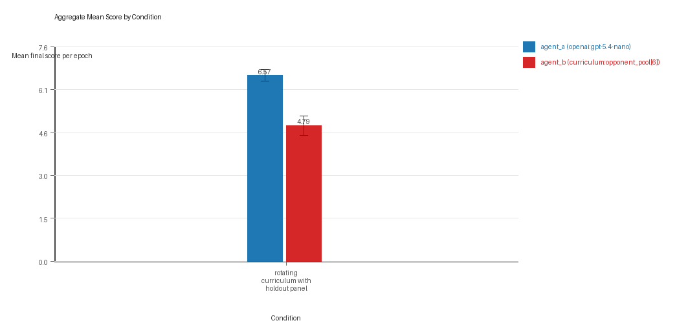
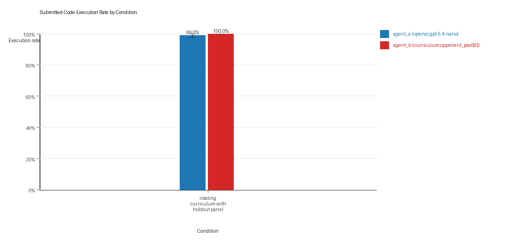
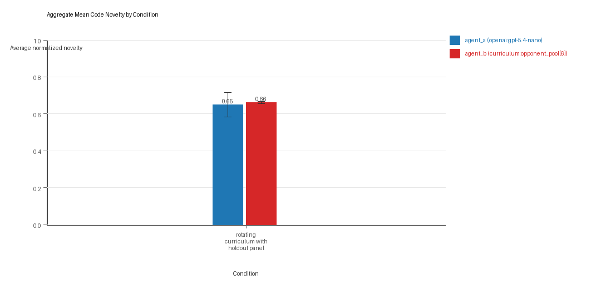
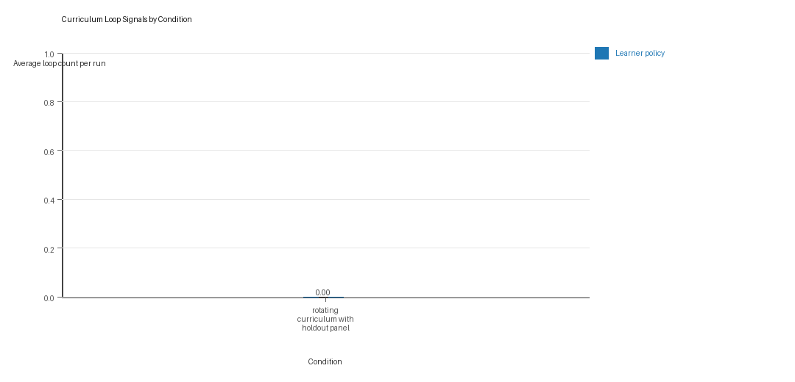
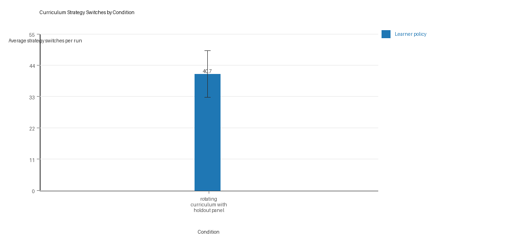

# Aggregate Research Report

## Included Runs
- Run count: 3.
- Conditions aggregated: 1.
- Runs: `run_20260506_074448_a`, `run_20260506_083740_b`, `run_20260506_105312_c`.

## Cross-Run Summary
- No same-model conditions were included in this aggregate.
- Cross-model novelty mean 0.65 (std 0.0582, 95% CI 0.5842 to 0.7158).
- No same-model rule-boundary indicator summary is available for this aggregate.
- Cross-model rule-boundary indicators mean 0.0 (std 0.0, 95% CI 0.0 to 0.0).
- Curriculum loop count mean 0.0 (std 0.0, 95% CI 0.0 to 0.0).
- Curriculum strategy switches mean 40.6667 (std 7.2342, 95% CI 32.4804 to 48.8529).
- Curriculum post-loss novelty spikes mean 29.0 (std 4.0, 95% CI 24.4736 to 33.5264).
- Curriculum specific adaptation count mean 23.0 (std 1.7321, 95% CI 21.04 to 24.96).
- Curriculum behavior-cell coverage mean 24.6667 (std 1.5275, 95% CI 22.9381 to 26.3952).

## Aggregate Charts
### Mean Score by Condition

- Each bar shows the mean final score per epoch for one agent role in that condition.
- Error bars show the 95% confidence interval across the included runs.

### Submitted-Code Execution Rate by Condition

- The y-axis is the percentage of epochs where submitted code executed instead of a fallback policy.
- Values near 100% indicate the infrastructure stayed reliable across the included runs.

### Mean Code Novelty by Condition

- Novelty is the average normalized code-change score across epochs for that agent role and condition.
- Higher bars indicate more code variation across repeated runs, not necessarily better performance.

### Curriculum Loop Signals

- Higher bars indicate more repeated motifs or unchanged-policy loops under the curriculum conditions.

### Curriculum Strategy Switches

- Higher bars indicate more switches between heuristic or behavior classes across epochs.

## Condition Results
### rotating_curriculum_with_holdout_panel
- Matchup type: cross-model.
- Curriculum roles: learner = agent_a (openai:gpt-5.4-nano); opponent role = agent_b (curriculum:opponent_pool[6]).
- Fully clean run count: 1/3.
- Research tags: holdout_enabled=True, replicate_label=a, seed_offset=0, suite_family=curriculum_suite, suite_type=holdout_evaluation; holdout_enabled=True, replicate_label=b, seed_offset=1000, suite_family=curriculum_suite, suite_type=holdout_evaluation; holdout_enabled=True, replicate_label=c, seed_offset=2000, suite_family=curriculum_suite, suite_type=holdout_evaluation.
- agent_a (openai:gpt-5.4-nano) average score: agent_a (openai:gpt-5.4-nano) mean 6.5667 (std 0.1841, 95% CI 6.3583 to 6.775).
- agent_a (openai:gpt-5.4-nano) generation success rate: agent_a (openai:gpt-5.4-nano) mean 0.99 (std 0.01, 95% CI 0.9787 to 1.0).
- agent_a (openai:gpt-5.4-nano) submitted-code execution rate: agent_a (openai:gpt-5.4-nano) mean 0.99 (std 0.01, 95% CI 0.9787 to 1.0).
- agent_a (openai:gpt-5.4-nano) novelty: agent_a (openai:gpt-5.4-nano) mean 0.65 (std 0.0582, 95% CI 0.5842 to 0.7158).
- agent_a (openai:gpt-5.4-nano) rule-boundary indicator count: agent_a (openai:gpt-5.4-nano) mean 0.0 (std 0.0, 95% CI 0.0 to 0.0).
- agent_b (curriculum:opponent_pool[6]) average score: agent_b (curriculum:opponent_pool[6]) mean 4.79 (std 0.2979, 95% CI 4.4529 to 5.1271).
- agent_b (curriculum:opponent_pool[6]) generation success rate: agent_b (curriculum:opponent_pool[6]) mean 1.0 (std 0.0, 95% CI 1.0 to 1.0).
- agent_b (curriculum:opponent_pool[6]) submitted-code execution rate: agent_b (curriculum:opponent_pool[6]) mean 1.0 (std 0.0, 95% CI 1.0 to 1.0).
- agent_b (curriculum:opponent_pool[6]) novelty: agent_b (curriculum:opponent_pool[6]) mean 0.6617 (std 0.0058, 95% CI 0.6552 to 0.6682).
- agent_b (curriculum:opponent_pool[6]) rule-boundary indicator count: agent_b (curriculum:opponent_pool[6]) mean 0.0 (std 0.0, 95% CI 0.0 to 0.0).
- Learner loop count: learner mean 0.0 (std 0.0, 95% CI 0.0 to 0.0).
- Learner stable strategy switches: learner mean 40.6667 (std 7.2342, 95% CI 32.4804 to 48.8529).
- Learner post-loss novelty spikes: learner mean 29.0 (std 4.0, 95% CI 24.4736 to 33.5264).
- Learner same-opponent adaptation count: learner mean 23.0 (std 1.7321, 95% CI 21.04 to 24.96).
- Learner behavior-cell coverage: learner mean 24.6667 (std 1.5275, 95% CI 22.9381 to 26.3952).
- Elite archive coverage: elite archive coverage mean 8.6667 (std 0.5774, 95% CI 8.0133 to 9.32).
- agent_a win share: agent_a mean 0.53 (std 0.0624, 95% CI 0.4593 to 0.6007).
- agent_b win share: agent_b mean 0.29 (std 0.04, 95% CI 0.2447 to 0.3353).
- draw win share: draw mean 0.18 (std 0.0265, 95% CI 0.1501 to 0.2099).
- Holdout evaluation was enabled in 3/3 runs for this condition.
- Holdout `center_rush` mean margin: center_rush mean 0.9333 (std 0.9452, 95% CI -0.1362 to 2.0029).
- Holdout `center_rush` win rate: center_rush mean 0.4667 (std 0.1155, 95% CI 0.336 to 0.5973).
- Holdout `corner_guard` mean margin: corner_guard mean 0.1333 (std 0.3055, 95% CI -0.2124 to 0.479).
- Holdout `corner_guard` win rate: corner_guard mean 0.3333 (std 0.1155, 95% CI 0.2027 to 0.464).
- Holdout `diagonal_probe` mean margin: diagonal_probe mean 2.4 (std 1.51, 95% CI 0.6913 to 4.1087).
- Holdout `diagonal_probe` win rate: diagonal_probe mean 0.6 (std 0.3464, 95% CI 0.208 to 0.992).
- Holdout `edge_patrol` mean margin: edge_patrol mean 5.9333 (std 0.3055, 95% CI 5.5876 to 6.279).
- Holdout `edge_patrol` win rate: edge_patrol mean 1.0 (std 0.0, 95% CI 1.0 to 1.0).
- Holdout `resource_denier` mean margin: resource_denier mean 2.0 (std 1.0392, 95% CI 0.824 to 3.176).
- Holdout `resource_denier` win rate: resource_denier mean 0.6 (std 0.2, 95% CI 0.3737 to 0.8263).
- Holdout `safe_collector` mean margin: safe_collector mean 0.8 (std 0.6, 95% CI 0.121 to 1.479).
- Holdout `safe_collector` win rate: safe_collector mean 0.4 (std 0.0, 95% CI 0.4 to 0.4).
- Qualitative follow-up candidates:
- Follow-up candidate from `run_20260506_074448_a`, epoch 2: largest score margin: agent_a (openai:gpt-5.4-nano) 12.0 vs agent_b (curriculum:opponent_pool[6]) 0.0.
- Follow-up candidate from `run_20260506_074448_a`, epoch 31: most runtime issues in one epoch: 142.
- Follow-up candidate from `run_20260506_074448_a`, epoch 39: first fallback/default-code epoch for agent_a (openai:gpt-5.4-nano).
- Follow-up candidate from `run_20260506_074448_a`, epoch 43: largest average code shift between consecutive epochs: 0.8681.

## Interpretation Caveats
- Aggregate results are only as strong as the included run set. If the input runs mix different prompts, environments, or suite definitions, treat the summary as descriptive rather than causal.
- Confidence intervals here summarize variation across run-level condition summaries; they are not substitutes for careful experimental design.
- Use this aggregate report together with per-run reports and the research checklist before making strong claims.

## Aggregate Conclusions
- Data quality summary: 0/1 conditions were fully clean, 1/1 were near-clean, and 0/1 remained higher-noise.
- This aggregate includes curriculum conditions, so the learner policy is the primary unit of analysis and opponent-role metrics are contextual.

### Best-Supported Findings
- This aggregate only supports cross-model novelty summary (0.65); no same-model comparison is available here.
- Rule-boundary indicator rates for the available cross-model conditions were 0.0; no same-model comparison is available here.
- Curriculum loop pressure produced an average loop count of 0.0 and an average strategy-switch count of 40.6667 across enabled conditions.
- Specific same-opponent adaptation signals averaged 23.0 across enabled curriculum conditions.
- Holdout-panel evidence: rotating curriculum with holdout panel vs center_rush: mean margin 0.9333, win rate 0.4667; rotating curriculum with holdout panel vs corner_guard: mean margin 0.1333, win rate 0.3333; rotating curriculum with holdout panel vs diagonal_probe: mean margin 2.4, win rate 0.6; rotating curriculum with holdout panel vs edge_patrol: mean margin 5.9333, win rate 1.0; rotating curriculum with holdout panel vs resource_denier: mean margin 2.0, win rate 0.6; rotating curriculum with holdout panel vs safe_collector: mean margin 0.8, win rate 0.4.

### Directional Or Uncertain Findings
- No major directional-only findings stood out beyond the supported points above.

### Claims Not Supported Yet
- The aggregate does not by itself establish causality; the strongest causal interpretations should come from replicated ablation conditions rather than from mixed-condition summaries alone.
- Code novelty is not equivalent to strategic innovation. Notable epochs and behavior traces require qualitative review.
