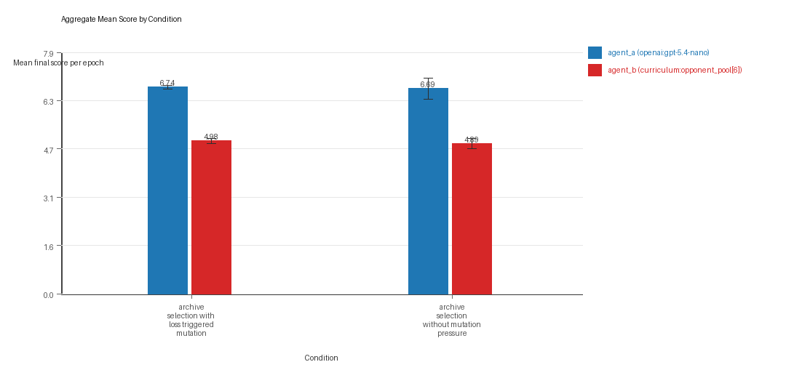
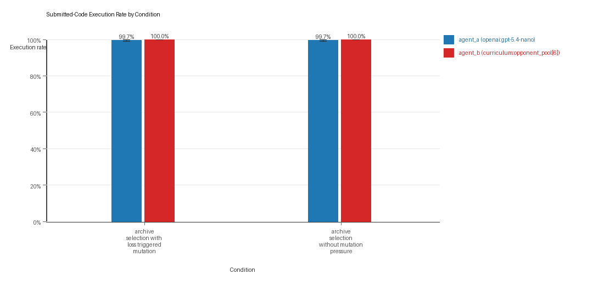
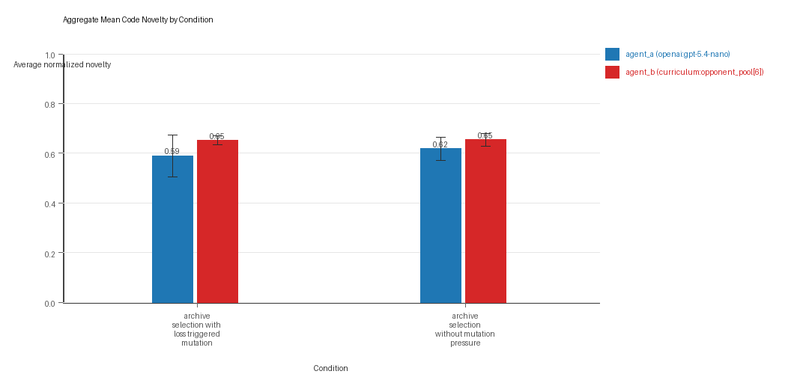
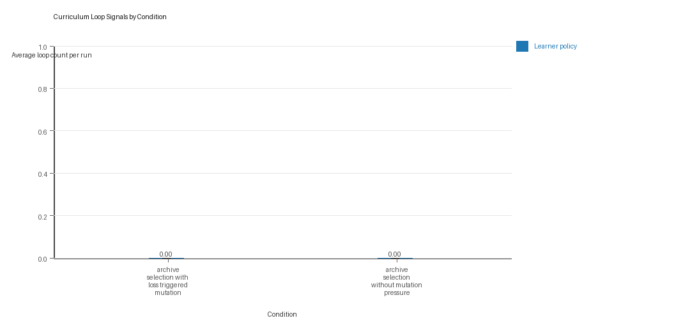
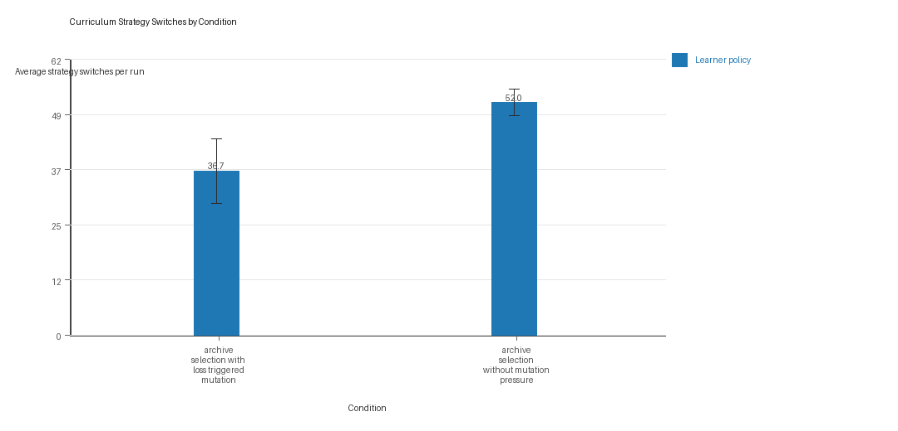

# Aggregate Research Report

## Included Runs
- Run count: 3.
- Conditions aggregated: 2.
- Runs: `run_20260505_184210_a`, `run_20260505_192355_b`, `run_20260505_200606_c`.

## Cross-Run Summary
- No same-model conditions were included in this aggregate.
- Cross-model novelty mean 0.6034 (std 0.0572, 95% CI 0.5387 to 0.6682).
- No same-model rule-boundary indicator summary is available for this aggregate.
- Cross-model rule-boundary indicators mean 0.3333 (std 0.2887, 95% CI 0.0067 to 0.66).
- Curriculum loop count mean 0.0 (std 0.0, 95% CI 0.0 to 0.0).
- Curriculum strategy switches mean 44.3333 (std 4.4814, 95% CI 39.2621 to 49.4046).
- Curriculum post-loss novelty spikes mean 30.6667 (std 2.0817, 95% CI 28.311 to 33.0223).
- Curriculum specific adaptation count mean 22.3333 (std 2.2546, 95% CI 19.782 to 24.8847).
- Curriculum behavior-cell coverage mean 25.1667 (std 5.0083, 95% CI 19.4992 to 30.8341).

## Aggregate Charts
### Mean Score by Condition

- Each bar shows the mean final score per epoch for one agent role in that condition.
- Error bars show the 95% confidence interval across the included runs.

### Submitted-Code Execution Rate by Condition

- The y-axis is the percentage of epochs where submitted code executed instead of a fallback policy.
- Values near 100% indicate the infrastructure stayed reliable across the included runs.

### Mean Code Novelty by Condition

- Novelty is the average normalized code-change score across epochs for that agent role and condition.
- Higher bars indicate more code variation across repeated runs, not necessarily better performance.

### Curriculum Loop Signals

- Higher bars indicate more repeated motifs or unchanged-policy loops under the curriculum conditions.

### Curriculum Strategy Switches

- Higher bars indicate more switches between heuristic or behavior classes across epochs.

## Condition Results
### archive_selection_with_loss_triggered_mutation
- Matchup type: cross-model.
- Curriculum roles: learner = agent_a (openai:gpt-5.4-nano); opponent role = agent_b (curriculum:opponent_pool[6]).
- Fully clean run count: 2/3.
- Research tags: pressure_mode=on, replicate_label=a, seed_offset=0, selection_mode=replay_aware_gate, suite_family=curriculum_suite, suite_type=loss_triggered_mutation; pressure_mode=on, replicate_label=b, seed_offset=1000, selection_mode=replay_aware_gate, suite_family=curriculum_suite, suite_type=loss_triggered_mutation; pressure_mode=on, replicate_label=c, seed_offset=2000, selection_mode=replay_aware_gate, suite_family=curriculum_suite, suite_type=loss_triggered_mutation.
- agent_a (openai:gpt-5.4-nano) average score: agent_a (openai:gpt-5.4-nano) mean 6.7367 (std 0.0569, 95% CI 6.6723 to 6.801).
- agent_a (openai:gpt-5.4-nano) generation success rate: agent_a (openai:gpt-5.4-nano) mean 0.9967 (std 0.0058, 95% CI 0.9901 to 1.0).
- agent_a (openai:gpt-5.4-nano) submitted-code execution rate: agent_a (openai:gpt-5.4-nano) mean 0.9967 (std 0.0058, 95% CI 0.9901 to 1.0).
- agent_a (openai:gpt-5.4-nano) novelty: agent_a (openai:gpt-5.4-nano) mean 0.5889 (std 0.0738, 95% CI 0.5054 to 0.6725).
- agent_a (openai:gpt-5.4-nano) rule-boundary indicator count: agent_a (openai:gpt-5.4-nano) mean 0.3333 (std 0.5774, 95% CI 0.0 to 0.9867).
- agent_b (curriculum:opponent_pool[6]) average score: agent_b (curriculum:opponent_pool[6]) mean 4.9833 (std 0.0751, 95% CI 4.8984 to 5.0683).
- agent_b (curriculum:opponent_pool[6]) generation success rate: agent_b (curriculum:opponent_pool[6]) mean 1.0 (std 0.0, 95% CI 1.0 to 1.0).
- agent_b (curriculum:opponent_pool[6]) submitted-code execution rate: agent_b (curriculum:opponent_pool[6]) mean 1.0 (std 0.0, 95% CI 1.0 to 1.0).
- agent_b (curriculum:opponent_pool[6]) novelty: agent_b (curriculum:opponent_pool[6]) mean 0.6515 (std 0.0164, 95% CI 0.633 to 0.67).
- agent_b (curriculum:opponent_pool[6]) rule-boundary indicator count: agent_b (curriculum:opponent_pool[6]) mean 0.0 (std 0.0, 95% CI 0.0 to 0.0).
- Learner loop count: learner mean 0.0 (std 0.0, 95% CI 0.0 to 0.0).
- Learner stable strategy switches: learner mean 36.6667 (std 6.3509, 95% CI 29.48 to 43.8533).
- Learner post-loss novelty spikes: learner mean 31.6667 (std 3.0551, 95% CI 28.2096 to 35.1238).
- Learner same-opponent adaptation count: learner mean 22.3333 (std 3.0551, 95% CI 18.8762 to 25.7904).
- Learner behavior-cell coverage: learner mean 26.0 (std 8.544, 95% CI 16.3315 to 35.6685).
- Elite archive coverage: elite archive coverage mean 9.6667 (std 4.0415, 95% CI 5.0933 to 14.24).
- agent_a win share: agent_a mean 0.5033 (std 0.0603, 95% CI 0.4351 to 0.5715).
- agent_b win share: agent_b mean 0.32 (std 0.0265, 95% CI 0.2901 to 0.3499).
- draw win share: draw mean 0.1767 (std 0.0351, 95% CI 0.1369 to 0.2164).
- Qualitative follow-up candidates:
- Follow-up candidate from `run_20260505_184210_a`, epoch 13: largest score margin: agent_a (openai:gpt-5.4-nano) 12.0 vs agent_b (curriculum:opponent_pool[6]) 0.0.
- Follow-up candidate from `run_20260505_184210_a`, epoch 43: most runtime issues in one epoch: 77.
- Follow-up candidate from `run_20260505_184210_a`, epoch 4: first fallback/default-code epoch for agent_a (openai:gpt-5.4-nano).
- Follow-up candidate from `run_20260505_184210_a`, epoch 90: largest average code shift between consecutive epochs: 0.8661.

### archive_selection_without_mutation_pressure
- Matchup type: cross-model.
- Curriculum roles: learner = agent_a (openai:gpt-5.4-nano); opponent role = agent_b (curriculum:opponent_pool[6]).
- Fully clean run count: 2/3.
- Research tags: pressure_mode=off, replicate_label=a, seed_offset=0, selection_mode=replay_aware_gate, suite_family=curriculum_suite, suite_type=loss_triggered_mutation; pressure_mode=off, replicate_label=b, seed_offset=1000, selection_mode=replay_aware_gate, suite_family=curriculum_suite, suite_type=loss_triggered_mutation; pressure_mode=off, replicate_label=c, seed_offset=2000, selection_mode=replay_aware_gate, suite_family=curriculum_suite, suite_type=loss_triggered_mutation.
- agent_a (openai:gpt-5.4-nano) average score: agent_a (openai:gpt-5.4-nano) mean 6.69 (std 0.2982, 95% CI 6.3526 to 7.0274).
- agent_a (openai:gpt-5.4-nano) generation success rate: agent_a (openai:gpt-5.4-nano) mean 0.9967 (std 0.0058, 95% CI 0.9901 to 1.0).
- agent_a (openai:gpt-5.4-nano) submitted-code execution rate: agent_a (openai:gpt-5.4-nano) mean 0.9967 (std 0.0058, 95% CI 0.9901 to 1.0).
- agent_a (openai:gpt-5.4-nano) novelty: agent_a (openai:gpt-5.4-nano) mean 0.6179 (std 0.041, 95% CI 0.5715 to 0.6643).
- agent_a (openai:gpt-5.4-nano) rule-boundary indicator count: agent_a (openai:gpt-5.4-nano) mean 0.3333 (std 0.5774, 95% CI 0.0 to 0.9867).
- agent_b (curriculum:opponent_pool[6]) average score: agent_b (curriculum:opponent_pool[6]) mean 4.8933 (std 0.1447, 95% CI 4.7296 to 5.0571).
- agent_b (curriculum:opponent_pool[6]) generation success rate: agent_b (curriculum:opponent_pool[6]) mean 1.0 (std 0.0, 95% CI 1.0 to 1.0).
- agent_b (curriculum:opponent_pool[6]) submitted-code execution rate: agent_b (curriculum:opponent_pool[6]) mean 1.0 (std 0.0, 95% CI 1.0 to 1.0).
- agent_b (curriculum:opponent_pool[6]) novelty: agent_b (curriculum:opponent_pool[6]) mean 0.6543 (std 0.0233, 95% CI 0.6279 to 0.6807).
- agent_b (curriculum:opponent_pool[6]) rule-boundary indicator count: agent_b (curriculum:opponent_pool[6]) mean 0.0 (std 0.0, 95% CI 0.0 to 0.0).
- Learner loop count: learner mean 0.0 (std 0.0, 95% CI 0.0 to 0.0).
- Learner stable strategy switches: learner mean 52.0 (std 2.6458, 95% CI 49.0061 to 54.9939).
- Learner post-loss novelty spikes: learner mean 29.6667 (std 2.3094, 95% CI 27.0533 to 32.28).
- Learner same-opponent adaptation count: learner mean 22.3333 (std 1.5275, 95% CI 20.6048 to 24.0619).
- Learner behavior-cell coverage: learner mean 24.3333 (std 2.5166, 95% CI 21.4855 to 27.1811).
- Elite archive coverage: elite archive coverage mean 10.0 (std 1.7321, 95% CI 8.04 to 11.96).
- agent_a win share: agent_a mean 0.52 (std 0.0656, 95% CI 0.4458 to 0.5942).
- agent_b win share: agent_b mean 0.2967 (std 0.0231, 95% CI 0.2705 to 0.3228).
- draw win share: draw mean 0.1833 (std 0.0451, 95% CI 0.1323 to 0.2344).
- Qualitative follow-up candidates:
- Follow-up candidate from `run_20260505_184210_a`, epoch 11: largest score margin: agent_a (openai:gpt-5.4-nano) 12.0 vs agent_b (curriculum:opponent_pool[6]) 0.0.
- Follow-up candidate from `run_20260505_184210_a`, epoch 63: most runtime issues in one epoch: 75.
- Follow-up candidate from `run_20260505_184210_a`, epoch 81: largest average code shift between consecutive epochs: 0.8972.
- Follow-up candidate from `run_20260505_184210_a`, epoch 11: first curriculum rejection by robustness checks: rejected_by_replay_checks.

## Interpretation Caveats
- Aggregate results are only as strong as the included run set. If the input runs mix different prompts, environments, or suite definitions, treat the summary as descriptive rather than causal.
- Confidence intervals here summarize variation across run-level condition summaries; they are not substitutes for careful experimental design.
- Use this aggregate report together with per-run reports and the research checklist before making strong claims.

## Aggregate Conclusions
- Data quality summary: 0/2 conditions were fully clean, 2/2 were near-clean, and 0/2 remained higher-noise.
- This aggregate includes curriculum conditions, so the learner policy is the primary unit of analysis and opponent-role metrics are contextual.

### Best-Supported Findings
- This aggregate only supports cross-model novelty summary (0.6034); no same-model comparison is available here.
- Rule-boundary indicator rates for the available cross-model conditions were 0.3333; no same-model comparison is available here.
- Curriculum loop pressure produced an average loop count of 0.0 and an average strategy-switch count of 44.3333 across enabled conditions.
- Specific same-opponent adaptation signals averaged 22.3333 across enabled curriculum conditions.

### Directional Or Uncertain Findings
- No major directional-only findings stood out beyond the supported points above.

### Claims Not Supported Yet
- The aggregate does not by itself establish causality; the strongest causal interpretations should come from replicated ablation conditions rather than from mixed-condition summaries alone.
- Code novelty should not be treated as equivalent to strategic innovation without qualitative review of notable epochs and behavior traces.
