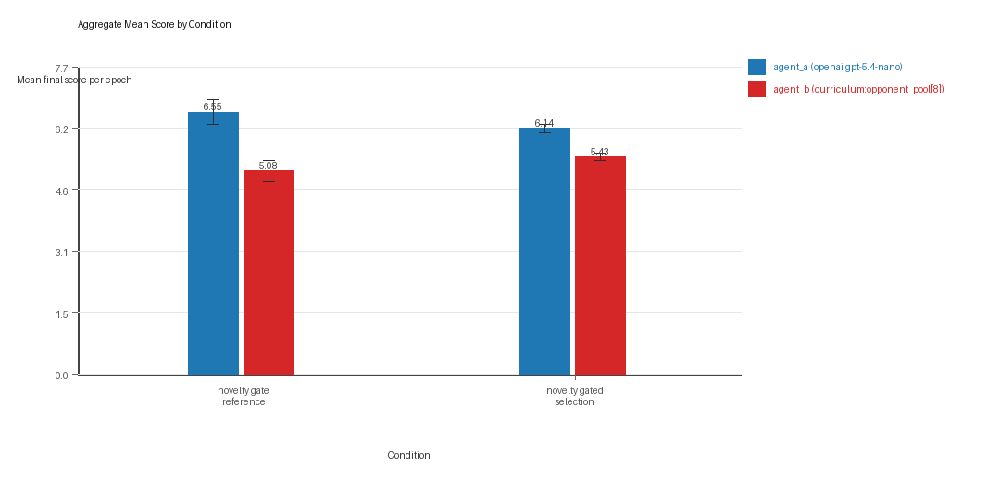
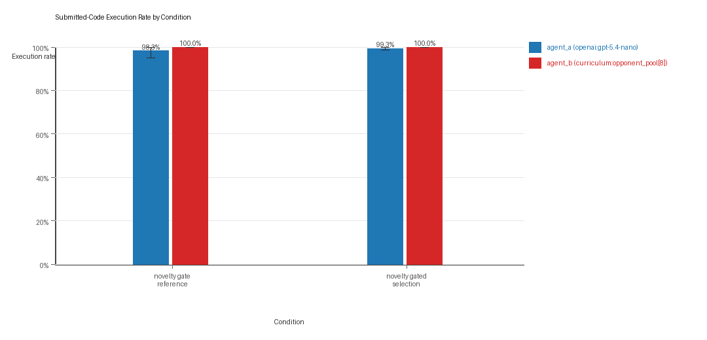
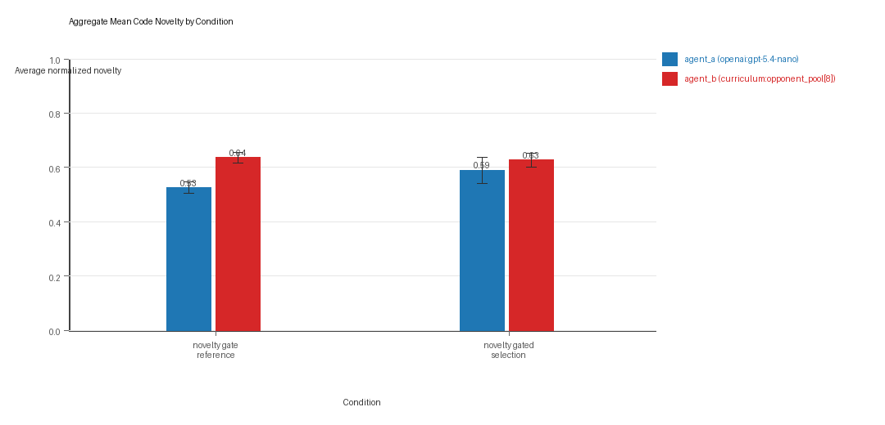
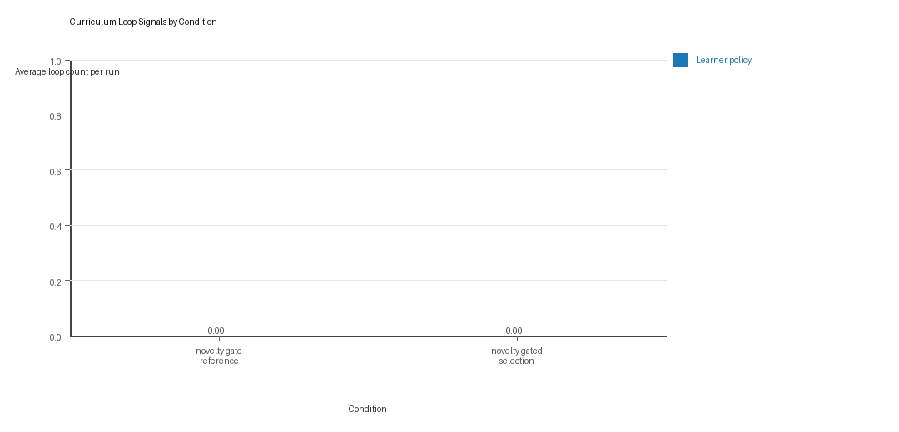
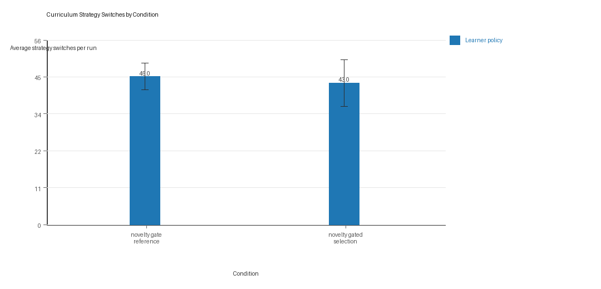

# Aggregate Research Report

## Included Runs
- Run count: 3.
- Conditions aggregated: 2.
- Runs: `run_20260505_215521_a`, `run_20260505_223643_b`, `run_20260506_070105_c`.

## Cross-Run Summary
- No same-model conditions were included in this aggregate.
- Cross-model novelty mean 0.5571 (std 0.0228, 95% CI 0.5312 to 0.5829).
- No same-model rule-boundary indicator summary is available for this aggregate.
- Cross-model rule-boundary indicators mean 0.1667 (std 0.2887, 95% CI 0.0 to 0.4933).
- Curriculum loop count mean 0.0 (std 0.0, 95% CI 0.0 to 0.0).
- Curriculum strategy switches mean 44.0 (std 4.272, 95% CI 39.1658 to 48.8342).
- Curriculum post-loss novelty spikes mean 34.3333 (std 4.0723, 95% CI 29.7251 to 38.9415).
- Curriculum specific adaptation count mean 26.5 (std 4.7697, 95% CI 21.1026 to 31.8974).
- Curriculum behavior-cell coverage mean 26.1667 (std 2.5166, 95% CI 23.3189 to 29.0145).

## Aggregate Charts
### Mean Score by Condition

- Each bar shows the mean final score per epoch for one agent role in that condition.
- Error bars show the 95% confidence interval across the included runs.

### Submitted-Code Execution Rate by Condition

- The y-axis is the percentage of epochs where submitted code executed instead of a fallback policy.
- Values near 100% indicate the infrastructure stayed reliable across the included runs.

### Mean Code Novelty by Condition

- Novelty is the average normalized code-change score across epochs for that agent role and condition.
- Higher bars indicate more code variation across repeated runs, not necessarily better performance.

### Curriculum Loop Signals

- Higher bars indicate more repeated motifs or unchanged-policy loops under the curriculum conditions.

### Curriculum Strategy Switches

- Higher bars indicate more switches between heuristic or behavior classes across epochs.

## Condition Results
### novelty_gate_reference
- Matchup type: cross-model.
- Curriculum roles: learner = agent_a (openai:gpt-5.4-nano); opponent role = agent_b (curriculum:opponent_pool[8]).
- Fully clean run count: 2/3.
- Research tags: replicate_label=a, seed_offset=0, selection_mode=accept_all, suite_family=curriculum_suite, suite_type=novelty_gated_selection; replicate_label=b, seed_offset=1000, selection_mode=accept_all, suite_family=curriculum_suite, suite_type=novelty_gated_selection; replicate_label=c, seed_offset=2000, selection_mode=accept_all, suite_family=curriculum_suite, suite_type=novelty_gated_selection.
- agent_a (openai:gpt-5.4-nano) average score: agent_a (openai:gpt-5.4-nano) mean 6.5517 (std 0.276, 95% CI 6.2394 to 6.864).
- agent_a (openai:gpt-5.4-nano) generation success rate: agent_a (openai:gpt-5.4-nano) mean 0.9833 (std 0.0289, 95% CI 0.9507 to 1.0).
- agent_a (openai:gpt-5.4-nano) submitted-code execution rate: agent_a (openai:gpt-5.4-nano) mean 0.9833 (std 0.0289, 95% CI 0.9507 to 1.0).
- agent_a (openai:gpt-5.4-nano) novelty: agent_a (openai:gpt-5.4-nano) mean 0.5252 (std 0.0184, 95% CI 0.5043 to 0.546).
- agent_a (openai:gpt-5.4-nano) rule-boundary indicator count: agent_a (openai:gpt-5.4-nano) mean 0.0 (std 0.0, 95% CI 0.0 to 0.0).
- agent_b (curriculum:opponent_pool[8]) average score: agent_b (curriculum:opponent_pool[8]) mean 5.075 (std 0.2318, 95% CI 4.8127 to 5.3373).
- agent_b (curriculum:opponent_pool[8]) generation success rate: agent_b (curriculum:opponent_pool[8]) mean 1.0 (std 0.0, 95% CI 1.0 to 1.0).
- agent_b (curriculum:opponent_pool[8]) submitted-code execution rate: agent_b (curriculum:opponent_pool[8]) mean 1.0 (std 0.0, 95% CI 1.0 to 1.0).
- agent_b (curriculum:opponent_pool[8]) novelty: agent_b (curriculum:opponent_pool[8]) mean 0.6362 (std 0.0176, 95% CI 0.6163 to 0.6561).
- agent_b (curriculum:opponent_pool[8]) rule-boundary indicator count: agent_b (curriculum:opponent_pool[8]) mean 0.0 (std 0.0, 95% CI 0.0 to 0.0).
- Learner loop count: learner mean 0.0 (std 0.0, 95% CI 0.0 to 0.0).
- Learner stable strategy switches: learner mean 45.0 (std 3.6056, 95% CI 40.9199 to 49.0801).
- Learner post-loss novelty spikes: learner mean 31.3333 (std 3.2146, 95% CI 27.6957 to 34.9709).
- Learner same-opponent adaptation count: learner mean 24.3333 (std 6.1101, 95% CI 17.4191 to 31.2476).
- Learner behavior-cell coverage: learner mean 24.6667 (std 1.5275, 95% CI 22.9381 to 26.3952).
- Elite archive coverage: elite archive coverage mean 12.0 (std 0.0, 95% CI 12.0 to 12.0).
- agent_a win share: agent_a mean 0.48 (std 0.03, 95% CI 0.4461 to 0.5139).
- agent_b win share: agent_b mean 0.3167 (std 0.0289, 95% CI 0.284 to 0.3493).
- draw win share: draw mean 0.2033 (std 0.0153, 95% CI 0.186 to 0.2206).
- Qualitative follow-up candidates:
- Follow-up candidate from `run_20260505_215521_a`, epoch 3: largest score margin: agent_a (openai:gpt-5.4-nano) 12.0 vs agent_b (curriculum:opponent_pool[8]) 0.0.
- Follow-up candidate from `run_20260505_215521_a`, epoch 39: most runtime issues in one epoch: 80.
- Follow-up candidate from `run_20260505_215521_a`, epoch 12: largest average code shift between consecutive epochs: 0.7751.
- Follow-up candidate from `run_20260505_223643_b`, epoch 35: largest score margin: agent_a (openai:gpt-5.4-nano) 0.0 vs agent_b (curriculum:opponent_pool[8]) 12.0.

### novelty_gated_selection
- Matchup type: cross-model.
- Curriculum roles: learner = agent_a (openai:gpt-5.4-nano); opponent role = agent_b (curriculum:opponent_pool[8]).
- Fully clean run count: 1/3.
- Research tags: replicate_label=a, seed_offset=0, selection_mode=score_or_diversity, suite_family=curriculum_suite, suite_type=novelty_gated_selection; replicate_label=b, seed_offset=1000, selection_mode=score_or_diversity, suite_family=curriculum_suite, suite_type=novelty_gated_selection; replicate_label=c, seed_offset=2000, selection_mode=score_or_diversity, suite_family=curriculum_suite, suite_type=novelty_gated_selection.
- agent_a (openai:gpt-5.4-nano) average score: agent_a (openai:gpt-5.4-nano) mean 6.1367 (std 0.0922, 95% CI 6.0323 to 6.241).
- agent_a (openai:gpt-5.4-nano) generation success rate: agent_a (openai:gpt-5.4-nano) mean 0.9933 (std 0.0058, 95% CI 0.9868 to 0.9999).
- agent_a (openai:gpt-5.4-nano) submitted-code execution rate: agent_a (openai:gpt-5.4-nano) mean 0.9933 (std 0.0058, 95% CI 0.9868 to 0.9999).
- agent_a (openai:gpt-5.4-nano) novelty: agent_a (openai:gpt-5.4-nano) mean 0.589 (std 0.0422, 95% CI 0.5412 to 0.6368).
- agent_a (openai:gpt-5.4-nano) rule-boundary indicator count: agent_a (openai:gpt-5.4-nano) mean 0.3333 (std 0.5774, 95% CI 0.0 to 0.9867).
- agent_b (curriculum:opponent_pool[8]) average score: agent_b (curriculum:opponent_pool[8]) mean 5.4267 (std 0.0752, 95% CI 5.3415 to 5.5118).
- agent_b (curriculum:opponent_pool[8]) generation success rate: agent_b (curriculum:opponent_pool[8]) mean 1.0 (std 0.0, 95% CI 1.0 to 1.0).
- agent_b (curriculum:opponent_pool[8]) submitted-code execution rate: agent_b (curriculum:opponent_pool[8]) mean 1.0 (std 0.0, 95% CI 1.0 to 1.0).
- agent_b (curriculum:opponent_pool[8]) novelty: agent_b (curriculum:opponent_pool[8]) mean 0.6266 (std 0.0226, 95% CI 0.601 to 0.6522).
- agent_b (curriculum:opponent_pool[8]) rule-boundary indicator count: agent_b (curriculum:opponent_pool[8]) mean 0.0 (std 0.0, 95% CI 0.0 to 0.0).
- Learner loop count: learner mean 0.0 (std 0.0, 95% CI 0.0 to 0.0).
- Learner stable strategy switches: learner mean 43.0 (std 6.245, 95% CI 35.9331 to 50.0669).
- Learner post-loss novelty spikes: learner mean 37.3333 (std 5.1316, 95% CI 31.5264 to 43.1403).
- Learner same-opponent adaptation count: learner mean 28.6667 (std 4.5092, 95% CI 23.564 to 33.7694).
- Learner behavior-cell coverage: learner mean 27.6667 (std 3.5119, 95% CI 23.6926 to 31.6407).
- Elite archive coverage: elite archive coverage mean 11.6667 (std 0.5774, 95% CI 11.0133 to 12.32).
- agent_a win share: agent_a mean 0.42 (std 0.0265, 95% CI 0.3901 to 0.4499).
- agent_b win share: agent_b mean 0.3733 (std 0.0513, 95% CI 0.3153 to 0.4314).
- draw win share: draw mean 0.2067 (std 0.0252, 95% CI 0.1782 to 0.2351).
- Qualitative follow-up candidates:
- Follow-up candidate from `run_20260505_215521_a`, epoch 39: largest score margin: agent_a (openai:gpt-5.4-nano) 0.0 vs agent_b (curriculum:opponent_pool[8]) 12.0.
- Follow-up candidate from `run_20260505_215521_a`, epoch 83: most runtime issues in one epoch: 80.
- Follow-up candidate from `run_20260505_215521_a`, epoch 64: first fallback/default-code epoch for agent_a (openai:gpt-5.4-nano).
- Follow-up candidate from `run_20260505_215521_a`, epoch 3: largest average code shift between consecutive epochs: 0.8352.

## Interpretation Caveats
- Aggregate results are only as strong as the included run set. If the input runs mix different prompts, environments, or suite definitions, treat the summary as descriptive rather than causal.
- Confidence intervals here summarize variation across run-level condition summaries; they are not substitutes for careful experimental design.
- Use this aggregate report together with per-run reports and the research checklist before making strong claims.

## Aggregate Conclusions
- Data quality summary: 0/2 conditions were fully clean, 1/2 were near-clean, and 1/2 remained higher-noise.
- This aggregate includes curriculum conditions, so the learner policy is the primary unit of analysis and opponent-role metrics are contextual.

### Best-Supported Findings
- This aggregate only supports cross-model novelty summary (0.5571); no same-model comparison is available here.
- Rule-boundary indicator rates for the available cross-model conditions were 0.1667; no same-model comparison is available here.
- Curriculum loop pressure produced an average loop count of 0.0 and an average strategy-switch count of 44.0 across enabled conditions.
- Specific same-opponent adaptation signals averaged 26.5 across enabled curriculum conditions.

### Directional Or Uncertain Findings
- Conditions classified as higher-noise should be treated as exploratory unless the same direction reappears in cleaner replicate runs.

### Claims Not Supported Yet
- The aggregate does not by itself establish causality; the strongest causal interpretations should come from replicated ablation conditions rather than from mixed-condition summaries alone.
- Code novelty should not be treated as equivalent to strategic innovation without qualitative review of notable epochs and behavior traces.
