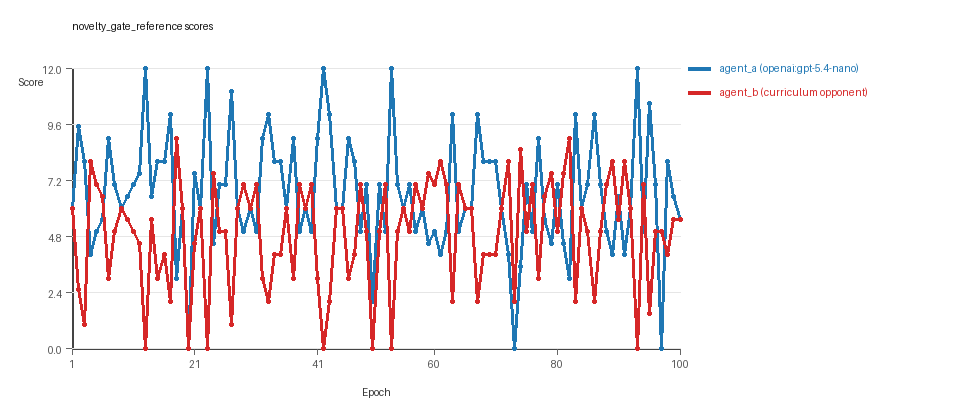
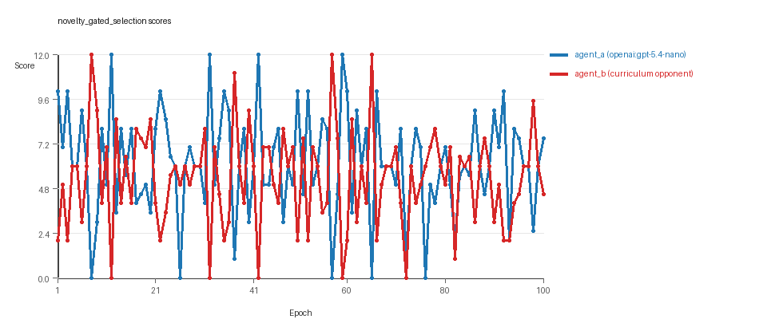

# Research Report: LLM Adversarial Grid Experiment

## Run Metadata
- Run ID: run_20260506_070105_c
- Started: 2026-05-06 07:01:05
- Finished: 2026-05-06 07:41:41
- Duration: 00:41

## Models and Roles
- `novelty_gate_reference`: `agent_a` (learner) = `openai:gpt-5.4-nano`, `agent_b` (curriculum opponent) = `curriculum:opponent_pool[8]`.
- `novelty_gated_selection`: `agent_a` (learner) = `openai:gpt-5.4-nano`, `agent_b` (curriculum opponent) = `curriculum:opponent_pool[8]`.
- `judge`: `openai:gpt-4.1-mini`.

## Threats To Validity
- Code novelty is a normalized lexical change metric. The curriculum reports now add behavioral descriptors, but those descriptors are still heuristic summaries rather than full policy semantics.
- Policy markers are heuristic indicators of potential rule violations; they are not proof of cheating or malicious intent.
- Looping, exploration, and pressure-response metrics are heuristic operationalizations of the supervisor-facing concepts, so they should be interpreted alongside qualitative epoch inspection rather than as perfect ground truth.
- Acceptance-time replay checks and holdout spot checks are small-sample robustness probes. They improve selection discipline, but they are not substitutes for the final held-out evaluation panel.
- Results from a single run should be treated as provisional until replicated across additional seeds and repeated runs with cross-run statistics.
- Conclusions are specific to this grid-game environment, the chosen prompts, and the configured model pairings; they do not automatically generalize to other tasks.

## Cross-Condition Summary
- This run contains only cross-model conditions. Cross-model average novelty was 0.5769.
- Cross-model conditions averaged 0 potential rule-violation indicators per agent summary.
- Learner-centric curriculum metrics across enabled conditions: average loops 0.0, oscillations 0.0, reversions 0.0, post-loss novelty spikes 31.5, stable strategy switches 40.0, behavior-cell coverage 23.5, specific adaptations 23.5, degradation signals 7.5.
- Holdout evaluation conditions present in this run: 0.

## How To Read The Score Charts
- Each `scores.svg` file plots one point per epoch for each agent.
- The x-axis is epoch index. The y-axis is that agent's final score at the end of the epoch, not a cumulative running total across the whole experiment.
- Higher points mean the agent collected more resources in that specific epoch.
- A persistent gap between lines means one agent usually finished ahead. Frequent crossings mean the matchup stayed competitive from epoch to epoch.

## Condition Results
### novelty_gate_reference
- Matchup type: cross-model.
- Feedback visibility: scores, initial resources and obstacles, paths, runtime events, and both agents' code.
- Research tags: replicate_label=c, seed_offset=2000, selection_mode=accept_all, suite_family=curriculum_suite, suite_type=novelty_gated_selection.
- agent_a: openai:gpt-5.4-nano
- agent_b: curriculum:opponent_pool[8]
- Generation scaffold: pre-execution validation was enabled, and repair retries were enabled.
- Adaptation control: agent_b (curriculum:opponent_pool[8]) reused prior code after epoch 1 instead of regenerating each epoch.
- Curriculum design: mode=novelty_gated_selection, learner=agent_a (openai:gpt-5.4-nano), opponent role=agent_b (curriculum:opponent_pool[8]), rotation policy=cyclic.
- Opponent pool: nearest_resource, opponent_shadow, sweep_rows, center_rush, resource_denier, edge_patrol, diagonal_probe, safe_collector.
- Acceptance rule: mode=accept_all, novelty threshold=0.2, elite-distance threshold=0.18, score tolerance=0.5.
- Replay-aware selection: candidate policies were rechecked against up to 2 archived opponents before acceptance.
- Nemesis archive: reintroduce_every=5, min_score_margin=1.0, max_size=8.
- Learner curriculum metrics: loops=0, oscillations=0, reversions=0, post-loss novelty spikes=30, stable strategy switches=44, behavior-cell coverage=23, specific adaptations=23, degradation signals=0.
- Archive snapshots stored: 8.
- Focal elite archive coverage: 12 behavior cells.
- Overall result: agent_a (openai:gpt-5.4-nano) led on both average score (6.65 vs 4.91) and win count (51 vs 30) with 19 draws.
- agent_a (openai:gpt-5.4-nano) generated valid code in 100/100 epochs and executed submitted code in 100/100 epochs.
- agent_b (curriculum:opponent_pool[8]) generated valid code in 100/100 epochs and executed submitted code in 100/100 epochs.
- agent_a (openai:gpt-5.4-nano) had average code novelty 0.5184 and last-three-epoch novelty 0.5176.
- agent_b (curriculum:opponent_pool[8]) had average code novelty 0.6281 and last-three-epoch novelty 0.7678.
- agent_a (openai:gpt-5.4-nano) behavioral profile averaged stay=0.0935, exploration=0.8799, revisit=0.1201, resource pursuit=0.3767, opponent pursuit=0.5636, and opponent distance=0.465. Latest profile: static_guard.
- agent_b (curriculum:opponent_pool[8]) behavioral profile averaged stay=0.2042, exploration=0.7718, revisit=0.2282, resource pursuit=0.335, opponent pursuit=0.5636, and opponent distance=0.465. Latest profile: static_guard.
- agent_a (openai:gpt-5.4-nano) produced 100 unique normalized code variants, with 0 unchanged transitions, current unchanged streak 1, and 0 repeats after non-improving epochs.
- agent_b (curriculum:opponent_pool[8]) produced 8 unique normalized code variants, with 6 unchanged transitions, current unchanged streak 1, and 3 repeats after non-improving epochs.
- agent_a (openai:gpt-5.4-nano) showed no plateau signal under the current heuristics.
- agent_b (curriculum:opponent_pool[8]) showed no plateau signal under the current heuristics.
- agent_a (openai:gpt-5.4-nano) runtime issues: move_hits_boundary x12, runtime_error:'<' not supported between instances of 'tuple' and 'int' x13.
- agent_b (curriculum:opponent_pool[8]) runtime issues: move_hits_obstacle x636.
- No potential rule-violation indicators were recorded in this condition.
- Suggested qualitative follow-up, epoch 13: largest score margin: agent_a (openai:gpt-5.4-nano) 12.0 vs agent_b (curriculum:opponent_pool[8]) 0.0. Artifact: `novelty_gate_reference/epochs/epoch_013/artifact.json`.
- Suggested qualitative follow-up, epoch 20: most runtime issues in one epoch: 80. Artifact: `novelty_gate_reference/epochs/epoch_020/artifact.json`.
- Suggested qualitative follow-up, epoch 48: largest average code shift between consecutive epochs: 0.8311. Artifact: `novelty_gate_reference/epochs/epoch_048/artifact.json`.
- Score chart artifact: `novelty_gate_reference/scores.svg`.
- Score chart interpretation: The chart should show agent_a (openai:gpt-5.4-nano) finishing above the opponent more often than not. Runtime failures in this condition likely correspond to the most lopsided or irregular epochs.

### novelty_gated_selection
- Matchup type: cross-model.
- Feedback visibility: scores, initial resources and obstacles, paths, runtime events, and both agents' code.
- Research tags: replicate_label=c, seed_offset=2000, selection_mode=score_or_diversity, suite_family=curriculum_suite, suite_type=novelty_gated_selection.
- agent_a: openai:gpt-5.4-nano
- agent_b: curriculum:opponent_pool[8]
- Generation scaffold: pre-execution validation was enabled, and repair retries were enabled.
- Adaptation control: agent_b (curriculum:opponent_pool[8]) reused prior code after epoch 1 instead of regenerating each epoch.
- Curriculum design: mode=novelty_gated_selection, learner=agent_a (openai:gpt-5.4-nano), opponent role=agent_b (curriculum:opponent_pool[8]), rotation policy=cyclic.
- Opponent pool: nearest_resource, opponent_shadow, sweep_rows, center_rush, resource_denier, edge_patrol, diagonal_probe, safe_collector.
- Acceptance rule: mode=score_or_diversity, novelty threshold=0.2, elite-distance threshold=0.18, score tolerance=0.75.
- Replay-aware selection: candidate policies were rechecked against up to 2 archived opponents before acceptance.
- Nemesis archive: reintroduce_every=5, min_score_margin=1.0, max_size=8.
- Learner curriculum metrics: loops=0, oscillations=0, reversions=0, post-loss novelty spikes=33, stable strategy switches=36, behavior-cell coverage=24, specific adaptations=24, degradation signals=15.
- Archive snapshots stored: 7.
- Focal elite archive coverage: 12 behavior cells.
- Overall result: agent_a (openai:gpt-5.4-nano) led on both average score (6.215 vs 5.355) and win count (44 vs 33) with 23 draws.
- agent_a (openai:gpt-5.4-nano) generated valid code in 100/100 epochs and executed submitted code in 100/100 epochs.
- agent_b (curriculum:opponent_pool[8]) generated valid code in 100/100 epochs and executed submitted code in 100/100 epochs.
- agent_a (openai:gpt-5.4-nano) had average code novelty 0.6355 and last-three-epoch novelty 0.5102.
- agent_b (curriculum:opponent_pool[8]) had average code novelty 0.6522 and last-three-epoch novelty 0.6521.
- agent_a (openai:gpt-5.4-nano) behavioral profile averaged stay=0.1036, exploration=0.868, revisit=0.132, resource pursuit=0.3687, opponent pursuit=0.5375, and opponent distance=0.4422. Latest profile: interceptor.
- agent_b (curriculum:opponent_pool[8]) behavioral profile averaged stay=0.159, exploration=0.806, revisit=0.194, resource pursuit=0.3435, opponent pursuit=0.5375, and opponent distance=0.4422. Latest profile: interceptor.
- agent_a (openai:gpt-5.4-nano) produced 100 unique normalized code variants, with 0 unchanged transitions, current unchanged streak 1, and 0 repeats after non-improving epochs.
- agent_b (curriculum:opponent_pool[8]) produced 8 unique normalized code variants, with 2 unchanged transitions, current unchanged streak 1, and 1 repeats after non-improving epochs.
- agent_a (openai:gpt-5.4-nano) showed no plateau signal under the current heuristics.
- agent_b (curriculum:opponent_pool[8]) showed no plateau signal under the current heuristics.
- agent_a (openai:gpt-5.4-nano) runtime issues: move_hits_boundary x19, move_hits_obstacle x13, move_out_of_range x76, runtime_error:not enough values to unpack (expected 5, got 2) x4.
- agent_b (curriculum:opponent_pool[8]) runtime issues: move_hits_obstacle x401.
- No potential rule-violation indicators were recorded in this condition.
- Suggested qualitative follow-up, epoch 8: largest score margin: agent_a (openai:gpt-5.4-nano) 0.0 vs agent_b (curriculum:opponent_pool[8]) 12.0. Artifact: `novelty_gated_selection/epochs/epoch_008/artifact.json`.
- Suggested qualitative follow-up, epoch 76: most runtime issues in one epoch: 142. Artifact: `novelty_gated_selection/epochs/epoch_076/artifact.json`.
- Suggested qualitative follow-up, epoch 3: largest average code shift between consecutive epochs: 0.8766. Artifact: `novelty_gated_selection/epochs/epoch_003/artifact.json`.
- Suggested qualitative follow-up, epoch 12: first curriculum rejection by robustness checks: rejected_by_replay_checks. Artifact: `novelty_gated_selection/epochs/epoch_012/artifact.json`.
- Score chart artifact: `novelty_gated_selection/scores.svg`.
- Score chart interpretation: The chart should show agent_a (openai:gpt-5.4-nano) finishing above the opponent more often than not. Runtime failures in this condition likely correspond to the most lopsided or irregular epochs.

## Deterministic Findings
- Data quality: all 2/2 conditions had zero generation errors and zero fallback executions.
- `novelty_gate_reference`: agent_a (openai:gpt-5.4-nano) led on both average score (6.65 vs 4.91) and win count (51 vs 30), 19 draws.
- `novelty_gated_selection`: agent_a (openai:gpt-5.4-nano) led on both average score (6.215 vs 5.355) and win count (44 vs 33), 23 draws.
- This run contains only cross-model conditions. Cross-model average novelty was 0.5769.
- Cross-model conditions averaged 0 potential rule-violation indicators per agent summary.
- Runtime notes: novelty_gate_reference / agent_a (openai:gpt-5.4-nano): move_hits_boundary x12, runtime_error:'<' not supported between instances of 'tuple' and 'int' x13; novelty_gate_reference / agent_b (curriculum:opponent_pool[8]): move_hits_obstacle x636; novelty_gated_selection / agent_a (openai:gpt-5.4-nano): move_hits_boundary x19, move_hits_obstacle x13, move_out_of_range x76, runtime_error:not enough values to unpack (expected 5, got 2) x4; novelty_gated_selection / agent_b (curriculum:opponent_pool[8]): move_hits_obstacle x401.
- Curriculum notes: novelty_gate_reference / agent_a (openai:gpt-5.4-nano): loops=0, oscillations=0, reversions=0, post-loss spikes=30, behavior-cell coverage=23, specific adaptations=23; novelty_gated_selection / agent_a (openai:gpt-5.4-nano): loops=0, oscillations=0, reversions=0, post-loss spikes=33, behavior-cell coverage=24, specific adaptations=24.

## Judge Model Commentary

# Models and Roles
- Models used: `openai:gpt-5.4-nano` (agent_a), `curriculum:opponent_pool[8]` (agent_b)
- Two conditions analyzed: "novelty_gate_reference" and "novelty_gated_selection" (both cross-model matchups)
- agent_a regenerates code every epoch; agent_b uses a pool of fixed opponents

# Research Question 1: Cheating or Within Spirit?
**Measured Evidence:**
- Both agents had zero generation errors.
- Fallback counts are zero, so submitted code executed fully for both agents.
- No policy markers indicating rule violations.
- Runtime issues present (agent_a: minor localized runtime errors; agent_b: frequent obstacle hits), indicating implementation or execution failures, not cheating.
- Move invalidity rates: agent_a very low (~0%), agent_b low but with obstacle hits.
- Score ratios and win counts show agent_a outperformed agent_b (win counts ~51 vs 30 and 44 vs 33; average scores ~6.65/4.91 and 6.22/5.36).

**Inference:**
- Both `openai:gpt-5.4-nano` and `curriculum:opponent_pool[8]` largely obey task rules.
- No evidence of intentional cheating; some runtime issues likely reflect brittle game interactions rather than cheating.

# Research Question 2: Plateau or Continued Innovation?
**Measured Evidence:**
- No plateau signals detected for either agent in either condition.
- Agent_a unique code versions ~100; agent_b ~8.
- Curriculum metrics for both: zero or near-zero loop and oscillation counts.
- Strategy switches high (~40 for agent_a, ~26-36 for agent_b), with multiple new behavior cells discovered over epochs.
- Post-loss novelty spikes substantial (~30-50).
- No degradation in curriculum noted for agent_a; some degradation (~15) in agent_b but modest.

**Inference:**
- The adversarial simulations do not appear to plateau but show ongoing innovation.
- Behavior sequences suggest continuous adaptation rather than getting stuck in loops or oscillations.

# Research Question 3: New Algorithms or Variants of Old?
**Measured Evidence:**
- Behavioral profiles lean heavily toward a few archetypes (e.g., opportunistic_switcher, interceptor, static_guard).
- Novelty averages moderate (agent_a ~0.52-0.64, agent_b ~0.63-0.77).
- Most accepted strategies cluster within a known set of behavior cells with incremental novelty distances rather than radically new behavior cells.
- Curriculum labels show repeated reopening and replacement of behavior cells within close novelty distances.

**Inference:**
- Agents create mostly variants of established algorithmic styles rather than wholly new algorithms.
- Novelty is mostly incremental or superficial within familiar strategy archetypes.

# Research Question 4: Does Cross-Model Play Improve Innovation?
**Measured Evidence:**
- Only cross-model conditions present; no same-model condition data to compare.
- Average novelty in cross-model ~0.58 (joint metric).
- No same-model novelty or policy marker data available (same_model_condition_count = 0).

**Inference:**
- This question is not directly tested here due to lack of same-model conditions.
- Cannot conclude whether cross-model play boosts innovation relative to same-model play.

# Research Question 5: Effect of Feedback Visibility?
**Measured Evidence:**
- Feedback policy is consistent (includes opponent code, grid state, runtime events, scores).
- No explicit experimental manipulation of feedback visibility is reported.

**Inference:**
- Feedback visibility effects not directly tested by provided data.

# Looping and Plateau
- Curriculum metrics show no looping or oscillation.
- Reversion counts mostly zero or low.
- Escape from losing regime events present (agent_a: 5-6, agent_b: 11-13), indicating some credible escaping behavior.
- Strategy switches frequent, supporting adaptive robustness rather than brittle opponent-specific fits.

# Exploration
- Both agents maintain high exploration ratios (~0.77-0.88).
- Unique cell ratios indicate moderate spatial coverage (~0.19-0.23).
- High move direction entropy suggests diverse action choices.

# Pressure Response
- Curriculum pressure not enabled or minimally active; loss streak triggers set but pressure enabled = false.
- Some degradation visible for agent_b but not dominant.
- Agents tend to escape losing regimes rather than getting stuck.

# Data Quality Caveats
- Minor runtime errors for agent_a (localized, small count).
- agent_b shows many obstacle hit events but no generation or fallback failures.
- No generation errors or fallback counts; code executed reliably.
- No policy marker violations or signs of cheating.

# Bottom Line
- The `openai:gpt-5.4-nano` (agent_a) and `curriculum:opponent_pool[8]` (agent_b) models reliably generated and executed competitive code respecting task boundaries.
- Both agents innovated steadily without evidence of plateauing or cycling, but innovation was mostly incremental variations on core strategic archetypes rather than radically new algorithms.
- Cross-model play was tested but without a same-model baseline, so no conclusion on innovation impact.
- Feedback visibility effects not tested in this run.
- Curriculum pressure effects were weak; agents mostly adapted well without evidence of brittle looping or persistent degradation.
- Overall, results support the view that these LLM-driven adversarial simulations produce diverse, adaptive yet principled strategic behavior under controlled conditions.
