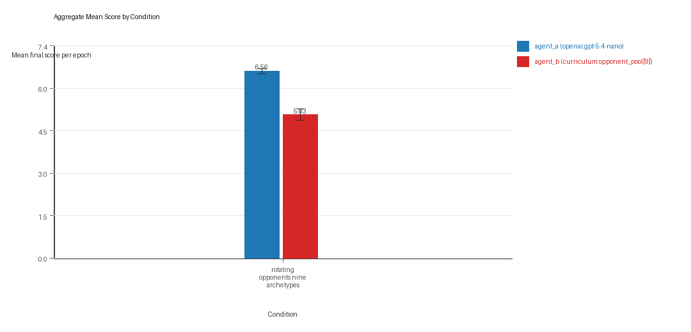
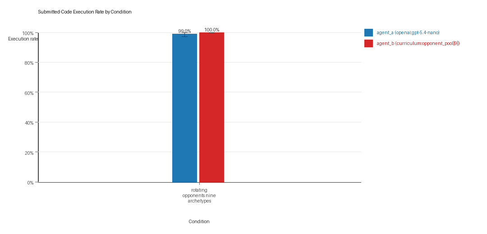
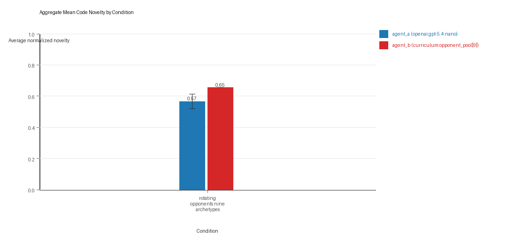
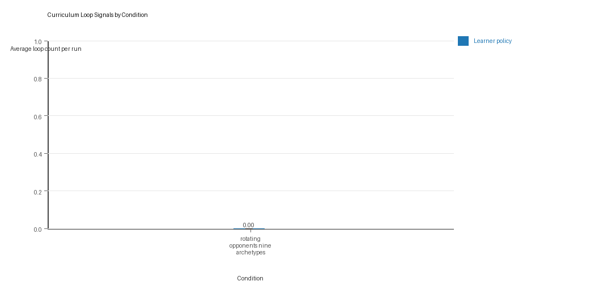
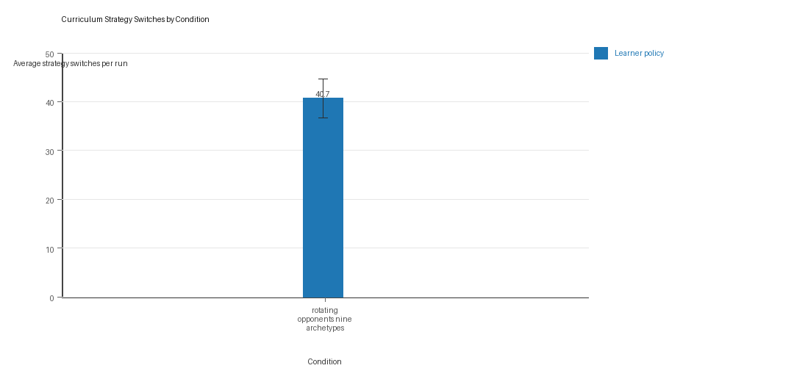

# Aggregate Research Report

## Included Runs
- Run count: 3.
- Conditions aggregated: 1.
- Runs: `run_20260505_165651_a`, `run_20260505_172402_b`, `run_20260505_175721_c`.

## Cross-Run Summary
- No same-model conditions were included in this aggregate.
- Cross-model novelty mean 0.5662 (std 0.0402, 95% CI 0.5208 to 0.6117).
- No same-model rule-boundary indicator summary is available for this aggregate.
- Cross-model rule-boundary indicators mean 0.0 (std 0.0, 95% CI 0.0 to 0.0).
- Curriculum loop count mean 0.0 (std 0.0, 95% CI 0.0 to 0.0).
- Curriculum strategy switches mean 40.6667 (std 3.5119, 95% CI 36.6926 to 44.6407).
- Curriculum post-loss novelty spikes mean 31.0 (std 4.5826, 95% CI 25.8143 to 36.1857).
- Curriculum specific adaptation count mean 21.6667 (std 1.5275, 95% CI 19.9381 to 23.3952).
- Curriculum behavior-cell coverage mean 24.3333 (std 2.3094, 95% CI 21.72 to 26.9467).

## Aggregate Charts
### Mean Score by Condition

- Each bar shows the mean final score per epoch for one agent role in that condition.
- Error bars show the 95% confidence interval across the included runs.

### Submitted-Code Execution Rate by Condition

- The y-axis is the percentage of epochs where submitted code executed instead of a fallback policy.
- Values near 100% indicate the infrastructure stayed reliable across the included runs.

### Mean Code Novelty by Condition

- Novelty is the average normalized code-change score across epochs for that agent role and condition.
- Higher bars indicate more code variation across repeated runs, not necessarily better performance.

### Curriculum Loop Signals

- Higher bars indicate more repeated motifs or unchanged-policy loops under the curriculum conditions.

### Curriculum Strategy Switches

- Higher bars indicate more switches between heuristic or behavior classes across epochs.

## Condition Results
### rotating_opponents_nine_archetypes
- Matchup type: cross-model.
- Curriculum roles: learner = agent_a (openai:gpt-5.4-nano); opponent role = agent_b (curriculum:opponent_pool[9]).
- Fully clean run count: 2/3.
- Research tags: pool_size=9, replicate_label=a, seed_offset=0, suite_family=curriculum_suite, suite_type=rotating_opponents; pool_size=9, replicate_label=b, seed_offset=1000, suite_family=curriculum_suite, suite_type=rotating_opponents; pool_size=9, replicate_label=c, seed_offset=2000, suite_family=curriculum_suite, suite_type=rotating_opponents.
- agent_a (openai:gpt-5.4-nano) average score: agent_a (openai:gpt-5.4-nano) mean 6.5633 (std 0.0778, 95% CI 6.4753 to 6.6514).
- agent_a (openai:gpt-5.4-nano) generation success rate: agent_a (openai:gpt-5.4-nano) mean 0.99 (std 0.0173, 95% CI 0.9704 to 1.0).
- agent_a (openai:gpt-5.4-nano) submitted-code execution rate: agent_a (openai:gpt-5.4-nano) mean 0.99 (std 0.0173, 95% CI 0.9704 to 1.0).
- agent_a (openai:gpt-5.4-nano) novelty: agent_a (openai:gpt-5.4-nano) mean 0.5662 (std 0.0402, 95% CI 0.5208 to 0.6117).
- agent_a (openai:gpt-5.4-nano) rule-boundary indicator count: agent_a (openai:gpt-5.4-nano) mean 0.0 (std 0.0, 95% CI 0.0 to 0.0).
- agent_b (curriculum:opponent_pool[9]) average score: agent_b (curriculum:opponent_pool[9]) mean 5.0333 (std 0.1747, 95% CI 4.8357 to 5.231).
- agent_b (curriculum:opponent_pool[9]) generation success rate: agent_b (curriculum:opponent_pool[9]) mean 1.0 (std 0.0, 95% CI 1.0 to 1.0).
- agent_b (curriculum:opponent_pool[9]) submitted-code execution rate: agent_b (curriculum:opponent_pool[9]) mean 1.0 (std 0.0, 95% CI 1.0 to 1.0).
- agent_b (curriculum:opponent_pool[9]) novelty: agent_b (curriculum:opponent_pool[9]) mean 0.6542 (std 0.0, 95% CI 0.6542 to 0.6542).
- agent_b (curriculum:opponent_pool[9]) rule-boundary indicator count: agent_b (curriculum:opponent_pool[9]) mean 0.0 (std 0.0, 95% CI 0.0 to 0.0).
- Learner loop count: learner mean 0.0 (std 0.0, 95% CI 0.0 to 0.0).
- Learner stable strategy switches: learner mean 40.6667 (std 3.5119, 95% CI 36.6926 to 44.6407).
- Learner post-loss novelty spikes: learner mean 31.0 (std 4.5826, 95% CI 25.8143 to 36.1857).
- Learner same-opponent adaptation count: learner mean 21.6667 (std 1.5275, 95% CI 19.9381 to 23.3952).
- Learner behavior-cell coverage: learner mean 24.3333 (std 2.3094, 95% CI 21.72 to 26.9467).
- Elite archive coverage: elite archive coverage mean 12.0 (std 0.0, 95% CI 12.0 to 12.0).
- agent_a win share: agent_a mean 0.5067 (std 0.0603, 95% CI 0.4385 to 0.5749).
- agent_b win share: agent_b mean 0.3133 (std 0.0473, 95% CI 0.2599 to 0.3668).
- draw win share: draw mean 0.18 (std 0.0361, 95% CI 0.1392 to 0.2208).
- Qualitative follow-up candidates:
- Follow-up candidate from `run_20260505_165651_a`, epoch 63: largest score margin: agent_a (openai:gpt-5.4-nano) 0.0 vs agent_b (curriculum:opponent_pool[9]) 12.0.
- Follow-up candidate from `run_20260505_165651_a`, epoch 62: most runtime issues in one epoch: 77.
- Follow-up candidate from `run_20260505_165651_a`, epoch 67: first fallback/default-code epoch for agent_a (openai:gpt-5.4-nano).
- Follow-up candidate from `run_20260505_165651_a`, epoch 75: largest average code shift between consecutive epochs: 0.8162.

## Interpretation Caveats
- Aggregate results are only as strong as the included run set. If the input runs mix different prompts, environments, or suite definitions, treat the summary as descriptive rather than causal.
- Confidence intervals here summarize variation across run-level condition summaries; they are not substitutes for careful experimental design.
- Use this aggregate report together with per-run reports and the research checklist before making strong claims.

## Aggregate Conclusions
- Data quality summary: 0/1 conditions were fully clean, 1/1 were near-clean, and 0/1 remained higher-noise.
- This aggregate includes curriculum conditions, so the learner policy is the primary unit of analysis and opponent-role metrics are contextual.

### Best-Supported Findings
- This aggregate only supports cross-model novelty summary (0.5662); no same-model comparison is available here.
- Rule-boundary indicator rates for the available cross-model conditions were 0.0; no same-model comparison is available here.
- Curriculum loop pressure produced an average loop count of 0.0 and an average strategy-switch count of 40.6667 across enabled conditions.
- Specific same-opponent adaptation signals averaged 21.6667 across enabled curriculum conditions.

### Directional Or Uncertain Findings
- No major directional-only findings stood out beyond the supported points above.

### Claims Not Supported Yet
- The aggregate does not by itself establish causality; the strongest causal interpretations should come from replicated ablation conditions rather than from mixed-condition summaries alone.
- Code novelty should not be treated as equivalent to strategic innovation without qualitative review of notable epochs and behavior traces.
