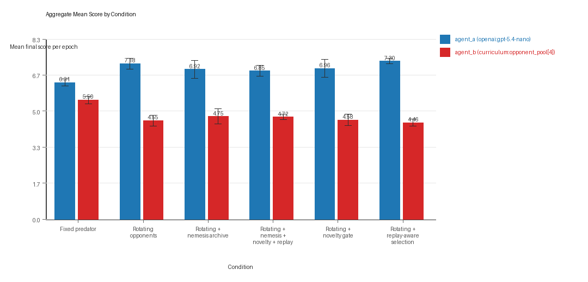
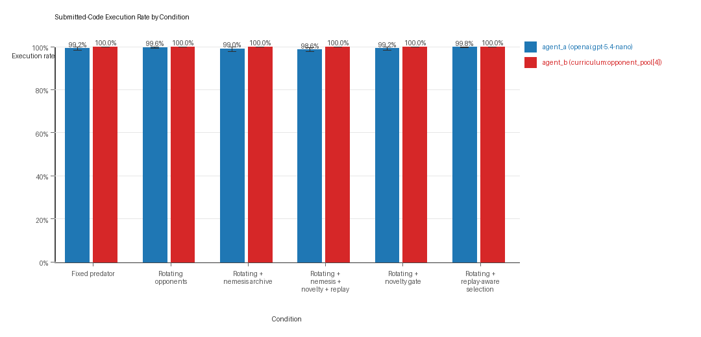
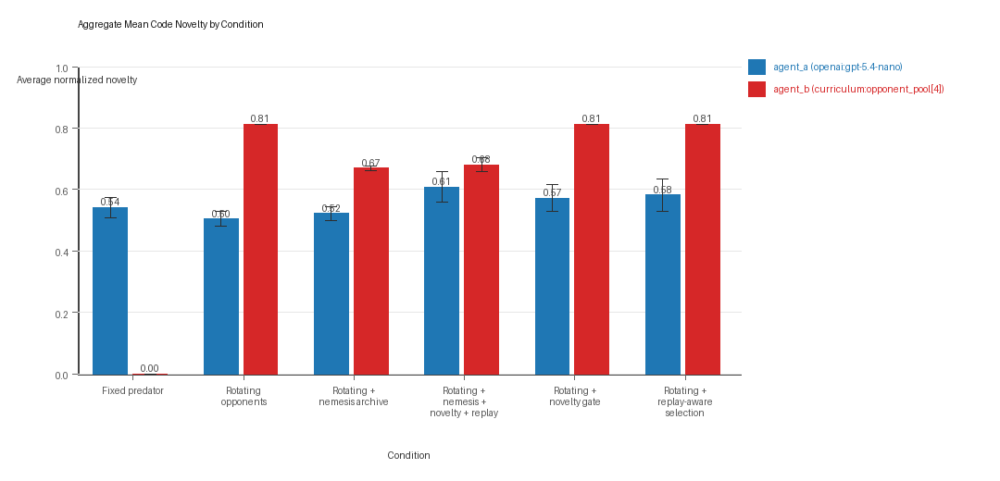
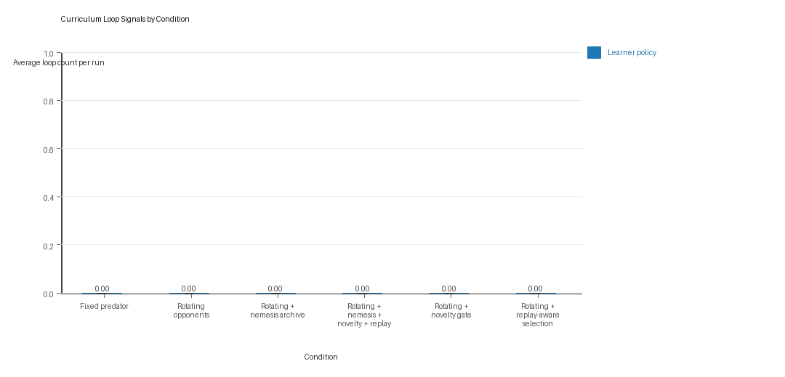
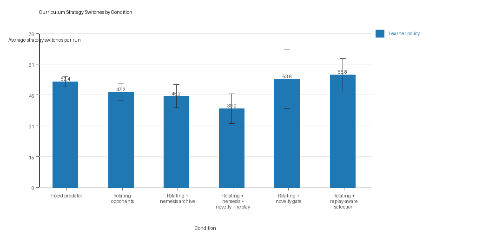
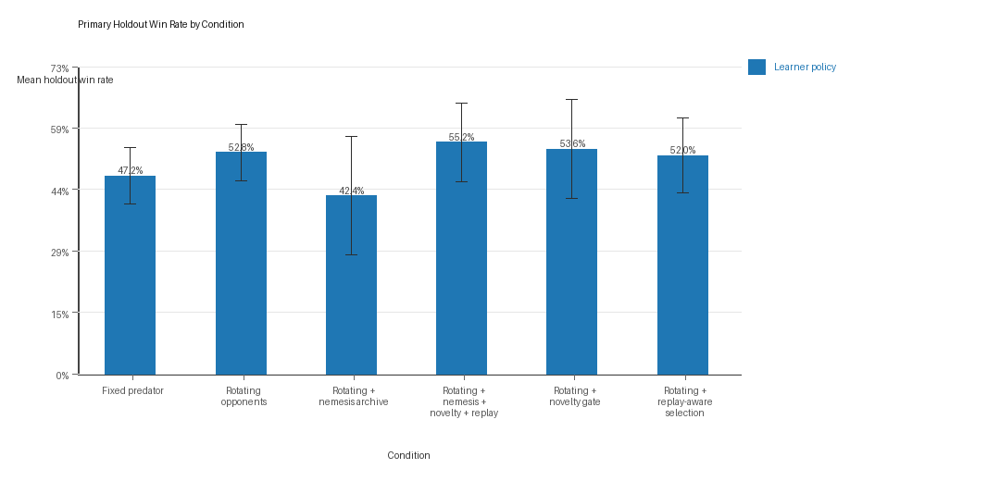

# Aggregate Research Report

## Included Runs
- Run count: 5.
- Conditions aggregated: 6.
- Runs: `run_20260506_221141_a`, `run_20260506_235450_b`, `run_20260507_012808_c`, `run_20260507_030759_d`, `run_20260507_044309_e`.

## Cross-Run Summary
- This aggregate uses curriculum-style learner-versus-opponent-pool conditions, so same-model versus cross-model summaries are intentionally de-emphasized.
- Curriculum loop count mean 0.0 (std 0.0, 95% CI 0.0 to 0.0).
- Curriculum strategy switches mean 48.8667 (std 3.6236, 95% CI 45.6904 to 52.0429).
- Curriculum post-loss novelty spikes mean 25.4667 (std 0.9747, 95% CI 24.6123 to 26.321).
- Curriculum specific adaptation count mean 19.9 (std 0.4014, 95% CI 19.5482 to 20.2518).
- Curriculum behavior-cell coverage mean 22.1333 (std 1.5519, 95% CI 20.773 to 23.4936).
- Primary holdout win rate mean 0.5053 (std 0.0888, 95% CI 0.4275 to 0.5831).
- Primary holdout score margin mean 1.2827 (std 0.6019, 95% CI 0.7551 to 1.8103).

## Aggregate Charts
### Mean Score by Condition

- Each bar shows the mean final score per epoch for one agent role in that condition.
- Error bars show the 95% confidence interval across the included runs.

### Submitted-Code Execution Rate by Condition

- The y-axis is the percentage of epochs where submitted code executed instead of a fallback policy.
- Values near 100% indicate the infrastructure stayed reliable across the included runs.

### Mean Code Novelty by Condition

- Novelty is the average normalized code-change score across epochs for that agent role and condition.
- Higher bars indicate more code variation across repeated runs, not necessarily better performance.

### Curriculum Loop Signals

- Higher bars indicate more repeated motifs or unchanged-policy loops under the curriculum conditions.

### Curriculum Strategy Switches

- Higher bars indicate more switches between heuristic or behavior classes across epochs.

### Primary Holdout Win Rate

- This is the main evaluation endpoint for holdout-first ablation studies.
- Higher bars mean the accepted learner policy won more often against opponents that were not used as the training objective.

## Condition Results
### fixed_predator_holdout_endpoint
- Curriculum roles: learner = agent_a (openai:gpt-5.4-nano); opponent role = agent_b (builtin:resource_denier).
- Environment: resource_collection.
- Fully clean run count: 2/5.
- Primary endpoint: held-out win rate mean 0.472 (std 0.0769, 95% CI 0.4046 to 0.5394); held-out score margin mean 1.176 (std 0.4721, 95% CI 0.7622 to 1.5898).
- Research tags: environment_family=resource_collection, factorial_goal=generalizable_adaptation, primary_endpoint=holdout_win_rate, recipe=fixed_predator, replicate_label=a, seed_offset=0, study_phase=phase_2b, suite_family=factorial_holdout_suite; environment_family=resource_collection, factorial_goal=generalizable_adaptation, primary_endpoint=holdout_win_rate, recipe=fixed_predator, replicate_label=b, seed_offset=1000, study_phase=phase_2b, suite_family=factorial_holdout_suite; environment_family=resource_collection, factorial_goal=generalizable_adaptation, primary_endpoint=holdout_win_rate, recipe=fixed_predator, replicate_label=c, seed_offset=2000, study_phase=phase_2b, suite_family=factorial_holdout_suite; environment_family=resource_collection, factorial_goal=generalizable_adaptation, primary_endpoint=holdout_win_rate, recipe=fixed_predator, replicate_label=d, seed_offset=3000, study_phase=phase_2b, suite_family=factorial_holdout_suite; environment_family=resource_collection, factorial_goal=generalizable_adaptation, primary_endpoint=holdout_win_rate, recipe=fixed_predator, replicate_label=e, seed_offset=4000, study_phase=phase_2b, suite_family=factorial_holdout_suite.
- agent_a (openai:gpt-5.4-nano) average score: agent_a (openai:gpt-5.4-nano) mean 6.307 (std 0.1836, 95% CI 6.1461 to 6.4679).
- agent_a (openai:gpt-5.4-nano) generation success rate: agent_a (openai:gpt-5.4-nano) mean 0.992 (std 0.0084, 95% CI 0.9847 to 0.9993).
- agent_a (openai:gpt-5.4-nano) submitted-code execution rate: agent_a (openai:gpt-5.4-nano) mean 0.992 (std 0.0084, 95% CI 0.9847 to 0.9993).
- agent_a (openai:gpt-5.4-nano) novelty: agent_a (openai:gpt-5.4-nano) mean 0.5412 (std 0.0388, 95% CI 0.5072 to 0.5753).
- agent_a (openai:gpt-5.4-nano) rule-boundary indicator count: agent_a (openai:gpt-5.4-nano) mean 0.0 (std 0.0, 95% CI 0.0 to 0.0).
- agent_b (builtin:resource_denier) average score: agent_b (builtin:resource_denier) mean 5.503 (std 0.203, 95% CI 5.3251 to 5.6809).
- agent_b (builtin:resource_denier) generation success rate: agent_b (builtin:resource_denier) mean 1.0 (std 0.0, 95% CI 1.0 to 1.0).
- agent_b (builtin:resource_denier) submitted-code execution rate: agent_b (builtin:resource_denier) mean 1.0 (std 0.0, 95% CI 1.0 to 1.0).
- agent_b (builtin:resource_denier) novelty: agent_b (builtin:resource_denier) mean 0.0 (std 0.0, 95% CI 0.0 to 0.0).
- agent_b (builtin:resource_denier) rule-boundary indicator count: agent_b (builtin:resource_denier) mean 0.0 (std 0.0, 95% CI 0.0 to 0.0).
- Learner loop count: learner mean 0.0 (std 0.0, 95% CI 0.0 to 0.0).
- Learner stable strategy switches: learner mean 52.4 (std 3.0496, 95% CI 49.7269 to 55.0731).
- Learner post-loss novelty spikes: learner mean 27.2 (std 4.0866, 95% CI 23.618 to 30.782).
- Learner same-opponent adaptation count: learner mean 21.0 (std 3.1623, 95% CI 18.2281 to 23.7719).
- Learner behavior-cell coverage: learner mean 24.6 (std 1.5166, 95% CI 23.2707 to 25.9293).
- Elite archive coverage: elite archive coverage mean 0.0 (std 0.0, 95% CI 0.0 to 0.0).
- agent_a win share: agent_a mean 0.498 (std 0.0626, 95% CI 0.4431 to 0.5529).
- agent_b win share: agent_b mean 0.274 (std 0.0439, 95% CI 0.2355 to 0.3125).
- draw win share: draw mean 0.228 (std 0.0363, 95% CI 0.1962 to 0.2598).
- Holdout evaluation was enabled in 5/5 runs for this condition.
- Holdout `center_rush` mean margin: center_rush mean 0.48 (std 1.3755, 95% CI -0.7257 to 1.6857).
- Holdout `center_rush` win rate: center_rush mean 0.48 (std 0.1789, 95% CI 0.3232 to 0.6368).
- Holdout `corner_guard` mean margin: corner_guard mean 0.72 (std 1.2296, 95% CI -0.3578 to 1.7978).
- Holdout `corner_guard` win rate: corner_guard mean 0.48 (std 0.1789, 95% CI 0.3232 to 0.6368).
- Holdout `diagonal_probe` mean margin: diagonal_probe mean -0.4 (std 1.3928, 95% CI -1.6209 to 0.8209).
- Holdout `diagonal_probe` win rate: diagonal_probe mean 0.28 (std 0.1789, 95% CI 0.1232 to 0.4368).
- Holdout `edge_patrol` mean margin: edge_patrol mean 6.28 (std 0.8198, 95% CI 5.5615 to 6.9985).
- Holdout `edge_patrol` win rate: edge_patrol mean 1.0 (std 0.0, 95% CI 1.0 to 1.0).
- Holdout `safe_collector` mean margin: safe_collector mean -1.2 (std 0.7483, 95% CI -1.8559 to -0.5441).
- Holdout `safe_collector` win rate: safe_collector mean 0.12 (std 0.1095, 95% CI 0.024 to 0.216).
- Qualitative follow-up candidates:
- Follow-up candidate from `run_20260506_221141_a`, epoch 60: largest score margin: agent_a (openai:gpt-5.4-nano) 1.0 vs agent_b (builtin:resource_denier) 11.0.
- Follow-up candidate from `run_20260506_221141_a`, epoch 61: most runtime issues in one epoch: 148.
- Follow-up candidate from `run_20260506_221141_a`, epoch 27: first fallback/default-code epoch for agent_a (openai:gpt-5.4-nano).
- Follow-up candidate from `run_20260506_221141_a`, epoch 9: largest average code shift between consecutive epochs: 0.4616.

### rotating_opponents_holdout_endpoint
- Curriculum roles: learner = agent_a (openai:gpt-5.4-nano); opponent role = agent_b (curriculum:opponent_pool[4]).
- Environment: resource_collection.
- Fully clean run count: 3/5.
- Primary endpoint: held-out win rate mean 0.528 (std 0.0769, 95% CI 0.4606 to 0.5954); held-out score margin mean 1.608 (std 0.3627, 95% CI 1.2901 to 1.9259).
- Research tags: environment_family=resource_collection, factorial_goal=generalizable_adaptation, primary_endpoint=holdout_win_rate, recipe=rotating_opponents, replicate_label=a, seed_offset=0, study_phase=phase_2b, suite_family=factorial_holdout_suite; environment_family=resource_collection, factorial_goal=generalizable_adaptation, primary_endpoint=holdout_win_rate, recipe=rotating_opponents, replicate_label=b, seed_offset=1000, study_phase=phase_2b, suite_family=factorial_holdout_suite; environment_family=resource_collection, factorial_goal=generalizable_adaptation, primary_endpoint=holdout_win_rate, recipe=rotating_opponents, replicate_label=c, seed_offset=2000, study_phase=phase_2b, suite_family=factorial_holdout_suite; environment_family=resource_collection, factorial_goal=generalizable_adaptation, primary_endpoint=holdout_win_rate, recipe=rotating_opponents, replicate_label=d, seed_offset=3000, study_phase=phase_2b, suite_family=factorial_holdout_suite; environment_family=resource_collection, factorial_goal=generalizable_adaptation, primary_endpoint=holdout_win_rate, recipe=rotating_opponents, replicate_label=e, seed_offset=4000, study_phase=phase_2b, suite_family=factorial_holdout_suite.
- agent_a (openai:gpt-5.4-nano) average score: agent_a (openai:gpt-5.4-nano) mean 7.18 (std 0.2833, 95% CI 6.9317 to 7.4283).
- agent_a (openai:gpt-5.4-nano) generation success rate: agent_a (openai:gpt-5.4-nano) mean 0.996 (std 0.0055, 95% CI 0.9912 to 1.0).
- agent_a (openai:gpt-5.4-nano) submitted-code execution rate: agent_a (openai:gpt-5.4-nano) mean 0.996 (std 0.0055, 95% CI 0.9912 to 1.0).
- agent_a (openai:gpt-5.4-nano) novelty: agent_a (openai:gpt-5.4-nano) mean 0.5042 (std 0.0263, 95% CI 0.4811 to 0.5272).
- agent_a (openai:gpt-5.4-nano) rule-boundary indicator count: agent_a (openai:gpt-5.4-nano) mean 0.0 (std 0.0, 95% CI 0.0 to 0.0).
- agent_b (curriculum:opponent_pool[4]) average score: agent_b (curriculum:opponent_pool[4]) mean 4.55 (std 0.2808, 95% CI 4.3039 to 4.7961).
- agent_b (curriculum:opponent_pool[4]) generation success rate: agent_b (curriculum:opponent_pool[4]) mean 1.0 (std 0.0, 95% CI 1.0 to 1.0).
- agent_b (curriculum:opponent_pool[4]) submitted-code execution rate: agent_b (curriculum:opponent_pool[4]) mean 1.0 (std 0.0, 95% CI 1.0 to 1.0).
- agent_b (curriculum:opponent_pool[4]) novelty: agent_b (curriculum:opponent_pool[4]) mean 0.8125 (std 0.0, 95% CI 0.8125 to 0.8125).
- agent_b (curriculum:opponent_pool[4]) rule-boundary indicator count: agent_b (curriculum:opponent_pool[4]) mean 0.0 (std 0.0, 95% CI 0.0 to 0.0).
- Learner loop count: learner mean 0.0 (std 0.0, 95% CI 0.0 to 0.0).
- Learner stable strategy switches: learner mean 47.2 (std 5.02, 95% CI 42.7998 to 51.6002).
- Learner post-loss novelty spikes: learner mean 24.2 (std 4.5497, 95% CI 20.212 to 28.188).
- Learner same-opponent adaptation count: learner mean 19.2 (std 4.1473, 95% CI 15.5647 to 22.8353).
- Learner behavior-cell coverage: learner mean 22.2 (std 3.5637, 95% CI 19.0763 to 25.3237).
- Elite archive coverage: elite archive coverage mean 0.0 (std 0.0, 95% CI 0.0 to 0.0).
- agent_a win share: agent_a mean 0.564 (std 0.0789, 95% CI 0.4948 to 0.6332).
- agent_b win share: agent_b mean 0.248 (std 0.0455, 95% CI 0.2081 to 0.2879).
- draw win share: draw mean 0.188 (std 0.0476, 95% CI 0.1462 to 0.2298).
- Holdout evaluation was enabled in 5/5 runs for this condition.
- Holdout `center_rush` mean margin: center_rush mean 1.16 (std 1.2759, 95% CI 0.0416 to 2.2784).
- Holdout `center_rush` win rate: center_rush mean 0.52 (std 0.1095, 95% CI 0.424 to 0.616).
- Holdout `corner_guard` mean margin: corner_guard mean 1.28 (std 0.8899, 95% CI 0.4999 to 2.0601).
- Holdout `corner_guard` win rate: corner_guard mean 0.52 (std 0.1095, 95% CI 0.424 to 0.616).
- Holdout `diagonal_probe` mean margin: diagonal_probe mean 0.36 (std 1.5323, 95% CI -0.9831 to 1.7031).
- Holdout `diagonal_probe` win rate: diagonal_probe mean 0.44 (std 0.1673, 95% CI 0.2933 to 0.5867).
- Holdout `edge_patrol` mean margin: edge_patrol mean 6.24 (std 1.0431, 95% CI 5.3257 to 7.1543).
- Holdout `edge_patrol` win rate: edge_patrol mean 1.0 (std 0.0, 95% CI 1.0 to 1.0).
- Holdout `safe_collector` mean margin: safe_collector mean -1.0 (std 0.6928, 95% CI -1.6073 to -0.3927).
- Holdout `safe_collector` win rate: safe_collector mean 0.16 (std 0.1673, 95% CI 0.0133 to 0.3067).
- Qualitative follow-up candidates:
- Follow-up candidate from `run_20260506_221141_a`, epoch 7: largest score margin: agent_a (openai:gpt-5.4-nano) 12.0 vs agent_b (curriculum:opponent_pool[4]) 0.0.
- Follow-up candidate from `run_20260506_221141_a`, epoch 15: most runtime issues in one epoch: 80.
- Follow-up candidate from `run_20260506_221141_a`, epoch 6: first fallback/default-code epoch for agent_a (openai:gpt-5.4-nano).
- Follow-up candidate from `run_20260506_221141_a`, epoch 6: largest average code shift between consecutive epochs: 0.8617.

### rotating_plus_nemesis_archive
- Curriculum roles: learner = agent_a (openai:gpt-5.4-nano); opponent role = agent_b (curriculum:opponent_pool[4]).
- Environment: resource_collection.
- Fully clean run count: 3/5.
- Primary endpoint: held-out win rate mean 0.424 (std 0.1615, 95% CI 0.2824 to 0.5656); held-out score margin mean 0.408 (std 1.7658, 95% CI -1.1398 to 1.9558).
- Research tags: environment_family=resource_collection, factorial_goal=generalizable_adaptation, primary_endpoint=holdout_win_rate, recipe=rotating+nemesis_archive, replicate_label=a, seed_offset=0, study_phase=phase_2b, suite_family=factorial_holdout_suite; environment_family=resource_collection, factorial_goal=generalizable_adaptation, primary_endpoint=holdout_win_rate, recipe=rotating+nemesis_archive, replicate_label=b, seed_offset=1000, study_phase=phase_2b, suite_family=factorial_holdout_suite; environment_family=resource_collection, factorial_goal=generalizable_adaptation, primary_endpoint=holdout_win_rate, recipe=rotating+nemesis_archive, replicate_label=c, seed_offset=2000, study_phase=phase_2b, suite_family=factorial_holdout_suite; environment_family=resource_collection, factorial_goal=generalizable_adaptation, primary_endpoint=holdout_win_rate, recipe=rotating+nemesis_archive, replicate_label=d, seed_offset=3000, study_phase=phase_2b, suite_family=factorial_holdout_suite; environment_family=resource_collection, factorial_goal=generalizable_adaptation, primary_endpoint=holdout_win_rate, recipe=rotating+nemesis_archive, replicate_label=e, seed_offset=4000, study_phase=phase_2b, suite_family=factorial_holdout_suite.
- agent_a (openai:gpt-5.4-nano) average score: agent_a (openai:gpt-5.4-nano) mean 6.917 (std 0.4652, 95% CI 6.5092 to 7.3248).
- agent_a (openai:gpt-5.4-nano) generation success rate: agent_a (openai:gpt-5.4-nano) mean 0.99 (std 0.0141, 95% CI 0.9776 to 1.0).
- agent_a (openai:gpt-5.4-nano) submitted-code execution rate: agent_a (openai:gpt-5.4-nano) mean 0.99 (std 0.0141, 95% CI 0.9776 to 1.0).
- agent_a (openai:gpt-5.4-nano) novelty: agent_a (openai:gpt-5.4-nano) mean 0.5213 (std 0.0253, 95% CI 0.4991 to 0.5435).
- agent_a (openai:gpt-5.4-nano) rule-boundary indicator count: agent_a (openai:gpt-5.4-nano) mean 0.4 (std 0.8944, 95% CI 0.0 to 1.184).
- agent_b (curriculum:opponent_pool[4]) average score: agent_b (curriculum:opponent_pool[4]) mean 4.747 (std 0.3913, 95% CI 4.404 to 5.09).
- agent_b (curriculum:opponent_pool[4]) generation success rate: agent_b (curriculum:opponent_pool[4]) mean 1.0 (std 0.0, 95% CI 1.0 to 1.0).
- agent_b (curriculum:opponent_pool[4]) submitted-code execution rate: agent_b (curriculum:opponent_pool[4]) mean 1.0 (std 0.0, 95% CI 1.0 to 1.0).
- agent_b (curriculum:opponent_pool[4]) novelty: agent_b (curriculum:opponent_pool[4]) mean 0.669 (std 0.0077, 95% CI 0.6623 to 0.6758).
- agent_b (curriculum:opponent_pool[4]) rule-boundary indicator count: agent_b (curriculum:opponent_pool[4]) mean 0.0 (std 0.0, 95% CI 0.0 to 0.0).
- Learner loop count: learner mean 0.0 (std 0.0, 95% CI 0.0 to 0.0).
- Learner stable strategy switches: learner mean 45.2 (std 6.4962, 95% CI 39.5059 to 50.8941).
- Learner post-loss novelty spikes: learner mean 26.4 (std 7.4699, 95% CI 19.8523 to 32.9477).
- Learner same-opponent adaptation count: learner mean 20.0 (std 3.3912, 95% CI 17.0275 to 22.9725).
- Learner behavior-cell coverage: learner mean 22.6 (std 3.8471, 95% CI 19.2279 to 25.9721).
- Elite archive coverage: elite archive coverage mean 0.0 (std 0.0, 95% CI 0.0 to 0.0).
- agent_a win share: agent_a mean 0.556 (std 0.0522, 95% CI 0.5102 to 0.6018).
- agent_b win share: agent_b mean 0.266 (std 0.0783, 95% CI 0.1974 to 0.3346).
- draw win share: draw mean 0.178 (std 0.0335, 95% CI 0.1487 to 0.2073).
- Holdout evaluation was enabled in 5/5 runs for this condition.
- Holdout `center_rush` mean margin: center_rush mean -0.44 (std 2.6359, 95% CI -2.7505 to 1.8705).
- Holdout `center_rush` win rate: center_rush mean 0.48 (std 0.3033, 95% CI 0.2141 to 0.7459).
- Holdout `corner_guard` mean margin: corner_guard mean 0.8 (std 2.2405, 95% CI -1.1639 to 2.7639).
- Holdout `corner_guard` win rate: corner_guard mean 0.4 (std 0.2828, 95% CI 0.1521 to 0.6479).
- Holdout `diagonal_probe` mean margin: diagonal_probe mean -1.28 (std 1.1189, 95% CI -2.2608 to -0.2992).
- Holdout `diagonal_probe` win rate: diagonal_probe mean 0.16 (std 0.1673, 95% CI 0.0133 to 0.3067).
- Holdout `edge_patrol` mean margin: edge_patrol mean 4.48 (std 3.0483, 95% CI 1.8081 to 7.1519).
- Holdout `edge_patrol` win rate: edge_patrol mean 0.92 (std 0.1789, 95% CI 0.7632 to 1.0).
- Holdout `safe_collector` mean margin: safe_collector mean -1.52 (std 0.955, 95% CI -2.3571 to -0.6829).
- Holdout `safe_collector` win rate: safe_collector mean 0.16 (std 0.1673, 95% CI 0.0133 to 0.3067).
- Qualitative follow-up candidates:
- Follow-up candidate from `run_20260506_221141_a`, epoch 9: largest score margin: agent_a (openai:gpt-5.4-nano) 0.0 vs agent_b (curriculum:opponent_pool[4]) 12.0.
- Follow-up candidate from `run_20260506_221141_a`, epoch 63: most runtime issues in one epoch: 73.
- Follow-up candidate from `run_20260506_221141_a`, epoch 2: largest average code shift between consecutive epochs: 0.8449.
- Follow-up candidate from `run_20260506_235450_b`, epoch 47: largest score margin: agent_a (openai:gpt-5.4-nano) 12.0 vs agent_b (curriculum:opponent_pool[4]) 0.0.

### rotating_plus_nemesis_novelty_replay
- Curriculum roles: learner = agent_a (openai:gpt-5.4-nano); opponent role = agent_b (curriculum:opponent_pool[4]).
- Environment: resource_collection.
- Fully clean run count: 1/5.
- Primary endpoint: held-out win rate mean 0.552 (std 0.1073, 95% CI 0.4579 to 0.6461); held-out score margin mean 1.52 (std 0.4841, 95% CI 1.0956 to 1.9444).
- Research tags: environment_family=resource_collection, factorial_goal=generalizable_adaptation, primary_endpoint=holdout_win_rate, recipe=rotating+nemesis+novelty+replay, replicate_label=a, seed_offset=0, study_phase=phase_2b, suite_family=factorial_holdout_suite; environment_family=resource_collection, factorial_goal=generalizable_adaptation, primary_endpoint=holdout_win_rate, recipe=rotating+nemesis+novelty+replay, replicate_label=b, seed_offset=1000, study_phase=phase_2b, suite_family=factorial_holdout_suite; environment_family=resource_collection, factorial_goal=generalizable_adaptation, primary_endpoint=holdout_win_rate, recipe=rotating+nemesis+novelty+replay, replicate_label=c, seed_offset=2000, study_phase=phase_2b, suite_family=factorial_holdout_suite; environment_family=resource_collection, factorial_goal=generalizable_adaptation, primary_endpoint=holdout_win_rate, recipe=rotating+nemesis+novelty+replay, replicate_label=d, seed_offset=3000, study_phase=phase_2b, suite_family=factorial_holdout_suite; environment_family=resource_collection, factorial_goal=generalizable_adaptation, primary_endpoint=holdout_win_rate, recipe=rotating+nemesis+novelty+replay, replicate_label=e, seed_offset=4000, study_phase=phase_2b, suite_family=factorial_holdout_suite.
- agent_a (openai:gpt-5.4-nano) average score: agent_a (openai:gpt-5.4-nano) mean 6.85 (std 0.2837, 95% CI 6.6013 to 7.0987).
- agent_a (openai:gpt-5.4-nano) generation success rate: agent_a (openai:gpt-5.4-nano) mean 0.986 (std 0.0114, 95% CI 0.976 to 0.996).
- agent_a (openai:gpt-5.4-nano) submitted-code execution rate: agent_a (openai:gpt-5.4-nano) mean 0.986 (std 0.0114, 95% CI 0.976 to 0.996).
- agent_a (openai:gpt-5.4-nano) novelty: agent_a (openai:gpt-5.4-nano) mean 0.6082 (std 0.0577, 95% CI 0.5576 to 0.6587).
- agent_a (openai:gpt-5.4-nano) rule-boundary indicator count: agent_a (openai:gpt-5.4-nano) mean 0.2 (std 0.4472, 95% CI 0.0 to 0.592).
- agent_b (curriculum:opponent_pool[4]) average score: agent_b (curriculum:opponent_pool[4]) mean 4.722 (std 0.1453, 95% CI 4.5946 to 4.8494).
- agent_b (curriculum:opponent_pool[4]) generation success rate: agent_b (curriculum:opponent_pool[4]) mean 1.0 (std 0.0, 95% CI 1.0 to 1.0).
- agent_b (curriculum:opponent_pool[4]) submitted-code execution rate: agent_b (curriculum:opponent_pool[4]) mean 1.0 (std 0.0, 95% CI 1.0 to 1.0).
- agent_b (curriculum:opponent_pool[4]) novelty: agent_b (curriculum:opponent_pool[4]) mean 0.68 (std 0.0259, 95% CI 0.6572 to 0.7027).
- agent_b (curriculum:opponent_pool[4]) rule-boundary indicator count: agent_b (curriculum:opponent_pool[4]) mean 0.0 (std 0.0, 95% CI 0.0 to 0.0).
- Learner loop count: learner mean 0.0 (std 0.0, 95% CI 0.0 to 0.0).
- Learner stable strategy switches: learner mean 39.0 (std 8.2765, 95% CI 31.7454 to 46.2546).
- Learner post-loss novelty spikes: learner mean 25.4 (std 2.7019, 95% CI 23.0317 to 27.7683).
- Learner same-opponent adaptation count: learner mean 21.6 (std 2.1909, 95% CI 19.6796 to 23.5204).
- Learner behavior-cell coverage: learner mean 21.2 (std 1.4832, 95% CI 19.8999 to 22.5001).
- Elite archive coverage: elite archive coverage mean 7.2 (std 1.0954, 95% CI 6.2398 to 8.1602).
- agent_a win share: agent_a mean 0.568 (std 0.0286, 95% CI 0.5429 to 0.5931).
- agent_b win share: agent_b mean 0.258 (std 0.0277, 95% CI 0.2337 to 0.2823).
- draw win share: draw mean 0.174 (std 0.0279, 95% CI 0.1495 to 0.1985).
- Holdout evaluation was enabled in 5/5 runs for this condition.
- Holdout `center_rush` mean margin: center_rush mean 0.64 (std 1.374, 95% CI -0.5644 to 1.8444).
- Holdout `center_rush` win rate: center_rush mean 0.48 (std 0.1095, 95% CI 0.384 to 0.576).
- Holdout `corner_guard` mean margin: corner_guard mean 1.48 (std 0.955, 95% CI 0.6429 to 2.3171).
- Holdout `corner_guard` win rate: corner_guard mean 0.48 (std 0.228, 95% CI 0.2801 to 0.6799).
- Holdout `diagonal_probe` mean margin: diagonal_probe mean 0.36 (std 0.6066, 95% CI -0.1717 to 0.8917).
- Holdout `diagonal_probe` win rate: diagonal_probe mean 0.52 (std 0.1789, 95% CI 0.3632 to 0.6768).
- Holdout `edge_patrol` mean margin: edge_patrol mean 5.44 (std 1.0334, 95% CI 4.5341 to 6.3459).
- Holdout `edge_patrol` win rate: edge_patrol mean 0.96 (std 0.0894, 95% CI 0.8816 to 1.0).
- Holdout `safe_collector` mean margin: safe_collector mean -0.32 (std 1.1189, 95% CI -1.3008 to 0.6608).
- Holdout `safe_collector` win rate: safe_collector mean 0.32 (std 0.228, 95% CI 0.1201 to 0.5199).
- Qualitative follow-up candidates:
- Follow-up candidate from `run_20260506_221141_a`, epoch 23: largest score margin: agent_a (openai:gpt-5.4-nano) 12.0 vs agent_b (curriculum:opponent_pool[4]) 0.0.
- Follow-up candidate from `run_20260506_221141_a`, epoch 27: most runtime issues in one epoch: 80.
- Follow-up candidate from `run_20260506_221141_a`, epoch 1: first fallback/default-code epoch for agent_a (openai:gpt-5.4-nano).
- Follow-up candidate from `run_20260506_221141_a`, epoch 47: largest average code shift between consecutive epochs: 0.8802.

### rotating_plus_novelty_gate
- Curriculum roles: learner = agent_a (openai:gpt-5.4-nano); opponent role = agent_b (curriculum:opponent_pool[4]).
- Environment: resource_collection.
- Fully clean run count: 3/5.
- Primary endpoint: held-out win rate mean 0.536 (std 0.1345, 95% CI 0.4181 to 0.6539); held-out score margin mean 1.504 (std 0.5964, 95% CI 0.9812 to 2.0268).
- Research tags: environment_family=resource_collection, factorial_goal=generalizable_adaptation, primary_endpoint=holdout_win_rate, recipe=rotating+novelty_gate, replicate_label=a, seed_offset=0, study_phase=phase_2b, suite_family=factorial_holdout_suite; environment_family=resource_collection, factorial_goal=generalizable_adaptation, primary_endpoint=holdout_win_rate, recipe=rotating+novelty_gate, replicate_label=b, seed_offset=1000, study_phase=phase_2b, suite_family=factorial_holdout_suite; environment_family=resource_collection, factorial_goal=generalizable_adaptation, primary_endpoint=holdout_win_rate, recipe=rotating+novelty_gate, replicate_label=c, seed_offset=2000, study_phase=phase_2b, suite_family=factorial_holdout_suite; environment_family=resource_collection, factorial_goal=generalizable_adaptation, primary_endpoint=holdout_win_rate, recipe=rotating+novelty_gate, replicate_label=d, seed_offset=3000, study_phase=phase_2b, suite_family=factorial_holdout_suite; environment_family=resource_collection, factorial_goal=generalizable_adaptation, primary_endpoint=holdout_win_rate, recipe=rotating+novelty_gate, replicate_label=e, seed_offset=4000, study_phase=phase_2b, suite_family=factorial_holdout_suite.
- agent_a (openai:gpt-5.4-nano) average score: agent_a (openai:gpt-5.4-nano) mean 6.959 (std 0.4679, 95% CI 6.5489 to 7.3691).
- agent_a (openai:gpt-5.4-nano) generation success rate: agent_a (openai:gpt-5.4-nano) mean 0.992 (std 0.011, 95% CI 0.9824 to 1.0).
- agent_a (openai:gpt-5.4-nano) submitted-code execution rate: agent_a (openai:gpt-5.4-nano) mean 0.992 (std 0.011, 95% CI 0.9824 to 1.0).
- agent_a (openai:gpt-5.4-nano) novelty: agent_a (openai:gpt-5.4-nano) mean 0.5719 (std 0.0496, 95% CI 0.5284 to 0.6153).
- agent_a (openai:gpt-5.4-nano) rule-boundary indicator count: agent_a (openai:gpt-5.4-nano) mean 0.4 (std 0.8944, 95% CI 0.0 to 1.184).
- agent_b (curriculum:opponent_pool[4]) average score: agent_b (curriculum:opponent_pool[4]) mean 4.585 (std 0.2986, 95% CI 4.3233 to 4.8467).
- agent_b (curriculum:opponent_pool[4]) generation success rate: agent_b (curriculum:opponent_pool[4]) mean 1.0 (std 0.0, 95% CI 1.0 to 1.0).
- agent_b (curriculum:opponent_pool[4]) submitted-code execution rate: agent_b (curriculum:opponent_pool[4]) mean 1.0 (std 0.0, 95% CI 1.0 to 1.0).
- agent_b (curriculum:opponent_pool[4]) novelty: agent_b (curriculum:opponent_pool[4]) mean 0.8125 (std 0.0, 95% CI 0.8125 to 0.8125).
- agent_b (curriculum:opponent_pool[4]) rule-boundary indicator count: agent_b (curriculum:opponent_pool[4]) mean 0.0 (std 0.0, 95% CI 0.0 to 0.0).
- Learner loop count: learner mean 0.0 (std 0.0, 95% CI 0.0 to 0.0).
- Learner stable strategy switches: learner mean 53.6 (std 16.6523, 95% CI 39.0036 to 68.1964).
- Learner post-loss novelty spikes: learner mean 25.8 (std 4.6043, 95% CI 21.7641 to 29.8359).
- Learner same-opponent adaptation count: learner mean 20.2 (std 3.1145, 95% CI 17.47 to 22.93).
- Learner behavior-cell coverage: learner mean 21.4 (std 1.6733, 95% CI 19.9333 to 22.8667).
- Elite archive coverage: elite archive coverage mean 8.8 (std 1.9235, 95% CI 7.1139 to 10.4861).
- agent_a win share: agent_a mean 0.578 (std 0.0432, 95% CI 0.5401 to 0.6159).
- agent_b win share: agent_b mean 0.26 (std 0.0453, 95% CI 0.2203 to 0.2997).
- draw win share: draw mean 0.162 (std 0.0327, 95% CI 0.1333 to 0.1907).
- Holdout evaluation was enabled in 5/5 runs for this condition.
- Holdout `center_rush` mean margin: center_rush mean 0.76 (std 0.6986, 95% CI 0.1477 to 1.3723).
- Holdout `center_rush` win rate: center_rush mean 0.48 (std 0.1095, 95% CI 0.384 to 0.576).
- Holdout `corner_guard` mean margin: corner_guard mean 1.48 (std 1.6037, 95% CI 0.0743 to 2.8857).
- Holdout `corner_guard` win rate: corner_guard mean 0.48 (std 0.228, 95% CI 0.2801 to 0.6799).
- Holdout `diagonal_probe` mean margin: diagonal_probe mean -0.44 (std 1.6517, 95% CI -1.8877 to 1.0077).
- Holdout `diagonal_probe` win rate: diagonal_probe mean 0.4 (std 0.2449, 95% CI 0.1853 to 0.6147).
- Holdout `edge_patrol` mean margin: edge_patrol mean 5.72 (std 0.7155, 95% CI 5.0928 to 6.3472).
- Holdout `edge_patrol` win rate: edge_patrol mean 1.0 (std 0.0, 95% CI 1.0 to 1.0).
- Holdout `safe_collector` mean margin: safe_collector mean -0.0 (std 0.7616, 95% CI -0.6676 to 0.6676).
- Holdout `safe_collector` win rate: safe_collector mean 0.32 (std 0.2683, 95% CI 0.0848 to 0.5552).
- Qualitative follow-up candidates:
- Follow-up candidate from `run_20260506_221141_a`, epoch 11: largest score margin: agent_a (openai:gpt-5.4-nano) 12.0 vs agent_b (curriculum:opponent_pool[4]) 0.0.
- Follow-up candidate from `run_20260506_221141_a`, epoch 98: most runtime issues in one epoch: 143.
- Follow-up candidate from `run_20260506_221141_a`, epoch 26: largest average code shift between consecutive epochs: 0.8515.
- Follow-up candidate from `run_20260506_235450_b`, epoch 5: largest score margin: agent_a (openai:gpt-5.4-nano) 0.0 vs agent_b (curriculum:opponent_pool[4]) 12.0.

### rotating_plus_replay_aware_selection
- Curriculum roles: learner = agent_a (openai:gpt-5.4-nano); opponent role = agent_b (curriculum:opponent_pool[4]).
- Environment: resource_collection.
- Fully clean run count: 4/5.
- Primary endpoint: held-out win rate mean 0.52 (std 0.102, 95% CI 0.4306 to 0.6094); held-out score margin mean 1.48 (std 0.7386, 95% CI 0.8325 to 2.1275).
- Research tags: environment_family=resource_collection, factorial_goal=generalizable_adaptation, primary_endpoint=holdout_win_rate, recipe=rotating+replay_aware, replicate_label=a, seed_offset=0, study_phase=phase_2b, suite_family=factorial_holdout_suite; environment_family=resource_collection, factorial_goal=generalizable_adaptation, primary_endpoint=holdout_win_rate, recipe=rotating+replay_aware, replicate_label=b, seed_offset=1000, study_phase=phase_2b, suite_family=factorial_holdout_suite; environment_family=resource_collection, factorial_goal=generalizable_adaptation, primary_endpoint=holdout_win_rate, recipe=rotating+replay_aware, replicate_label=c, seed_offset=2000, study_phase=phase_2b, suite_family=factorial_holdout_suite; environment_family=resource_collection, factorial_goal=generalizable_adaptation, primary_endpoint=holdout_win_rate, recipe=rotating+replay_aware, replicate_label=d, seed_offset=3000, study_phase=phase_2b, suite_family=factorial_holdout_suite; environment_family=resource_collection, factorial_goal=generalizable_adaptation, primary_endpoint=holdout_win_rate, recipe=rotating+replay_aware, replicate_label=e, seed_offset=4000, study_phase=phase_2b, suite_family=factorial_holdout_suite.
- agent_a (openai:gpt-5.4-nano) average score: agent_a (openai:gpt-5.4-nano) mean 7.3 (std 0.1381, 95% CI 7.179 to 7.421).
- agent_a (openai:gpt-5.4-nano) generation success rate: agent_a (openai:gpt-5.4-nano) mean 0.998 (std 0.0045, 95% CI 0.9941 to 1.0).
- agent_a (openai:gpt-5.4-nano) submitted-code execution rate: agent_a (openai:gpt-5.4-nano) mean 0.998 (std 0.0045, 95% CI 0.9941 to 1.0).
- agent_a (openai:gpt-5.4-nano) novelty: agent_a (openai:gpt-5.4-nano) mean 0.5821 (std 0.0601, 95% CI 0.5295 to 0.6348).
- agent_a (openai:gpt-5.4-nano) rule-boundary indicator count: agent_a (openai:gpt-5.4-nano) mean 0.0 (std 0.0, 95% CI 0.0 to 0.0).
- agent_b (curriculum:opponent_pool[4]) average score: agent_b (curriculum:opponent_pool[4]) mean 4.46 (std 0.1745, 95% CI 4.307 to 4.613).
- agent_b (curriculum:opponent_pool[4]) generation success rate: agent_b (curriculum:opponent_pool[4]) mean 1.0 (std 0.0, 95% CI 1.0 to 1.0).
- agent_b (curriculum:opponent_pool[4]) submitted-code execution rate: agent_b (curriculum:opponent_pool[4]) mean 1.0 (std 0.0, 95% CI 1.0 to 1.0).
- agent_b (curriculum:opponent_pool[4]) novelty: agent_b (curriculum:opponent_pool[4]) mean 0.8125 (std 0.0, 95% CI 0.8125 to 0.8125).
- agent_b (curriculum:opponent_pool[4]) rule-boundary indicator count: agent_b (curriculum:opponent_pool[4]) mean 0.0 (std 0.0, 95% CI 0.0 to 0.0).
- Learner loop count: learner mean 0.0 (std 0.0, 95% CI 0.0 to 0.0).
- Learner stable strategy switches: learner mean 55.8 (std 9.094, 95% CI 47.8288 to 63.7712).
- Learner post-loss novelty spikes: learner mean 23.8 (std 2.1679, 95% CI 21.8997 to 25.7003).
- Learner same-opponent adaptation count: learner mean 17.4 (std 1.3416, 95% CI 16.224 to 18.576).
- Learner behavior-cell coverage: learner mean 20.8 (std 3.1145, 95% CI 18.07 to 23.53).
- Elite archive coverage: elite archive coverage mean 0.0 (std 0.0, 95% CI 0.0 to 0.0).
- agent_a win share: agent_a mean 0.59 (std 0.0418, 95% CI 0.5533 to 0.6267).
- agent_b win share: agent_b mean 0.244 (std 0.0279, 95% CI 0.2195 to 0.2685).
- draw win share: draw mean 0.166 (std 0.0439, 95% CI 0.1275 to 0.2045).
- Holdout evaluation was enabled in 5/5 runs for this condition.
- Holdout `center_rush` mean margin: center_rush mean 1.08 (std 0.9859, 95% CI 0.2158 to 1.9442).
- Holdout `center_rush` win rate: center_rush mean 0.56 (std 0.1673, 95% CI 0.4133 to 0.7067).
- Holdout `corner_guard` mean margin: corner_guard mean 1.64 (std 1.5388, 95% CI 0.2912 to 2.9888).
- Holdout `corner_guard` win rate: corner_guard mean 0.48 (std 0.228, 95% CI 0.2801 to 0.6799).
- Holdout `diagonal_probe` mean margin: diagonal_probe mean 0.0 (std 1.0198, 95% CI -0.8939 to 0.8939).
- Holdout `diagonal_probe` win rate: diagonal_probe mean 0.28 (std 0.228, 95% CI 0.0801 to 0.4799).
- Holdout `edge_patrol` mean margin: edge_patrol mean 4.84 (std 1.6334, 95% CI 3.4083 to 6.2717).
- Holdout `edge_patrol` win rate: edge_patrol mean 0.96 (std 0.0894, 95% CI 0.8816 to 1.0).
- Holdout `safe_collector` mean margin: safe_collector mean -0.16 (std 1.0526, 95% CI -1.0827 to 0.7627).
- Holdout `safe_collector` win rate: safe_collector mean 0.32 (std 0.1789, 95% CI 0.1632 to 0.4768).
- Qualitative follow-up candidates:
- Follow-up candidate from `run_20260506_221141_a`, epoch 9: largest score margin: agent_a (openai:gpt-5.4-nano) 12.0 vs agent_b (curriculum:opponent_pool[4]) 0.0.
- Follow-up candidate from `run_20260506_221141_a`, epoch 24: most runtime issues in one epoch: 73.
- Follow-up candidate from `run_20260506_221141_a`, epoch 15: largest average code shift between consecutive epochs: 0.8531.
- Follow-up candidate from `run_20260506_235450_b`, epoch 3: largest score margin: agent_a (openai:gpt-5.4-nano) 12.0 vs agent_b (curriculum:opponent_pool[4]) 0.0.

## Interpretation Caveats
- Aggregate results are only as strong as the included run set. If the input runs mix different prompts, environments, or suite definitions, treat the summary as descriptive rather than causal.
- Confidence intervals here summarize variation across run-level condition summaries; they are not substitutes for careful experimental design.
- Use this aggregate report together with per-run reports and the research checklist before making strong claims.

## Aggregate Conclusions
- Data quality summary: 0/6 conditions were fully clean, 5/6 were near-clean, and 1/6 remained higher-noise.
- This aggregate includes curriculum conditions, so the learner policy is the primary unit of analysis and opponent-role metrics are contextual.

### Best-Supported Findings
- On the primary endpoint, Rotating + nemesis + novelty + replay led with mean held-out win rate 0.552 and mean held-out margin 1.52.
- This aggregate is organized around learner-versus-opponent-pool curriculum conditions, so same-model versus cross-model novelty is not the main comparison axis.
- Rule-boundary indicators should be interpreted condition by condition here, because these curriculum families compare opponent-pool recipes rather than same-model versus cross-model matchups.
- Curriculum loop pressure produced an average loop count of 0.0 and an average strategy-switch count of 48.8667 across enabled conditions.
- Specific same-opponent adaptation signals averaged 19.9 across enabled curriculum conditions.
- Holdout-panel evidence: Fixed predator vs center_rush: mean margin 0.48, win rate 0.48; Fixed predator vs corner_guard: mean margin 0.72, win rate 0.48; Fixed predator vs diagonal_probe: mean margin -0.4, win rate 0.28; Fixed predator vs edge_patrol: mean margin 6.28, win rate 1.0; Fixed predator vs safe_collector: mean margin -1.2, win rate 0.12; Rotating opponents vs center_rush: mean margin 1.16, win rate 0.52; Rotating opponents vs corner_guard: mean margin 1.28, win rate 0.52; Rotating opponents vs diagonal_probe: mean margin 0.36, win rate 0.44; Rotating opponents vs edge_patrol: mean margin 6.24, win rate 1.0; Rotating opponents vs safe_collector: mean margin -1.0, win rate 0.16; Rotating + nemesis archive vs center_rush: mean margin -0.44, win rate 0.48; Rotating + nemesis archive vs corner_guard: mean margin 0.8, win rate 0.4; Rotating + nemesis archive vs diagonal_probe: mean margin -1.28, win rate 0.16; Rotating + nemesis archive vs edge_patrol: mean margin 4.48, win rate 0.92; Rotating + nemesis archive vs safe_collector: mean margin -1.52, win rate 0.16; Rotating + nemesis + novelty + replay vs center_rush: mean margin 0.64, win rate 0.48; Rotating + nemesis + novelty + replay vs corner_guard: mean margin 1.48, win rate 0.48; Rotating + nemesis + novelty + replay vs diagonal_probe: mean margin 0.36, win rate 0.52; Rotating + nemesis + novelty + replay vs edge_patrol: mean margin 5.44, win rate 0.96; Rotating + nemesis + novelty + replay vs safe_collector: mean margin -0.32, win rate 0.32; Rotating + novelty gate vs center_rush: mean margin 0.76, win rate 0.48; Rotating + novelty gate vs corner_guard: mean margin 1.48, win rate 0.48; Rotating + novelty gate vs diagonal_probe: mean margin -0.44, win rate 0.4; Rotating + novelty gate vs edge_patrol: mean margin 5.72, win rate 1.0; Rotating + novelty gate vs safe_collector: mean margin -0.0, win rate 0.32; Rotating + replay-aware selection vs center_rush: mean margin 1.08, win rate 0.56; Rotating + replay-aware selection vs corner_guard: mean margin 1.64, win rate 0.48; Rotating + replay-aware selection vs diagonal_probe: mean margin 0.0, win rate 0.28; Rotating + replay-aware selection vs edge_patrol: mean margin 4.84, win rate 0.96; Rotating + replay-aware selection vs safe_collector: mean margin -0.16, win rate 0.32.

### Directional Or Uncertain Findings
- Conditions classified as higher-noise should be treated as exploratory unless the same direction reappears in cleaner replicate runs.

### Claims Not Supported Yet
- The aggregate does not by itself establish causality; the strongest causal interpretations should come from replicated ablation conditions rather than from mixed-condition summaries alone.
- Code novelty should not be treated as equivalent to strategic innovation without qualitative review of notable epochs and behavior traces.
