# Novelty Spike Review

This packet is intended for manual validation of the strongest code-novelty spikes.
Each case connects code change, behavioral descriptor change, trajectory change, and score / holdout effect.

## rotating_plus_nemesis_novelty_replay / epoch 6 / run_20260506_221141_a
- Environment: `resource_collection`.
- Learner: `agent_a` vs opponent role `agent_b`.
- Code novelty: 0.9385.
- Behavioral descriptor shift: 0.1408.
- Behavior profile: `opportunistic_switcher` -> `opportunistic_switcher`.
- Behavior cell: `opportunistic_switcher:4:0:3:3` -> `opportunistic_switcher:4:0:3:2`.
- Score delta: -4.0000.
- Margin delta: -8.0000.
- Holdout margin delta vs incumbent: N/A.
- Preliminary interpretation: `mixed_change`.
- Strongest descriptor changes:
  - diagonal_ratio: 0.2143 -> 0.6667 (+0.4524)
  - score_ratio: 0.7500 -> 0.4167 (-0.3333)
  - mean_opponent_distance: 0.4762 -> 0.6209 (+0.1447)
  - resource_switch_ratio: 0.6429 -> 0.5000 (-0.1429)
  - opponent_pursuit_ratio: 0.6429 -> 0.5000 (-0.1429)

### Code Diff Preview
```diff
--- previous.py
+++ current.py
@@ -1,49 +1,84 @@
 def choose_move(observation):
-    sx, sy = observation.get("self_position", (0, 0))
-    ox, oy = observation.get("opponent_position", (0, 0))
+    sx, sy = observation["self_position"]
+    ox, oy = observation["opponent_position"]
     gw = observation.get("grid_width", 8)
     gh = observation.get("grid_height", 8)
-    resources = observation.get("resources", []) or []
-    obstacles = observation.get("obstacles", []) or []
-    obs = set(obstacles)
+    resources = observation.get("resources", [])
+    obstacles = observation.get("obstacles", [])
+    obs = set((x, y) for x, y in obstacles)
+
+    if not resources:
+        return [0, 0]
 
     moves = [(0, 0), (1, 0), (-1, 0), (0, 1), (0, -1), (1, 1), (1, -1), (-1, 1), (-1, -1)]
 
     def inb(x, y):
-        return 0 <= x < gw and 0 <= y < gh
+        return 0 <= x < gw and 0 <= y < gh and (x, y) not in obs
 
-    if not resources:
-        return [0, 0]
+    def bfs_dist(start, goal, limit=18):
+        if start == goal:
+            return 0
+        q = [start]
+        head = 0
+        dist = {start: 0}
+        while head < len(q):
+            x, y = q[head]
+            head += 1
+            d = dist[(x, y)]
+            if d >= limit:
+                continue
+            for dx, dy in moves[1:]:
+                nx, ny = x + dx, y + dy
+                if not inb(nx, ny):
+                    continue
+                nd = d + 1
+                if (nx, ny) == goal:
+                    return nd
+                if (nx, ny) not in dist:
+                    dist[(nx, ny)] = nd
+                    q.append((nx, ny))
+        return None
 
-    def best_target(x, y):
-        best = None
-        for rx, ry in resources:
-            sd = (x - rx) * (x - rx) + (y - ry) * (y - ry)
-            if best is None or sd < best[0]:
-                best = (sd, rx, ry)
-        return best[1], best[2]
+    best_r = None
+    best_key = None
+    for rx, ry in resources:
+        sd = bfs_dist((sx, sy), (rx, ry))
+        od = bfs_dist((ox, oy), (rx, ry))
+        if sd is None and od is None:
+            continue
+        if sd is None:
+            key = (-10**6, 10**6)  # can't reach, avoid
+        elif od is None:
+            key = (10**6, -10**6)  # we can reach, opponent can't
+        else:
+            advantage = od - sd
+            # tie-break: prefer smaller own distance
+            key = (advantage, -sd)
+        if best_key is None or key > best_key:
+            best_key = key
+            best_r = (rx, ry)
 
-    tx, ty = best_target(sx, sy)
-    best_move = (0, 0)
... diff truncated ...
```

### Trajectory Artifacts
- Previous trajectory: 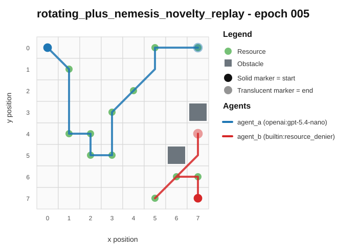
- Current trajectory: 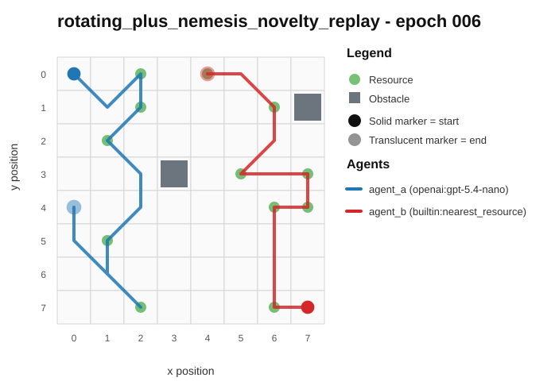
- Full artifact: `../run_20260506_221141_a/rotating_plus_nemesis_novelty_replay/epochs/epoch_006/artifact.json`

## rotating_plus_nemesis_novelty_replay / epoch 6 / run_20260507_044309_e
- Environment: `resource_collection`.
- Learner: `agent_a` vs opponent role `agent_b`.
- Code novelty: 0.9362.
- Behavioral descriptor shift: 0.1127.
- Behavior profile: `opportunistic_switcher` -> `opportunistic_switcher`.
- Behavior cell: `opportunistic_switcher:4:0:3:3` -> `opportunistic_switcher:4:0:3:3`.
- Score delta: +5.0000.
- Margin delta: +10.0000.
- Holdout margin delta vs incumbent: N/A.
- Preliminary interpretation: `mixed_change`.
- Strongest descriptor changes:
  - score_ratio: 0.5000 -> 0.9167 (+0.4167)
  - unique_cell_ratio: 0.1562 -> 0.3125 (+0.1563)
  - mean_opponent_distance: 0.6143 -> 0.4694 (-0.1449)
  - center_bias: 0.3286 -> 0.4558 (+0.1272)
  - opponent_pursuit_ratio: 0.6667 -> 0.5500 (-0.1167)

### Code Diff Preview
```diff
--- previous.py
+++ current.py
@@ -1,72 +1,56 @@
 def choose_move(observation):
-    w = observation["grid_width"]
-    h = observation["grid_height"]
     sx, sy = observation["self_position"]
     ox, oy = observation["opponent_position"]
     resources = observation.get("resources") or []
     obstacles = set(tuple(p) for p in (observation.get("obstacles") or []))
-
     if not resources:
         return [0, 0]
 
-    def man(ax, ay, bx, by):
-        d = ax - bx
-        if d < 0:
-            d = -d
-        e = ay - by
-        if e < 0:
-            e = -e
-        return d + e
+    def man(a, b, c, d):
+        dx = a - c
+        if dx < 0: dx = -dx
+        dy = b - d
+        if dy < 0: dy = -dy
+        return dx + dy
+
+    # Pick target that we are closest to relative to opponent (maximize opp_dist - self_dist)
+    best = None
+    best_key = None
+    for rx, ry in resources:
+        sd = man(sx, sy, rx, ry)
+        od = man(ox, oy, rx, ry)
+        key = (od - sd, -sd, rx, ry)
+        if best_key is None or key > best_key:
+            best_key = key
+            best = (rx, ry)
+    tx, ty = best
 
     moves = [(-1, -1), (0, -1), (1, -1), (-1, 0), (0, 0), (1, 0), (-1, 1), (0, 1), (1, 1)]
-
-    # Opponent's likely near-term target (closest resource by manhattan distance)
-    best_opp = None
-    best_opp_d = 10**9
-    for rx, ry in resources:
-        d = man(ox, oy, rx, ry)
-        if d < best_opp_d:
-            best_opp_d = d
-            best_opp = (rx, ry)
-    if best_opp is None:
-        return [0, 0]
-
-    # Opponent's greedy next step toward its chosen target (for counter-pressure)
-    tx, ty = best_opp
-    o_dx = 0 if tx == ox else (1 if tx > ox else -1)
-    o_dy = 0 if ty == oy else (1 if ty > oy else -1)
-    o_next = (ox + o_dx, oy + o_dy)
-
-    def step_score(nx, ny):
-        # Primary: how much closer we are than opponent for our best target (pick single best after moving)
-        best_gain = -10**9
-        for rx, ry in resources:
-            self_d = man(nx, ny, rx, ry)
-            opp_d = man(o_next[0], o_next[1], rx, ry)
-            gain = opp_d - self_d  # positive means we are closer next turn (by manhattan)
-            # Favor taking a resource sooner too (not only relative advantage)
-            if gain > best_gain or (gain == best_gain and self_d < best_opp_d):
-                best_gain = gain
-
-        # Secondary: avoid walking into obstacles; add mild preference to not go straight into opponent chase line
-        opp_next_dist = man(nx, ny, o_next[0], o_next[1])
-        # If we move onto opponent's likely target cell, that's extremely strong
-        on_opp_path = 1 if resources and (nx, ny) == (tx, ty) else 0
-        return best_gain * 10 + opp_next_dist + on_opp_path * 100
-
-    best_move = (0, 0)
-    best_val = -10**18
+    valid = []
... diff truncated ...
```

### Trajectory Artifacts
- Previous trajectory: 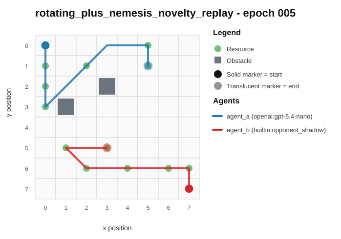
- Current trajectory: 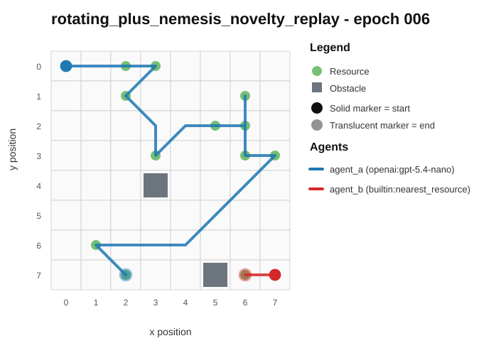
- Full artifact: `../run_20260507_044309_e/rotating_plus_nemesis_novelty_replay/epochs/epoch_006/artifact.json`

## rotating_opponents_holdout_endpoint / epoch 25 / run_20260507_044309_e
- Environment: `resource_collection`.
- Learner: `agent_a` vs opponent role `agent_b`.
- Code novelty: 0.9326.
- Behavioral descriptor shift: 0.0869.
- Behavior profile: `opportunistic_switcher` -> `opportunistic_switcher`.
- Behavior cell: `opportunistic_switcher:4:0:3:2` -> `opportunistic_switcher:4:0:4:2`.
- Score delta: -2.0000.
- Margin delta: -4.0000.
- Holdout margin delta vs incumbent: N/A.
- Preliminary interpretation: `minor_adjustment`.
- Strongest descriptor changes:
  - diagonal_ratio: 0.0769 -> 0.3077 (+0.2308)
  - score_ratio: 0.6667 -> 0.5000 (-0.1667)
  - resource_pursuit_ratio: 0.3077 -> 0.4615 (+0.1538)
  - opponent_avoidance_ratio: 0.1538 -> 0.0000 (-0.1538)
  - mean_opponent_distance: 0.5255 -> 0.4235 (-0.1020)

### Code Diff Preview
```diff
--- previous.py
+++ current.py
@@ -1,66 +1,64 @@
 def choose_move(observation):
-    w = observation["grid_width"]
-    h = observation["grid_height"]
     sx, sy = observation["self_position"]
     ox, oy = observation["opponent_position"]
     resources = observation.get("resources", []) or []
     obstacles = set(tuple(p) for p in (observation.get("obstacles", []) or []))
-
     if not resources:
         return [0, 0]
 
-    def md(ax, ay, bx, by):
-        dx = ax - bx
-        dy = ay - by
-        if dx < 0:
-            dx = -dx
-        if dy < 0:
-            dy = -dy
+    w = observation.get("grid_width", 8)
+    h = observation.get("grid_height", 8)
+
+    def md(x1, y1, x2, y2):
+        dx = x1 - x2
+        if dx < 0: dx = -dx
+        dy = y1 - y2
+        if dy < 0: dy = -dy
         return dx + dy
 
-    def best_resource():
-        best = None
-        best_key = None
-        for rx, ry in resources:
-            if (rx, ry) in obstacles:
-                continue
-            sd = md(sx, sy, rx, ry)
-            od = md(ox, oy, rx, ry)
-            adv = od - sd  # positive: we are closer
-            align = (1 if rx == sx else 0) + (1 if ry == sy else 0)
-            key = (-adv, sd, -align, rx, ry)
-            if best_key is None or key < best_key:
-                best_key = key
-                best = (rx, ry)
-        return best
+    # If standing on a resource, don't move.
+    if (sx, sy) in resources:
+        return [0, 0]
 
-    target = best_resource()
-    if target is None:
+    # Pick target resource we can beat the opponent on (largest opp_d - self_d; i.e., most negative self-opp).
+    best = None
+    best_key = None
+    for rx, ry in resources:
+        if (rx, ry) in obstacles:
+            continue
+        sd = md(sx, sy, rx, ry)
+        od = md(ox, oy, rx, ry)
+        adv = od - sd  # bigger => we are closer
+        # tie-break: prefer shorter our distance, then closer to our corner direction
+        key = (-adv, sd, rx + ry)
+        if best_key is None or key < best_key:
+            best_key = key
+            best = (rx, ry)
+
+    if best is None:
         return [0, 0]
-    tx, ty = target
+    tx, ty = best
 
     moves = [(-1, -1), (-1, 0), (-1, 1),
              (0, -1), (0, 0), (0, 1),
              (1, -1), (1, 0), (1, 1)]
 
-    best_m = None
-    best_key = None
+    best_step = [0, 0]
+    best_score = None
... diff truncated ...
```

### Trajectory Artifacts
- Previous trajectory: 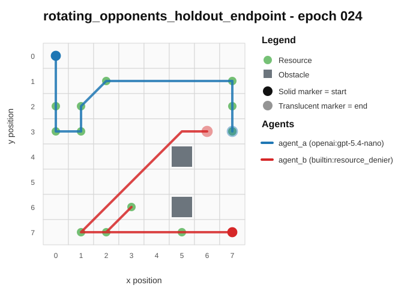
- Current trajectory: 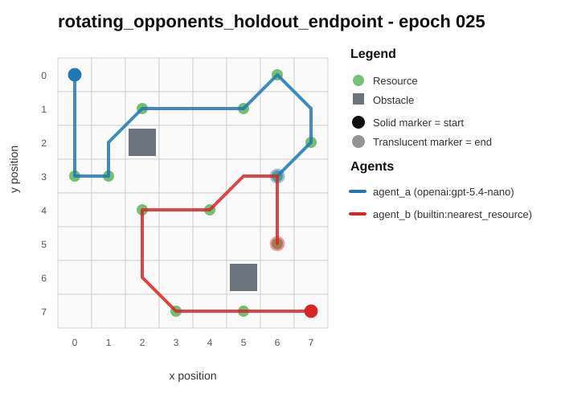
- Full artifact: `../run_20260507_044309_e/rotating_opponents_holdout_endpoint/epochs/epoch_025/artifact.json`

## rotating_plus_nemesis_novelty_replay / epoch 14 / run_20260506_221141_a
- Environment: `resource_collection`.
- Learner: `agent_a` vs opponent role `agent_b`.
- Code novelty: 0.9323.
- Behavioral descriptor shift: 0.1125.
- Behavior profile: `opportunistic_switcher` -> `opportunistic_switcher`.
- Behavior cell: `opportunistic_switcher:4:0:2:3` -> `opportunistic_switcher:4:0:3:2`.
- Score delta: -3.0000.
- Margin delta: -6.0000.
- Holdout margin delta vs incumbent: N/A.
- Preliminary interpretation: `mixed_change`.
- Strongest descriptor changes:
  - opponent_avoidance_ratio: 0.3684 -> 0.0769 (-0.2915)
  - resource_switch_ratio: 0.7895 -> 0.5385 (-0.2510)
  - score_ratio: 0.9167 -> 0.6667 (-0.2500)
  - center_bias: 0.5500 -> 0.4184 (-0.1316)
  - diagonal_ratio: 0.2632 -> 0.3846 (+0.1214)

### Code Diff Preview
```diff
--- previous.py
+++ current.py
@@ -1,57 +1,70 @@
 def choose_move(observation):
-    sx, sy = observation.get("self_position", (0, 0))
-    ox, oy = observation.get("opponent_position", (0, 0))
-    gw = int(observation.get("grid_width", 8))
-    gh = int(observation.get("grid_height", 8))
-    obs_list = observation.get("obstacles", []) or []
+    sx, sy = observation["self_position"]
+    ox, oy = observation["opponent_position"]
+    gw = observation.get("grid_width", 8)
+    gh = observation.get("grid_height", 8)
+
+    obstacles = observation.get("obstacles", []) or []
     obs = set()
-    for p in obs_list:
+    for p in obstacles:
         if isinstance(p, (list, tuple)) and len(p) >= 2:
             obs.add((int(p[0]), int(p[1])))
-    res_list = observation.get("resources", []) or []
-    resources = []
-    for r in res_list:
+
+    resources = observation.get("resources", []) or []
+    res = []
+    for r in resources:
         if isinstance(r, (list, tuple)) and len(r) >= 2:
             rx, ry = int(r[0]), int(r[1])
             if 0 <= rx < gw and 0 <= ry < gh and (rx, ry) not in obs:
-                resources.append((rx, ry))
-    if not resources:
+                res.append((rx, ry))
+    if not res:
         return [0, 0]
 
     moves = [(0, 0), (1, 0), (0, 1), (-1, 0), (0, -1), (1, 1), (1, -1), (-1, 1), (-1, -1)]
 
-    def inb(x, y):
-        return 0 <= x < gw and 0 <= y < gh and (x, y) not in obs
+    def manh(a, b):
+        return abs(a[0] - b[0]) + abs(a[1] - b[1])
 
-    def manh(x1, y1, x2, y2):
-        return abs(x1 - x2) + abs(y1 - y2)
+    def feasible(nx, ny):
+        return 0 <= nx < gw and 0 <= ny < gh and (nx, ny) not in obs
 
-    best_target = None
-    best_score = None
-    for rx, ry in resources:
-        sd = manh(sx, sy, rx, ry)
-        od = manh(ox, oy, rx, ry)
-        # Prefer close targets for self, but avoid ones opponent can reach much faster
-        score = sd + (10 if od + 1 < sd else 0) + (0 if od >= sd else 2 * (sd - od))
-        if best_score is None or score < best_score or (score == best_score and (rx, ry) < best_target):
-            best_score = score
-            best_target = (rx, ry)
+    def score_cell(cell):
+        self_d = manh((sx, sy), cell)
+        opp_d = manh((ox, oy), cell)
+        # Try to pick resources we can reach first; otherwise pick those that deny most.
+        # Larger is better.
+        reach_first = 1 if self_d < opp_d else 0
+        return (reach_first, opp_d - self_d, -(self_d))
 
-    tx, ty = best_target
-    chosen = None
-    chosen_score = None
+    # Pick target resource using deterministic ordering on ties.
+    best_res = None
+    best_key = None
+    for cell in res:
+        key = score_cell(cell)
+        if best_key is None or key > best_key or (key == best_key and (cell[0], cell[1]) < (best_res[0], best_res[1])):
+            best_key = key
+            best_res = cell
+
+    tx, ty = best_res
+
... diff truncated ...
```

### Trajectory Artifacts
- Previous trajectory: 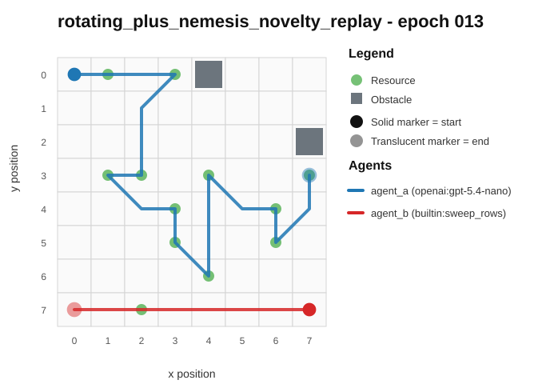
- Current trajectory: 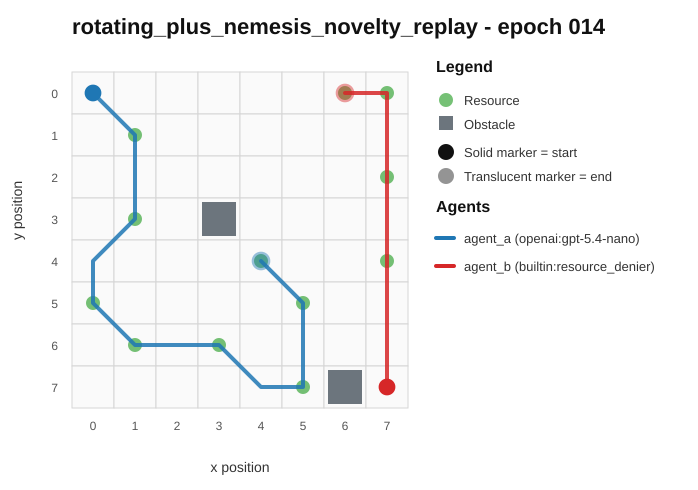
- Full artifact: `../run_20260506_221141_a/rotating_plus_nemesis_novelty_replay/epochs/epoch_014/artifact.json`

## rotating_plus_nemesis_novelty_replay / epoch 40 / run_20260506_235450_b
- Environment: `resource_collection`.
- Learner: `agent_a` vs opponent role `agent_b`.
- Code novelty: 0.9297.
- Behavioral descriptor shift: 0.0843.
- Behavior profile: `interceptor` -> `opportunistic_switcher`.
- Behavior cell: `interceptor:4:0:3:3` -> `opportunistic_switcher:4:0:3:2`.
- Score delta: +1.0000.
- Margin delta: +2.0000.
- Holdout margin delta vs incumbent: N/A.
- Preliminary interpretation: `minor_adjustment`.
- Strongest descriptor changes:
  - mean_opponent_distance: 0.3010 -> 0.5584 (+0.2574)
  - diagonal_ratio: 0.3077 -> 0.5000 (+0.1923)
  - resource_pursuit_ratio: 0.3846 -> 0.5000 (+0.1154)
  - resource_switch_ratio: 0.6154 -> 0.5000 (-0.1154)
  - opponent_pursuit_ratio: 0.6154 -> 0.7000 (+0.0846)

### Code Diff Preview
```diff
--- previous.py
+++ current.py
@@ -1,65 +1,64 @@
 def choose_move(observation):
-    w = observation.get("grid_width", 0)
-    h = observation.get("grid_height", 0)
-    sx, sy = observation.get("self_position", (0, 0))
-    ox, oy = observation.get("opponent_position", (0, 0))
-
-    resources = observation.get("resources", None) or []
-    obstacles = observation.get("obstacles", None) or []
-    obs = set()
-    for p in obstacles:
-        if isinstance(p, (list, tuple)) and len(p) >= 2:
-            obs.add((p[0], p[1]))
-
-    dirs = [(-1, -1), (0, -1), (1, -1), (-1, 0), (0, 0), (1, 0), (-1, 1), (0, 1), (1, 1)]
+    w, h = observation["grid_width"], observation["grid_height"]
+    sx, sy = observation["self_position"]
+    ox, oy = observation["opponent_position"]
+    resources = observation.get("resources", []) or []
+    obstacles = set(tuple(p) for p in (observation.get("obstacles", []) or []))
 
     def inb(x, y):
         return 0 <= x < w and 0 <= y < h
 
-    def ok(x, y):
-        return inb(x, y) and (x, y) not in obs
+    def valid(x, y):
+        return inb(x, y) and (x, y) not in obstacles
 
-    def dist2(a, b):
-        dx = a[0] - b[0]
-        dy = a[1] - b[1]
-        return dx * dx + dy * dy
+    cand = [(-1, -1), (0, -1), (1, -1), (-1, 0), (0, 0), (1, 0), (-1, 1), (0, 1), (1, 1)]
+
+    def man(ax, ay, bx, by):
+        return abs(ax - bx) + abs(ay - by)
 
     if not resources:
-        tx, ty = (w - 1, h - 1)
-        if (ox, oy) == (tx, ty):
-            tx, ty = (0, h - 1 if h else 0)
-        best = (0, 0)
-        bestv = -10**18
-        for dx, dy in dirs:
-            nx, ny = sx + dx, sy + dy
-            if not ok(nx, ny):
-                continue
-            v = -dist2((nx, ny), (tx, ty)) - 0.2 * dist2((nx, ny), (ox, oy))
-            if v > bestv:
-                bestv = v
-                best = (dx, dy)
-        return [best[0], best[1]]
+        tx, ty = (w - 1, h - 1) if (sx, sy) == (0, 0) else (0, 0)
+        dx = 0 if tx == sx else (1 if tx > sx else -1)
+        dy = 0 if ty == sy else (1 if ty > sy else -1)
+        nx, ny = sx + dx, sy + dy
+        if valid(nx, ny):
+            return [dx, dy]
+        for mx, my in cand:
+            nx, ny = sx + mx, sy + my
+            if valid(nx, ny):
+                return [mx, my]
+        return [0, 0]
 
-    best = (0, 0)
-    bestv = -10**18
-    for dx, dy in dirs:
+    best_score = None
+    best_move = (0, 0)
+
+    for dx, dy in cand:
         nx, ny = sx + dx, sy + dy
-        if not ok(nx, ny):
+        if not valid(nx, ny):
             continue
-        d_self = 10**18
-        d_opp = 10**18
... diff truncated ...
```

### Trajectory Artifacts
- Previous trajectory: 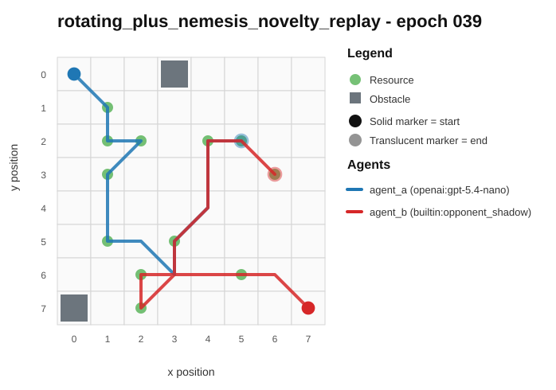
- Current trajectory: 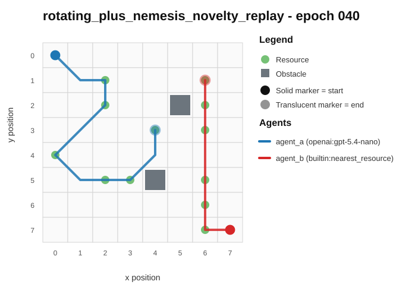
- Full artifact: `../run_20260506_235450_b/rotating_plus_nemesis_novelty_replay/epochs/epoch_040/artifact.json`

## rotating_plus_replay_aware_selection / epoch 95 / run_20260507_012808_c
- Environment: `resource_collection`.
- Learner: `agent_a` vs opponent role `agent_b`.
- Code novelty: 0.9282.
- Behavioral descriptor shift: 0.1402.
- Behavior profile: `opportunistic_switcher` -> `opportunistic_switcher`.
- Behavior cell: `opportunistic_switcher:4:0:3:3` -> `opportunistic_switcher:4:0:3:3`.
- Score delta: +6.0000.
- Margin delta: +12.0000.
- Holdout margin delta vs incumbent: N/A.
- Preliminary interpretation: `mixed_change`.
- Strongest descriptor changes:
  - score_ratio: 0.4167 -> 0.9167 (+0.5000)
  - opponent_avoidance_ratio: 0.3333 -> 0.1000 (-0.2333)
  - diagonal_ratio: 0.7500 -> 0.5500 (-0.2000)
  - exploration_ratio: 1.0000 -> 0.8500 (-0.1500)
  - revisit_ratio: 0.0000 -> 0.1500 (+0.1500)

### Code Diff Preview
```diff
--- previous.py
+++ current.py
@@ -1,11 +1,10 @@
 def choose_move(observation):
-    w = observation["grid_width"]
-    h = observation["grid_height"]
+    w = observation.get("grid_width", 8)
+    h = observation.get("grid_height", 8)
     sx, sy = observation["self_position"]
     ox, oy = observation["opponent_position"]
     resources = observation.get("resources", []) or []
     obstacles = set(tuple(p) for p in (observation.get("obstacles", []) or []))
-
     dirs = [(-1, -1), (0, -1), (1, -1), (-1, 0), (0, 0), (1, 0), (-1, 1), (0, 1), (1, 1)]
 
     def valid(x, y):
@@ -20,74 +19,44 @@
             dy = -dy
         return dx if dx > dy else dy
 
-    rem = observation.get("turns_remaining", 0)
-
-    # Choose best move by deterministic scoring
-    best = (0, 0)
-    best_score = -10**18
-
-    # If no resources, drift toward center
     if not resources:
         tx, ty = (w - 1) // 2, (h - 1) // 2
+        best = [0, 0]
+        bestd = 10**9
         for dx, dy in dirs:
             nx, ny = sx + dx, sy + dy
-            if not valid(nx, ny):
-                continue
-            d = cheb(nx, ny, tx, ty)
-            if d < best_score:
-                best_score = d
-                best = (dx, dy)
-        return [best[0], best[1]]
+            if valid(nx, ny):
+                d = cheb(nx, ny, tx, ty)
+                if d < bestd:
+                    bestd = d
+                    best = [dx, dy]
+        return best
 
     res = [tuple(r) for r in resources]
-    opp_nearest = min(cheb(ox, oy, rx, ry) for rx, ry in res)
-    our_nearest = min(cheb(sx, sy, rx, ry) for rx, ry in res)
+    best_move = [0, 0]
+    best_key = None
 
     for dx, dy in dirs:
         nx, ny = sx + dx, sy + dy
         if not valid(nx, ny):
             continue
 
-        # Find best resource to secure
-        best_gain = -10**18
-        best_tie = None
+        our_best_adv = -10**9
+        our_best_dist = 10**9
         for rx, ry in res:
-            d_us = cheb(nx, ny, rx, ry)
-            d_opp = cheb(ox, oy, rx, ry)
+            od = cheb(ox, oy, rx, ry)
+            nd = cheb(nx, ny, rx, ry)
+            adv = od - nd  # higher means we arrive earlier (or opponent later)
+            if adv > our_best_adv or (adv == our_best_adv and nd < our_best_dist):
+                our_best_adv = adv
+                our_best_dist = nd
 
-            # Only count if we can realistically arrive before opponent (or tie-break)
-            # Tie-break favors points for earlier collection; if equal, prefer smaller combined arrival.
-            if rem > 0:
-                if d_us > rem:
-                    continue
+        # Prefer moves with better arrival advantage; if tie, prefer shorter distance; then prefer staying closer to center
+        cx, cy = (w - 1) // 2, (h - 1) // 2
... diff truncated ...
```

### Trajectory Artifacts
- Previous trajectory: 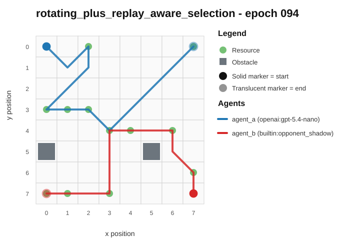
- Current trajectory: 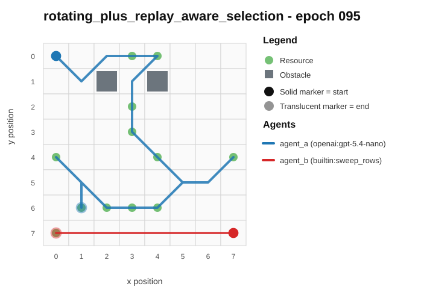
- Full artifact: `../run_20260507_012808_c/rotating_plus_replay_aware_selection/epochs/epoch_095/artifact.json`

## rotating_plus_nemesis_archive / epoch 25 / run_20260507_012808_c
- Environment: `resource_collection`.
- Learner: `agent_a` vs opponent role `agent_b`.
- Code novelty: 0.9273.
- Behavioral descriptor shift: 0.1186.
- Behavior profile: `opportunistic_switcher` -> `opportunistic_switcher`.
- Behavior cell: `opportunistic_switcher:4:0:3:2` -> `opportunistic_switcher:4:0:3:3`.
- Score delta: +3.0000.
- Margin delta: +6.0000.
- Holdout margin delta vs incumbent: N/A.
- Preliminary interpretation: `mixed_change`.
- Strongest descriptor changes:
  - center_bias: 0.3077 -> 0.5625 (+0.2548)
  - score_ratio: 0.5000 -> 0.7500 (+0.2500)
  - resource_switch_ratio: 0.5000 -> 0.7333 (+0.2333)
  - resource_pursuit_ratio: 0.5000 -> 0.3333 (-0.1667)
  - diagonal_ratio: 0.5000 -> 0.6667 (+0.1667)

### Code Diff Preview
```diff
--- previous.py
+++ current.py
@@ -1,73 +1,61 @@
 def choose_move(observation):
-    sx, sy = observation["self_position"]
-    ox, oy = observation["opponent_position"]
-    resources = observation.get("resources") or []
-    obstacles = set(tuple(p) for p in (observation.get("obstacles") or []))
+    sx, sy = observation.get("self_position", (0, 0))
+    ox, oy = observation.get("opponent_position", (0, 0))
     w = observation.get("grid_width", 8)
     h = observation.get("grid_height", 8)
 
+    resources = observation.get("resources") or []
+    res = []
+    for r in resources:
+        if isinstance(r, (list, tuple)) and len(r) >= 2:
+            res.append((int(r[0]), int(r[1])))
+
+    obstacles = observation.get("obstacles") or []
+    obs = set()
+    for p in obstacles:
+        if isinstance(p, (list, tuple)) and len(p) >= 2:
+            obs.add((int(p[0]), int(p[1])))
+
+    if not res:
+        return [0, 0]
+
     def cheb(ax, ay, bx, by):
         dx = ax - bx
-        if dx < 0:
-            dx = -dx
+        if dx < 0: dx = -dx
         dy = ay - by
-        if dy < 0:
-            dy = -dy
+        if dy < 0: dy = -dy
         return dx if dx > dy else dy
 
-    if not resources:
-        return [0, 0]
+    def pick_target():
+        best = None
+        best_key = None
+        for rx, ry in res:
+            my = cheb(sx, sy, rx, ry)
+            op = cheb(ox, oy, rx, ry)
+            key = (op - my, -my, rx, ry)
+            if best_key is None or key > best_key:
+                best_key = key
+                best = (rx, ry)
+        return best
 
-    # If already on a resource, take it
-    if (sx, sy) in set(tuple(r) for r in resources):
-        return [0, 0]
+    tx, ty = pick_target()
+    dirs = [(-1, -1), (0, -1), (1, -1), (-1, 0), (0, 0), (1, 0), (-1, 1), (0, 1), (1, 1)]
 
-    # Choose target: prefer resources where we are strictly closer than opponent; then maximize closeness advantage
-    best = None
+    best_move = [0, 0]
     best_key = None
-    for rx, ry in resources:
-        my = cheb(sx, sy, rx, ry)
-        op = cheb(ox, oy, rx, ry)
-        advantage = op - my  # positive if we are closer
-        tie = (advantage, -my, -op, rx, ry)
-        if advantage > 0:
-            if best_key is None or tie > best_key:
-                best_key = tie
-                best = (rx, ry)
-        else:
-            if best is None:
-                best = (rx, ry)
-                best_key = (advantage, -my, -op, rx, ry)
+    for dx, dy in dirs:
+        nx, ny = sx + dx, sy + dy
+        if nx < 0 or ny < 0 or nx >= w or ny >= h:
+            continue
... diff truncated ...
```

### Trajectory Artifacts
- Previous trajectory: 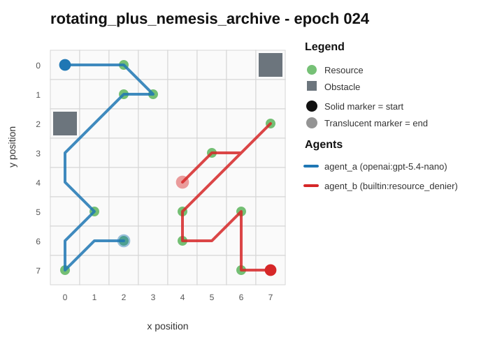
- Current trajectory: 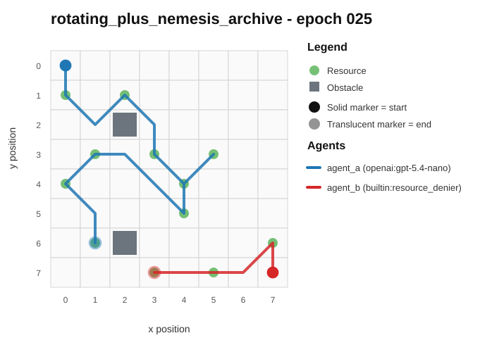
- Full artifact: `../run_20260507_012808_c/rotating_plus_nemesis_archive/epochs/epoch_025/artifact.json`

## fixed_predator_holdout_endpoint / epoch 9 / run_20260506_221141_a
- Environment: `resource_collection`.
- Learner: `agent_a` vs opponent role `agent_b`.
- Code novelty: 0.9233.
- Behavioral descriptor shift: 0.0578.
- Behavior profile: `opportunistic_switcher` -> `opportunistic_switcher`.
- Behavior cell: `opportunistic_switcher:4:0:3:2` -> `opportunistic_switcher:4:0:4:2`.
- Score delta: +0.0000.
- Margin delta: +0.0000.
- Holdout margin delta vs incumbent: N/A.
- Preliminary interpretation: `likely_code_churn`.
- Strongest descriptor changes:
  - mean_opponent_distance: 0.5667 -> 0.4341 (-0.1326)
  - resource_pursuit_ratio: 0.2857 -> 0.4167 (+0.1310)
  - opponent_avoidance_ratio: 0.2143 -> 0.0833 (-0.1310)
  - resource_switch_ratio: 0.5000 -> 0.5833 (+0.0833)
  - move_direction_entropy: 0.9134 -> 0.8438 (-0.0696)

### Code Diff Preview
```diff
--- previous.py
+++ current.py
@@ -1,62 +1,48 @@
 def choose_move(observation):
-    w = observation["grid_width"]; h = observation["grid_height"]
-    x, y = observation["self_position"]
+    sx, sy = observation["self_position"]
     ox, oy = observation["opponent_position"]
     resources = observation.get("resources", [])
     obstacles = observation.get("obstacles", [])
     if not resources:
         return [0, 0]
-    obs = {(int(a), int(b)) for a, b in obstacles}
+
+    obst = {(int(a), int(b)) for a, b in obstacles}
+    w = int(observation.get("grid_width", 8))
+    h = int(observation.get("grid_height", 8))
 
     def md(ax, ay, bx, by):
         return abs(ax - bx) + abs(ay - by)
 
-    # Select a target resource deterministically.
+    # Pick a resource we can reach with clear relative advantage (opp closer => worse).
     best = None
     best_key = None
     for rx, ry in resources:
-        sd = md(x, y, rx, ry)
+        sd = md(sx, sy, rx, ry)
         od = md(ox, oy, rx, ry)
-        key = (-(od - sd), sd, rx, ry)  # maximize (od-sd): we are relatively closer
+        adv = od - sd  # larger means we are closer
+        key = (-adv, sd, od, rx, ry)  # maximize adv; then smaller sd; then deterministic
         if best_key is None or key < best_key:
             best_key = key
             best = (rx, ry)
     tx, ty = best
 
-    # If opponent is at least as close, switch to contesting: pick a target where
-    # our relative advantage is smallest (resource_denier behavior).
-    if md(ox, oy, tx, ty) <= md(x, y, tx, ty) and len(resources) > 1:
-        best_key = None
-        best = None
-        for rx, ry in resources:
-            sd = md(x, y, rx, ry)
-            od = md(ox, oy, rx, ry)
-            key = (sd - od, sd, rx, ry)  # minimize our advantage
-            if best_key is None or key < best_key:
-                best_key = key
-                best = (rx, ry)
-        tx, ty = best
+    # Choose a legal step that maximizes our advantage on that target, with obstacle avoidance.
+    deltas = [(-1, -1), (-1, 0), (-1, 1), (0, -1), (0, 0), (0, 1), (1, -1), (1, 0), (1, 1)]
+    best_move = (0, 0)
+    best_move_key = None
+    for dx, dy in deltas:
+        nx, ny = sx + dx, sy + dy
+        if nx < 0 or nx >= w or ny < 0 or ny >= h:
+            continue
+        if (nx, ny) in obst:
+            continue
+        nsd = md(nx, ny, tx, ty)
+        nod = md(ox, oy, tx, ty)  # opponent position unchanged this turn
+        adv = nod - nsd
+        # Prefer higher adv; then smaller nsd; then keep movement minimal; deterministic tie-break.
+        key = (-adv, nsd, abs(dx) + abs(dy), dx, dy)
+        if best_move_key is None or key < best_move_key:
+            best_move_key = key
+            best_move = (dx, dy)
 
-    opp_close = md(ox, oy, tx, ty) <= md(x, y, tx, ty)
-
-    # Choose a legal one-step move that optimizes approach to the target and contest logic.
-    best_move = [0, 0]
-    best_val = None
-    for dx in (-1, 0, 1):
-        for dy in (-1, 0, 1):
-            nx, ny = x + dx, y + dy
-            if nx < 0 or nx >= w or ny < 0 or ny >= h:
-                continue
-            if (nx, ny) in obs:
... diff truncated ...
```

### Trajectory Artifacts
- Previous trajectory: 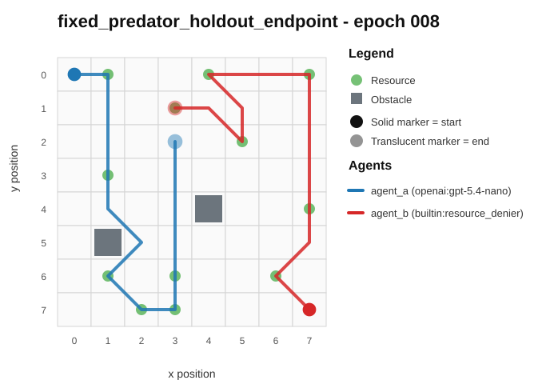
- Current trajectory: 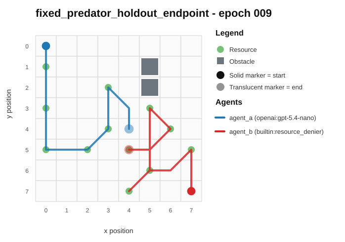
- Full artifact: `../run_20260506_221141_a/fixed_predator_holdout_endpoint/epochs/epoch_009/artifact.json`

## rotating_plus_nemesis_novelty_replay / epoch 84 / run_20260506_221141_a
- Environment: `resource_collection`.
- Learner: `agent_a` vs opponent role `agent_b`.
- Code novelty: 0.9212.
- Behavioral descriptor shift: 0.1497.
- Behavior profile: `opportunistic_switcher` -> `opportunistic_switcher`.
- Behavior cell: `opportunistic_switcher:4:0:3:2` -> `opportunistic_switcher:4:0:3:4`.
- Score delta: -5.0000.
- Margin delta: -10.0000.
- Holdout margin delta vs incumbent: N/A.
- Preliminary interpretation: `mixed_change`.
- Strongest descriptor changes:
  - score_ratio: 0.8333 -> 0.4167 (-0.4166)
  - diagonal_ratio: 0.6316 -> 0.9333 (+0.3017)
  - resource_switch_ratio: 0.5263 -> 0.8000 (+0.2737)
  - mean_opponent_distance: 0.5321 -> 0.2946 (-0.2375)
  - move_direction_entropy: 0.9864 -> 0.7996 (-0.1868)

### Code Diff Preview
```diff
--- previous.py
+++ current.py
@@ -1,69 +1,72 @@
 def choose_move(observation):
-    sx, sy = observation.get("self_position", (0, 0))
-    ox, oy = observation.get("opponent_position", (0, 0))
-    sx, sy = int(sx), int(sy)
-    ox, oy = int(ox), int(oy)
     gw = int(observation.get("grid_width", 8) or 8)
     gh = int(observation.get("grid_height", 8) or 8)
-
+    sx, sy = observation.get("self_position", [0, 0])
+    ox, oy = observation.get("opponent_position", [7, 7])
+    sx, sy, ox, oy = int(sx), int(sy), int(ox), int(oy)
     obstacles = set()
-    for it in observation.get("obstacles") or []:
+    for it in (observation.get("obstacles") or []):
         if isinstance(it, (list, tuple)) and len(it) >= 2:
             x, y = int(it[0]), int(it[1])
             if 0 <= x < gw and 0 <= y < gh:
                 obstacles.add((x, y))
-
     resources = []
-    for it in observation.get("resources") or []:
+    for it in (observation.get("resources") or []):
         if isinstance(it, (list, tuple)) and len(it) >= 2:
             x, y = int(it[0]), int(it[1])
             if 0 <= x < gw and 0 <= y < gh and (x, y) not in obstacles:
                 resources.append((x, y))
-
     if not resources:
+        tx, ty = gw // 2, gh // 2
+    else:
+        def dist(x1, y1, x2, y2):
+            dx = x1 - x2
+            if dx < 0: dx = -dx
+            dy = y1 - y2
+            if dy < 0: dy = -dy
+            return dx if dx > dy else dy
+        best_intercept = None
+        best_intercept_val = None
+        best_collect = None
+        best_collect_val = None
+        for (rx, ry) in resources:
+            sd = dist(sx, sy, rx, ry)
+            od = dist(ox, oy, rx, ry)
+            delta = od - sd  # positive: we are closer
+            if best_collect is None or (delta, -sd, -rx, -ry) > best_collect_val:
+                best_collect = (rx, ry)
+                best_collect_val = (delta, -sd, -rx, -ry)
+            # If opponent is closer, try to deny by moving toward that contested resource.
+            if od < sd:
+                val = (sd - od, -sd, rx, ry)  # prioritize smallest contest gap? use sd-od large
+                if best_intercept is None or val > best_intercept_val:
+                    best_intercept = (rx, ry)
+                    best_intercept_val = val
+        tx, ty = best_intercept if best_intercept is not None else best_collect
+    def safe(nx, ny):
+        return 0 <= nx < gw and 0 <= ny < gh and (nx, ny) not in obstacles
+    moves = [(-1,-1),(0,-1),(1,-1),(-1,0),(0,0),(1,0),(-1,1),(0,1),(1,1)]
+    def cheb(x1, y1, x2, y2):
+        a = x1 - x2
+        if a < 0: a = -a
+        b = y1 - y2
+        if b < 0: b = -b
+        return a if a > b else b
+    best = None
+    best_val = None
+    for dx, dy in moves:
+        nx, ny = sx + dx, sy + dy
+        if not safe(nx, ny):
+            continue
+        d_self = cheb(nx, ny, tx, ty)
+        # also consider not giving opponent a huge lead into our target
+        d_opp = cheb(ox, oy, tx, ty)
+        val = (-d_self, sd := -d_self, -(d_opp - d_self), -abs(nx - ox) - abs(ny - oy))
+        # deterministic tie-break with position ordering
+        val = (val, nx, ny)
+        if best is None or val > best_val:
+            best = (dx, dy)
... diff truncated ...
```

### Trajectory Artifacts
- Previous trajectory: 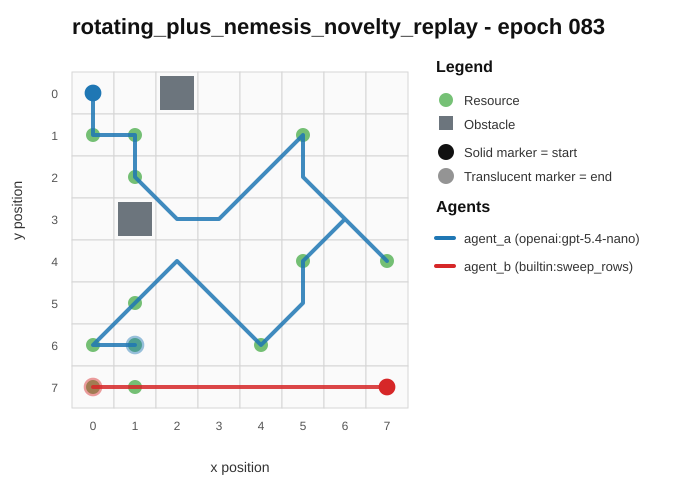
- Current trajectory: 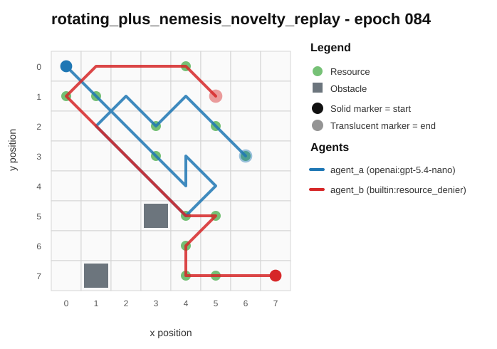
- Full artifact: `../run_20260506_221141_a/rotating_plus_nemesis_novelty_replay/epochs/epoch_084/artifact.json`

## rotating_plus_nemesis_novelty_replay / epoch 57 / run_20260507_030759_d
- Environment: `resource_collection`.
- Learner: `agent_a` vs opponent role `agent_b`.
- Code novelty: 0.9192.
- Behavioral descriptor shift: 0.0719.
- Behavior profile: `opportunistic_switcher` -> `opportunistic_switcher`.
- Behavior cell: `opportunistic_switcher:4:0:3:2` -> `opportunistic_switcher:4:0:3:2`.
- Score delta: +2.0000.
- Margin delta: +4.0000.
- Holdout margin delta vs incumbent: N/A.
- Preliminary interpretation: `minor_adjustment`.
- Strongest descriptor changes:
  - opponent_pursuit_ratio: 0.7000 -> 0.5000 (-0.2000)
  - score_ratio: 0.3333 -> 0.5000 (+0.1667)
  - center_bias: 0.3766 -> 0.4805 (+0.1039)
  - resource_switch_ratio: 0.4000 -> 0.5000 (+0.1000)
  - diagonal_ratio: 0.6000 -> 0.7000 (+0.1000)

### Code Diff Preview
```diff
--- previous.py
+++ current.py
@@ -1,29 +1,26 @@
 def choose_move(observation):
-    def to_xy(v):
-        if not v or len(v) < 2:
-            return (0, 0)
-        return (int(v[0]), int(v[1]))
-
-    w = int(observation.get("grid_width", 8) or 8)
-    h = int(observation.get("grid_height", 8) or 8)
-    sx, sy = to_xy(observation.get("self_position"))
-    ox, oy = to_xy(observation.get("opponent_position"))
+    sp = observation.get("self_position") or [0, 0]
+    op = observation.get("opponent_position") or [0, 0]
+    sx, sy = int(sp[0]), int(sp[1])
+    ox, oy = int(op[0]), int(op[1])
+    w = int(observation.get("grid_width") or 8)
+    h = int(observation.get("grid_height") or 8)
 
     obstacles = set()
-    for o in observation.get("obstacles", []) or []:
+    for o in observation.get("obstacles") or []:
         if isinstance(o, (list, tuple)) and len(o) >= 2:
-            obstacles.add((int(o[0]), int(o[1])))
+            x, y = int(o[0]), int(o[1])
+            if 0 <= x < w and 0 <= y < h:
+                obstacles.add((x, y))
 
     resources = []
-    for r in observation.get("resources", []) or []:
+    for r in observation.get("resources") or []:
         if isinstance(r, (list, tuple)) and len(r) >= 2:
-            cell = (int(r[0]), int(r[1]))
-            if cell not in obstacles:
-                resources.append(cell)
+            x, y = int(r[0]), int(r[1])
+            if (x, y) not in obstacles and 0 <= x < w and 0 <= y < h:
+                resources.append((x, y))
 
-    moves = [(-1, -1), (-1, 0), (-1, 1), (0, -1), (0, 0), (0, 1), (1, -1), (1, 0), (1, 1)]
-
-    def dist_cheb(x1, y1, x2, y2):
+    def cheb(x1, y1, x2, y2):
         dx = x1 - x2
         if dx < 0:
             dx = -dx
@@ -32,58 +29,44 @@
             dy = -dy
         return dx if dx > dy else dy
 
-    def valid(nx, ny):
-        return 0 <= nx < w and 0 <= ny < h and (nx, ny) not in obstacles
+    def valid(x, y):
+        return 0 <= x < w and 0 <= y < h and (x, y) not in obstacles
+
+    moves = [(1, 0), (0, 1), (-1, 0), (0, -1), (1, 1), (-1, 1), (1, -1), (-1, -1), (0, 0)]
 
     if not resources:
-        best = (-(10**9), 0, 0)
-        for dx, dy in moves:
-            nx, ny = sx + dx, sy + dy
-            if not valid(nx, ny):
-                continue
-            d = dist_cheb(nx, ny, ox, oy)
-            if d > best[0]:
-                best = (d, dx, dy)
-        return [best[1], best[2]]
+        dx = 0
+        if ox > sx:
+            dx = 1
+        elif ox < sx:
+            dx = -1
+        dy = 0
+        if oy > sy:
+            dy = 1
+        elif oy < sy:
+            dy = -1
+        nx, ny = sx + dx, sy + dy
+        if valid(nx, ny):
... diff truncated ...
```

### Trajectory Artifacts
- Previous trajectory: 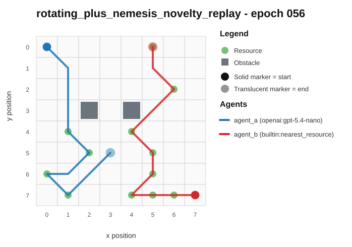
- Current trajectory: 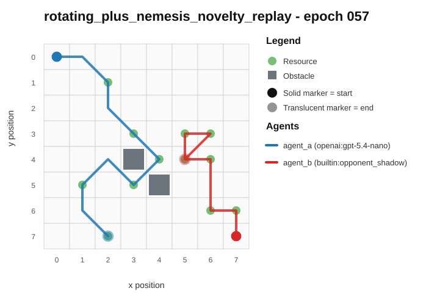
- Full artifact: `../run_20260507_030759_d/rotating_plus_nemesis_novelty_replay/epochs/epoch_057/artifact.json`
