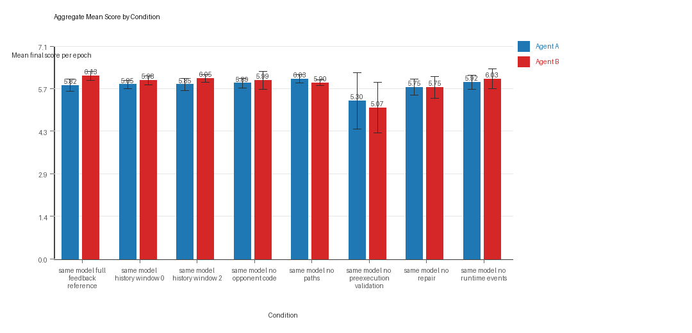
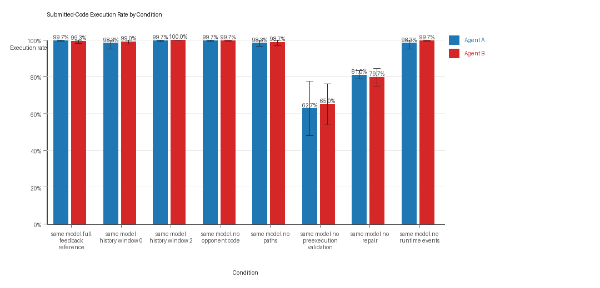
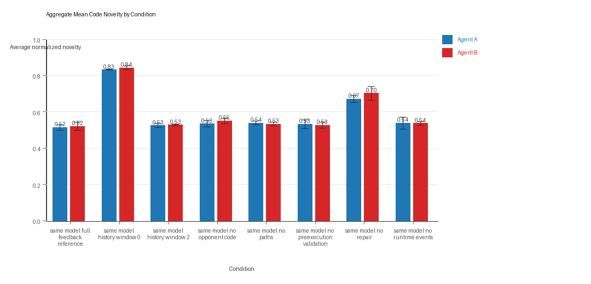

# Aggregate Research Report

## Included Runs
- Run count: 3.
- Conditions aggregated: 8.
- Runs: `run_20260429_005321`, `run_20260429_071125`, `run_20260429_115414`.

## Cross-Run Summary
- Same-model novelty mean 0.5892 (std 0.0006, 95% CI 0.5885 to 0.5898).
- No cross-model conditions were included in this aggregate.
- Same-model policy markers mean 3.6247 (std 0.5965, 95% CI 2.9497 to 4.2996).
- No cross-model policy-marker summary is available for this aggregate.

## Aggregate Charts
### Mean Score by Condition

- Each bar shows the mean final score per epoch for one agent role in that condition.
- Error bars show the 95% confidence interval across the included runs.

### Submitted-Code Execution Rate by Condition

- The y-axis is the percentage of epochs where submitted code executed instead of a fallback policy.
- Values near 100% indicate the infrastructure stayed reliable across the included runs.

### Mean Code Novelty by Condition

- Novelty is the average normalized code-change score across epochs for that agent role and condition.
- Higher bars indicate more code variation across repeated runs, not necessarily better performance.

## Per Condition
### same_model_full_feedback_reference
- Matchup type: same-model.
- Fully clean run count: 2/3.
- Research tags: campaign=full_suite_from_scratch, factor_level=baseline, factor_name=full_feedback_reference, replicate_id=A, suite_family=ablations, suite_type=research_ablation; campaign=full_suite_from_scratch, factor_level=baseline, factor_name=full_feedback_reference, replicate_id=B, suite_family=ablations, suite_type=research_ablation; campaign=full_suite_from_scratch, factor_level=baseline, factor_name=full_feedback_reference, replicate_id=C, suite_family=ablations, suite_type=research_ablation.
- agent_a average score: agent_a mean 5.8167 (std 0.1757, 95% CI 5.6179 to 6.0155).
- agent_a generation success rate: agent_a mean 0.9967 (std 0.0058, 95% CI 0.9901 to 1.0).
- agent_a submitted-code execution rate: agent_a mean 0.9967 (std 0.0058, 95% CI 0.9901 to 1.0).
- agent_a novelty: agent_a mean 0.515 (std 0.0133, 95% CI 0.4999 to 0.5301).
- agent_a policy-marker count: agent_a mean 0.0 (std 0.0, 95% CI 0.0 to 0.0).
- agent_b average score: agent_b mean 6.1333 (std 0.1325, 95% CI 5.9834 to 6.2833).
- agent_b generation success rate: agent_b mean 0.9933 (std 0.0115, 95% CI 0.9803 to 1.0).
- agent_b submitted-code execution rate: agent_b mean 0.9933 (std 0.0115, 95% CI 0.9803 to 1.0).
- agent_b novelty: agent_b mean 0.5198 (std 0.0202, 95% CI 0.497 to 0.5426).
- agent_b policy-marker count: agent_b mean 0.0 (std 0.0, 95% CI 0.0 to 0.0).
- agent_a win share: agent_a mean 0.3533 (std 0.0058, 95% CI 0.3468 to 0.3599).
- agent_b win share: agent_b mean 0.4167 (std 0.0702, 95% CI 0.3372 to 0.4961).
- draw win share: draw mean 0.23 (std 0.0755, 95% CI 0.1446 to 0.3154).

### same_model_history_window_0
- Matchup type: same-model.
- Fully clean run count: 1/3.
- Research tags: campaign=full_suite_from_scratch, factor_level=0, factor_name=history_window, replicate_id=A, suite_family=ablations, suite_type=research_ablation; campaign=full_suite_from_scratch, factor_level=0, factor_name=history_window, replicate_id=B, suite_family=ablations, suite_type=research_ablation; campaign=full_suite_from_scratch, factor_level=0, factor_name=history_window, replicate_id=C, suite_family=ablations, suite_type=research_ablation.
- agent_a average score: agent_a mean 5.8483 (std 0.1239, 95% CI 5.7081 to 5.9886).
- agent_a generation success rate: agent_a mean 0.9833 (std 0.0289, 95% CI 0.9507 to 1.0).
- agent_a submitted-code execution rate: agent_a mean 0.9833 (std 0.0289, 95% CI 0.9507 to 1.0).
- agent_a novelty: agent_a mean 0.8324 (std 0.0017, 95% CI 0.8304 to 0.8344).
- agent_a policy-marker count: agent_a mean 0.3333 (std 0.5774, 95% CI 0.0 to 0.9867).
- agent_b average score: agent_b mean 5.9817 (std 0.1418, 95% CI 5.8212 to 6.1421).
- agent_b generation success rate: agent_b mean 0.99 (std 0.01, 95% CI 0.9787 to 1.0).
- agent_b submitted-code execution rate: agent_b mean 0.99 (std 0.01, 95% CI 0.9787 to 1.0).
- agent_b novelty: agent_b mean 0.8432 (std 0.0094, 95% CI 0.8326 to 0.8539).
- agent_b policy-marker count: agent_b mean 0.0 (std 0.0, 95% CI 0.0 to 0.0).
- agent_a win share: agent_a mean 0.3833 (std 0.0321, 95% CI 0.347 to 0.4197).
- agent_b win share: agent_b mean 0.41 (std 0.0361, 95% CI 0.3692 to 0.4508).
- draw win share: draw mean 0.2067 (std 0.0503, 95% CI 0.1497 to 0.2636).

### same_model_history_window_2
- Matchup type: same-model.
- Fully clean run count: 2/3.
- Research tags: campaign=full_suite_from_scratch, factor_level=2, factor_name=history_window, replicate_id=A, suite_family=ablations, suite_type=research_ablation; campaign=full_suite_from_scratch, factor_level=2, factor_name=history_window, replicate_id=B, suite_family=ablations, suite_type=research_ablation; campaign=full_suite_from_scratch, factor_level=2, factor_name=history_window, replicate_id=C, suite_family=ablations, suite_type=research_ablation.
- agent_a average score: agent_a mean 5.8483 (std 0.1815, 95% CI 5.643 to 6.0537).
- agent_a generation success rate: agent_a mean 0.9967 (std 0.0058, 95% CI 0.9901 to 1.0).
- agent_a submitted-code execution rate: agent_a mean 0.9967 (std 0.0058, 95% CI 0.9901 to 1.0).
- agent_a novelty: agent_a mean 0.525 (std 0.0109, 95% CI 0.5126 to 0.5373).
- agent_a policy-marker count: agent_a mean 0.0 (std 0.0, 95% CI 0.0 to 0.0).
- agent_b average score: agent_b mean 6.0483 (std 0.1168, 95% CI 5.9162 to 6.1805).
- agent_b generation success rate: agent_b mean 1.0 (std 0.0, 95% CI 1.0 to 1.0).
- agent_b submitted-code execution rate: agent_b mean 1.0 (std 0.0, 95% CI 1.0 to 1.0).
- agent_b novelty: agent_b mean 0.5279 (std 0.0037, 95% CI 0.5237 to 0.532).
- agent_b policy-marker count: agent_b mean 0.3333 (std 0.5774, 95% CI 0.0 to 0.9867).
- agent_a win share: agent_a mean 0.3667 (std 0.0462, 95% CI 0.3144 to 0.4189).
- agent_b win share: agent_b mean 0.4133 (std 0.0643, 95% CI 0.3406 to 0.4861).
- draw win share: draw mean 0.22 (std 0.02, 95% CI 0.1974 to 0.2426).

### same_model_no_opponent_code
- Matchup type: same-model.
- Fully clean run count: 2/3.
- Research tags: campaign=full_suite_from_scratch, factor_level=off, factor_name=opponent_code_visibility, replicate_id=A, suite_family=ablations, suite_type=research_ablation; campaign=full_suite_from_scratch, factor_level=off, factor_name=opponent_code_visibility, replicate_id=B, suite_family=ablations, suite_type=research_ablation; campaign=full_suite_from_scratch, factor_level=off, factor_name=opponent_code_visibility, replicate_id=C, suite_family=ablations, suite_type=research_ablation.
- agent_a average score: agent_a mean 5.8917 (std 0.1415, 95% CI 5.7315 to 6.0518).
- agent_a generation success rate: agent_a mean 0.9967 (std 0.0058, 95% CI 0.9901 to 1.0).
- agent_a submitted-code execution rate: agent_a mean 0.9967 (std 0.0058, 95% CI 0.9901 to 1.0).
- agent_a novelty: agent_a mean 0.5345 (std 0.016, 95% CI 0.5165 to 0.5526).
- agent_a policy-marker count: agent_a mean 0.0 (std 0.0, 95% CI 0.0 to 0.0).
- agent_b average score: agent_b mean 5.9883 (std 0.2684, 95% CI 5.6846 to 6.292).
- agent_b generation success rate: agent_b mean 0.9967 (std 0.0058, 95% CI 0.9901 to 1.0).
- agent_b submitted-code execution rate: agent_b mean 0.9967 (std 0.0058, 95% CI 0.9901 to 1.0).
- agent_b novelty: agent_b mean 0.5498 (std 0.0136, 95% CI 0.5344 to 0.5652).
- agent_b policy-marker count: agent_b mean 0.0 (std 0.0, 95% CI 0.0 to 0.0).
- agent_a win share: agent_a mean 0.4033 (std 0.0651, 95% CI 0.3297 to 0.477).
- agent_b win share: agent_b mean 0.3833 (std 0.0723, 95% CI 0.3015 to 0.4652).
- draw win share: draw mean 0.2133 (std 0.0289, 95% CI 0.1807 to 0.246).

### same_model_no_paths
- Matchup type: same-model.
- Fully clean run count: 1/3.
- Research tags: campaign=full_suite_from_scratch, factor_level=off, factor_name=path_feedback, replicate_id=A, suite_family=ablations, suite_type=research_ablation; campaign=full_suite_from_scratch, factor_level=off, factor_name=path_feedback, replicate_id=B, suite_family=ablations, suite_type=research_ablation; campaign=full_suite_from_scratch, factor_level=off, factor_name=path_feedback, replicate_id=C, suite_family=ablations, suite_type=research_ablation.
- agent_a average score: agent_a mean 6.0267 (std 0.125, 95% CI 5.8852 to 6.1682).
- agent_a generation success rate: agent_a mean 0.9833 (std 0.0153, 95% CI 0.966 to 1.0).
- agent_a submitted-code execution rate: agent_a mean 0.9833 (std 0.0153, 95% CI 0.966 to 1.0).
- agent_a novelty: agent_a mean 0.5386 (std 0.0088, 95% CI 0.5287 to 0.5485).
- agent_a policy-marker count: agent_a mean 0.6667 (std 0.5774, 95% CI 0.0133 to 1.32).
- agent_b average score: agent_b mean 5.9 (std 0.0866, 95% CI 5.802 to 5.998).
- agent_b generation success rate: agent_b mean 0.9867 (std 0.0153, 95% CI 0.9694 to 1.0).
- agent_b submitted-code execution rate: agent_b mean 0.9867 (std 0.0153, 95% CI 0.9694 to 1.0).
- agent_b novelty: agent_b mean 0.5328 (std 0.0089, 95% CI 0.5227 to 0.5429).
- agent_b policy-marker count: agent_b mean 0.6667 (std 1.1547, 95% CI 0.0 to 1.9733).
- agent_a win share: agent_a mean 0.3733 (std 0.0666, 95% CI 0.298 to 0.4487).
- agent_b win share: agent_b mean 0.3567 (std 0.0058, 95% CI 0.3501 to 0.3632).
- draw win share: draw mean 0.27 (std 0.0693, 95% CI 0.1916 to 0.3484).

### same_model_no_preexecution_validation
- Matchup type: same-model.
- Fully clean run count: 0/3.
- Research tags: campaign=full_suite_from_scratch, factor_level=disabled, factor_name=generation_scaffold, replicate_id=A, suite_family=ablations, suite_type=research_ablation; campaign=full_suite_from_scratch, factor_level=disabled, factor_name=generation_scaffold, replicate_id=B, suite_family=ablations, suite_type=research_ablation; campaign=full_suite_from_scratch, factor_level=disabled, factor_name=generation_scaffold, replicate_id=C, suite_family=ablations, suite_type=research_ablation.
- agent_a average score: agent_a mean 5.2967 (std 0.8372, 95% CI 4.3493 to 6.244).
- agent_a generation success rate: agent_a mean 1.0 (std 0.0, 95% CI 1.0 to 1.0).
- agent_a submitted-code execution rate: agent_a mean 0.6267 (std 0.1305, 95% CI 0.479 to 0.7744).
- agent_a novelty: agent_a mean 0.5317 (std 0.0225, 95% CI 0.5063 to 0.5572).
- agent_a policy-marker count: agent_a mean 15.6667 (std 5.6862, 95% CI 9.2321 to 22.1013).
- agent_b average score: agent_b mean 5.0667 (std 0.7427, 95% CI 4.2262 to 5.9071).
- agent_b generation success rate: agent_b mean 1.0 (std 0.0, 95% CI 1.0 to 1.0).
- agent_b submitted-code execution rate: agent_b mean 0.65 (std 0.0985, 95% CI 0.5385 to 0.7615).
- agent_b novelty: agent_b mean 0.5269 (std 0.0148, 95% CI 0.5102 to 0.5437).
- agent_b policy-marker count: agent_b mean 17.0 (std 1.7321, 95% CI 15.04 to 18.96).
- agent_a win share: agent_a mean 0.4 (std 0.0872, 95% CI 0.3013 to 0.4987).
- agent_b win share: agent_b mean 0.37 (std 0.0624, 95% CI 0.2993 to 0.4407).
- draw win share: draw mean 0.23 (std 0.0265, 95% CI 0.2001 to 0.2599).

### same_model_no_repair
- Matchup type: same-model.
- Fully clean run count: 0/3.
- Research tags: campaign=full_suite_from_scratch, factor_level=repair_off, factor_name=generation_scaffold, replicate_id=A, suite_family=ablations, suite_type=research_ablation; campaign=full_suite_from_scratch, factor_level=repair_off, factor_name=generation_scaffold, replicate_id=B, suite_family=ablations, suite_type=research_ablation; campaign=full_suite_from_scratch, factor_level=repair_off, factor_name=generation_scaffold, replicate_id=C, suite_family=ablations, suite_type=research_ablation.
- agent_a average score: agent_a mean 5.755 (std 0.2318, 95% CI 5.4927 to 6.0173).
- agent_a generation success rate: agent_a mean 0.81 (std 0.02, 95% CI 0.7874 to 0.8326).
- agent_a submitted-code execution rate: agent_a mean 0.81 (std 0.02, 95% CI 0.7874 to 0.8326).
- agent_a novelty: agent_a mean 0.6716 (std 0.0176, 95% CI 0.6517 to 0.6914).
- agent_a policy-marker count: agent_a mean 11.3333 (std 2.3094, 95% CI 8.72 to 13.9467).
- agent_b average score: agent_b mean 5.7517 (std 0.3191, 95% CI 5.3906 to 6.1127).
- agent_b generation success rate: agent_b mean 0.7967 (std 0.0416, 95% CI 0.7496 to 0.8438).
- agent_b submitted-code execution rate: agent_b mean 0.7967 (std 0.0416, 95% CI 0.7496 to 0.8438).
- agent_b novelty: agent_b mean 0.702 (std 0.0341, 95% CI 0.6634 to 0.7405).
- agent_b policy-marker count: agent_b mean 11.0 (std 1.0, 95% CI 9.8684 to 12.1316).
- agent_a win share: agent_a mean 0.4133 (std 0.0208, 95% CI 0.3898 to 0.4369).
- agent_b win share: agent_b mean 0.39 (std 0.0557, 95% CI 0.327 to 0.453).
- draw win share: draw mean 0.1967 (std 0.0462, 95% CI 0.1444 to 0.2489).

### same_model_no_runtime_events
- Matchup type: same-model.
- Fully clean run count: 1/3.
- Research tags: campaign=full_suite_from_scratch, factor_level=off, factor_name=runtime_event_feedback, replicate_id=A, suite_family=ablations, suite_type=research_ablation; campaign=full_suite_from_scratch, factor_level=off, factor_name=runtime_event_feedback, replicate_id=B, suite_family=ablations, suite_type=research_ablation; campaign=full_suite_from_scratch, factor_level=off, factor_name=runtime_event_feedback, replicate_id=C, suite_family=ablations, suite_type=research_ablation.
- agent_a average score: agent_a mean 5.9183 (std 0.2097, 95% CI 5.6811 to 6.1556).
- agent_a generation success rate: agent_a mean 0.9833 (std 0.0289, 95% CI 0.9507 to 1.0).
- agent_a submitted-code execution rate: agent_a mean 0.9833 (std 0.0289, 95% CI 0.9507 to 1.0).
- agent_a novelty: agent_a mean 0.5387 (std 0.0292, 95% CI 0.5056 to 0.5717).
- agent_a policy-marker count: agent_a mean 1.0 (std 1.7321, 95% CI 0.0 to 2.96).
- agent_b average score: agent_b mean 6.0317 (std 0.2962, 95% CI 5.6965 to 6.3668).
- agent_b generation success rate: agent_b mean 0.9967 (std 0.0058, 95% CI 0.9901 to 1.0).
- agent_b submitted-code execution rate: agent_b mean 0.9967 (std 0.0058, 95% CI 0.9901 to 1.0).
- agent_b novelty: agent_b mean 0.5364 (std 0.0098, 95% CI 0.5254 to 0.5475).
- agent_b policy-marker count: agent_b mean 0.0 (std 0.0, 95% CI 0.0 to 0.0).
- agent_a win share: agent_a mean 0.3633 (std 0.0737, 95% CI 0.2799 to 0.4467).
- agent_b win share: agent_b mean 0.41 (std 0.07, 95% CI 0.3308 to 0.4892).
- draw win share: draw mean 0.2267 (std 0.0252, 95% CI 0.1982 to 0.2551).

## Interpretation Caveats
- Aggregate results are only as strong as the included run set. If the input runs mix different prompts, environments, or suite definitions, treat the summary as descriptive rather than causal.
- Confidence intervals here summarize variation across run-level condition summaries; they are not substitutes for careful experimental design.
- Use this aggregate report together with per-run reports and the research checklist before making strong claims.

## Aggregate Conclusions
- Data quality summary: 0/8 conditions were fully clean, 3/8 were near-clean, and 5/8 remained higher-noise.

### Best-Supported Findings
- This aggregate only supports same-model novelty summary (0.5892); no cross-model comparison is available here.
- Policy-marker rates for the available same-model conditions were 3.6247; no cross-model comparison is available here.

### Directional Or Uncertain Findings
- Conditions classified as higher-noise should be treated as exploratory unless the same direction reappears in cleaner replicate runs.

### Claims Not Supported Yet
- The aggregate does not by itself establish causality; the strongest causal interpretations should come from replicated ablation conditions rather than from mixed-condition summaries alone.
- Code novelty should not be treated as equivalent to strategic innovation without qualitative review of notable epochs and behavior traces.
