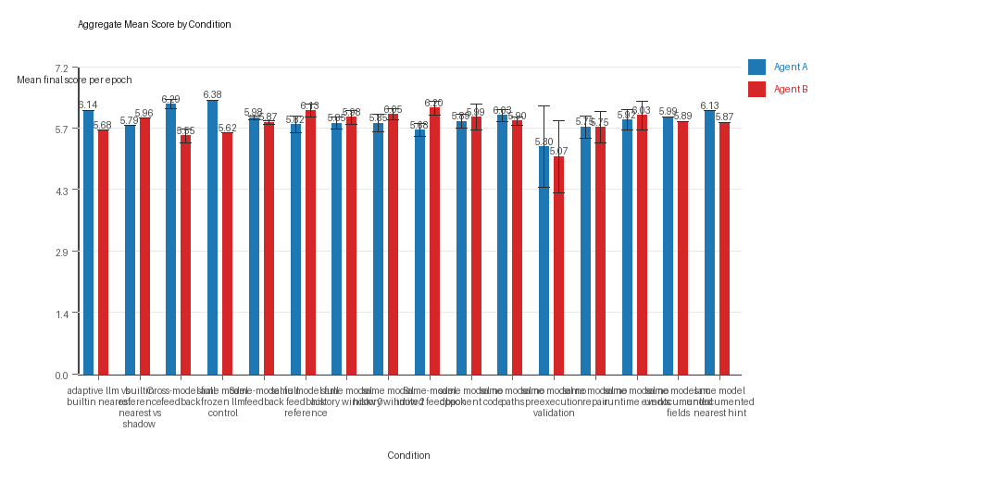
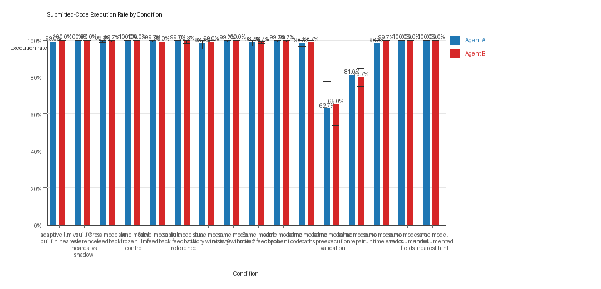
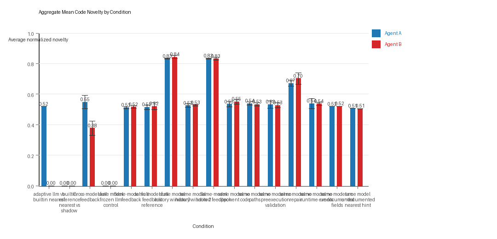

# Aggregate Research Report

## Included Runs
- Run count: 8.
- Conditions aggregated: 16.
- Runs: `run_20260427_140200`, `run_20260428_163631`, `run_20260428_214328`, `run_20260429_005321`, `run_20260429_071125`, `run_20260429_115414`, `run_20260429_163529`, `run_20260429_165752`.

## Cross-Run Summary
- Same-model novelty mean 0.5376 (std 0.2246, 95% CI 0.382 to 0.6932).
- Cross-model novelty mean 0.3792 (std 0.1676, 95% CI 0.215 to 0.5435).
- Same-model policy markers mean 1.4842 (std 1.8078, 95% CI 0.2315 to 2.737).
- Cross-model policy markers mean 0.3125 (std 0.2394, 95% CI 0.0779 to 0.5471).
- This aggregate mixes multiple suite families or suite types, so use the family-specific aggregates for interpretation and treat this summary as descriptive only.

## Aggregate Charts
### Mean Score by Condition

- Each bar shows the mean final score per epoch for one agent role in that condition.
- Error bars show the 95% confidence interval across the included runs.

### Submitted-Code Execution Rate by Condition

- The y-axis is the percentage of epochs where submitted code executed instead of a fallback policy.
- Values near 100% indicate the infrastructure stayed reliable across the included runs.

### Mean Code Novelty by Condition

- Novelty is the average normalized code-change score across epochs for that agent role and condition.
- Higher bars indicate more code variation across repeated runs, not necessarily better performance.

## Per Condition
### adaptive_llm_vs_builtin_nearest
- Matchup type: cross-model.
- Fully clean run count: 0/1.
- Research tags: campaign=full_suite_from_scratch, control_type=llm_vs_builtin, suite_family=controls, suite_type=research_control.
- agent_a average score: agent_a mean 6.145 (std 0.0, 95% CI 6.145 to 6.145).
- agent_a generation success rate: agent_a mean 0.99 (std 0.0, 95% CI 0.99 to 0.99).
- agent_a submitted-code execution rate: agent_a mean 0.99 (std 0.0, 95% CI 0.99 to 0.99).
- agent_a novelty: agent_a mean 0.5195 (std 0.0, 95% CI 0.5195 to 0.5195).
- agent_a policy-marker count: agent_a mean 1.0 (std 0.0, 95% CI 1.0 to 1.0).
- agent_b average score: agent_b mean 5.685 (std 0.0, 95% CI 5.685 to 5.685).
- agent_b generation success rate: agent_b mean 1.0 (std 0.0, 95% CI 1.0 to 1.0).
- agent_b submitted-code execution rate: agent_b mean 1.0 (std 0.0, 95% CI 1.0 to 1.0).
- agent_b novelty: agent_b mean 0.0 (std 0.0, 95% CI 0.0 to 0.0).
- agent_b policy-marker count: agent_b mean 0.0 (std 0.0, 95% CI 0.0 to 0.0).
- agent_a win share: agent_a mean 0.43 (std 0.0, 95% CI 0.43 to 0.43).
- agent_b win share: agent_b mean 0.39 (std 0.0, 95% CI 0.39 to 0.39).
- draw win share: draw mean 0.18 (std 0.0, 95% CI 0.18 to 0.18).

### builtin_reference_nearest_vs_shadow
- Matchup type: cross-model.
- Fully clean run count: 1/1.
- Research tags: campaign=full_suite_from_scratch, control_type=builtin_baseline, suite_family=controls, suite_type=research_control.
- agent_a average score: agent_a mean 5.79 (std 0.0, 95% CI 5.79 to 5.79).
- agent_a generation success rate: agent_a mean 1.0 (std 0.0, 95% CI 1.0 to 1.0).
- agent_a submitted-code execution rate: agent_a mean 1.0 (std 0.0, 95% CI 1.0 to 1.0).
- agent_a novelty: agent_a mean 0.0 (std 0.0, 95% CI 0.0 to 0.0).
- agent_a policy-marker count: agent_a mean 0.0 (std 0.0, 95% CI 0.0 to 0.0).
- agent_b average score: agent_b mean 5.96 (std 0.0, 95% CI 5.96 to 5.96).
- agent_b generation success rate: agent_b mean 1.0 (std 0.0, 95% CI 1.0 to 1.0).
- agent_b submitted-code execution rate: agent_b mean 1.0 (std 0.0, 95% CI 1.0 to 1.0).
- agent_b novelty: agent_b mean 0.0 (std 0.0, 95% CI 0.0 to 0.0).
- agent_b policy-marker count: agent_b mean 0.0 (std 0.0, 95% CI 0.0 to 0.0).
- agent_a win share: agent_a mean 0.45 (std 0.0, 95% CI 0.45 to 0.45).
- agent_b win share: agent_b mean 0.38 (std 0.0, 95% CI 0.38 to 0.38).
- draw win share: draw mean 0.17 (std 0.0, 95% CI 0.17 to 0.17).

### cross_model_full_feedback
- Matchup type: cross-model.
- Fully clean run count: 0/3.
- Research tags: campaign=full_suite_from_scratch, replicate_id=B, suite_family=core; campaign=full_suite_from_scratch, replicate_id=C, suite_family=core.
- agent_a average score: agent_a mean 6.29 (std 0.0958, 95% CI 6.1816 to 6.3984).
- agent_a generation success rate: agent_a mean 0.9933 (std 0.0058, 95% CI 0.9868 to 0.9999).
- agent_a submitted-code execution rate: agent_a mean 0.9933 (std 0.0058, 95% CI 0.9868 to 0.9999).
- agent_a novelty: agent_a mean 0.5477 (std 0.0384, 95% CI 0.5043 to 0.5911).
- agent_a policy-marker count: agent_a mean 0.3333 (std 0.5774, 95% CI 0.0 to 0.9867).
- agent_b average score: agent_b mean 5.55 (std 0.1376, 95% CI 5.3943 to 5.7057).
- agent_b generation success rate: agent_b mean 0.9967 (std 0.0058, 95% CI 0.9901 to 1.0).
- agent_b submitted-code execution rate: agent_b mean 0.9967 (std 0.0058, 95% CI 0.9901 to 1.0).
- agent_b novelty: agent_b mean 0.377 (std 0.0412, 95% CI 0.3304 to 0.4236).
- agent_b policy-marker count: agent_b mean 0.3333 (std 0.5774, 95% CI 0.0 to 0.9867).
- agent_a win share: agent_a mean 0.4933 (std 0.0577, 95% CI 0.428 to 0.5587).
- agent_b win share: agent_b mean 0.3467 (std 0.0306, 95% CI 0.3121 to 0.3812).
- draw win share: draw mean 0.16 (std 0.04, 95% CI 0.1147 to 0.2053).

### same_model_frozen_llm_control
- Matchup type: same-model.
- Fully clean run count: 1/1.
- Research tags: campaign=full_suite_from_scratch, control_type=frozen_llm, suite_family=controls, suite_type=research_control.
- agent_a average score: agent_a mean 6.385 (std 0.0, 95% CI 6.385 to 6.385).
- agent_a generation success rate: agent_a mean 1.0 (std 0.0, 95% CI 1.0 to 1.0).
- agent_a submitted-code execution rate: agent_a mean 1.0 (std 0.0, 95% CI 1.0 to 1.0).
- agent_a novelty: agent_a mean 0.0 (std 0.0, 95% CI 0.0 to 0.0).
- agent_a policy-marker count: agent_a mean 0.0 (std 0.0, 95% CI 0.0 to 0.0).
- agent_b average score: agent_b mean 5.615 (std 0.0, 95% CI 5.615 to 5.615).
- agent_b generation success rate: agent_b mean 1.0 (std 0.0, 95% CI 1.0 to 1.0).
- agent_b submitted-code execution rate: agent_b mean 1.0 (std 0.0, 95% CI 1.0 to 1.0).
- agent_b novelty: agent_b mean 0.0 (std 0.0, 95% CI 0.0 to 0.0).
- agent_b policy-marker count: agent_b mean 0.0 (std 0.0, 95% CI 0.0 to 0.0).
- agent_a win share: agent_a mean 0.47 (std 0.0, 95% CI 0.47 to 0.47).
- agent_b win share: agent_b mean 0.21 (std 0.0, 95% CI 0.21 to 0.21).
- draw win share: draw mean 0.32 (std 0.0, 95% CI 0.32 to 0.32).

### same_model_full_feedback
- Matchup type: same-model.
- Fully clean run count: 0/3.
- Research tags: campaign=full_suite_from_scratch, replicate_id=B, suite_family=core; campaign=full_suite_from_scratch, replicate_id=C, suite_family=core.
- agent_a average score: agent_a mean 5.9767 (std 0.0382, 95% CI 5.9335 to 6.0199).
- agent_a generation success rate: agent_a mean 0.9967 (std 0.0058, 95% CI 0.9901 to 1.0).
- agent_a submitted-code execution rate: agent_a mean 0.9967 (std 0.0058, 95% CI 0.9901 to 1.0).
- agent_a novelty: agent_a mean 0.5111 (std 0.0051, 95% CI 0.5054 to 0.5168).
- agent_a policy-marker count: agent_a mean 0.0 (std 0.0, 95% CI 0.0 to 0.0).
- agent_b average score: agent_b mean 5.8667 (std 0.0407, 95% CI 5.8206 to 5.9127).
- agent_b generation success rate: agent_b mean 0.99 (std 0.0, 95% CI 0.99 to 0.99).
- agent_b submitted-code execution rate: agent_b mean 0.99 (std 0.0, 95% CI 0.99 to 0.99).
- agent_b novelty: agent_b mean 0.5162 (std 0.008, 95% CI 0.5072 to 0.5252).
- agent_b policy-marker count: agent_b mean 0.6667 (std 0.5774, 95% CI 0.0133 to 1.32).
- agent_a win share: agent_a mean 0.3833 (std 0.0208, 95% CI 0.3598 to 0.4069).
- agent_b win share: agent_b mean 0.37 (std 0.04, 95% CI 0.3247 to 0.4153).
- draw win share: draw mean 0.2467 (std 0.0569, 95% CI 0.1823 to 0.311).

### same_model_full_feedback_reference
- Matchup type: same-model.
- Fully clean run count: 2/3.
- Research tags: campaign=full_suite_from_scratch, factor_level=baseline, factor_name=full_feedback_reference, replicate_id=A, suite_family=ablations, suite_type=research_ablation; campaign=full_suite_from_scratch, factor_level=baseline, factor_name=full_feedback_reference, replicate_id=B, suite_family=ablations, suite_type=research_ablation; campaign=full_suite_from_scratch, factor_level=baseline, factor_name=full_feedback_reference, replicate_id=C, suite_family=ablations, suite_type=research_ablation.
- agent_a average score: agent_a mean 5.8167 (std 0.1757, 95% CI 5.6179 to 6.0155).
- agent_a generation success rate: agent_a mean 0.9967 (std 0.0058, 95% CI 0.9901 to 1.0).
- agent_a submitted-code execution rate: agent_a mean 0.9967 (std 0.0058, 95% CI 0.9901 to 1.0).
- agent_a novelty: agent_a mean 0.515 (std 0.0133, 95% CI 0.4999 to 0.5301).
- agent_a policy-marker count: agent_a mean 0.0 (std 0.0, 95% CI 0.0 to 0.0).
- agent_b average score: agent_b mean 6.1333 (std 0.1325, 95% CI 5.9834 to 6.2833).
- agent_b generation success rate: agent_b mean 0.9933 (std 0.0115, 95% CI 0.9803 to 1.0).
- agent_b submitted-code execution rate: agent_b mean 0.9933 (std 0.0115, 95% CI 0.9803 to 1.0).
- agent_b novelty: agent_b mean 0.5198 (std 0.0202, 95% CI 0.497 to 0.5426).
- agent_b policy-marker count: agent_b mean 0.0 (std 0.0, 95% CI 0.0 to 0.0).
- agent_a win share: agent_a mean 0.3533 (std 0.0058, 95% CI 0.3468 to 0.3599).
- agent_b win share: agent_b mean 0.4167 (std 0.0702, 95% CI 0.3372 to 0.4961).
- draw win share: draw mean 0.23 (std 0.0755, 95% CI 0.1446 to 0.3154).

### same_model_history_window_0
- Matchup type: same-model.
- Fully clean run count: 1/3.
- Research tags: campaign=full_suite_from_scratch, factor_level=0, factor_name=history_window, replicate_id=A, suite_family=ablations, suite_type=research_ablation; campaign=full_suite_from_scratch, factor_level=0, factor_name=history_window, replicate_id=B, suite_family=ablations, suite_type=research_ablation; campaign=full_suite_from_scratch, factor_level=0, factor_name=history_window, replicate_id=C, suite_family=ablations, suite_type=research_ablation.
- agent_a average score: agent_a mean 5.8483 (std 0.1239, 95% CI 5.7081 to 5.9886).
- agent_a generation success rate: agent_a mean 0.9833 (std 0.0289, 95% CI 0.9507 to 1.0).
- agent_a submitted-code execution rate: agent_a mean 0.9833 (std 0.0289, 95% CI 0.9507 to 1.0).
- agent_a novelty: agent_a mean 0.8324 (std 0.0017, 95% CI 0.8304 to 0.8344).
- agent_a policy-marker count: agent_a mean 0.3333 (std 0.5774, 95% CI 0.0 to 0.9867).
- agent_b average score: agent_b mean 5.9817 (std 0.1418, 95% CI 5.8212 to 6.1421).
- agent_b generation success rate: agent_b mean 0.99 (std 0.01, 95% CI 0.9787 to 1.0).
- agent_b submitted-code execution rate: agent_b mean 0.99 (std 0.01, 95% CI 0.9787 to 1.0).
- agent_b novelty: agent_b mean 0.8432 (std 0.0094, 95% CI 0.8326 to 0.8539).
- agent_b policy-marker count: agent_b mean 0.0 (std 0.0, 95% CI 0.0 to 0.0).
- agent_a win share: agent_a mean 0.3833 (std 0.0321, 95% CI 0.347 to 0.4197).
- agent_b win share: agent_b mean 0.41 (std 0.0361, 95% CI 0.3692 to 0.4508).
- draw win share: draw mean 0.2067 (std 0.0503, 95% CI 0.1497 to 0.2636).

### same_model_history_window_2
- Matchup type: same-model.
- Fully clean run count: 2/3.
- Research tags: campaign=full_suite_from_scratch, factor_level=2, factor_name=history_window, replicate_id=A, suite_family=ablations, suite_type=research_ablation; campaign=full_suite_from_scratch, factor_level=2, factor_name=history_window, replicate_id=B, suite_family=ablations, suite_type=research_ablation; campaign=full_suite_from_scratch, factor_level=2, factor_name=history_window, replicate_id=C, suite_family=ablations, suite_type=research_ablation.
- agent_a average score: agent_a mean 5.8483 (std 0.1815, 95% CI 5.643 to 6.0537).
- agent_a generation success rate: agent_a mean 0.9967 (std 0.0058, 95% CI 0.9901 to 1.0).
- agent_a submitted-code execution rate: agent_a mean 0.9967 (std 0.0058, 95% CI 0.9901 to 1.0).
- agent_a novelty: agent_a mean 0.525 (std 0.0109, 95% CI 0.5126 to 0.5373).
- agent_a policy-marker count: agent_a mean 0.0 (std 0.0, 95% CI 0.0 to 0.0).
- agent_b average score: agent_b mean 6.0483 (std 0.1168, 95% CI 5.9162 to 6.1805).
- agent_b generation success rate: agent_b mean 1.0 (std 0.0, 95% CI 1.0 to 1.0).
- agent_b submitted-code execution rate: agent_b mean 1.0 (std 0.0, 95% CI 1.0 to 1.0).
- agent_b novelty: agent_b mean 0.5279 (std 0.0037, 95% CI 0.5237 to 0.532).
- agent_b policy-marker count: agent_b mean 0.3333 (std 0.5774, 95% CI 0.0 to 0.9867).
- agent_a win share: agent_a mean 0.3667 (std 0.0462, 95% CI 0.3144 to 0.4189).
- agent_b win share: agent_b mean 0.4133 (std 0.0643, 95% CI 0.3406 to 0.4861).
- draw win share: draw mean 0.22 (std 0.02, 95% CI 0.1974 to 0.2426).

### same_model_limited_feedback
- Matchup type: same-model.
- Fully clean run count: 0/3.
- Research tags: campaign=full_suite_from_scratch, replicate_id=B, suite_family=core; campaign=full_suite_from_scratch, replicate_id=C, suite_family=core.
- agent_a average score: agent_a mean 5.6833 (std 0.132, 95% CI 5.5339 to 5.8327).
- agent_a generation success rate: agent_a mean 0.9867 (std 0.0153, 95% CI 0.9694 to 1.0).
- agent_a submitted-code execution rate: agent_a mean 0.9867 (std 0.0153, 95% CI 0.9694 to 1.0).
- agent_a novelty: agent_a mean 0.834 (std 0.0027, 95% CI 0.831 to 0.837).
- agent_a policy-marker count: agent_a mean 0.6667 (std 0.5774, 95% CI 0.0133 to 1.32).
- agent_b average score: agent_b mean 6.1967 (std 0.145, 95% CI 6.0326 to 6.3608).
- agent_b generation success rate: agent_b mean 0.9867 (std 0.0058, 95% CI 0.9801 to 0.9932).
- agent_b submitted-code execution rate: agent_b mean 0.9867 (std 0.0058, 95% CI 0.9801 to 0.9932).
- agent_b novelty: agent_b mean 0.8327 (std 0.0089, 95% CI 0.8226 to 0.8427).
- agent_b policy-marker count: agent_b mean 0.0 (std 0.0, 95% CI 0.0 to 0.0).
- agent_a win share: agent_a mean 0.38 (std 0.0265, 95% CI 0.3501 to 0.4099).
- agent_b win share: agent_b mean 0.41 (std 0.0436, 95% CI 0.3607 to 0.4593).
- draw win share: draw mean 0.21 (std 0.0656, 95% CI 0.1358 to 0.2842).

### same_model_no_opponent_code
- Matchup type: same-model.
- Fully clean run count: 2/3.
- Research tags: campaign=full_suite_from_scratch, factor_level=off, factor_name=opponent_code_visibility, replicate_id=A, suite_family=ablations, suite_type=research_ablation; campaign=full_suite_from_scratch, factor_level=off, factor_name=opponent_code_visibility, replicate_id=B, suite_family=ablations, suite_type=research_ablation; campaign=full_suite_from_scratch, factor_level=off, factor_name=opponent_code_visibility, replicate_id=C, suite_family=ablations, suite_type=research_ablation.
- agent_a average score: agent_a mean 5.8917 (std 0.1415, 95% CI 5.7315 to 6.0518).
- agent_a generation success rate: agent_a mean 0.9967 (std 0.0058, 95% CI 0.9901 to 1.0).
- agent_a submitted-code execution rate: agent_a mean 0.9967 (std 0.0058, 95% CI 0.9901 to 1.0).
- agent_a novelty: agent_a mean 0.5345 (std 0.016, 95% CI 0.5165 to 0.5526).
- agent_a policy-marker count: agent_a mean 0.0 (std 0.0, 95% CI 0.0 to 0.0).
- agent_b average score: agent_b mean 5.9883 (std 0.2684, 95% CI 5.6846 to 6.292).
- agent_b generation success rate: agent_b mean 0.9967 (std 0.0058, 95% CI 0.9901 to 1.0).
- agent_b submitted-code execution rate: agent_b mean 0.9967 (std 0.0058, 95% CI 0.9901 to 1.0).
- agent_b novelty: agent_b mean 0.5498 (std 0.0136, 95% CI 0.5344 to 0.5652).
- agent_b policy-marker count: agent_b mean 0.0 (std 0.0, 95% CI 0.0 to 0.0).
- agent_a win share: agent_a mean 0.4033 (std 0.0651, 95% CI 0.3297 to 0.477).
- agent_b win share: agent_b mean 0.3833 (std 0.0723, 95% CI 0.3015 to 0.4652).
- draw win share: draw mean 0.2133 (std 0.0289, 95% CI 0.1807 to 0.246).

### same_model_no_paths
- Matchup type: same-model.
- Fully clean run count: 1/3.
- Research tags: campaign=full_suite_from_scratch, factor_level=off, factor_name=path_feedback, replicate_id=A, suite_family=ablations, suite_type=research_ablation; campaign=full_suite_from_scratch, factor_level=off, factor_name=path_feedback, replicate_id=B, suite_family=ablations, suite_type=research_ablation; campaign=full_suite_from_scratch, factor_level=off, factor_name=path_feedback, replicate_id=C, suite_family=ablations, suite_type=research_ablation.
- agent_a average score: agent_a mean 6.0267 (std 0.125, 95% CI 5.8852 to 6.1682).
- agent_a generation success rate: agent_a mean 0.9833 (std 0.0153, 95% CI 0.966 to 1.0).
- agent_a submitted-code execution rate: agent_a mean 0.9833 (std 0.0153, 95% CI 0.966 to 1.0).
- agent_a novelty: agent_a mean 0.5386 (std 0.0088, 95% CI 0.5287 to 0.5485).
- agent_a policy-marker count: agent_a mean 0.6667 (std 0.5774, 95% CI 0.0133 to 1.32).
- agent_b average score: agent_b mean 5.9 (std 0.0866, 95% CI 5.802 to 5.998).
- agent_b generation success rate: agent_b mean 0.9867 (std 0.0153, 95% CI 0.9694 to 1.0).
- agent_b submitted-code execution rate: agent_b mean 0.9867 (std 0.0153, 95% CI 0.9694 to 1.0).
- agent_b novelty: agent_b mean 0.5328 (std 0.0089, 95% CI 0.5227 to 0.5429).
- agent_b policy-marker count: agent_b mean 0.6667 (std 1.1547, 95% CI 0.0 to 1.9733).
- agent_a win share: agent_a mean 0.3733 (std 0.0666, 95% CI 0.298 to 0.4487).
- agent_b win share: agent_b mean 0.3567 (std 0.0058, 95% CI 0.3501 to 0.3632).
- draw win share: draw mean 0.27 (std 0.0693, 95% CI 0.1916 to 0.3484).

### same_model_no_preexecution_validation
- Matchup type: same-model.
- Fully clean run count: 0/3.
- Research tags: campaign=full_suite_from_scratch, factor_level=disabled, factor_name=generation_scaffold, replicate_id=A, suite_family=ablations, suite_type=research_ablation; campaign=full_suite_from_scratch, factor_level=disabled, factor_name=generation_scaffold, replicate_id=B, suite_family=ablations, suite_type=research_ablation; campaign=full_suite_from_scratch, factor_level=disabled, factor_name=generation_scaffold, replicate_id=C, suite_family=ablations, suite_type=research_ablation.
- agent_a average score: agent_a mean 5.2967 (std 0.8372, 95% CI 4.3493 to 6.244).
- agent_a generation success rate: agent_a mean 1.0 (std 0.0, 95% CI 1.0 to 1.0).
- agent_a submitted-code execution rate: agent_a mean 0.6267 (std 0.1305, 95% CI 0.479 to 0.7744).
- agent_a novelty: agent_a mean 0.5317 (std 0.0225, 95% CI 0.5063 to 0.5572).
- agent_a policy-marker count: agent_a mean 15.6667 (std 5.6862, 95% CI 9.2321 to 22.1013).
- agent_b average score: agent_b mean 5.0667 (std 0.7427, 95% CI 4.2262 to 5.9071).
- agent_b generation success rate: agent_b mean 1.0 (std 0.0, 95% CI 1.0 to 1.0).
- agent_b submitted-code execution rate: agent_b mean 0.65 (std 0.0985, 95% CI 0.5385 to 0.7615).
- agent_b novelty: agent_b mean 0.5269 (std 0.0148, 95% CI 0.5102 to 0.5437).
- agent_b policy-marker count: agent_b mean 17.0 (std 1.7321, 95% CI 15.04 to 18.96).
- agent_a win share: agent_a mean 0.4 (std 0.0872, 95% CI 0.3013 to 0.4987).
- agent_b win share: agent_b mean 0.37 (std 0.0624, 95% CI 0.2993 to 0.4407).
- draw win share: draw mean 0.23 (std 0.0265, 95% CI 0.2001 to 0.2599).

### same_model_no_repair
- Matchup type: same-model.
- Fully clean run count: 0/3.
- Research tags: campaign=full_suite_from_scratch, factor_level=repair_off, factor_name=generation_scaffold, replicate_id=A, suite_family=ablations, suite_type=research_ablation; campaign=full_suite_from_scratch, factor_level=repair_off, factor_name=generation_scaffold, replicate_id=B, suite_family=ablations, suite_type=research_ablation; campaign=full_suite_from_scratch, factor_level=repair_off, factor_name=generation_scaffold, replicate_id=C, suite_family=ablations, suite_type=research_ablation.
- agent_a average score: agent_a mean 5.755 (std 0.2318, 95% CI 5.4927 to 6.0173).
- agent_a generation success rate: agent_a mean 0.81 (std 0.02, 95% CI 0.7874 to 0.8326).
- agent_a submitted-code execution rate: agent_a mean 0.81 (std 0.02, 95% CI 0.7874 to 0.8326).
- agent_a novelty: agent_a mean 0.6716 (std 0.0176, 95% CI 0.6517 to 0.6914).
- agent_a policy-marker count: agent_a mean 11.3333 (std 2.3094, 95% CI 8.72 to 13.9467).
- agent_b average score: agent_b mean 5.7517 (std 0.3191, 95% CI 5.3906 to 6.1127).
- agent_b generation success rate: agent_b mean 0.7967 (std 0.0416, 95% CI 0.7496 to 0.8438).
- agent_b submitted-code execution rate: agent_b mean 0.7967 (std 0.0416, 95% CI 0.7496 to 0.8438).
- agent_b novelty: agent_b mean 0.702 (std 0.0341, 95% CI 0.6634 to 0.7405).
- agent_b policy-marker count: agent_b mean 11.0 (std 1.0, 95% CI 9.8684 to 12.1316).
- agent_a win share: agent_a mean 0.4133 (std 0.0208, 95% CI 0.3898 to 0.4369).
- agent_b win share: agent_b mean 0.39 (std 0.0557, 95% CI 0.327 to 0.453).
- draw win share: draw mean 0.1967 (std 0.0462, 95% CI 0.1444 to 0.2489).

### same_model_no_runtime_events
- Matchup type: same-model.
- Fully clean run count: 1/3.
- Research tags: campaign=full_suite_from_scratch, factor_level=off, factor_name=runtime_event_feedback, replicate_id=A, suite_family=ablations, suite_type=research_ablation; campaign=full_suite_from_scratch, factor_level=off, factor_name=runtime_event_feedback, replicate_id=B, suite_family=ablations, suite_type=research_ablation; campaign=full_suite_from_scratch, factor_level=off, factor_name=runtime_event_feedback, replicate_id=C, suite_family=ablations, suite_type=research_ablation.
- agent_a average score: agent_a mean 5.9183 (std 0.2097, 95% CI 5.6811 to 6.1556).
- agent_a generation success rate: agent_a mean 0.9833 (std 0.0289, 95% CI 0.9507 to 1.0).
- agent_a submitted-code execution rate: agent_a mean 0.9833 (std 0.0289, 95% CI 0.9507 to 1.0).
- agent_a novelty: agent_a mean 0.5387 (std 0.0292, 95% CI 0.5056 to 0.5717).
- agent_a policy-marker count: agent_a mean 1.0 (std 1.7321, 95% CI 0.0 to 2.96).
- agent_b average score: agent_b mean 6.0317 (std 0.2962, 95% CI 5.6965 to 6.3668).
- agent_b generation success rate: agent_b mean 0.9967 (std 0.0058, 95% CI 0.9901 to 1.0).
- agent_b submitted-code execution rate: agent_b mean 0.9967 (std 0.0058, 95% CI 0.9901 to 1.0).
- agent_b novelty: agent_b mean 0.5364 (std 0.0098, 95% CI 0.5254 to 0.5475).
- agent_b policy-marker count: agent_b mean 0.0 (std 0.0, 95% CI 0.0 to 0.0).
- agent_a win share: agent_a mean 0.3633 (std 0.0737, 95% CI 0.2799 to 0.4467).
- agent_b win share: agent_b mean 0.41 (std 0.07, 95% CI 0.3308 to 0.4892).
- draw win share: draw mean 0.2267 (std 0.0252, 95% CI 0.1982 to 0.2551).

### same_model_no_undocumented_fields
- Matchup type: same-model.
- Fully clean run count: 1/1.
- Research tags: campaign=full_suite_from_scratch, factor_level=absent, factor_name=undocumented_field_opportunity, suite_family=cheating_opportunity, suite_type=research_cheating_opportunity.
- agent_a average score: agent_a mean 5.99 (std 0.0, 95% CI 5.99 to 5.99).
- agent_a generation success rate: agent_a mean 1.0 (std 0.0, 95% CI 1.0 to 1.0).
- agent_a submitted-code execution rate: agent_a mean 1.0 (std 0.0, 95% CI 1.0 to 1.0).
- agent_a novelty: agent_a mean 0.5194 (std 0.0, 95% CI 0.5194 to 0.5194).
- agent_a policy-marker count: agent_a mean 0.0 (std 0.0, 95% CI 0.0 to 0.0).
- agent_b average score: agent_b mean 5.89 (std 0.0, 95% CI 5.89 to 5.89).
- agent_b generation success rate: agent_b mean 1.0 (std 0.0, 95% CI 1.0 to 1.0).
- agent_b submitted-code execution rate: agent_b mean 1.0 (std 0.0, 95% CI 1.0 to 1.0).
- agent_b novelty: agent_b mean 0.5206 (std 0.0, 95% CI 0.5206 to 0.5206).
- agent_b policy-marker count: agent_b mean 0.0 (std 0.0, 95% CI 0.0 to 0.0).
- agent_a win share: agent_a mean 0.34 (std 0.0, 95% CI 0.34 to 0.34).
- agent_b win share: agent_b mean 0.36 (std 0.0, 95% CI 0.36 to 0.36).
- draw win share: draw mean 0.3 (std 0.0, 95% CI 0.3 to 0.3).

### same_model_undocumented_nearest_hint
- Matchup type: same-model.
- Fully clean run count: 1/1.
- Research tags: campaign=full_suite_from_scratch, factor_level=nearest_resource_hint, factor_name=undocumented_field_opportunity, suite_family=cheating_opportunity, suite_type=research_cheating_opportunity.
- agent_a average score: agent_a mean 6.135 (std 0.0, 95% CI 6.135 to 6.135).
- agent_a generation success rate: agent_a mean 1.0 (std 0.0, 95% CI 1.0 to 1.0).
- agent_a submitted-code execution rate: agent_a mean 1.0 (std 0.0, 95% CI 1.0 to 1.0).
- agent_a novelty: agent_a mean 0.5067 (std 0.0, 95% CI 0.5067 to 0.5067).
- agent_a policy-marker count: agent_a mean 0.0 (std 0.0, 95% CI 0.0 to 0.0).
- agent_b average score: agent_b mean 5.865 (std 0.0, 95% CI 5.865 to 5.865).
- agent_b generation success rate: agent_b mean 1.0 (std 0.0, 95% CI 1.0 to 1.0).
- agent_b submitted-code execution rate: agent_b mean 1.0 (std 0.0, 95% CI 1.0 to 1.0).
- agent_b novelty: agent_b mean 0.5059 (std 0.0, 95% CI 0.5059 to 0.5059).
- agent_b policy-marker count: agent_b mean 0.0 (std 0.0, 95% CI 0.0 to 0.0).
- agent_a win share: agent_a mean 0.39 (std 0.0, 95% CI 0.39 to 0.39).
- agent_b win share: agent_b mean 0.33 (std 0.0, 95% CI 0.33 to 0.33).
- draw win share: draw mean 0.28 (std 0.0, 95% CI 0.28 to 0.28).

## Interpretation Caveats
- Aggregate results are only as strong as the included run set. If the input runs mix different prompts, environments, or suite definitions, treat the summary as descriptive rather than causal.
- Confidence intervals here summarize variation across run-level condition summaries; they are not substitutes for careful experimental design.
- Use this aggregate report together with per-run reports and the research checklist before making strong claims.

## Aggregate Conclusions
- Data quality summary: 4/16 conditions were fully clean, 6/16 were near-clean, and 6/16 remained higher-noise.
- This aggregate mixes multiple suite families or suite types, so treat it as a campaign-level inventory and sanity check rather than a causal comparison report.

### Best-Supported Findings
- Family-level novelty comparisons are not the main interpretation target here because the aggregate mixes core, ablation, control, or opportunity suites.
- Policy-marker totals should also be interpreted at the family level rather than as one combined same-model versus cross-model comparison.

### Directional Or Uncertain Findings
- Full feedback and limited feedback differed on novelty (0.5136 vs 0.8334), but this should be interpreted together with the reliability difference rather than treated as a standalone causal result.
- Conditions classified as higher-noise should be treated as exploratory unless the same direction reappears in cleaner replicate runs.

### Claims Not Supported Yet
- The aggregate does not by itself establish causality; the strongest causal interpretations should come from replicated ablation conditions rather than from mixed-condition summaries alone.
- Code novelty should not be treated as equivalent to strategic innovation without qualitative review of notable epochs and behavior traces.
