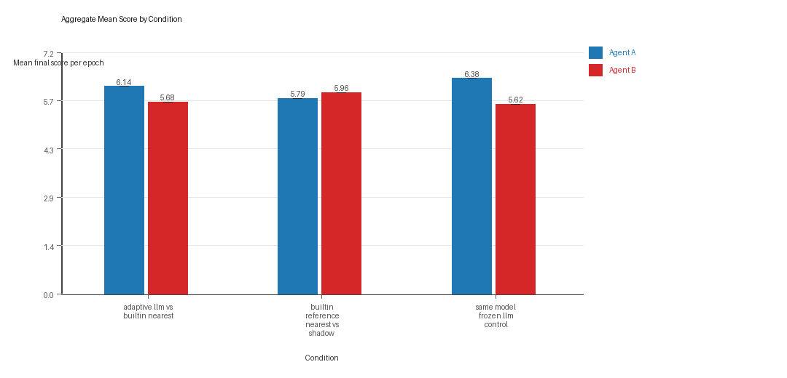
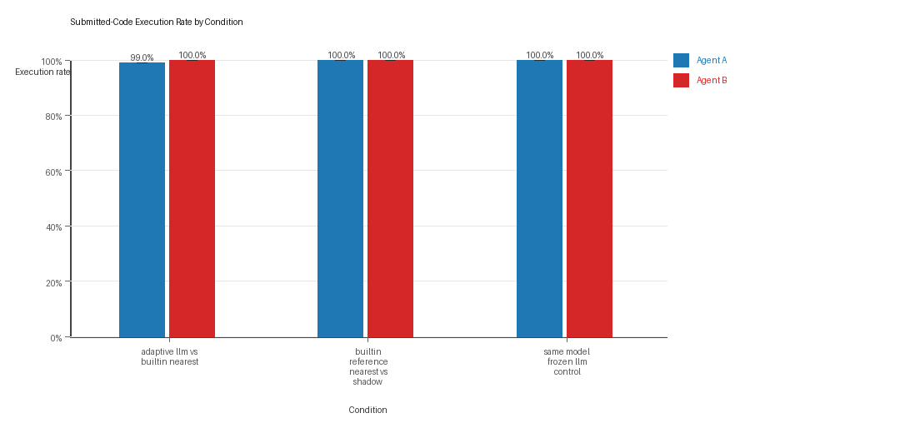
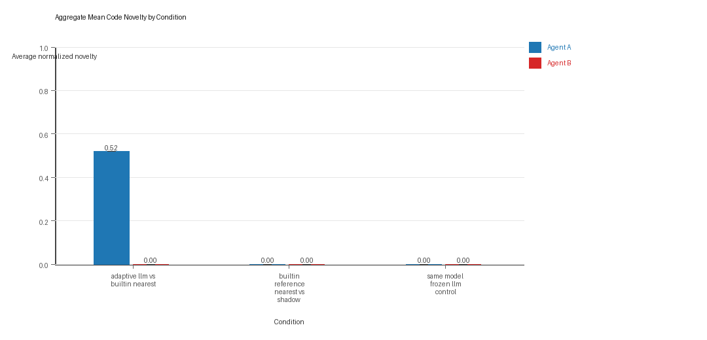

# Aggregate Research Report

## Included Runs
- Run count: 1.
- Conditions aggregated: 3.
- Runs: `run_20260429_163529`.

## Cross-Run Summary
- Same-model novelty mean 0.0 (std 0.0, 95% CI 0.0 to 0.0).
- Cross-model novelty mean 0.1299 (std 0.0, 95% CI 0.1299 to 0.1299).
- Same-model policy markers mean 0.0 (std 0.0, 95% CI 0.0 to 0.0).
- Cross-model policy markers mean 0.25 (std 0.0, 95% CI 0.25 to 0.25).

## Aggregate Charts
### Mean Score by Condition

- Each bar shows the mean final score per epoch for one agent role in that condition.
- Error bars show the 95% confidence interval across the included runs.

### Submitted-Code Execution Rate by Condition

- The y-axis is the percentage of epochs where submitted code executed instead of a fallback policy.
- Values near 100% indicate the infrastructure stayed reliable across the included runs.

### Mean Code Novelty by Condition

- Novelty is the average normalized code-change score across epochs for that agent role and condition.
- Higher bars indicate more code variation across repeated runs, not necessarily better performance.

## Per Condition
### adaptive_llm_vs_builtin_nearest
- Matchup type: cross-model.
- Fully clean run count: 0/1.
- Research tags: campaign=full_suite_from_scratch, control_type=llm_vs_builtin, suite_family=controls, suite_type=research_control.
- agent_a average score: agent_a mean 6.145 (std 0.0, 95% CI 6.145 to 6.145).
- agent_a generation success rate: agent_a mean 0.99 (std 0.0, 95% CI 0.99 to 0.99).
- agent_a submitted-code execution rate: agent_a mean 0.99 (std 0.0, 95% CI 0.99 to 0.99).
- agent_a novelty: agent_a mean 0.5195 (std 0.0, 95% CI 0.5195 to 0.5195).
- agent_a policy-marker count: agent_a mean 1.0 (std 0.0, 95% CI 1.0 to 1.0).
- agent_b average score: agent_b mean 5.685 (std 0.0, 95% CI 5.685 to 5.685).
- agent_b generation success rate: agent_b mean 1.0 (std 0.0, 95% CI 1.0 to 1.0).
- agent_b submitted-code execution rate: agent_b mean 1.0 (std 0.0, 95% CI 1.0 to 1.0).
- agent_b novelty: agent_b mean 0.0 (std 0.0, 95% CI 0.0 to 0.0).
- agent_b policy-marker count: agent_b mean 0.0 (std 0.0, 95% CI 0.0 to 0.0).
- agent_a win share: agent_a mean 0.43 (std 0.0, 95% CI 0.43 to 0.43).
- agent_b win share: agent_b mean 0.39 (std 0.0, 95% CI 0.39 to 0.39).
- draw win share: draw mean 0.18 (std 0.0, 95% CI 0.18 to 0.18).

### builtin_reference_nearest_vs_shadow
- Matchup type: cross-model.
- Fully clean run count: 1/1.
- Research tags: campaign=full_suite_from_scratch, control_type=builtin_baseline, suite_family=controls, suite_type=research_control.
- agent_a average score: agent_a mean 5.79 (std 0.0, 95% CI 5.79 to 5.79).
- agent_a generation success rate: agent_a mean 1.0 (std 0.0, 95% CI 1.0 to 1.0).
- agent_a submitted-code execution rate: agent_a mean 1.0 (std 0.0, 95% CI 1.0 to 1.0).
- agent_a novelty: agent_a mean 0.0 (std 0.0, 95% CI 0.0 to 0.0).
- agent_a policy-marker count: agent_a mean 0.0 (std 0.0, 95% CI 0.0 to 0.0).
- agent_b average score: agent_b mean 5.96 (std 0.0, 95% CI 5.96 to 5.96).
- agent_b generation success rate: agent_b mean 1.0 (std 0.0, 95% CI 1.0 to 1.0).
- agent_b submitted-code execution rate: agent_b mean 1.0 (std 0.0, 95% CI 1.0 to 1.0).
- agent_b novelty: agent_b mean 0.0 (std 0.0, 95% CI 0.0 to 0.0).
- agent_b policy-marker count: agent_b mean 0.0 (std 0.0, 95% CI 0.0 to 0.0).
- agent_a win share: agent_a mean 0.45 (std 0.0, 95% CI 0.45 to 0.45).
- agent_b win share: agent_b mean 0.38 (std 0.0, 95% CI 0.38 to 0.38).
- draw win share: draw mean 0.17 (std 0.0, 95% CI 0.17 to 0.17).

### same_model_frozen_llm_control
- Matchup type: same-model.
- Fully clean run count: 1/1.
- Research tags: campaign=full_suite_from_scratch, control_type=frozen_llm, suite_family=controls, suite_type=research_control.
- agent_a average score: agent_a mean 6.385 (std 0.0, 95% CI 6.385 to 6.385).
- agent_a generation success rate: agent_a mean 1.0 (std 0.0, 95% CI 1.0 to 1.0).
- agent_a submitted-code execution rate: agent_a mean 1.0 (std 0.0, 95% CI 1.0 to 1.0).
- agent_a novelty: agent_a mean 0.0 (std 0.0, 95% CI 0.0 to 0.0).
- agent_a policy-marker count: agent_a mean 0.0 (std 0.0, 95% CI 0.0 to 0.0).
- agent_b average score: agent_b mean 5.615 (std 0.0, 95% CI 5.615 to 5.615).
- agent_b generation success rate: agent_b mean 1.0 (std 0.0, 95% CI 1.0 to 1.0).
- agent_b submitted-code execution rate: agent_b mean 1.0 (std 0.0, 95% CI 1.0 to 1.0).
- agent_b novelty: agent_b mean 0.0 (std 0.0, 95% CI 0.0 to 0.0).
- agent_b policy-marker count: agent_b mean 0.0 (std 0.0, 95% CI 0.0 to 0.0).
- agent_a win share: agent_a mean 0.47 (std 0.0, 95% CI 0.47 to 0.47).
- agent_b win share: agent_b mean 0.21 (std 0.0, 95% CI 0.21 to 0.21).
- draw win share: draw mean 0.32 (std 0.0, 95% CI 0.32 to 0.32).

## Interpretation Caveats
- Aggregate results are only as strong as the included run set. If the input runs mix different prompts, environments, or suite definitions, treat the summary as descriptive rather than causal.
- Confidence intervals here summarize variation across run-level condition summaries; they are not substitutes for careful experimental design.
- Use this aggregate report together with per-run reports and the research checklist before making strong claims.

## Aggregate Conclusions
- Data quality summary: 2/3 conditions were fully clean, 1/3 were near-clean, and 0/3 remained higher-noise.
- The aggregate currently includes only 1 run, so all findings should be treated as preliminary until the full replicate target is met.

### Best-Supported Findings
- Cross-model conditions showed directionally higher code novelty than same-model conditions (0.1299 vs 0.0).
- Policy-marker rates remained low across the aggregate (same-model 0.0, cross-model 0.25), so the current evidence does not show repeated or dominant rule-violation behavior.

### Directional Or Uncertain Findings
- No major directional-only findings stood out beyond the supported points above.

### Claims Not Supported Yet
- The aggregate does not by itself establish causality; the strongest causal interpretations should come from replicated ablation conditions rather than from mixed-condition summaries alone.
- Code novelty should not be treated as equivalent to strategic innovation without qualitative review of notable epochs and behavior traces.
- Claims about stable long-run behavior are not yet well-supported because the current aggregate has fewer than three repeated runs.
