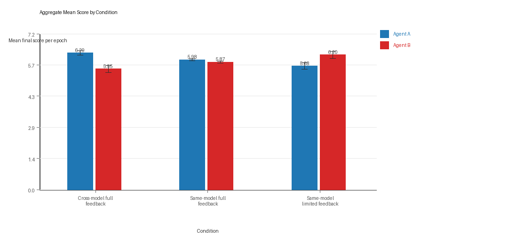
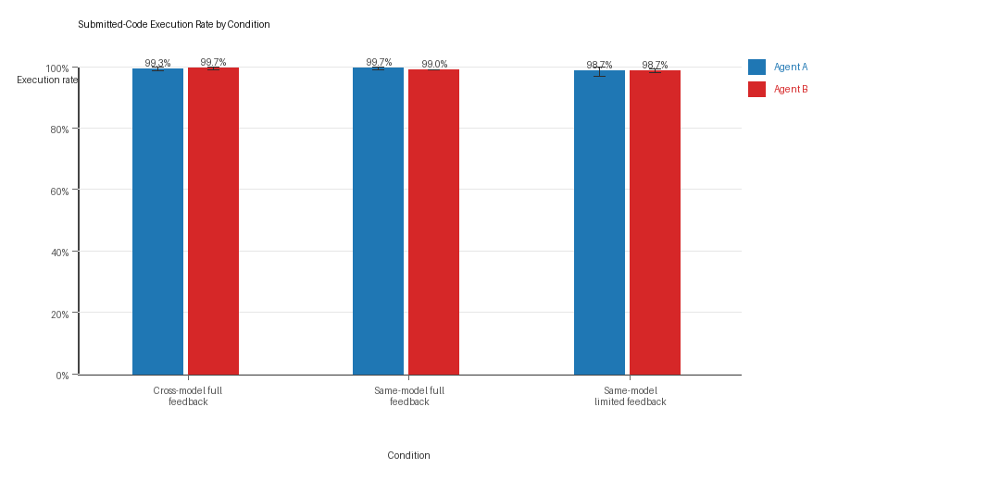
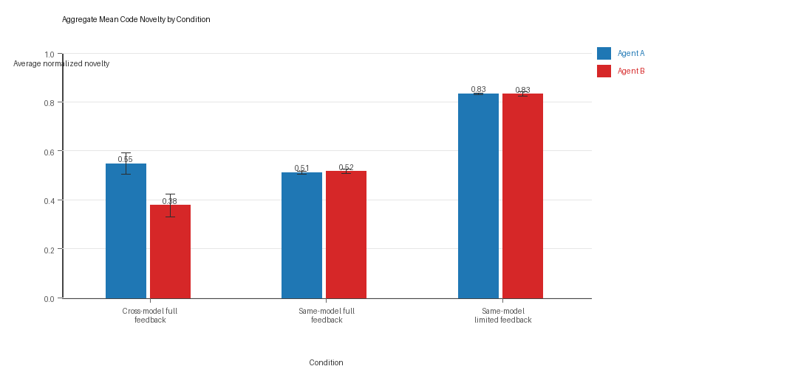

# Aggregate Research Report

## Included Runs
- Run count: 3.
- Conditions aggregated: 3.
- Runs: `run_20260427_140200`, `run_20260428_163631`, `run_20260428_214328`.

## Cross-Run Summary
- Same-model novelty mean 0.6735 (std 0.0022, 95% CI 0.6709 to 0.676).
- Cross-model novelty mean 0.4623 (std 0.0263, 95% CI 0.4326 to 0.4921).
- Same-model policy markers mean 0.3333 (std 0.1443, 95% CI 0.17 to 0.4967).
- Cross-model policy markers mean 0.3333 (std 0.2887, 95% CI 0.0067 to 0.66).

## Aggregate Charts
### Mean Score by Condition

- Each bar shows the mean final score per epoch for one agent role in that condition.
- Error bars show the 95% confidence interval across the included runs.

### Submitted-Code Execution Rate by Condition

- The y-axis is the percentage of epochs where submitted code executed instead of a fallback policy.
- Values near 100% indicate the infrastructure stayed reliable across the included runs.

### Mean Code Novelty by Condition

- Novelty is the average normalized code-change score across epochs for that agent role and condition.
- Higher bars indicate more code variation across repeated runs, not necessarily better performance.

## Per Condition
### cross_model_full_feedback
- Matchup type: cross-model.
- Fully clean run count: 0/3.
- Research tags: campaign=full_suite_from_scratch, replicate_id=B, suite_family=core; campaign=full_suite_from_scratch, replicate_id=C, suite_family=core.
- agent_a average score: agent_a mean 6.29 (std 0.0958, 95% CI 6.1816 to 6.3984).
- agent_a generation success rate: agent_a mean 0.9933 (std 0.0058, 95% CI 0.9868 to 0.9999).
- agent_a submitted-code execution rate: agent_a mean 0.9933 (std 0.0058, 95% CI 0.9868 to 0.9999).
- agent_a novelty: agent_a mean 0.5477 (std 0.0384, 95% CI 0.5043 to 0.5911).
- agent_a policy-marker count: agent_a mean 0.3333 (std 0.5774, 95% CI 0.0 to 0.9867).
- agent_b average score: agent_b mean 5.55 (std 0.1376, 95% CI 5.3943 to 5.7057).
- agent_b generation success rate: agent_b mean 0.9967 (std 0.0058, 95% CI 0.9901 to 1.0).
- agent_b submitted-code execution rate: agent_b mean 0.9967 (std 0.0058, 95% CI 0.9901 to 1.0).
- agent_b novelty: agent_b mean 0.377 (std 0.0412, 95% CI 0.3304 to 0.4236).
- agent_b policy-marker count: agent_b mean 0.3333 (std 0.5774, 95% CI 0.0 to 0.9867).
- agent_a win share: agent_a mean 0.4933 (std 0.0577, 95% CI 0.428 to 0.5587).
- agent_b win share: agent_b mean 0.3467 (std 0.0306, 95% CI 0.3121 to 0.3812).
- draw win share: draw mean 0.16 (std 0.04, 95% CI 0.1147 to 0.2053).

### same_model_full_feedback
- Matchup type: same-model.
- Fully clean run count: 0/3.
- Research tags: campaign=full_suite_from_scratch, replicate_id=B, suite_family=core; campaign=full_suite_from_scratch, replicate_id=C, suite_family=core.
- agent_a average score: agent_a mean 5.9767 (std 0.0382, 95% CI 5.9335 to 6.0199).
- agent_a generation success rate: agent_a mean 0.9967 (std 0.0058, 95% CI 0.9901 to 1.0).
- agent_a submitted-code execution rate: agent_a mean 0.9967 (std 0.0058, 95% CI 0.9901 to 1.0).
- agent_a novelty: agent_a mean 0.5111 (std 0.0051, 95% CI 0.5054 to 0.5168).
- agent_a policy-marker count: agent_a mean 0.0 (std 0.0, 95% CI 0.0 to 0.0).
- agent_b average score: agent_b mean 5.8667 (std 0.0407, 95% CI 5.8206 to 5.9127).
- agent_b generation success rate: agent_b mean 0.99 (std 0.0, 95% CI 0.99 to 0.99).
- agent_b submitted-code execution rate: agent_b mean 0.99 (std 0.0, 95% CI 0.99 to 0.99).
- agent_b novelty: agent_b mean 0.5162 (std 0.008, 95% CI 0.5072 to 0.5252).
- agent_b policy-marker count: agent_b mean 0.6667 (std 0.5774, 95% CI 0.0133 to 1.32).
- agent_a win share: agent_a mean 0.3833 (std 0.0208, 95% CI 0.3598 to 0.4069).
- agent_b win share: agent_b mean 0.37 (std 0.04, 95% CI 0.3247 to 0.4153).
- draw win share: draw mean 0.2467 (std 0.0569, 95% CI 0.1823 to 0.311).

### same_model_limited_feedback
- Matchup type: same-model.
- Fully clean run count: 0/3.
- Research tags: campaign=full_suite_from_scratch, replicate_id=B, suite_family=core; campaign=full_suite_from_scratch, replicate_id=C, suite_family=core.
- agent_a average score: agent_a mean 5.6833 (std 0.132, 95% CI 5.5339 to 5.8327).
- agent_a generation success rate: agent_a mean 0.9867 (std 0.0153, 95% CI 0.9694 to 1.0).
- agent_a submitted-code execution rate: agent_a mean 0.9867 (std 0.0153, 95% CI 0.9694 to 1.0).
- agent_a novelty: agent_a mean 0.834 (std 0.0027, 95% CI 0.831 to 0.837).
- agent_a policy-marker count: agent_a mean 0.6667 (std 0.5774, 95% CI 0.0133 to 1.32).
- agent_b average score: agent_b mean 6.1967 (std 0.145, 95% CI 6.0326 to 6.3608).
- agent_b generation success rate: agent_b mean 0.9867 (std 0.0058, 95% CI 0.9801 to 0.9932).
- agent_b submitted-code execution rate: agent_b mean 0.9867 (std 0.0058, 95% CI 0.9801 to 0.9932).
- agent_b novelty: agent_b mean 0.8327 (std 0.0089, 95% CI 0.8226 to 0.8427).
- agent_b policy-marker count: agent_b mean 0.0 (std 0.0, 95% CI 0.0 to 0.0).
- agent_a win share: agent_a mean 0.38 (std 0.0265, 95% CI 0.3501 to 0.4099).
- agent_b win share: agent_b mean 0.41 (std 0.0436, 95% CI 0.3607 to 0.4593).
- draw win share: draw mean 0.21 (std 0.0656, 95% CI 0.1358 to 0.2842).

## Interpretation Caveats
- Aggregate results are only as strong as the included run set. If the input runs mix different prompts, environments, or suite definitions, treat the summary as descriptive rather than causal.
- Confidence intervals here summarize variation across run-level condition summaries; they are not substitutes for careful experimental design.
- Use this aggregate report together with per-run reports and the research checklist before making strong claims.

## Aggregate Conclusions
- Data quality summary: 0/3 conditions were fully clean, 2/3 were near-clean, and 1/3 remained higher-noise.

### Best-Supported Findings
- Same-model conditions showed consistently higher code novelty than cross-model conditions (0.6735 vs 0.4623).
- Policy-marker rates remained low across the aggregate (same-model 0.3333, cross-model 0.3333), so the current evidence does not show repeated or dominant rule-violation behavior.
- In Cross-model full feedback, agent_a (openai:gpt-5.4-nano) consistently outperformed agent_b (openai:gpt-5-nano) on both mean score (6.29 vs 5.55) and win share (0.493 vs 0.347).

### Directional Or Uncertain Findings
- Full feedback and limited feedback differed on novelty (0.5136 vs 0.8334), but this should be interpreted together with the reliability difference rather than treated as a standalone causal result.
- Conditions classified as higher-noise should be treated as exploratory unless the same direction reappears in cleaner replicate runs.

### Claims Not Supported Yet
- The aggregate does not by itself establish causality; the strongest causal interpretations should come from replicated ablation conditions rather than from mixed-condition summaries alone.
- Code novelty should not be treated as equivalent to strategic innovation without qualitative review of notable epochs and behavior traces.
