# Novelty Spike Review

This packet is intended for manual validation of the strongest code-novelty spikes.
Each case connects code change, behavioral descriptor change, trajectory change, and score / holdout effect.

## transfer_territory_control / epoch 53 / run_20260507_210350_b
- Environment: `territory_control`.
- Learner: `agent_a` vs opponent role `agent_b`.
- Code novelty: 0.9482.
- Behavioral descriptor shift: 1.6767.
- Behavior profile: `static_guard` -> `static_guard`.
- Behavior cell: `static_guard:0:4:2:0` -> `static_guard:0:4:2:0`.
- Score delta: +7.5000.
- Margin delta: +19.0000.
- Holdout margin delta vs incumbent: N/A.
- Preliminary interpretation: `candidate_behavioral_innovation`.
- Strongest descriptor changes:
  - score_ratio: 2.0000 -> 9.5000 (+7.5000)
  - obstacle_hit_rate: 0.9714 -> 0.0000 (-0.9714)
  - territory_contest_ratio: 0.0000 -> 0.9143 (+0.9143)
  - path_overlap_ratio: 0.0000 -> 0.9014 (+0.9014)
  - center_bias: 0.0020 -> 0.3078 (+0.3058)

### Code Diff Preview
```diff
--- previous.py
+++ current.py
@@ -1,32 +1,15 @@
 def choose_move(observation):
-    def safe_int(v, d=0):
-        try:
-            if v is None:
-                return d
-            if isinstance(v, bool):
-                return d
-            if isinstance(v, (int,)):
-                return int(v)
-            if isinstance(v, float):
-                return int(v)
-            s = str(v).strip()
-            if "**" in s or "e" in s.lower():
-                return d
-            return int(s)
-        except:
-            return d
-
-    w = safe_int(observation.get("grid_width", 8), 8)
-    h = safe_int(observation.get("grid_height", 8), 8)
+    w = int(observation.get("grid_width", 8) or 8)
+    h = int(observation.get("grid_height", 8) or 8)
     sp = observation.get("self_position") or [0, 0]
     op = observation.get("opponent_position") or [0, 0]
-    sx, sy = safe_int(sp[0], 0), safe_int(sp[1], 0)
-    ox, oy = safe_int(op[0], 0), safe_int(op[1], 0)
+    sx, sy = int(sp[0]), int(sp[1])
+    ox, oy = int(op[0]), int(op[1])
 
     obstacles = set()
     for p in observation.get("obstacles") or []:
         if p and len(p) >= 2:
-            x, y = safe_int(p[0], 0), safe_int(p[1], 0)
+            x, y = int(p[0]), int(p[1])
             if 0 <= x < w and 0 <= y < h:
                 obstacles.add((x, y))
 
@@ -35,43 +18,16 @@
     def inb(x, y):
         return 0 <= x < w and 0 <= y < h
 
-    def man(a, b, x, y):
-        return abs(a - x) + abs(b - y)
-
-    candidates = []
+    best_dx, best_d = 0, 10**9
     for dx, dy in dirs:
         nx, ny = sx + dx, sy + dy
-        if inb(nx, ny) and (nx, ny) not in obstacles:
-            candidates.append((dx, dy, nx, ny))
-
-    if not candidates:
+        if not inb(nx, ny) or (nx, ny) in obstacles:
+            continue
+        d = abs(nx - ox) + abs(ny - oy)
+        if d < best_d:
+            best_d = d
+            best_dx = dx
+            best_dy = dy
+    if best_d == 10**9:
         return [0, 0]
-
-    target_list = observation.get("unclaimed_cells") or observation.get("resources") or []
-    best_target = None
-    best_dist = 10**18
-    for p in target_list:
-        if p and len(p) >= 2:
-            x, y = safe_int(p[0], None), safe_int(p[1], None)
-            if x is None or y is None:
-                continue
-            if 0 <= x < w and 0 <= y < h and (x, y) not in obstacles:
-                d = man(sx, sy, x, y)
-                if d < best_dist:
-                    best_dist = d
-                    best_target = (x, y)
-
-    if best_target is None:
... diff truncated ...
```

### Trajectory Artifacts
- Previous trajectory: 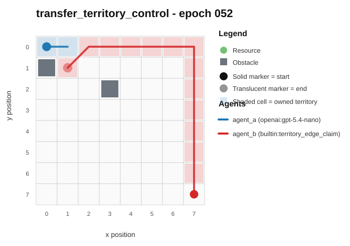
- Current trajectory: 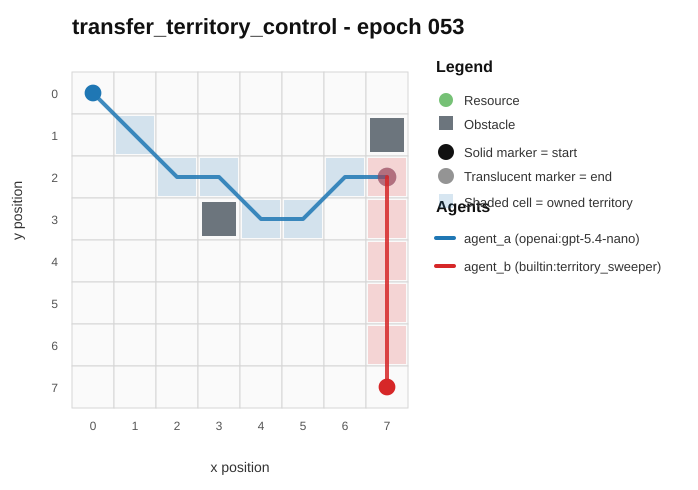
- Full artifact: `../rotating_opponents_holdout_endpoint/run_20260507_210350_b/transfer_territory_control/epochs/epoch_053/artifact.json`

## transfer_territory_control / epoch 37 / run_20260507_201051_a
- Environment: `territory_control`.
- Learner: `agent_a` vs opponent role `agent_b`.
- Code novelty: 0.9478.
- Behavioral descriptor shift: 2.1865.
- Behavior profile: `static_guard` -> `static_guard`.
- Behavior cell: `static_guard:1:3:2:0` -> `static_guard:1:3:2:0`.
- Score delta: -10.0000.
- Margin delta: -2.5000.
- Holdout margin delta vs incumbent: N/A.
- Preliminary interpretation: `mixed_change`.
- Strongest descriptor changes:
  - score_ratio: 28.5000 -> 18.5000 (-10.0000)
  - center_bias: 0.3239 -> 0.0905 (-0.2334)
  - territory_claim_ratio: 0.4286 -> 0.2143 (-0.2143)
  - territory_contest_ratio: 0.5714 -> 0.7857 (+0.2143)
  - stay_ratio: 0.5571 -> 0.7714 (+0.2143)

### Code Diff Preview
```diff
--- previous.py
+++ current.py
@@ -1,10 +1,8 @@
 def choose_move(observation):
-    w = int(observation.get("grid_width") or 8)
-    h = int(observation.get("grid_height") or 8)
-    sp = observation.get("self_position") or [0, 0]
-    op = observation.get("opponent_position") or [w - 1, h - 1]
-    sx, sy = int(sp[0]), int(sp[1])
-    ox, oy = int(op[0]), int(op[1])
+    w = int(observation["grid_width"])
+    h = int(observation["grid_height"])
+    sx, sy = observation["self_position"]
+    ox, oy = observation["opponent_position"]
 
     obstacles = set(map(tuple, observation.get("obstacles") or []))
     unclaimed = set(map(tuple, observation.get("unclaimed_cells") or []))
@@ -12,63 +10,51 @@
     opp_t = set(map(tuple, observation.get("opponent_territory") or []))
 
     dirs = [(-1, -1), (0, -1), (1, -1), (-1, 0), (0, 0), (1, 0), (-1, 1), (0, 1), (1, 1)]
-    cx, cy = (w - 1) / 2.0, (h - 1) / 2.0
+    neigh = [(-1, -1), (0, -1), (1, -1), (-1, 0), (1, 0), (-1, 1), (0, 1), (1, 1)]
 
-    def valid(nx, ny):
-        return 0 <= nx < w and 0 <= ny < h and (nx, ny) not in obstacles
+    def valid(x, y):
+        return 0 <= x < w and 0 <= y < h and (x, y) not in obstacles
 
-    def dist2(x1, y1, x2, y2):
-        dx, dy = x1 - x2, y1 - y2
-        return dx * dx + dy * dy
+    def any_adj_in(x, y, S):
+        for ax, ay in neigh:
+            if (x + ax, y + ay) in S:
+                return True
+        return False
 
-    def adj_count(cell, S):
-        x, y = cell
+    def adj_count_in(x, y, S):
         c = 0
-        for ax in (-1, 0, 1):
-            for ay in (-1, 0, 1):
-                if ax == 0 and ay == 0:
-                    continue
-                nx, ny = x + ax, y + ay
-                if (nx, ny) in S:
-                    c += 1
+        for ax, ay in neigh:
+            if (x + ax, y + ay) in S:
+                c += 1
         return c
 
-    best_score = None
-    best_move = [0, 0]
+    best = (-10**18, [0, 0])
     for dx, dy in dirs:
         nx, ny = sx + dx, sy + dy
         if not valid(nx, ny):
             continue
-        cell = (nx, ny)
 
         score = 0
-        if cell in opp_t:
-            score += 14  # strong incentive to flip
-        elif cell in unclaimed:
-            score += 7
-        elif cell in self_t:
-            score += 3
+        if (nx, ny) in opp_t:
+            score += 2000
+        elif (nx, ny) in unclaimed:
+            score += 20
+        elif (nx, ny) in self_t:
+            score += 2
 
-        score += 0.6 * adj_count(cell, self_t)  # prefer extending frontier rooted in our territory
+        if any_adj_in(nx, ny, opp_t):
+            score += 15 + 2 * adj_count_in(nx, ny, opp_t)
... diff truncated ...
```

### Trajectory Artifacts
- Previous trajectory: 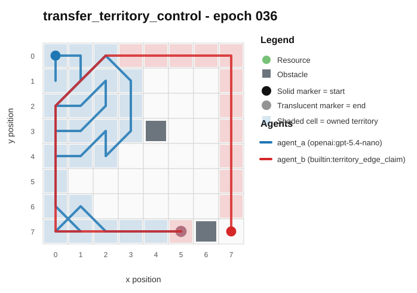
- Current trajectory: 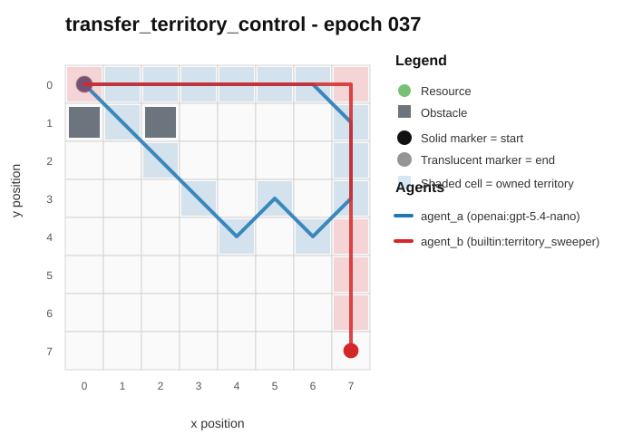
- Full artifact: `../rotating_opponents_holdout_endpoint/run_20260507_201051_a/transfer_territory_control/epochs/epoch_037/artifact.json`

## transfer_resource_collection_denial / epoch 57 / run_20260507_220338_c
- Environment: `resource_collection`.
- Learner: `agent_a` vs opponent role `agent_b`.
- Code novelty: 0.9478.
- Behavioral descriptor shift: 0.1515.
- Behavior profile: `opportunistic_switcher` -> `opportunistic_switcher`.
- Behavior cell: `opportunistic_switcher:4:0:3:2` -> `opportunistic_switcher:4:0:3:3`.
- Score delta: -0.5000.
- Margin delta: -1.0000.
- Holdout margin delta vs incumbent: N/A.
- Preliminary interpretation: `mixed_change`.
- Strongest descriptor changes:
  - path_overlap_ratio: 0.0333 -> 0.4737 (+0.4404)
  - diagonal_ratio: 0.8276 -> 0.3889 (-0.4387)
  - opponent_avoidance_ratio: 0.2414 -> 0.0000 (-0.2414)
  - unique_cell_ratio: 0.4062 -> 0.2500 (-0.1562)
  - resource_pursuit_ratio: 0.3103 -> 0.3889 (+0.0786)

### Code Diff Preview
```diff
--- previous.py
+++ current.py
@@ -1,65 +1,63 @@
 def choose_move(observation):
-    w = observation["grid_width"]
-    h = observation["grid_height"]
     sx, sy = observation["self_position"]
     ox, oy = observation["opponent_position"]
     resources = [tuple(p) for p in (observation.get("resources", []) or [])]
     obstacles = set(tuple(p) for p in (observation.get("obstacles", []) or []))
+    if not resources:
+        return [0, 0]
 
     def man(x1, y1, x2, y2):
         return abs(x1 - x2) + abs(y1 - y2)
 
-    def cheb(x1, y1, x2, y2):
-        dx = x1 - x2
-        if dx < 0: dx = -dx
-        dy = y1 - y2
-        if dy < 0: dy = -dy
-        return dx if dx >= dy else dy
+    # Pick a target: first prefer resources we can reach first; otherwise maximize "lead".
+    best = None
+    for rx, ry in resources:
+        if (rx, ry) in obstacles:
+            continue
+        sd = man(sx, sy, rx, ry)
+        od = man(ox, oy, rx, ry)
+        # behind_check: we are farther => likely steal; prioritize where opponent advantage is smallest.
+        lead = od - sd  # positive if we are closer
+        # prefer closer targets but also avoid giving opponent huge advantage
+        key = (sd, -lead) if od <= sd + 1 else (sd, -(lead + 2))
+        if best is None or key < best[0]:
+            best = (key, (rx, ry))
+    if best is None:
+        return [0, 0]
+    tx, ty = best[1]
 
-    resources = [r for r in resources if r not in obstacles]
-    if not resources:
+    # If already on a resource, stay (collect).
+    if sx == tx and sy == ty:
         return [0, 0]
 
-    my_min_d = min(man(sx, sy, rx, ry) for rx, ry in resources)
-    op_min_d = min(man(ox, oy, rx, ry) for rx, ry in resources)
-    behind = (my_min_d - op_min_d) >= 2
+    # Choose best one-step move that decreases distance to target, avoiding obstacles.
+    moves = []
+    for dx in (-1, 0, 1):
+        for dy in (-1, 0, 1):
+            if dx == 0 and dy == 0:
+                moves.append((0, 0))
+            else:
+                moves.append((dx, dy))
 
-    best = None
-    for rx, ry in resources:
-        sd = man(sx, sy, rx, ry)
-        od = man(ox, oy, rx, ry)
-        if behind:
-            # Reduce chance we get stolen: pick targets where opponent is not aggressively closer.
-            key = (-(od - sd), sd, cheb(ox, oy, rx, ry), (rx + 31 * ry))
-        else:
-            # Prefer resources where we are closer (or opponent much farther).
-            key = (min(od - sd, 9999), sd, cheb(ox, oy, rx, ry), (rx + 31 * ry))
-        if best is None or key < best[0]:
-            best = (key, rx, ry)
+    w = observation.get("grid_width", 8)
+    h = observation.get("grid_height", 8)
 
-    _, tx, ty = best
+    best_move = (None, None, None)
+    for dx, dy in moves:
+        nx, ny = sx + dx, sy + dy
+        if nx < 0 or ny < 0 or nx >= w or ny >= h:
+            continue
+        if (nx, ny) in obstacles:
+            continue
... diff truncated ...
```

### Trajectory Artifacts
- Previous trajectory: 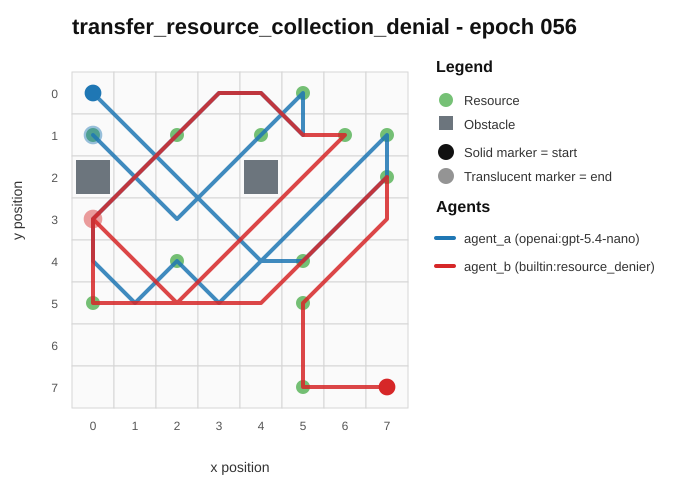
- Current trajectory: 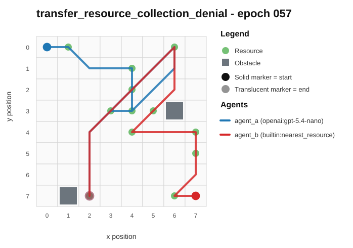
- Full artifact: `../rotating_opponents_holdout_endpoint/run_20260507_220338_c/transfer_resource_collection_denial/epochs/epoch_057/artifact.json`

## transfer_resource_collection_denial / epoch 3 / run_20260507_234515_e
- Environment: `resource_collection`.
- Learner: `agent_a` vs opponent role `agent_b`.
- Code novelty: 0.9386.
- Behavioral descriptor shift: 0.1195.
- Behavior profile: `opportunistic_switcher` -> `opportunistic_switcher`.
- Behavior cell: `opportunistic_switcher:4:0:3:3` -> `opportunistic_switcher:4:0:3:3`.
- Score delta: +5.0000.
- Margin delta: +10.0000.
- Holdout margin delta vs incumbent: N/A.
- Preliminary interpretation: `mixed_change`.
- Strongest descriptor changes:
  - score_ratio: 0.5833 -> 1.0000 (+0.4167)
  - resource_pursuit_ratio: 0.5333 -> 0.2857 (-0.2476)
  - opponent_avoidance_ratio: 0.2000 -> 0.0476 (-0.1524)
  - diagonal_ratio: 0.6000 -> 0.7143 (+0.1143)
  - mean_opponent_distance: 0.4866 -> 0.5747 (+0.0881)

### Code Diff Preview
```diff
--- previous.py
+++ current.py
@@ -1,82 +1,58 @@
 def choose_move(observation):
-    w = observation["grid_width"]
-    h = observation["grid_height"]
     sx, sy = observation["self_position"]
     ox, oy = observation["opponent_position"]
-    obstacles = set(tuple(p) for p in observation["obstacles"] or [])
-    resources = observation["resources"] or []
+    resources = observation.get("resources") or []
+    obstacles = set(tuple(p) for p in (observation.get("obstacles") or []))
+    w = observation.get("grid_width", 8)
+    h = observation.get("grid_height", 8)
+
+    def sign(v):
+        return 0 if v == 0 else (1 if v > 0 else -1)
 
     if not resources:
         return [0, 0]
 
-    # Pick best resource: prioritize those we can get earlier than opponent; otherwise nearest-but-closest-to-win.
-    best_r = None
-    best_key = None
+    best = None
     for rx, ry in resources:
         dself = (rx - sx) * (rx - sx) + (ry - sy) * (ry - sy)
         dopp = (rx - ox) * (rx - ox) + (ry - oy) * (ry - oy)
-        # key: maximize (dopp - dself), then minimize dself (break ties deterministically)
-        key = (-(dopp - dself), dself, rx, ry)
-        if best_key is None or key < best_key:
-            best_key = key
-            best_r = (rx, ry)
+        key = (-(dopp - dself), dself, rx, ry)  # maximize advantage, then nearer, then deterministic
+        if best is None or key < best[0]:
+            best = (key, (rx, ry))
 
-    rx, ry = best_r
+    tx, ty = best[1]
+    dx = sign(tx - sx)
+    dy = sign(ty - sy)
 
-    # If opponent is significantly closer to the best resource, head to a different resource that we can beat or reduce contest.
-    # (simple second pass)
-    dself0 = (rx - sx) * (rx - sx) + (ry - sy) * (ry - sy)
-    dopp0 = (rx - ox) * (rx - ox) + (ry - oy) * (ry - oy)
-    if dopp0 + 1 < dself0 and len(resources) > 1:
-        alt = None
-        alt_key = None
-        for ax, ay in resources:
-            dself = (ax - sx) * (ax - sx) + (ay - sy) * (ay - sy)
-            dopp = (ax - ox) * (ax - ox) + (ay - oy) * (ay - oy)
-            # require we are not worse by too much; then maximize gap
-            if dself > dopp + 4:
+    # Candidate moves: prefer diagonal/straight toward target, then alternatives, then stay
+    dirs = []
+    for ddx in (dx, 0, -dx):
+        for ddy in (dy, 0, -dy):
+            if ddx == 0 and ddy == 0:
                 continue
-            key = (-(dopp - dself), dself, ax, ay)
-            if alt_key is None or key < alt_key:
-                alt_key = key
-                alt = (ax, ay)
-        if alt is not None:
-            rx, ry = alt
-
-    # Candidate moves: 8-neighborhood + stay, deterministic ordering, avoid obstacles.
-    candidates = []
-    for dx in (-1, 0, 1):
-        for dy in (-1, 0, 1):
-            nx, ny = sx + dx, sy + dy
-            if 0 <= nx < w and 0 <= ny < h and (nx, ny) not in obstacles:
-                candidates.append((dx, dy))
-
-    if not candidates:
+            dirs.append((ddx, ddy))
+    dirs += [(dx, dy), (dx, 0), (0, dy), (0, 0), (-dx, dy), (dx, -dy), (-dx, 0), (0, -dy)]
+    seen = set()
+    cand = []
... diff truncated ...
```

### Trajectory Artifacts
- Previous trajectory: 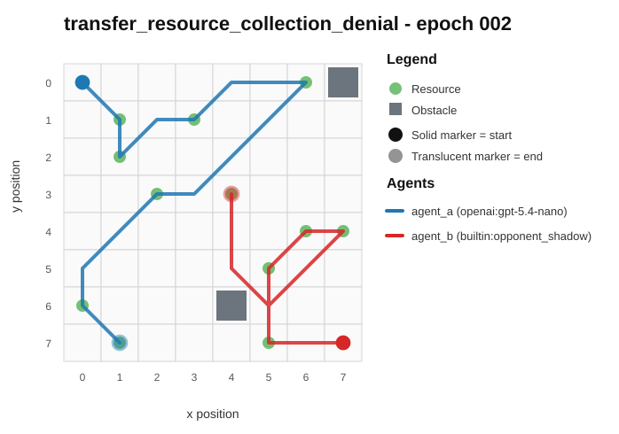
- Current trajectory: 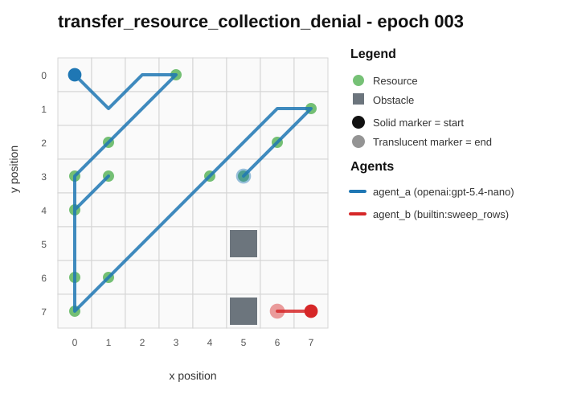
- Full artifact: `../rotating_opponents_holdout_endpoint/run_20260507_234515_e/transfer_resource_collection_denial/epochs/epoch_003/artifact.json`

## transfer_resource_collection_denial / epoch 2 / run_20260507_225407_d
- Environment: `resource_collection`.
- Learner: `agent_a` vs opponent role `agent_b`.
- Code novelty: 0.9332.
- Behavioral descriptor shift: 0.0961.
- Behavior profile: `opportunistic_switcher` -> `opportunistic_switcher`.
- Behavior cell: `opportunistic_switcher:4:0:2:2` -> `opportunistic_switcher:4:0:3:3`.
- Score delta: -1.0000.
- Margin delta: -2.0000.
- Holdout margin delta vs incumbent: N/A.
- Preliminary interpretation: `minor_adjustment`.
- Strongest descriptor changes:
  - resource_switch_ratio: 0.4000 -> 0.6364 (+0.2364)
  - opponent_avoidance_ratio: 0.4000 -> 0.1818 (-0.2182)
  - diagonal_ratio: 0.3000 -> 0.4545 (+0.1545)
  - unique_cell_ratio: 0.3281 -> 0.1875 (-0.1406)
  - opponent_pursuit_ratio: 0.5000 -> 0.6364 (+0.1364)

### Code Diff Preview
```diff
--- previous.py
+++ current.py
@@ -1,73 +1,63 @@
 def choose_move(observation):
-    w = observation.get("grid_width", 8)
-    h = observation.get("grid_height", 8)
-    self_pos = observation["self_position"]
-    opp_pos = observation["opponent_position"]
-    resources = observation.get("resources", [])
-    obstacles = set(tuple(p) for p in observation.get("obstacles", []))
-    sx, sy = self_pos[0], self_pos[1]
-    ox, oy = opp_pos[0], opp_pos[1]
+    sx, sy = observation["self_position"]
+    ox, oy = observation["opponent_position"]
+    resources = observation.get("resources", []) or []
+    obstacles_list = observation.get("obstacles", []) or []
+    obstacles = set((x, y) for x, y in obstacles_list)
 
-    def dist(a, b):
-        dx = a[0] - b[0]
-        dy = a[1] - b[1]
+    def cheb(ax, ay, bx, by):
+        dx = ax - bx
         if dx < 0: dx = -dx
+        dy = ay - by
         if dy < 0: dy = -dy
-        return dx if dx > dy else dy  # Chebyshev (diagonal allowed)
+        return dx if dx > dy else dy
 
     if not resources:
         return [0, 0]
 
-    # If we're on a resource, stay to collect it.
-    if tuple(self_pos) in set(tuple(p) for p in resources):
+    res_set = set((x, y) for x, y in resources)
+    if (sx, sy) in res_set:
         return [0, 0]
 
+    # Choose best target deterministically with opponent-advantage weighting.
     best = None
     best_val = -10**18
     for rx, ry in resources:
         if (rx, ry) in obstacles:
             continue
-        sd = dist((sx, sy), (rx, ry))
-        od = dist((ox, oy), (rx, ry))
-        # Prefer resources where we are closer than opponent; break ties by smaller self distance.
+        sd = cheb(sx, sy, rx, ry)
+        od = cheb(ox, oy, rx, ry)
+        # Prefer resources we can reach sooner; secondary prefer far/near to control tie-break.
         val = (od - sd) * 1000 - sd
         if val > best_val:
             best_val = val
             best = (rx, ry)
 
     tx, ty = best
-    dx = tx - sx
-    dy = ty - sy
-    step_x = 0 if dx == 0 else (1 if dx > 0 else -1)
-    step_y = 0 if dy == 0 else (1 if dy > 0 else -1)
+    dirs = [(-1, -1), (0, -1), (1, -1), (-1, 0), (0, 0), (1, 0), (-1, 1), (0, 1), (1, 1)]
 
-    candidates = []
-    # Main step toward target
-    candidates.append((step_x, step_y))
-    # Also consider single-axis move toward target to avoid obstacles
-    if step_x != 0:
-        candidates.append((step_x, 0))
-    if step_y != 0:
-        candidates.append((0, step_y))
-    # And no move / fallback diagonals
-    candidates.append((0, 0))
-    if step_x != 0 or step_y != 0:
-        candidates.append((step_x, 0))
-        candidates.append((0, step_y))
-
-    best_move = (0, 0)
+    # Greedy local move evaluation toward target with obstacle avoidance and slight anti-blocking.
+    best_move = [0, 0]
     best_score = -10**18
... diff truncated ...
```

### Trajectory Artifacts
- Previous trajectory: 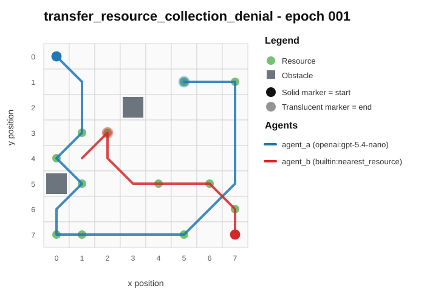
- Current trajectory: 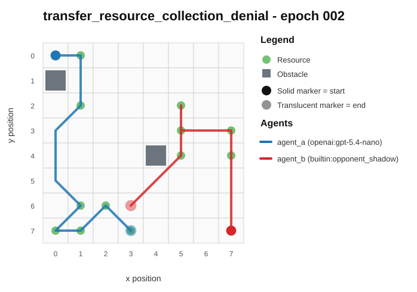
- Full artifact: `../rotating_opponents_holdout_endpoint/run_20260507_225407_d/transfer_resource_collection_denial/epochs/epoch_002/artifact.json`

## transfer_territory_control / epoch 11 / run_20260509_002410_i
- Environment: `territory_control`.
- Learner: `agent_a` vs opponent role `agent_b`.
- Code novelty: 0.9284.
- Behavioral descriptor shift: 4.2632.
- Behavior profile: `static_guard` -> `claimer`.
- Behavior cell: `static_guard:2:2:2:0` -> `claimer:3:1:2:0`.
- Score delta: -19.5000.
- Margin delta: -59.0000.
- Holdout margin delta vs incumbent: N/A.
- Preliminary interpretation: `mixed_change`.
- Strongest descriptor changes:
  - score_ratio: 33.5000 -> 14.0000 (-19.5000)
  - territory_contest_ratio: 0.5000 -> 0.0000 (-0.5000)
  - territory_claim_ratio: 0.5000 -> 1.0000 (+0.5000)
  - path_overlap_ratio: 0.4930 -> 0.0000 (-0.4930)
  - stay_ratio: 0.4857 -> 0.0000 (-0.4857)

### Code Diff Preview
```diff
--- previous.py
+++ current.py
@@ -1,63 +1,59 @@
 def choose_move(observation):
-    w = observation.get("grid_width", 8)
-    h = observation.get("grid_height", 8)
-    sx, sy = observation.get("self_position", (0, 0))
-    ox, oy = observation.get("opponent_position", (0, 0))
+    w = observation["grid_width"]
+    h = observation["grid_height"]
+    sx, sy = observation["self_position"]
     obstacles = set(map(tuple, observation.get("obstacles") or []))
     self_t = set(map(tuple, observation.get("self_territory") or []))
     opp_t = set(map(tuple, observation.get("opponent_territory") or []))
     unclaimed = set(map(tuple, observation.get("unclaimed_cells") or []))
+    ox, oy = observation.get("opponent_position", (w - 1, h - 1))
 
     def inside(x, y):
         return 0 <= x < w and 0 <= y < h
 
-    neigh = [(-1, -1), (0, -1), (1, -1), (-1, 0), (0, 0), (1, 0), (-1, 1), (0, 1), (1, 1)]
-    candidates = []
+    neigh8 = [(-1, -1), (0, -1), (1, -1), (-1, 0), (0, 0), (1, 0), (-1, 1), (0, 1), (1, 1)]
+    dirs4 = [(-1, 0), (1, 0), (0, -1), (0, 1)]
 
-    # Try to attack/expand onto cells adjacent to opponent territory (frontier grab).
-    opp_frontier = set()
-    if opp_t:
-        for px, py in opp_t:
-            for dx, dy in [(-1, 0), (1, 0), (0, -1), (0, 1), (-1, -1), (1, 1), (-1, 1), (1, -1)]:
-                nx, ny = px + dx, py + dy
-                if inside(nx, ny) and (nx, ny) not in obstacles and ((nx, ny) in unclaimed or (nx, ny) in self_t):
-                    opp_frontier.add((nx, ny))
-    if not opp_frontier:
-        # Fallback: prioritize any unclaimed near center and near opponent.
-        cx, cy = (w - 1) // 2, (h - 1) // 2
-        def key_uc(p):
-            x, y = p
-            return (abs(x - cx) + abs(y - cy), abs(x - ox) + abs(y - oy), y, x)
-        opp_frontier = set(sorted(unclaimed, key=key_uc)[:8])
+    def cell_gain(x, y):
+        if (x, y) in obstacles:
+            return -10**9
+        base = 0
+        if (x, y) in unclaimed:
+            base += 100
+        if (x, y) in self_t:
+            base += 40
+        if (x, y) in opp_t:
+            base += 80  # flipping on entry enabled
+        # Local expansion pressure: how many unclaimed adjacent cells
+        adj_u = 0
+        for dx, dy in dirs4:
+            nx, ny = x + dx, y + dy
+            if inside(nx, ny) and (nx, ny) in unclaimed:
+                adj_u += 1
+        base += 12 * adj_u
+        # Prefer moving closer to opponent to enable counterclaims; also avoid getting stuck
+        dist_self = abs(x - ox) + abs(y - oy)
+        base += (18 if dist_self <= 3 else 0) - (dist_self // 2)
+        # If staying, slight penalty to encourage progress unless already in good territory
+        if x == sx and y == sy:
+            base -= 6 if (sx, sy) not in self_t else 2
+        return base
 
-    # Evaluate one-step move.
-    best = (0, 0)
-    best_sc = -10**18
-    for dx, dy in neigh:
+    best = [0, 0]
+    best_score = cell_gain(sx, sy)
+    for dx, dy in neigh8:
         nx, ny = sx + dx, sy + dy
-        if not inside(nx, ny) or (nx, ny) in obstacles:
-            continue
-
-        sc = 0
-        if (nx, ny) in opp_t:
-            sc += 25  # strong flip
-        elif (nx, ny) in unclaimed:
... diff truncated ...
```

### Trajectory Artifacts
- Previous trajectory: 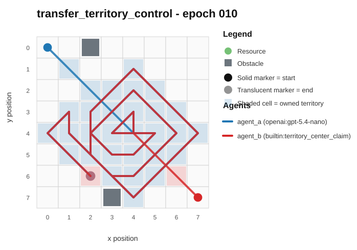
- Current trajectory: 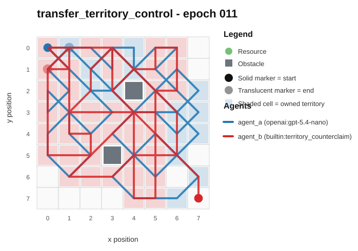
- Full artifact: `../rotating_opponents_holdout_endpoint/run_20260509_002410_i/transfer_territory_control/epochs/epoch_011/artifact.json`

## transfer_territory_control / epoch 4 / run_20260509_094819_f
- Environment: `territory_control`.
- Learner: `agent_a` vs opponent role `agent_b`.
- Code novelty: 0.9282.
- Behavioral descriptor shift: 4.1554.
- Behavior profile: `claimer` -> `claimer`.
- Behavior cell: `claimer:0:4:2:0` -> `claimer:2:2:2:0`.
- Score delta: +19.0000.
- Margin delta: -4.5000.
- Holdout margin delta vs incumbent: N/A.
- Preliminary interpretation: `candidate_behavioral_innovation`.
- Strongest descriptor changes:
  - score_ratio: 6.0000 -> 25.0000 (+19.0000)
  - territory_claim_ratio: 0.9857 -> 0.4286 (-0.5571)
  - territory_contest_ratio: 0.0143 -> 0.5571 (+0.5428)
  - path_overlap_ratio: 0.0141 -> 0.5493 (+0.5352)
  - center_bias: 0.0986 -> 0.5573 (+0.4587)

### Code Diff Preview
```diff
--- previous.py
+++ current.py
@@ -1,5 +1,5 @@
 def choose_move(observation):
-    x, y = observation.get("self_position", (0, 0))
+    x, y = observation["self_position"]
     w = observation.get("grid_width", 8)
     h = observation.get("grid_height", 8)
 
@@ -8,79 +8,63 @@
     self_terr = set(tuple(p) for p in (observation.get("self_territory", []) or []))
     opp_terr = set(tuple(p) for p in (observation.get("opponent_territory", []) or []))
 
-    dirs8 = [(-1, -1), (-1, 0), (-1, 1), (0, -1), (0, 1), (1, -1), (1, 0), (1, 1)]
+    dirs = [(dx, dy) for dx in (-1, 0, 1) for dy in (-1, 0, 1)]
 
     def inb(nx, ny):
         return 0 <= nx < w and 0 <= ny < h
 
-    def adj_count(cell_set, nx, ny):
-        c = 0
-        for dx, dy in dirs8:
+    def min_dist_to_set(cx, cy, cell_set):
+        md = 10**9
+        for tx, ty in cell_set:
+            d = abs(tx - cx) + abs(ty - cy)
+            if d < md:
+                md = d
+        return md if cell_set else 10**6
+
+    def neigh_score(nx, ny):
+        neigh = 0
+        u_adj = 0
+        o_adj = 0
+        for dx, dy in dirs:
+            if dx == 0 and dy == 0:
+                continue
             tx, ty = nx + dx, ny + dy
-            if (tx, ty) in cell_set:
-                c += 1
-        return c
+            if (tx, ty) in self_terr:
+                neigh += 2
+            if (tx, ty) in unclaimed:
+                u_adj += 3
+            if (tx, ty) in opp_terr:
+                o_adj += 1
+        return neigh + u_adj - 2 * o_adj
 
-    # Deterministic "expansion": prefer unclaimed near our territory, then safe approach to opponent edges.
-    best_move = (0, 0)
-    best_v = -10**18
+    best = [0, 0]
+    best_sc = -10**18
 
-    # Precompute a simple direction bias using closest relevant cell (unclaimed or opponent territory).
-    targets = []
-    if unclaimed:
-        targets = list(unclaimed)
-    elif opp_terr:
-        targets = list(opp_terr)
-
-    tx0, ty0 = x, y
-    if targets:
-        best_t = None
-        best_td = None
-        for tx, ty in targets:
-            if (tx, ty) in obstacles:
-                continue
-            td = (abs(tx - x) + abs(ty - y), abs(tx - x) + abs(ty - y) + 3 * abs(tx - x - (observation.get("opponent_position", (0, 0))[0] - x)))
-            if best_td is None or td < best_td:
-                best_td = td
-                best_t = (tx, ty)
-        if best_t is not None:
-            tx0, ty0 = best_t
-
-    for dx, dy in [(0, 0), (-1, -1), (-1, 0), (-1, 1), (0, -1), (0, 1), (1, -1), (1, 0), (1, 1)]:
+    opp_list = list(opp_terr)
+    for dx, dy in dirs:
         nx, ny = x + dx, y + dy
... diff truncated ...
```

### Trajectory Artifacts
- Previous trajectory: 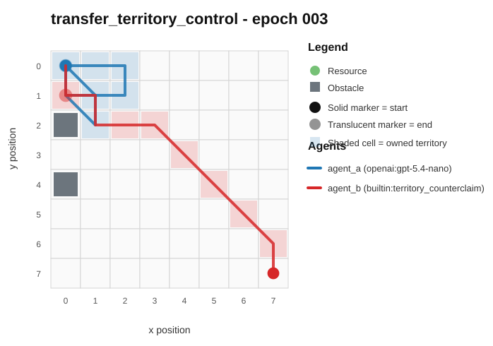
- Current trajectory: 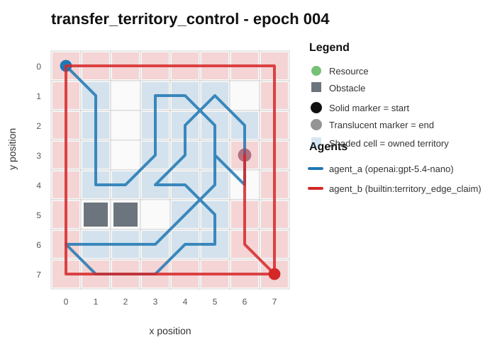
- Full artifact: `../rotating_opponents_holdout_endpoint/run_20260509_094819_f/transfer_territory_control/epochs/epoch_004/artifact.json`

## transfer_territory_control / epoch 77 / run_20260508_205712_g
- Environment: `territory_control`.
- Learner: `agent_a` vs opponent role `agent_b`.
- Code novelty: 0.9251.
- Behavioral descriptor shift: 1.1565.
- Behavior profile: `static_guard` -> `balanced`.
- Behavior cell: `static_guard:0:4:2:0` -> `balanced:0:4:2:0`.
- Score delta: +5.0000.
- Margin delta: +22.5000.
- Holdout margin delta vs incumbent: N/A.
- Preliminary interpretation: `candidate_behavioral_innovation`.
- Strongest descriptor changes:
  - score_ratio: 3.0000 -> 8.0000 (+5.0000)
  - stay_ratio: 0.9571 -> 0.0000 (-0.9571)
  - territory_contest_ratio: 0.0000 -> 0.8857 (+0.8857)
  - path_overlap_ratio: 0.0000 -> 0.8732 (+0.8732)
  - center_bias: 0.8330 -> 0.3421 (-0.4909)

### Code Diff Preview
```diff
--- previous.py
+++ current.py
@@ -1,68 +1,67 @@
 def choose_move(observation):
-    w = observation.get("grid_width") or 8
-    h = observation.get("grid_height") or 8
-    try:
-        w = int(w)
-        h = int(h)
-    except:
-        w, h = 8, 8
+    w = int(observation.get("grid_width") or 8)
+    h = int(observation.get("grid_height") or 8)
+    sp = observation.get("self_position") or (0, 0)
+    op = observation.get("opponent_position") or (0, 0)
+    sx, sy = int(sp[0]), int(sp[1])
+    ox, oy = int(op[0]), int(op[1])
 
-    sp = observation.get("self_position") or (0, 0)
-    sx, sy = sp[0], sp[1]
-    try:
-        sx, sy = int(sx), int(sy)
-    except:
-        sx, sy = 0, 0
-
-    obs = set()
+    obstacles = set()
     for p in observation.get("obstacles") or []:
         if p and len(p) >= 2:
-            try:
-                x, y = int(p[0]), int(p[1])
-            except:
-                continue
+            x, y = int(p[0]), int(p[1])
             if 0 <= x < w and 0 <= y < h:
-                obs.add((x, y))
+                obstacles.add((x, y))
+
+    oppT = set()
+    for p in observation.get("opponent_territory") or []:
+        if p and len(p) >= 2:
+            oppT.add((int(p[0]), int(p[1])))
+
+    def inb(x, y):
+        return 0 <= x < w and 0 <= y < h
+
+    def dist(a, b):
+        return abs(a[0] - b[0]) + abs(a[1] - b[1])
 
     resources = []
     for p in observation.get("resources") or []:
         if p and len(p) >= 2:
-            try:
-                x, y = int(p[0]), int(p[1])
-            except:
-                continue
-            if 0 <= x < w and 0 <= y < h:
+            x, y = int(p[0]), int(p[1])
+            if inb(x, y):
                 resources.append((x, y))
 
-    dirs = [(-1, 0), (1, 0), (0, -1), (0, 1), (-1, -1), (-1, 1), (1, -1), (1, 1), (0, 0)]
-    ox, oy = None, None
-    if resources:
-        bestd = None
-        for x, y in resources:
-            d = (x - sx) * (x - sx) + (y - sy) * (y - sy)
-            if bestd is None or d < bestd or (d == bestd and (x, y) < (ox, oy)):
-                bestd = d
-                ox, oy = x, y
+    remaining = observation.get("remaining_resource_count")
+    if remaining is None:
+        remaining = len(resources) if resources else 0
+    try:
+        remaining = int(remaining)
+    except:
+        remaining = 0
 
-    if ox is None:
-        ox, oy = (w - 1) // 2, (h - 1) // 2
... diff truncated ...
```

### Trajectory Artifacts
- Previous trajectory: 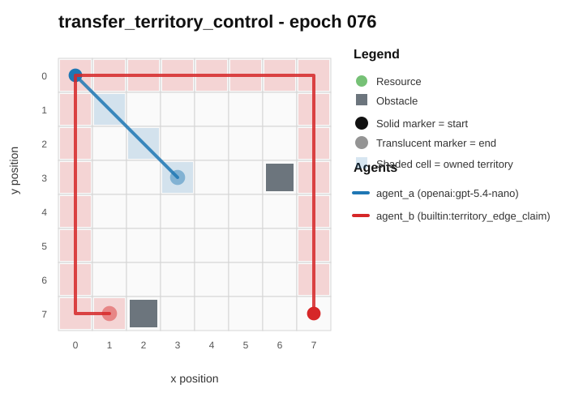
- Current trajectory: 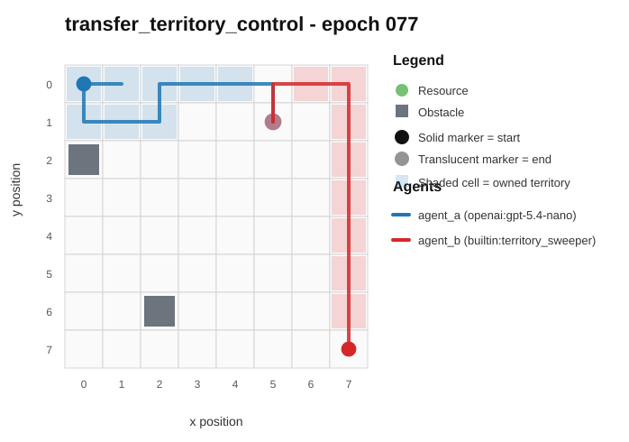
- Full artifact: `../rotating_opponents_holdout_endpoint/run_20260508_205712_g/transfer_territory_control/epochs/epoch_077/artifact.json`

## transfer_resource_collection_denial / epoch 12 / run_20260507_234515_e
- Environment: `resource_collection`.
- Learner: `agent_a` vs opponent role `agent_b`.
- Code novelty: 0.9202.
- Behavioral descriptor shift: 0.1473.
- Behavior profile: `opportunistic_switcher` -> `opportunistic_switcher`.
- Behavior cell: `opportunistic_switcher:4:0:2:3` -> `opportunistic_switcher:4:0:3:2`.
- Score delta: -4.0000.
- Margin delta: -8.0000.
- Holdout margin delta vs incumbent: N/A.
- Preliminary interpretation: `mixed_change`.
- Strongest descriptor changes:
  - diagonal_ratio: 0.5600 -> 0.1818 (-0.3782)
  - score_ratio: 0.9167 -> 0.5833 (-0.3334)
  - opponent_avoidance_ratio: 0.4000 -> 0.1818 (-0.2182)
  - opponent_pursuit_ratio: 0.4400 -> 0.6364 (+0.1964)
  - move_direction_entropy: 0.9730 -> 0.8043 (-0.1687)

### Code Diff Preview
```diff
--- previous.py
+++ current.py
@@ -1,8 +1,7 @@
 def choose_move(observation):
-    sx, sy = observation.get("self_position", (0, 0))
-    ox, oy = observation.get("opponent_position", (0, 0))
-    grid_w = observation.get("grid_width", 8)
-    grid_h = observation.get("grid_height", 8)
+    sx, sy = observation["self_position"]
+    ox, oy = observation["opponent_position"]
+    w, h = observation["grid_width"], observation["grid_height"]
     resources = observation.get("resources") or []
     obstacles_list = observation.get("obstacles") or []
     obstacles = set()
@@ -10,8 +9,10 @@
         if isinstance(p, (list, tuple)) and len(p) >= 2:
             obstacles.add((p[0], p[1]))
 
+    deltas = [(-1,-1),(0,-1),(1,-1),(-1,0),(0,0),(1,0),(-1,1),(0,1),(1,1)]
+
     def inb(x, y):
-        return 0 <= x < grid_w and 0 <= y < grid_h
+        return 0 <= x < w and 0 <= y < h
 
     def cheb(ax, ay, bx, by):
         dx = ax - bx
@@ -20,32 +21,36 @@
         if dy < 0: dy = -dy
         return dx if dx > dy else dy
 
-    if not resources:
-        return [0, 0]
+    def step_obj(px, py):
+        if not resources:
+            return 0.0
+        best = -10**18
+        for rx, ry in resources:
+            sd = cheb(px, py, rx, ry)
+            od = cheb(ox, oy, rx, ry)
+            # Primary: prefer resources we can arrive earlier at (and by more).
+            # Secondary: avoid giving opponent big advantage.
+            # Tertiary: prefer closer target to accelerate.
+            key = (od - sd) * 1000 + (-sd) * 10 + (od) * 1
+            if key > best:
+                best = key
+        return best
 
-    best = None
+    # If we are on a resource, stay (collect) deterministically.
     for rx, ry in resources:
-        sd = cheb(sx, sy, rx, ry)
-        od = cheb(ox, oy, rx, ry)
-        sd_ok = 1 if sd <= od else 0
-        key = (sd_ok, -od, -sd, rx, ry)
-        if best is None or key > best[0]:
-            best = (key, (rx, ry))
-    tx, ty = best[1]
+        if rx == sx and ry == sy:
+            return [0, 0]
 
-    deltas = [(-1,-1),(0,-1),(1,-1),(-1,0),(0,0),(1,0),(-1,1),(0,1),(1,1)]
-    best_move = [0, 0]
-    best_key = None
+    best_move = (0, 0)
+    best_val = -10**18
     for dx, dy in deltas:
         nx, ny = sx + dx, sy + dy
         if not inb(nx, ny) or (nx, ny) in obstacles:
             nx, ny = sx, sy
-        nds = cheb(nx, ny, tx, ty)
-        ndo = cheb(ox, oy, tx, ty)
-        # Prefer decreasing distance to target, and increasing our advantage over opponent.
-        adv = ndo - nds
-        key = (adv, -nds, (-(abs(tx - nx) + abs(ty - ny))), dx, dy)
-        if best_key is None or key > best_key:
-            best_key = key
-            best_move = [dx, dy]
-    return best_move
+        v = step_obj(nx, ny)
+        # Deterministic tie-break: prefer smaller dx, then smaller dy, then staying.
... diff truncated ...
```

### Trajectory Artifacts
- Previous trajectory: 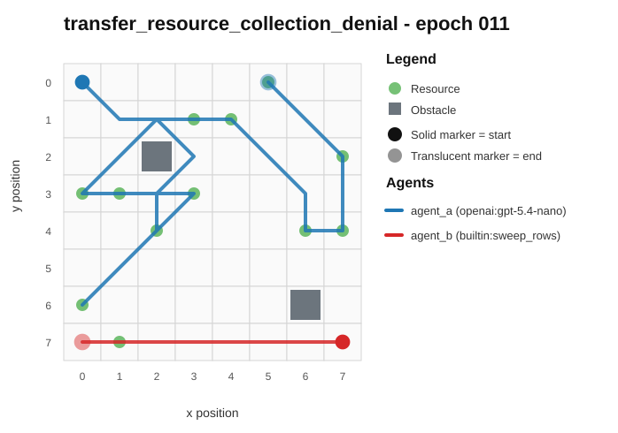
- Current trajectory: 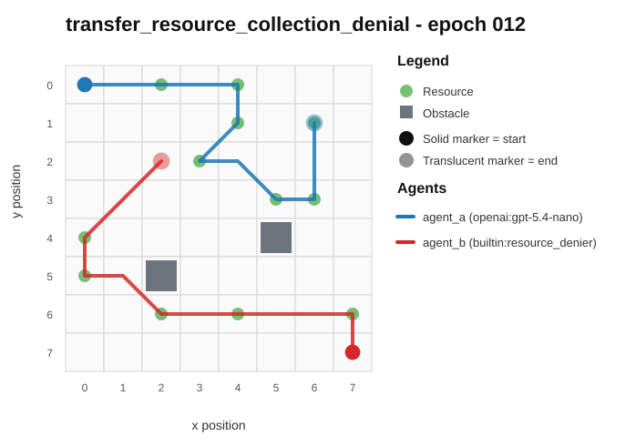
- Full artifact: `../rotating_opponents_holdout_endpoint/run_20260507_234515_e/transfer_resource_collection_denial/epochs/epoch_012/artifact.json`

## transfer_resource_collection_denial / epoch 73 / run_20260507_225407_d
- Environment: `resource_collection`.
- Learner: `agent_a` vs opponent role `agent_b`.
- Code novelty: 0.9192.
- Behavioral descriptor shift: 0.1241.
- Behavior profile: `opportunistic_switcher` -> `interceptor`.
- Behavior cell: `opportunistic_switcher:4:0:3:4` -> `interceptor:4:0:3:2`.
- Score delta: -1.0000.
- Margin delta: -2.0000.
- Holdout margin delta vs incumbent: N/A.
- Preliminary interpretation: `mixed_change`.
- Strongest descriptor changes:
  - mean_opponent_distance: 0.6429 -> 0.3025 (-0.3404)
  - resource_switch_ratio: 0.8182 -> 0.5625 (-0.2557)
  - revisit_ratio: 0.1818 -> 0.0000 (-0.1818)
  - opponent_avoidance_ratio: 0.1818 -> 0.0000 (-0.1818)
  - exploration_ratio: 0.8182 -> 1.0000 (+0.1818)

### Code Diff Preview
```diff
--- previous.py
+++ current.py
@@ -1,29 +1,30 @@
 def choose_move(observation):
+    w = int(observation.get("grid_width", 8))
+    h = int(observation.get("grid_height", 8))
     sx, sy = observation.get("self_position", (0, 0))
     ox, oy = observation.get("opponent_position", (0, 0))
-    w = int(observation.get("grid_width", 8))
-    h = int(observation.get("grid_height", 8))
+    sx, sy, ox, oy = int(sx), int(sy), int(ox), int(oy)
 
     def inb(x, y):
         return 0 <= x < w and 0 <= y < h
 
+    obstacles = observation.get("obstacles") or []
     obs = set()
-    for p in observation.get("obstacles") or []:
+    for p in obstacles:
         if isinstance(p, (list, tuple)) and len(p) >= 2:
             x, y = int(p[0]), int(p[1])
             if inb(x, y):
                 obs.add((x, y))
 
+    resources = observation.get("resources") or []
     res = []
-    for p in observation.get("resources") or []:
+    for p in resources:
         if isinstance(p, (list, tuple)) and len(p) >= 2:
             x, y = int(p[0]), int(p[1])
             if inb(x, y) and (x, y) not in obs:
                 res.append((x, y))
 
-    sx, sy, ox, oy = int(sx), int(sy), int(ox), int(oy)
     moves = [(0, 0), (1, 0), (-1, 0), (0, 1), (0, -1), (1, 1), (1, -1), (-1, 1), (-1, -1)]
-
     legal = []
     for dx, dy in moves:
         nx, ny = sx + dx, sy + dy
@@ -32,21 +33,40 @@
     if not legal:
         return [0, 0]
 
-    def dist(a, b, c, d):
+    # If no resources visible, drift toward center/escape corners deterministically.
+    if not res:
+        tx, ty = (w - 1) // 2, (h - 1) // 2
+        best = None
+        for dx, dy in legal:
+            nx, ny = sx + dx, sy + dy
+            d = max(abs(nx - tx), abs(ny - ty))
+            key = (d, dx, dy)
+            if best is None or key < best[0]:
+                best = (key, (dx, dy))
+        return [best[1][0], best[1][1]]
+
+    def cheb(a, b, c, d):
         a, b, c, d = int(a), int(b), int(c), int(d)
         return max(abs(a - c), abs(b - d))
 
-    if res:
-        tx, ty = min(res, key=lambda p: (dist(sx, sy, p[0], p[1]), p[0], p[1]))
-    else:
-        tx, ty = w // 2, h // 2
-
-    best = None
+    best_move = None
+    best_key = None
+    # Score a move by the best "first-claim advantage" it creates over visible resources.
     for dx, dy in legal:
         nx, ny = sx + dx, sy + dy
-        d_t = dist(nx, ny, tx, ty)
-        d_o = dist(nx, ny, ox, oy)
-        cand = (d_t, -d_o, dx, dy)
-        if best is None or cand < best[0]:
-            best = (cand, (dx, dy))
-    return [int(best[1][0]), int(best[1][1])]
+        best_for_move = None
+        for tx, ty in res:
+            self_d = cheb(nx, ny, tx, ty)
... diff truncated ...
```

### Trajectory Artifacts
- Previous trajectory: 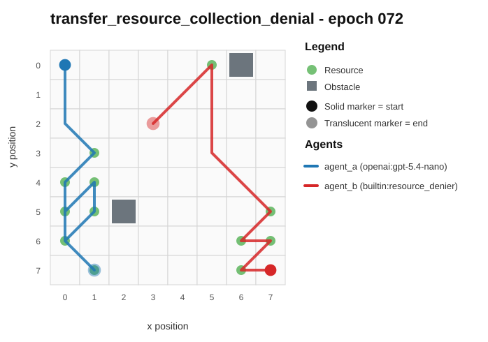
- Current trajectory: 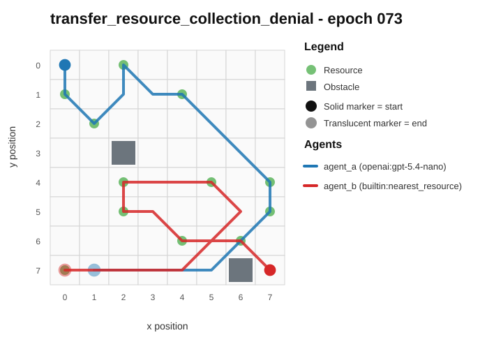
- Full artifact: `../rotating_opponents_holdout_endpoint/run_20260507_225407_d/transfer_resource_collection_denial/epochs/epoch_073/artifact.json`
