# Novelty Spike Review

This packet is intended for manual validation of the strongest code-novelty spikes.
Each case connects code change, behavioral descriptor change, trajectory change, and score / holdout effect.

## transfer_territory_control / epoch 54 / run_20260509_103847_j
- Environment: `territory_control`.
- Learner: `agent_a` vs opponent role `agent_b`.
- Code novelty: 0.9468.
- Behavioral descriptor shift: 6.0069.
- Behavior profile: `claimer` -> `static_guard`.
- Behavior cell: `claimer:1:3:2:0` -> `static_guard:2:2:2:0`.
- Score delta: +27.5000.
- Margin delta: +46.0000.
- Holdout margin delta vs incumbent: N/A.
- Preliminary interpretation: `candidate_behavioral_innovation`.
- Strongest descriptor changes:
  - score_ratio: 4.0000 -> 31.5000 (+27.5000)
  - territory_contest_ratio: 0.0000 -> 0.6000 (+0.6000)
  - territory_claim_ratio: 1.0000 -> 0.4000 (-0.6000)
  - path_overlap_ratio: 0.0000 -> 0.5915 (+0.5915)
  - stay_ratio: 0.0000 -> 0.5857 (+0.5857)

### Code Diff Preview
```diff
--- previous.py
+++ current.py
@@ -1,61 +1,68 @@
 def choose_move(observation):
-    w = int(observation.get("grid_width", 8))
-    h = int(observation.get("grid_height", 8))
-    sx, sy = observation.get("self_position", [0, 0])
-    sx, sy = int(sx), int(sy)
-    ox, oy = observation.get("opponent_position", [w - 1, h - 1])
-    ox, oy = int(ox), int(oy)
+    w = int(observation["grid_width"])
+    h = int(observation["grid_height"])
+    sx, sy = map(int, observation["self_position"])
+    ox, oy = map(int, observation["opponent_position"])
 
-    obstacles = set()
-    for p in observation.get("obstacles") or []:
-        if isinstance(p, (list, tuple)) and len(p) >= 2:
-            obstacles.add((int(p[0]), int(p[1])))
+    obstacles = set((int(p[0]), int(p[1])) for p in (observation.get("obstacles") or []))
+    selfT = set((int(p[0]), int(p[1])) for p in (observation.get("self_territory") or []))
+    opT = set((int(p[0]), int(p[1])) for p in (observation.get("opponent_territory") or []))
+    unT = set((int(p[0]), int(p[1])) for p in (observation.get("unclaimed_cells") or []))
 
-    selfT = set((int(p[0]), int(p[1])) for p in (observation.get("self_territory") or []) if isinstance(p, (list, tuple)) and len(p) >= 2)
-    opT = set((int(p[0]), int(p[1])) for p in (observation.get("opponent_territory") or []) if isinstance(p, (list, tuple)) and len(p) >= 2)
-    unT = set((int(p[0]), int(p[1])) for p in (observation.get("unclaimed_cells") or []) if isinstance(p, (list, tuple)) and len(p) >= 2)
+    def inside(x, y):
+        return 0 <= x < w and 0 <= y < h and (x, y) not in obstacles
 
     dirs = [(-1, -1), (0, -1), (1, -1), (-1, 0), (0, 0), (1, 0), (-1, 1), (0, 1), (1, 1)]
-    cx, cy = (w - 1) // 2, (h - 1) // 2
-    adj_dirs = dirs
+    neigh = [(sx + dx, sy + dy) for dx, dy in dirs]
+    neigh = [(x, y) for x, y in neigh if inside(x, y)]
+    if not neigh:
+        return [0, 0]
 
-    def inb(x, y):
-        return 0 <= x < w and 0 <= y < h and (x, y) not in obstacles
+    opp_border = set()
+    for x, y in opT:
+        for dx, dy in [(-1, -1), (0, -1), (1, -1), (-1, 0), (1, 0), (-1, 1), (0, 1), (1, 1)]:
+            nx, ny = x + dx, y + dy
+            if 0 <= nx < w and 0 <= ny < h and (nx, ny) not in obstacles:
+                opp_border.add((nx, ny))
 
-    best = None
-    best_key = None
-    for dx, dy in dirs:
-        nx, ny = sx + dx, sy + dy
-        if not inb(nx, ny):
-            continue
-        if (nx, ny) == (sx, sy):
-            gain = 0
-        elif (nx, ny) in unT:
-            gain = 7
-        elif (nx, ny) in opT:
-            gain = 5
-        elif (nx, ny) in selfT:
-            gain = 2
+    frontier = []
+    for x, y in selfT:
+        for dx, dy in [(-1, -1), (0, -1), (1, -1), (-1, 0), (1, 0), (-1, 1), (0, 1), (1, 1)]:
+            nx, ny = x + dx, y + dy
+            if inside(nx, ny) and ((nx, ny) in unT or (nx, ny) in opp_border):
+                frontier.append((nx, ny))
+
+    def score_cell(x, y):
+        d_to_op = abs(x - ox) + abs(y - oy)
+        is_un = (x, y) in unT
+        is_op = (x, y) in opT
+        is_f = (x, y) in opp_border or (x, y) in frontier
+        # Prefer claiming new territory; also push onto opponent border lines.
+        return (
+            (5 if is_un else 0) +
+            (8 if is_op else 0) +
+            (3 if is_f else 0) -
+            0.15 * d_to_op -
+            0.01 * (abs(x - sx) + abs(y - sy))
... diff truncated ...
```

### Trajectory Artifacts
- Previous trajectory: 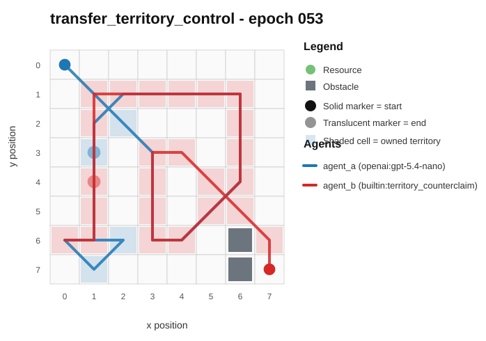
- Current trajectory: 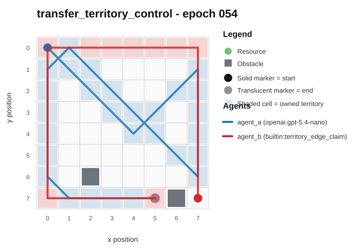
- Full artifact: `../rotating_plus_nemesis_novelty_replay/run_20260509_103847_j/transfer_territory_control/epochs/epoch_054/artifact.json`

## transfer_territory_control / epoch 42 / run_20260507_145614_b
- Environment: `territory_control`.
- Learner: `agent_a` vs opponent role `agent_b`.
- Code novelty: 0.9438.
- Behavioral descriptor shift: 5.3515.
- Behavior profile: `balanced` -> `claimer`.
- Behavior cell: `balanced:0:4:2:0` -> `claimer:2:2:2:0`.
- Score delta: +24.5000.
- Margin delta: +21.0000.
- Holdout margin delta vs incumbent: N/A.
- Preliminary interpretation: `candidate_behavioral_innovation`.
- Strongest descriptor changes:
  - score_ratio: 8.0000 -> 32.5000 (+24.5000)
  - unique_cell_ratio: 0.1250 -> 0.5625 (+0.4375)
  - territory_claim_ratio: 0.1143 -> 0.5429 (+0.4286)
  - revisit_ratio: 0.9000 -> 0.5000 (-0.4000)
  - exploration_ratio: 0.1000 -> 0.5000 (+0.4000)

### Code Diff Preview
```diff
--- previous.py
+++ current.py
@@ -1,69 +1,77 @@
 def choose_move(observation):
-    w = observation.get("grid_width", 0)
-    h = observation.get("grid_height", 0)
-    if not w or not h:
-        return [0, 0]
+    w, h = observation["grid_width"], observation["grid_height"]
+    sx, sy = observation["self_position"]
+    ox, oy = observation["opponent_position"]
 
-    sx, sy = observation.get("self_position", (0, 0))[:2]
-    ox, oy = observation.get("opponent_position", (0, 0))[:2]
-
-    obst = observation.get("obstacles") or []
     obstacles = set()
-    for p in obst:
+    for p in observation.get("obstacles") or []:
         if p and len(p) >= 2:
             obstacles.add((p[0], p[1]))
 
-    def inb(x, y):
-        return 0 <= x < w and 0 <= y < h and (x, y) not in obstacles
+    selfT = set()
+    for p in observation.get("self_territory") or []:
+        if p and len(p) >= 2:
+            selfT.add((p[0], p[1]))
 
-    dirs = [(-1, -1), (-1, 0), (-1, 1), (0, -1), (0, 0), (0, 1), (1, -1), (1, 0), (1, 1)]
-    unclaimed = observation.get("unclaimed_cells") or []
-    resources = observation.get("resources") or []
+    oppT = set()
+    for p in observation.get("opponent_territory") or []:
+        if p and len(p) >= 2:
+            oppT.add((p[0], p[1]))
 
-    def cell_list(arr):
-        out = []
-        for p in arr:
-            if p and len(p) >= 2:
-                out.append((p[0], p[1]))
-        return out
+    unclaimed = []
+    for p in observation.get("unclaimed_cells") or []:
+        if p and len(p) >= 2:
+            x, y = p[0], p[1]
+            if 0 <= x < w and 0 <= y < h and (x, y) not in obstacles:
+                unclaimed.append((x, y))
 
-    targets = cell_list(unclaimed)
-    if not targets:
-        targets = cell_list(resources)
-    if not targets:
-        ot = observation.get("opponent_territory") or []
-        targets = cell_list(ot)
-    if not targets:
-        targets = [(ox, oy)]
+    resources = []
+    for p in observation.get("resources") or []:
+        if p and len(p) >= 2:
+            x, y = p[0], p[1]
+            if 0 <= x < w and 0 <= y < h and (x, y) not in obstacles:
+                resources.append((x, y))
 
-    def man(a, b):
-        return abs(a[0] - b[0]) + abs(a[1] - b[1])
+    cx, cy = (w - 1) / 2.0, (h - 1) / 2.0
 
-    opp_adj = man((sx, sy), (ox, oy)) == 1
+    def neigh8(x, y):
+        for dx in (-1, 0, 1):
+            for dy in (-1, 0, 1):
+                if dx or dy:
+                    nx, ny = x + dx, y + dy
+                    if 0 <= nx < w and 0 <= ny < h:
+                        yield nx, ny
 
-    best_t = None
-    best_td = 10**9
... diff truncated ...
```

### Trajectory Artifacts
- Previous trajectory: 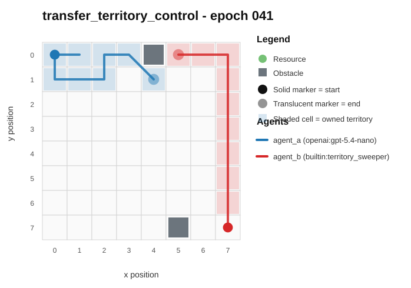
- Current trajectory: 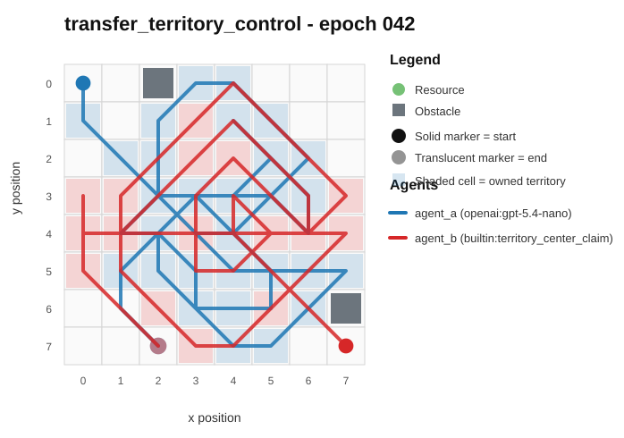
- Full artifact: `../rotating_plus_nemesis_novelty_replay/run_20260507_145614_b/transfer_territory_control/epochs/epoch_042/artifact.json`

## transfer_territory_control / epoch 87 / run_20260507_145614_b
- Environment: `territory_control`.
- Learner: `agent_a` vs opponent role `agent_b`.
- Code novelty: 0.9434.
- Behavioral descriptor shift: 2.203.
- Behavior profile: `static_guard` -> `static_guard`.
- Behavior cell: `static_guard:0:4:2:0` -> `static_guard:1:4:2:0`.
- Score delta: +10.0000.
- Margin delta: -2.5000.
- Holdout margin delta vs incumbent: N/A.
- Preliminary interpretation: `candidate_behavioral_innovation`.
- Strongest descriptor changes:
  - score_ratio: 6.0000 -> 16.0000 (+10.0000)
  - territory_contest_ratio: 0.9143 -> 0.0000 (-0.9143)
  - path_overlap_ratio: 0.9014 -> 0.0000 (-0.9014)
  - mean_opponent_distance: 0.0473 -> 0.4346 (+0.3873)
  - move_direction_entropy: 0.3581 -> 0.5222 (+0.1641)

### Code Diff Preview
```diff
--- previous.py
+++ current.py
@@ -1,47 +1,84 @@
 def choose_move(observation):
-    w = int(observation.get("grid_width", 0) or 0)
-    h = int(observation.get("grid_height", 0) or 0)
-    sx, sy = observation.get("self_position", (0, 0))
-    ox, oy = observation.get("opponent_position", (0, 0))
-    sx, sy, ox, oy = int(sx), int(sy), int(ox), int(oy)
-
+    w = int(observation["grid_width"])
+    h = int(observation["grid_height"])
+    sx, sy = observation["self_position"]
     obstacles = set()
-    for p in observation.get("obstacles") or []:
+    for p in (observation.get("obstacles") or []):
         if p and len(p) >= 2:
-            x, y = int(p[0]), int(p[1])
+            x, y = p[0], p[1]
             if 0 <= x < w and 0 <= y < h:
                 obstacles.add((x, y))
+    unclaimed = set()
+    for p in (observation.get("unclaimed_cells") or []):
+        if p and len(p) >= 2:
+            x, y = p[0], p[1]
+            if 0 <= x < w and 0 <= y < h and (x, y) not in obstacles:
+                unclaimed.add((x, y))
+    opp_s = set()
+    for p in (observation.get("opponent_territory") or []):
+        if p and len(p) >= 2:
+            x, y = p[0], p[1]
+            if 0 <= x < w and 0 <= y < h and (x, y) not in obstacles:
+                opp_s.add((x, y))
+    self_s = set()
+    for p in (observation.get("self_territory") or []):
+        if p and len(p) >= 2:
+            x, y = p[0], p[1]
+            if 0 <= x < w and 0 <= y < h and (x, y) not in obstacles:
+                self_s.add((x, y))
 
-    resources = []
-    for p in observation.get("resources") or []:
-        if p and len(p) >= 2:
-            x, y = int(p[0]), int(p[1])
-            if 0 <= x < w and 0 <= y < h and (x, y) not in obstacles:
-                resources.append((x, y))
+    def neighbors8(x, y):
+        for dx in (-1, 0, 1):
+            for dy in (-1, 0, 1):
+                if dx or dy:
+                    nx, ny = x + dx, y + dy
+                    if 0 <= nx < w and 0 <= ny < h:
+                        yield nx, ny
 
-    moves = [(-1, 0), (0, -1), (1, 0), (0, 1), (-1, -1), (-1, 1), (1, -1), (1, 1), (0, 0)]
+    def edge_bias(x, y):
+        return (1 if x == 0 or x == w - 1 else 0) + (1 if y == 0 or y == h - 1 else 0)
+
+    def eval_cell(x, y):
+        if (x, y) in obstacles:
+            return -10**9
+        val = 0
+        if (x, y) in unclaimed:
+            val += 8
+        if (x, y) in self_s:
+            val += 2
+        if (x, y) in opp_s:
+            val -= 18
+        e = edge_bias(x, y)
+        val += 3 * e
+        adj_our = 0
+        adj_opp = 0
+        for nx, ny in neighbors8(x, y):
+            if (nx, ny) in self_s:
+                adj_our += 1
+            elif (nx, ny) in opp_s:
+                adj_opp += 1
+        val += 1.2 * adj_our
+        if (x, y) in opp_s:
+            val += 2.5 * adj_our
... diff truncated ...
```

### Trajectory Artifacts
- Previous trajectory: 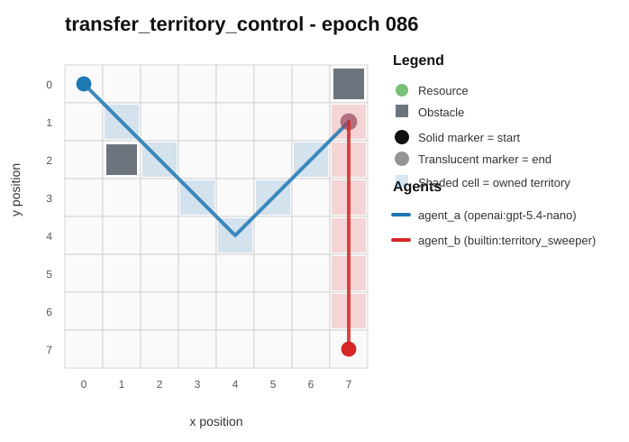
- Current trajectory: 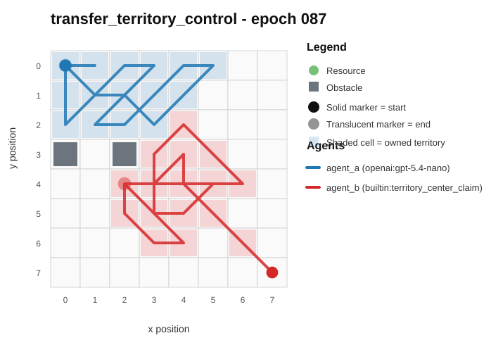
- Full artifact: `../rotating_plus_nemesis_novelty_replay/run_20260507_145614_b/transfer_territory_control/epochs/epoch_087/artifact.json`

## transfer_territory_control / epoch 82 / run_20260507_145614_b
- Environment: `territory_control`.
- Learner: `agent_a` vs opponent role `agent_b`.
- Code novelty: 0.9419.
- Behavioral descriptor shift: 6.8835.
- Behavior profile: `balanced` -> `static_guard`.
- Behavior cell: `balanced:0:4:2:0` -> `static_guard:2:2:2:0`.
- Score delta: +31.5000.
- Margin delta: +20.5000.
- Holdout margin delta vs incumbent: N/A.
- Preliminary interpretation: `candidate_behavioral_innovation`.
- Strongest descriptor changes:
  - score_ratio: 8.0000 -> 39.5000 (+31.5000)
  - territory_contest_ratio: 0.8857 -> 0.0000 (-0.8857)
  - path_overlap_ratio: 0.8732 -> 0.0000 (-0.8732)
  - stay_ratio: 0.0000 -> 0.4714 (+0.4714)
  - unique_cell_ratio: 0.1562 -> 0.5938 (+0.4376)

### Code Diff Preview
```diff
--- previous.py
+++ current.py
@@ -1,47 +1,76 @@
 def choose_move(observation):
-    w = int(observation.get("grid_width", 0) or 0)
-    h = int(observation.get("grid_height", 0) or 0)
-    sx, sy = observation.get("self_position", (0, 0))
-    ox, oy = observation.get("opponent_position", (0, 0))
+    w = int(observation["grid_width"])
+    h = int(observation["grid_height"])
+    sx, sy = observation["self_position"]
     obstacles = set()
     for p in observation.get("obstacles") or []:
         if p and len(p) >= 2:
-            x, y = p[0], p[1]
+            x, y = int(p[0]), int(p[1])
             if 0 <= x < w and 0 <= y < h:
                 obstacles.add((x, y))
-
-    targets = []
+    opp_set = set()
+    for p in observation.get("opponent_territory") or []:
+        if p and len(p) >= 2:
+            x, y = int(p[0]), int(p[1])
+            if 0 <= x < w and 0 <= y < h and (x, y) not in obstacles:
+                opp_set.add((x, y))
+    unclaimed = set()
     for p in observation.get("unclaimed_cells") or []:
         if p and len(p) >= 2:
-            x, y = p[0], p[1]
+            x, y = int(p[0]), int(p[1])
             if 0 <= x < w and 0 <= y < h and (x, y) not in obstacles:
-                targets.append((x, y))
+                unclaimed.add((x, y))
 
-    if not targets:
-        for p in observation.get("resources") or []:
-            if p and len(p) >= 2:
-                x, y = p[0], p[1]
-                if 0 <= x < w and 0 <= y < h and (x, y) not in obstacles:
-                    targets.append((x, y))
-    if not targets and 0 <= ox < w and 0 <= oy < h and (ox, oy) not in obstacles:
-        targets = [(ox, oy)]
+    def neighbors8(x, y):
+        for dx in (-1, 0, 1):
+            for dy in (-1, 0, 1):
+                if dx == 0 and dy == 0:
+                    continue
+                nx, ny = x + dx, y + dy
+                if 0 <= nx < w and 0 <= ny < h:
+                    yield nx, ny
 
-    if targets:
-        tx, ty = min(targets, key=lambda t: abs(t[0] - sx) + abs(t[1] - sy))
-    else:
-        tx, ty = sx, sy
+    cx, cy = (w - 1) / 2.0, (h - 1) / 2.0
 
-    moves = [(0, -1), (1, 0), (0, 1), (-1, 0), (1, -1), (1, 1), (-1, 1), (-1, -1)]
-    best = None
-    best_d = None
+    moves = [(dx, dy) for dx in (-1, 0, 1) for dy in (-1, 0, 1)]
+    best_move = (0, 0)
+    best_val = -10**18
     for dx, dy in moves:
         nx, ny = sx + dx, sy + dy
-        if 0 <= nx < w and 0 <= ny < h and (nx, ny) not in obstacles:
-            d = abs(nx - tx) + abs(ny - ty)
-            if best is None or d < best_d:
-                best = [dx, dy]
-                best_d = d
-    if best is not None:
-        return best
+        if not (0 <= nx < w and 0 <= ny < h):
+            continue
+        if (nx, ny) in obstacles:
+            continue
 
-    return [0, 0] if (0 == 0 and 0 == 0) else [0, 0]
+        val = 0
... diff truncated ...
```

### Trajectory Artifacts
- Previous trajectory: 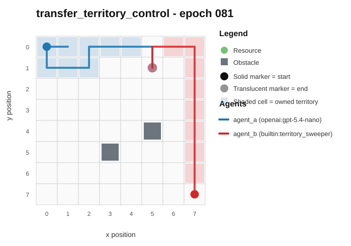
- Current trajectory: 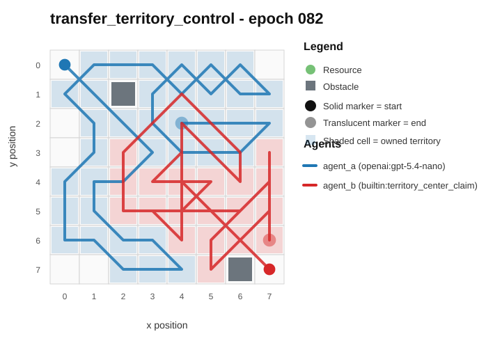
- Full artifact: `../rotating_plus_nemesis_novelty_replay/run_20260507_145614_b/transfer_territory_control/epochs/epoch_082/artifact.json`

## transfer_pursuit_evasion / epoch 87 / run_20260509_011052_i
- Environment: `pursuit_evasion`.
- Learner: `agent_a` vs opponent role `agent_b`.
- Code novelty: 0.9397.
- Behavioral descriptor shift: 0.2956.
- Behavior profile: `static_guard` -> `static_guard`.
- Behavior cell: `static_guard:0:4:2:0` -> `static_guard:0:4:2:0`.
- Score delta: +0.0000.
- Margin delta: +0.0000.
- Holdout margin delta vs incumbent: N/A.
- Preliminary interpretation: `mixed_change`.
- Strongest descriptor changes:
  - obstacle_hit_rate: 0.9167 -> 0.0000 (-0.9167)
  - mean_opponent_distance: 0.3208 -> 1.0000 (+0.6792)
  - center_bias: 0.5667 -> 0.0000 (-0.5667)
  - move_direction_entropy: 0.4138 -> 0.0000 (-0.4138)
  - stay_ratio: 0.9167 -> 1.0000 (+0.0833)

### Code Diff Preview
```diff
--- previous.py
+++ current.py
@@ -1,37 +1,74 @@
 def choose_move(observation):
-    env = observation.get("environment_name", "resource_collection")
+    w = int(observation.get("grid_width", 8))
+    h = int(observation.get("grid_height", 8))
     sx, sy = observation["self_position"]
     ox, oy = observation["opponent_position"]
-    if env == "pursuit_evasion":
-        role = observation.get("self_role", "pursuer")
-        if role == "pursuer":
-            dx = 0 if ox == sx else (1 if ox > sx else -1)
-            dy = 0 if oy == sy else (1 if oy > sy else -1)
-            return [dx, dy]
-        corners = [
-            [0, 0],
-            [0, observation["grid_height"] - 1],
-            [observation["grid_width"] - 1, 0],
-            [observation["grid_width"] - 1, observation["grid_height"] - 1],
-        ]
-        target = max(corners, key=lambda item: abs(item[0] - ox) + abs(item[1] - oy))
-        dx = 0 if target[0] == sx else (1 if target[0] > sx else -1)
-        dy = 0 if target[1] == sy else (1 if target[1] > sy else -1)
-        return [dx, dy]
-    if env == "territory_control":
-        targets = observation.get("unclaimed_cells") or observation.get("opponent_territory") or []
-        if not targets:
-            return [0, 0]
-        best = min(targets, key=lambda item: abs(item[0] - sx) + abs(item[1] - sy))
-        dx = 0 if best[0] == sx else (1 if best[0] > sx else -1)
-        dy = 0 if best[1] == sy else (1 if best[1] > sy else -1)
-        return [dx, dy]
-    resources = observation.get("resources") or []
-    if not resources:
-        dx = 0 if ox == sx else (1 if ox > sx else -1)
-        dy = 0 if oy == sy else (1 if oy > sy else -1)
-        return [dx, dy]
-    best = min(resources, key=lambda item: abs(item[0] - sx) + abs(item[1] - sy))
-    dx = 0 if best[0] == sx else (1 if best[0] > sx else -1)
-    dy = 0 if best[1] == sy else (1 if best[1] > sy else -1)
-    return [dx, dy]
+    obstacles = set(map(tuple, observation.get("obstacles") or []))
+    role = (observation.get("self_role") or "").lower()
+    is_pursuer = ("pursuer" in role) and ("evader" not in role)
+
+    def inb(x, y):
+        return 0 <= x < w and 0 <= y < h and (x, y) not in obstacles
+
+    def cheb(ax, ay, bx, by):
+        dx = ax - bx
+        if dx < 0: dx = -dx
+        dy = ay - by
+        if dy < 0: dy = -dy
+        return dx if dx > dy else dy
+
+    def obstacle_adj_pen(x, y):
+        # small deterministic penalty to avoid getting "wedged" into walls/obstacles
+        p = 0
+        for dx, dy in ((1,0),(-1,0),(0,1),(0,-1)):
+            nx, ny = x + dx, y + dy
+            if (nx, ny) in obstacles:
+                p += 1
+        return p
+
+    # Heuristic: chase/evade with wall/obstacle awareness; tie-break deterministically.
+    dirs = [(-1,-1),(0,-1),(1,-1),(-1,0),(0,0),(1,0),(-1,1),(0,1),(1,1)]
+    best_move = (0, 0)
+    # Prefer interior cells; helps against wall-run evasion.
+    best_val = None
+
+    # When opponent is near a boundary, favor moving to reduce/maintain component along that boundary.
+    opp_near_left = ox <= 1
+    opp_near_right = ox >= w - 2
+    opp_near_top = oy <= 1
+    opp_near_bot = oy >= h - 2
+
+    for dx, dy in dirs:
+        nx, ny = sx + dx, sy + dy
+        if not inb(nx, ny):
... diff truncated ...
```

### Trajectory Artifacts
- Previous trajectory: 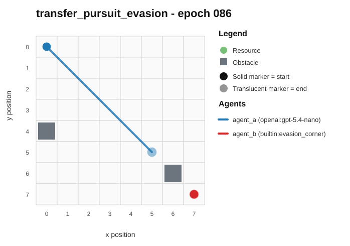
- Current trajectory: 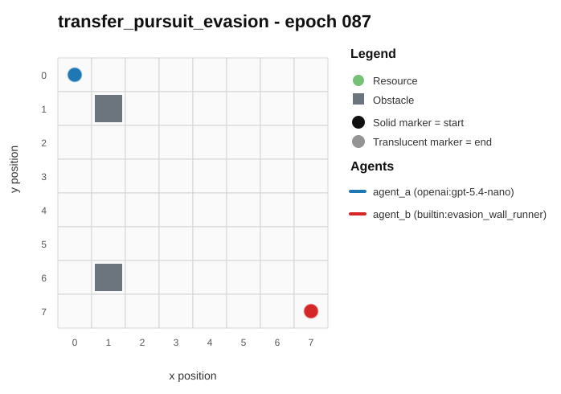
- Full artifact: `../rotating_plus_nemesis_novelty_replay/run_20260509_011052_i/transfer_pursuit_evasion/epochs/epoch_087/artifact.json`

## transfer_territory_control / epoch 64 / run_20260507_145614_b
- Environment: `territory_control`.
- Learner: `agent_a` vs opponent role `agent_b`.
- Code novelty: 0.9351.
- Behavioral descriptor shift: 10.4852.
- Behavior profile: `static_guard` -> `claimer`.
- Behavior cell: `static_guard:0:4:2:0` -> `claimer:3:1:2:0`.
- Score delta: +48.0000.
- Margin delta: +48.0000.
- Holdout margin delta vs incumbent: N/A.
- Preliminary interpretation: `candidate_behavioral_innovation`.
- Strongest descriptor changes:
  - score_ratio: 5.0000 -> 53.0000 (+48.0000)
  - territory_contest_ratio: 0.9000 -> 0.0143 (-0.8857)
  - path_overlap_ratio: 0.8873 -> 0.0141 (-0.8732)
  - stay_ratio: 0.9143 -> 0.1857 (-0.7286)
  - unique_cell_ratio: 0.0938 -> 0.7969 (+0.7031)

### Code Diff Preview
```diff
--- previous.py
+++ current.py
@@ -1,54 +1,73 @@
 def choose_move(observation):
-    w = int(observation.get("grid_width", 0))
-    h = int(observation.get("grid_height", 0))
-    sx, sy = observation.get("self_position", (0, 0))
-    ox, oy = observation.get("opponent_position", (0, 0))
+    w = int(observation["grid_width"])
+    h = int(observation["grid_height"])
+    sx, sy = observation["self_position"]
+    ox, oy = observation["opponent_position"]
 
     obstacles = set()
-    for p in observation.get("obstacles") or []:
+    for p in (observation.get("obstacles") or []):
         if p and len(p) >= 2:
-            obstacles.add((int(p[0]), int(p[1])))
+            x, y = p[0], p[1]
+            if 0 <= x < w and 0 <= y < h:
+                obstacles.add((x, y))
 
     unclaimed = []
-    for p in observation.get("unclaimed_cells") or []:
+    for p in (observation.get("unclaimed_cells") or []):
         if p and len(p) >= 2:
-            unclaimed.append((int(p[0]), int(p[1])))
+            x, y = p[0], p[1]
+            if 0 <= x < w and 0 <= y < h and (x, y) not in obstacles:
+                unclaimed.append((x, y))
 
-    dirs = [(-1, -1), (-1, 0), (-1, 1), (0, -1), (0, 0), (0, 1), (1, -1), (1, 0), (1, 1)]
+    self_terr = observation.get("self_territory") or []
+    opp_terr = observation.get("opponent_territory") or []
+    self_set = set((p[0], p[1]) for p in self_terr if p and len(p) >= 2)
+    opp_set = set((p[0], p[1]) for p in opp_terr if p and len(p) >= 2)
 
-    def inside(x, y):
-        return 0 <= x < w and 0 <= y < h
+    def man(a, b, c, d):
+        return abs(a - c) + abs(b - d)
 
-    def dist(a, b, c, d):
-        dx = a - c
-        dy = b - d
-        return abs(dx) + abs(dy)
+    def neighbors8(x, y):
+        for dx in (-1, 0, 1):
+            for dy in (-1, 0, 1):
+                if dx == 0 and dy == 0:
+                    continue
+                nx, ny = x + dx, y + dy
+                if 0 <= nx < w and 0 <= ny < h:
+                    yield nx, ny
 
-    target = None
-    if unclaimed:
+    # Frontier targeting: prefer unclaimed cells that are adjacent to opponent territory (edge claim).
+    # Fall back to unclaimed, else toward the closest unclaimed/opp territory cell.
+    opp_adj = []
+    for (x, y) in unclaimed:
+        if any((nx, ny) in opp_set for (nx, ny) in neighbors8(x, y)):
+            opp_adj.append((x, y))
+
+    candidates = opp_adj if opp_adj else unclaimed
+
+    if candidates:
         best = None
-        bestd = None
-        for (x, y) in unclaimed:
-            if not inside(x, y) or (x, y) in obstacles:
+        best_k = None
+        for x, y in candidates:
+            if (x, y) in self_set:
                 continue
-            d = dist(sx, sy, x, y)
-            if bestd is None or d < bestd or (d == bestd and (x, y) < best):
-                bestd = d
+            d_me = man(sx, sy, x, y)
+            d_opp = man(ox, oy, x, y)
... diff truncated ...
```

### Trajectory Artifacts
- Previous trajectory: 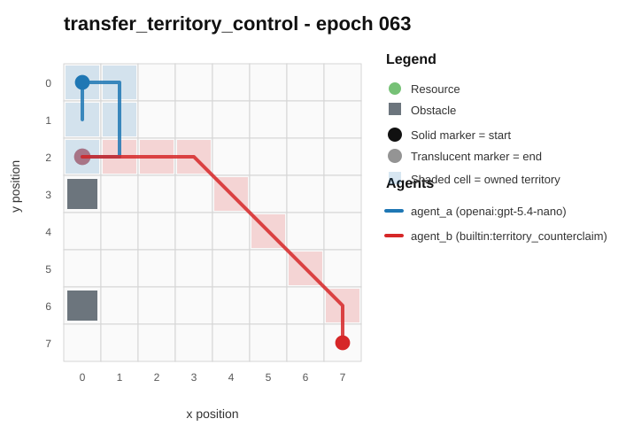
- Current trajectory: 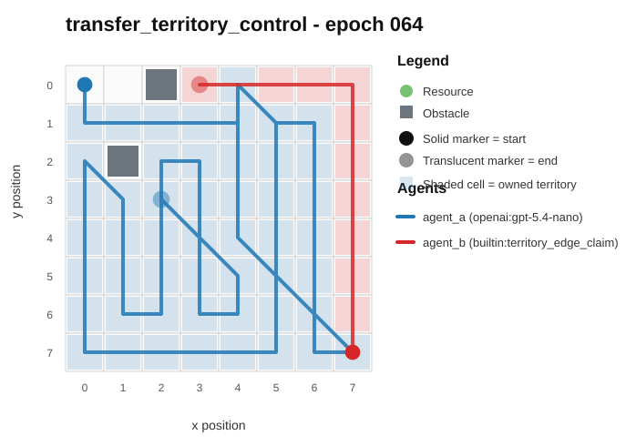
- Full artifact: `../rotating_plus_nemesis_novelty_replay/run_20260507_145614_b/transfer_territory_control/epochs/epoch_064/artifact.json`

## transfer_resource_collection_denial / epoch 82 / run_20260509_103847_j
- Environment: `resource_collection`.
- Learner: `agent_a` vs opponent role `agent_b`.
- Code novelty: 0.9333.
- Behavioral descriptor shift: 0.1739.
- Behavior profile: `opportunistic_switcher` -> `opportunistic_switcher`.
- Behavior cell: `opportunistic_switcher:4:0:3:2` -> `opportunistic_switcher:4:0:3:3`.
- Score delta: +1.5000.
- Margin delta: +3.0000.
- Holdout margin delta vs incumbent: N/A.
- Preliminary interpretation: `candidate_behavioral_innovation`.
- Strongest descriptor changes:
  - path_overlap_ratio: 0.5714 -> 0.0000 (-0.5714)
  - opponent_pursuit_ratio: 0.4000 -> 0.7273 (+0.3273)
  - mean_opponent_distance: 0.2245 -> 0.4940 (+0.2695)
  - resource_switch_ratio: 0.5000 -> 0.7273 (+0.2273)
  - unique_cell_ratio: 0.3281 -> 0.1875 (-0.1406)

### Code Diff Preview
```diff
--- previous.py
+++ current.py
@@ -1,64 +1,49 @@
 def choose_move(observation):
-    w = observation.get("grid_width", 8)
-    h = observation.get("grid_height", 8)
-    sx, sy = observation.get("self_position", (0, 0))
-    ox, oy = observation.get("opponent_position", (0, 0))
+    w = observation["grid_width"]
+    h = observation["grid_height"]
+    sx, sy = observation["self_position"]
+    ox, oy = observation["opponent_position"]
     resources = observation.get("resources") or []
-    obs_list = observation.get("obstacles") or []
-    obstacles = set((p[0], p[1]) for p in obs_list)
+    obstacles_list = observation.get("obstacles") or []
+    obstacles = set(obstacles_list) if isinstance(obstacles_list, set) else set(tuple(p) for p in obstacles_list)
 
     def inb(x, y):
         return 0 <= x < w and 0 <= y < h
 
     if not resources:
-        # Deterministic safe drift: move toward center
-        cx, cy = (w - 1) // 2, (h - 1) // 2
-        dx = 0 if sx == cx else (1 if sx < cx else -1)
-        dy = 0 if sy == cy else (1 if sy < cy else -1)
-        return [dx, dy]
+        return [0, 0]
 
     deltas = [(-1, -1), (0, -1), (1, -1), (-1, 0), (0, 0), (1, 0), (-1, 1), (0, 1), (1, 1)]
-    best_target = None
-    best_key = None
+
+    best = None
     for rx, ry in resources:
-        ds = abs(rx - sx) + abs(ry - sy)
-        do = abs(rx - ox) + abs(ry - oy)
-        # Favor targets we can reach first; slight bias for same row/col as opponent to contest.
-        contest = 0
-        if ry == oy:
-            contest += 1
-        if rx == ox:
-            contest += 0.5
-        # Add small tie-break toward closer targets to reduce dithering.
-        key = (-(do - ds + contest), ds + 0.1 * (rx + 2 * ry), rx, ry)
-        if best_key is None or key < best_key:
-            best_key = key
-            best_target = (rx, ry)
+        myd = abs(rx - sx) + abs(ry - sy)
+        opd = abs(rx - ox) + abs(ry - oy)
+        # Prefer resources where we are likely to arrive first; if tied, grab nearer ones.
+        lead = opd - myd
+        # Secondary: avoid resources far behind us in "y progress" to reduce dithering.
+        back_pen = (ry - sy) if sy <= 3 else (sy - ry)
+        key = (-lead, myd + 0.05 * back_pen, rx, ry)
+        if best is None or key < best[0]:
+            best = (key, rx, ry)
 
-    tx, ty = best_target
+    _, tx, ty = best
 
-    best_move = (0, 0)
-    best_move_key = None
+    # Move: try direct step minimizing distance to target, but avoid obstacles.
+    bestm = None
+    bestdist = None
     for dx, dy in deltas:
         nx, ny = sx + dx, sy + dy
         if not inb(nx, ny) or (nx, ny) in obstacles:
             continue
+        d = abs(tx - nx) + abs(ty - ny)
+        # Add a small anti-collision bias: don't step into squares very close to opponent.
+        od = abs(ox - nx) + abs(oy - ny)
+        score = (d, -od)
+        if bestdist is None or score < bestdist:
+            bestdist = score
+            bestm = (dx, dy)
 
-        ds_next = abs(tx - nx) + abs(ty - ny)
-        do_cur = abs(tx - ox) + abs(ty - oy)
... diff truncated ...
```

### Trajectory Artifacts
- Previous trajectory: 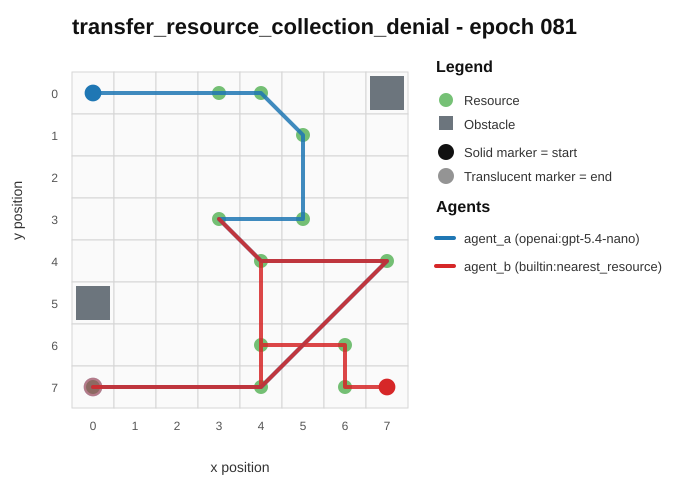
- Current trajectory: 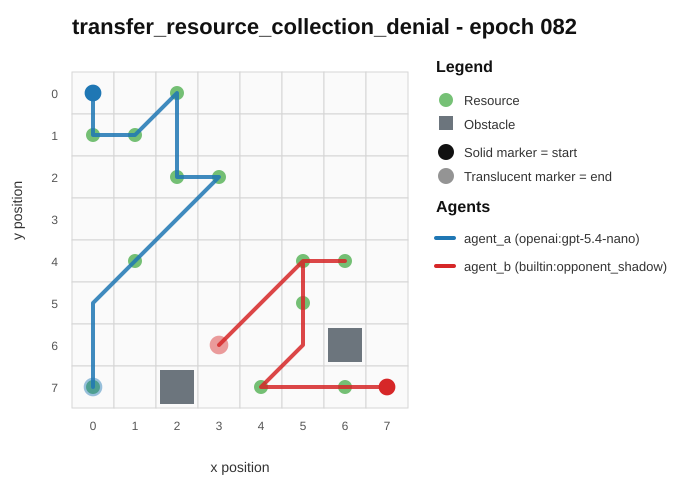
- Full artifact: `../rotating_plus_nemesis_novelty_replay/run_20260509_103847_j/transfer_resource_collection_denial/epochs/epoch_082/artifact.json`

## transfer_territory_control / epoch 72 / run_20260507_155959_c
- Environment: `territory_control`.
- Learner: `agent_a` vs opponent role `agent_b`.
- Code novelty: 0.9323.
- Behavioral descriptor shift: 8.628.
- Behavior profile: `balanced` -> `claimer`.
- Behavior cell: `balanced:0:4:2:0` -> `claimer:3:1:2:0`.
- Score delta: +39.5000.
- Margin delta: +43.5000.
- Holdout margin delta vs incumbent: N/A.
- Preliminary interpretation: `candidate_behavioral_innovation`.
- Strongest descriptor changes:
  - score_ratio: 8.0000 -> 47.5000 (+39.5000)
  - territory_contest_ratio: 0.8857 -> 0.0000 (-0.8857)
  - path_overlap_ratio: 0.8732 -> 0.0000 (-0.8732)
  - unique_cell_ratio: 0.1562 -> 0.7031 (+0.5469)
  - territory_claim_ratio: 0.1143 -> 0.6286 (+0.5143)

### Code Diff Preview
```diff
--- previous.py
+++ current.py
@@ -1,58 +1,67 @@
 def choose_move(observation):
-    w = int(observation.get("grid_width", 8) or 8)
-    h = int(observation.get("grid_height", 8) or 8)
-    sp = observation.get("self_position") or [0, 0]
-    op = observation.get("opponent_position") or [w - 1, h - 1]
-    sx, sy = int(sp[0]), int(sp[1])
-    ox, oy = int(op[0]), int(op[1])
+    w = int(observation["grid_width"] or 8)
+    h = int(observation["grid_height"] or 8)
+    sx, sy = observation["self_position"]
+    obstacles = set((p[0], p[1]) for p in (observation.get("obstacles") or []) if p and len(p) >= 2)
+    def inb(x, y): return 0 <= x < w and 0 <= y < h
+    def free(x, y): return inb(x, y) and (x, y) not in obstacles
 
-    obstacles = set()
-    for p in observation.get("obstacles") or []:
-        if p and len(p) >= 2:
-            x, y = int(p[0]), int(p[1])
-            if 0 <= x < w and 0 <= y < h:
-                obstacles.add((x, y))
+    neigh8 = [(dx, dy) for dx in (-1, 0, 1) for dy in (-1, 0, 1) if not (dx == 0 and dy == 0)]
+    unclaimed = [(c[0], c[1]) for c in (observation.get("unclaimed_cells") or []) if c and len(c) >= 2]
+    opp_t = [(c[0], c[1]) for c in (observation.get("opponent_territory") or []) if c and len(c) >= 2]
+    opp_pos = observation["opponent_position"]
+    ox, oy = opp_pos[0], opp_pos[1]
 
-    myt = set()
-    for p in observation.get("self_territory") or []:
-        if p and len(p) >= 2:
-            x, y = int(p[0]), int(p[1])
-            if 0 <= x < w and 0 <= y < h:
-                myt.add((x, y))
+    if opp_t:
+        # Prefer stealing squares adjacent to opponent territory; else approach its centroid.
+        opp_set = set(opp_t)
+        cand = []
+        for x, y in unclaimed:
+            if not free(x, y): 
+                continue
+            adj = any((x + dx, y + dy) in opp_set for dx, dy in neigh8)
+            if adj:
+                d = abs(x - sx) + abs(y - sy)
+                score = (0, d, abs(x - ox) + abs(y - oy), x, y)
+                cand.append((score, (x, y)))
+        if not cand:
+            cx = sum(x for x, y in opp_t) / len(opp_t)
+            cy = sum(y for x, y in opp_t) / len(opp_t)
+            cand = [((abs(cx - x) + abs(cy - y), abs(x - sx) + abs(y - sy), x, y), (x, y))
+                    for x, y in unclaimed if free(x, y)]
+        if cand:
+            cand.sort(key=lambda t: t[0])
+            tx, ty = cand[0][1]
+        else:
+            tx, ty = ox, oy
+    else:
+        tx, ty = ox, oy
+        # If unclaimed exists, go to the nearest unclaimed.
+        if unclaimed:
+            best = None
+            for x, y in unclaimed:
+                if free(x, y):
+                    d = abs(x - sx) + abs(y - sy)
+                    if best is None or (d, x, y) < best[0]:
+                        best = ((d, x, y), (x, y))
+            if best:
+                tx, ty = best[1]
 
-    unclaimed = []
-    for p in observation.get("unclaimed_cells") or []:
-        if p and len(p) >= 2:
-            x, y = int(p[0]), int(p[1])
-            if 0 <= x < w and 0 <= y < h:
-                unclaimed.append((x, y))
-    if not unclaimed:
-        unclaimed = list(myt)
-
-    best = None
... diff truncated ...
```

### Trajectory Artifacts
- Previous trajectory: 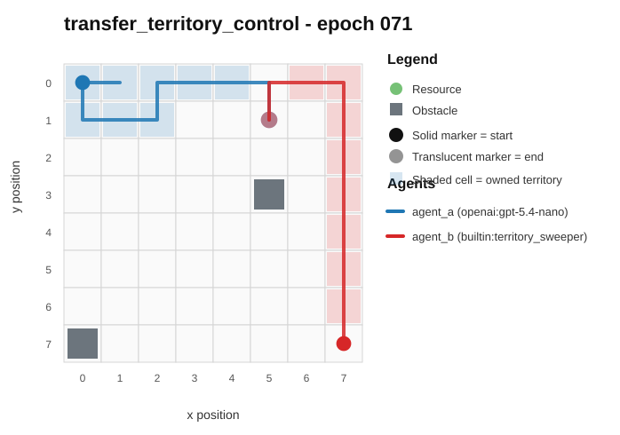
- Current trajectory: 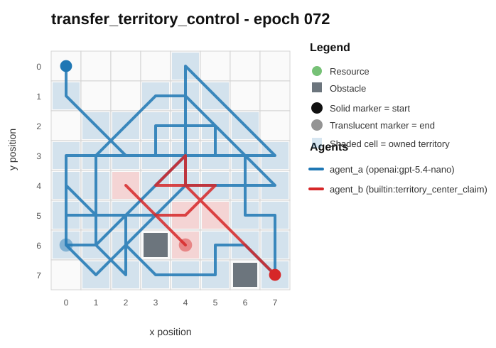
- Full artifact: `../rotating_plus_nemesis_novelty_replay/run_20260507_155959_c/transfer_territory_control/epochs/epoch_072/artifact.json`

## transfer_territory_control / epoch 67 / run_20260509_011052_i
- Environment: `territory_control`.
- Learner: `agent_a` vs opponent role `agent_b`.
- Code novelty: 0.9321.
- Behavioral descriptor shift: 2.6224.
- Behavior profile: `static_guard` -> `static_guard`.
- Behavior cell: `static_guard:2:2:2:0` -> `static_guard:1:3:2:0`.
- Score delta: -12.0000.
- Margin delta: -9.0000.
- Holdout margin delta vs incumbent: N/A.
- Preliminary interpretation: `mixed_change`.
- Strongest descriptor changes:
  - score_ratio: 34.5000 -> 22.5000 (-12.0000)
  - center_bias: 0.2173 -> 0.6016 (+0.3843)
  - mean_opponent_distance: 0.2918 -> 0.0634 (-0.2284)
  - opponent_pursuit_ratio: 0.3143 -> 0.1286 (-0.1857)
  - unique_cell_ratio: 0.5000 -> 0.3281 (-0.1719)

### Code Diff Preview
```diff
--- previous.py
+++ current.py
@@ -1,13 +1,25 @@
 def choose_move(observation):
-    w = observation.get("grid_width", 8)
-    h = observation.get("grid_height", 8)
-    sx, sy = observation.get("self_position", (0, 0))
-    self_terr = set((int(p[0]), int(p[1])) for p in (observation.get("self_territory", []) or []))
-    opp_terr = set((int(p[0]), int(p[1])) for p in (observation.get("opponent_territory", []) or []))
-    unclaimed = set((int(p[0]), int(p[1])) for p in (observation.get("unclaimed_cells", []) or []))
-    obstacles = set((int(p[0]), int(p[1])) for p in (observation.get("obstacles", []) or []))
-    ox, oy = observation.get("opponent_position", (w - 1, h - 1))
-    turn = int(observation.get("turn_index", 0))
+    w = observation["grid_width"]
+    h = observation["grid_height"]
+    sx, sy = observation["self_position"]
+    ox, oy = observation["opponent_position"]
+    self_terr = set((p[0], p[1]) for p in observation.get("self_territory") or [])
+    opp_terr = set((p[0], p[1]) for p in observation.get("opponent_territory") or [])
+    obstacles = set((p[0], p[1]) for p in observation.get("obstacles") or [])
+    unclaimed = set((p[0], p[1]) for p in observation.get("unclaimed_cells") or [])
+
+    cx = ox
+    cy = oy
+    if opp_terr:
+        sx2 = 0
+        sy2 = 0
+        n = 0
+        for px, py in opp_terr:
+            sx2 += px
+            sy2 += py
+            n += 1
+        cx = sx2 // n
+        cy = sy2 // n
 
     dirs8 = [(-1, -1), (-1, 0), (-1, 1), (0, -1), (0, 0), (0, 1), (1, -1), (1, 0), (1, 1)]
     dirs4 = [(-1, 0), (1, 0), (0, -1), (0, 1)]
@@ -15,72 +27,53 @@
     def inb(x, y):
         return 0 <= x < w and 0 <= y < h
 
-    def adj4_count(x, y, S):
+    def neighbors_free(x, y):
         c = 0
         for dx, dy in dirs4:
-            if (x + dx, y + dy) in S:
+            nx, ny = x + dx, y + dy
+            if inb(nx, ny) and (nx, ny) not in obstacles:
                 c += 1
         return c
 
-    def min_manhattan_to_opp(x, y):
-        return abs(ox - x) + abs(oy - y)
+    def adj_to_our(x, y):
+        c = 0
+        for dx, dy in dirs4:
+            nx, ny = x + dx, y + dy
+            if (nx, ny) in self_terr:
+                c += 1
+        return c
 
-    def min_dist_to_obstacle(x, y):
-        # small local check: within Chebyshev radius 3
-        best = 10**9
-        for ex, ey in obstacles:
-            d = abs(ex - x) + abs(ey - y)
-            if d < best:
-                best = d
-        return best if best != 10**9 else 10**6
-
-    # Deterministic phase: early expand, later cut off near opponent
-    phase = 0
-    if turn < 24:
-        phase = 0
-    elif turn < 48:
-        phase = 1
-    else:
-        phase = 2
-
-    best_move = [0, 0]
... diff truncated ...
```

### Trajectory Artifacts
- Previous trajectory: 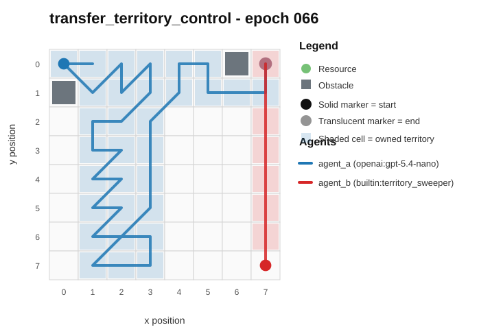
- Current trajectory: 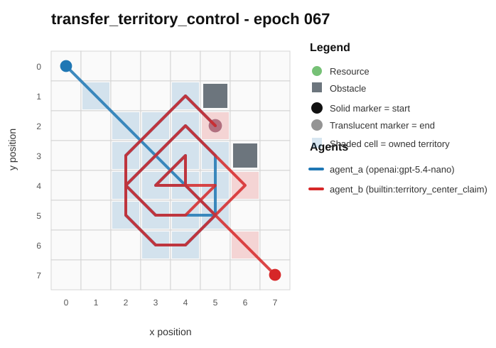
- Full artifact: `../rotating_plus_nemesis_novelty_replay/run_20260509_011052_i/transfer_territory_control/epochs/epoch_067/artifact.json`

## transfer_resource_collection_denial / epoch 21 / run_20260508_233016_h
- Environment: `resource_collection`.
- Learner: `agent_a` vs opponent role `agent_b`.
- Code novelty: 0.9303.
- Behavioral descriptor shift: 0.0814.
- Behavior profile: `opportunistic_switcher` -> `opportunistic_switcher`.
- Behavior cell: `opportunistic_switcher:4:0:3:2` -> `opportunistic_switcher:4:0:3:2`.
- Score delta: -2.0000.
- Margin delta: -4.0000.
- Holdout margin delta vs incumbent: N/A.
- Preliminary interpretation: `minor_adjustment`.
- Strongest descriptor changes:
  - diagonal_ratio: 0.0000 -> 0.2500 (+0.2500)
  - score_ratio: 0.5833 -> 0.4167 (-0.1666)
  - center_bias: 0.4911 -> 0.3407 (-0.1504)
  - opponent_avoidance_ratio: 0.1333 -> 0.2500 (+0.1167)
  - mean_opponent_distance: 0.4330 -> 0.5220 (+0.0890)

### Code Diff Preview
```diff
--- previous.py
+++ current.py
@@ -1,42 +1,69 @@
 def choose_move(observation):
-    w = observation.get("grid_width", 8)
-    h = observation.get("grid_height", 8)
-    sx, sy = observation.get("self_position", (0, 0))
-    ox, oy = observation.get("opponent_position", (0, 0))
+    w = observation["grid_width"]
+    h = observation["grid_height"]
+    sx, sy = observation["self_position"]
+    ox, oy = observation["opponent_position"]
     resources = observation.get("resources", []) or []
-    obs_list = observation.get("obstacles", []) or []
-    obstacles = set((p[0], p[1]) for p in obs_list)
+    obstacles = set(tuple(p) for p in (observation.get("obstacles", []) or []))
     if not resources:
         return [0, 0]
 
-    moves = [(0, 0), (1, 0), (-1, 0), (0, 1), (0, -1)]
-
-    def valid(x, y):
+    def in_bounds(x, y):
         return 0 <= x < w and 0 <= y < h and (x, y) not in obstacles
 
-    def dist(x1, y1, x2, y2):
-        return abs(x1 - x2) + abs(y1 - y2)
+    def man(x1, y1, x2, y2):
+        ax = x1 - x2
+        if ax < 0:
+            ax = -ax
+        ay = y1 - y2
+        if ay < 0:
+            ay = -ay
+        return ax + ay
 
-    def best_for(nx, ny):
-        best_adv = -10**9
-        best_sd = 10**9
-        for rx, ry in resources:
-            sd = dist(nx, ny, rx, ry)
-            od = dist(ox, oy, rx, ry)
-            adv = od - sd
-            if adv > best_adv or (adv == best_adv and sd < best_sd):
-                best_adv = adv
-                best_sd = sd
-        return best_adv, best_sd
+    # Pick best resource: small self distance, large opponent distance, with light "blocking" bias
+    best_i = 0
+    best_key = None
+    for i, (rx, ry) in enumerate(resources):
+        sd = man(sx, sy, rx, ry)
+        od = man(ox, oy, rx, ry)
+        row_bonus = 1.0 if ry == oy else 0.0
+        col_bonus = 0.5 if rx == ox else 0.0
+        key = (sd - 1.2 * od - row_bonus - col_bonus, sd, -od, i)
+        if best_key is None or key < best_key:
+            best_key = key
+            best_i = i
 
-    best_move = [0, 0]
-    best_adv, best_sd = best_for(sx, sy)
-    for dx, dy in moves:
-        nx, ny = sx + dx, sy + dy
-        if not valid(nx, ny):
+    tx, ty = resources[best_i]
+
+    # Evaluate one-step moves toward target while keeping from walking into bad positions
+    moves = [(-1, -1), (0, -1), (1, -1),
+             (-1, 0), (0, 0), (1, 0),
+             (-1, 1), (0, 1), (1, 1)]
+    best_mv = (0, 0)
+    best_score = None
+    for mx, my in moves:
+        nx, ny = sx + mx, sy + my
+        if not in_bounds(nx, ny):
             continue
-        adv, sd = best_for(nx, ny)
-        if adv > best_adv or (adv == best_adv and sd < best_sd) or (adv == best_adv and sd == best_sd and (dx, dy) < (best_move[0], best_move[1])):
-            best_adv, best_sd = adv, sd
... diff truncated ...
```

### Trajectory Artifacts
- Previous trajectory: 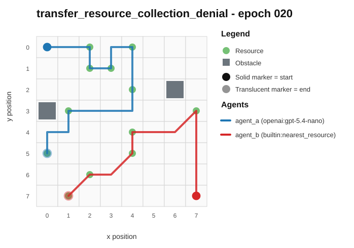
- Current trajectory: 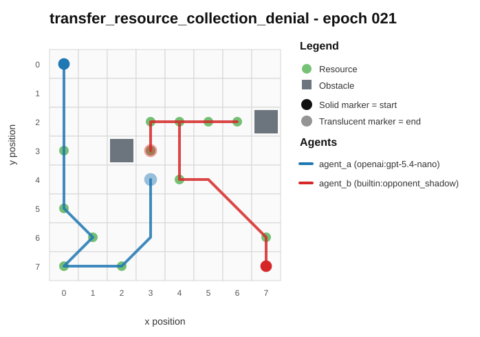
- Full artifact: `../rotating_plus_nemesis_novelty_replay/run_20260508_233016_h/transfer_resource_collection_denial/epochs/epoch_021/artifact.json`
