# Novelty Spike Review

This packet is intended for manual validation of the strongest code-novelty spikes.
Each case connects code change, behavioral descriptor change, trajectory change, and score / holdout effect.

## transfer_territory_control / epoch 49 / run_20260510_005204_d
- Environment: `territory_control`.
- Learner: `agent_a` vs opponent role `agent_b`.
- Code novelty: 0.9503.
- Behavioral descriptor shift: 0.766.
- Behavior profile: `static_guard` -> `static_guard`.
- Behavior cell: `static_guard:1:3:2:0` -> `static_guard:1:3:2:0`.
- Score delta: -3.5000.
- Margin delta: -7.5000.
- Holdout margin delta vs incumbent: N/A.
- Preliminary interpretation: `mixed_change`.
- Strongest descriptor changes:
  - score_ratio: 29.5000 -> 26.0000 (-3.5000)
  - center_bias: 0.3078 -> 0.4588 (+0.1510)
  - opponent_avoidance_ratio: 0.0000 -> 0.1000 (+0.1000)
  - mean_opponent_distance: 0.0714 -> 0.1590 (+0.0876)
  - move_direction_entropy: 0.6732 -> 0.5867 (-0.0865)

### Code Diff Preview
```diff
--- previous.py
+++ current.py
@@ -1,58 +1,73 @@
 def choose_move(observation):
-    w = int(observation.get("grid_width", 0))
-    h = int(observation.get("grid_height", 0))
-    sx, sy = observation.get("self_position", (0, 0))
-    ox, oy = observation.get("opponent_position", (0, 0))
-    sx, sy, ox, oy = int(sx), int(sy), int(ox), int(oy)
+    w = int(observation["grid_width"])
+    h = int(observation["grid_height"])
+    sx, sy = int(observation["self_position"][0]), int(observation["self_position"][1])
 
     obstacles = set()
     for p in (observation.get("obstacles") or []):
         if p and len(p) >= 2:
             obstacles.add((int(p[0]), int(p[1])))
 
-    resources = []
-    for p in (observation.get("resources") or []):
+    self_terr = set()
+    for p in (observation.get("self_territory") or []):
         if p and len(p) >= 2:
-            resources.append((int(p[0]), int(p[1])))
+            self_terr.add((int(p[0]), int(p[1])))
 
-    last = None
-    sp = observation.get("self_path") or []
-    if sp and isinstance(sp, list):
-        q = sp[-1]
-        if q and len(q) >= 2:
-            last = (int(q[0]), int(q[1]))
+    opp_terr = set()
+    for p in (observation.get("opponent_territory") or []):
+        if p and len(p) >= 2:
+            opp_terr.add((int(p[0]), int(p[1])))
+
+    unclaimed = set()
+    for p in (observation.get("unclaimed_cells") or []):
+        if p and len(p) >= 2:
+            unclaimed.add((int(p[0]), int(p[1])))
+
+    cx, cy = (w - 1) / 2.0, (h - 1) / 2.0
 
     moves = [(-1, 0), (0, -1), (0, 0), (1, 0), (0, 1), (-1, -1), (-1, 1), (1, -1), (1, 1)]
 
     def inb(x, y):
         return 0 <= x < w and 0 <= y < h and (x, y) not in obstacles
 
-    def dist2(a, b):
-        dx = a[0] - b[0]
-        dy = a[1] - b[1]
-        return dx * dx + dy * dy
+    def adj_unclaimed_count(x, y):
+        c = 0
+        for dx, dy in moves:
+            nx, ny = x + dx, y + dy
+            if inb(nx, ny) and (nx, ny) in unclaimed:
+                c += 1
+        return c
 
-    best = None
-    best_score = None
+    def adj_opp_count(x, y):
+        c = 0
+        for dx, dy in moves:
+            nx, ny = x + dx, y + dy
+            if inb(nx, ny) and (nx, ny) in opp_terr:
+                c += 1
+        return c
 
+    def score(nx, ny):
+        s = 0.0
+        s += 0.75 * (-(abs(nx - cx) + abs(ny - cy)))  # drift toward center (denser territory)
+        if (nx, ny) in unclaimed:
+            s += 6.0 + 1.2 * adj_unclaimed_count(nx, ny)
+            s += 0.8 * adj_opp_count(nx, ny)  # contention creates momentum against sweeper
+        if (nx, ny) in opp_terr:
+            s += 10.0 + 0.9 * adj_unclaimed_count(nx, ny) + 0.5 * adj_opp_count(nx, ny)
+        if (nx, ny) in self_terr:
... diff truncated ...
```

### Trajectory Artifacts
- Previous trajectory: 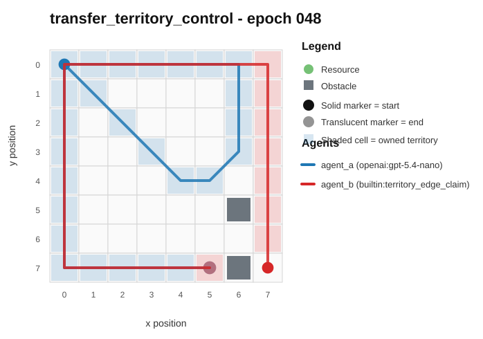
- Current trajectory: 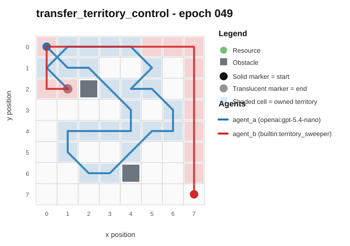
- Full artifact: `../rotating_plus_replay_aware_selection/run_20260510_005204_d/transfer_territory_control/epochs/epoch_049/artifact.json`

## transfer_pursuit_evasion / epoch 15 / run_20260510_043943_i
- Environment: `pursuit_evasion`.
- Learner: `agent_a` vs opponent role `agent_b`.
- Code novelty: 0.9479.
- Behavioral descriptor shift: 0.399.
- Behavior profile: `balanced` -> `static_guard`.
- Behavior cell: `balanced:1:4:2:0` -> `static_guard:0:4:2:0`.
- Score delta: +0.0000.
- Margin delta: +0.0000.
- Holdout margin delta vs incumbent: N/A.
- Preliminary interpretation: `mixed_change`.
- Strongest descriptor changes:
  - stay_ratio: 0.0000 -> 1.0000 (+1.0000)
  - move_direction_entropy: 0.9088 -> 0.0000 (-0.9088)
  - mean_opponent_distance: 0.1276 -> 1.0000 (+0.8724)
  - center_bias: 0.7916 -> 0.0000 (-0.7916)
  - unique_cell_ratio: 0.2031 -> 0.0156 (-0.1875)

### Code Diff Preview
```diff
--- previous.py
+++ current.py
@@ -1,73 +1,57 @@
 def choose_move(observation):
-    w = int(observation.get("grid_width", 8) or 8)
-    h = int(observation.get("grid_height", 8) or 8)
-    sx, sy = observation.get("self_position", [0, 0])
-    ox, oy = observation.get("opponent_position", [0, 0])
+    w = observation.get("grid_width", 8)
+    h = observation.get("grid_height", 8)
+    sx, sy = observation.get("self_position", (0, 0))
+    ox, oy = observation.get("opponent_position", (0, 0))
     self_role = observation.get("self_role", "pursuer")
     obstacles = set()
     for p in observation.get("obstacles", []) or []:
-        if isinstance(p, (list, tuple)) and len(p) == 2:
-            x, y = p[0], p[1]
-            if isinstance(x, int) and isinstance(y, int):
-                obstacles.add((x, y))
+        if isinstance(p, (list, tuple)) and len(p) == 2 and isinstance(p[0], int) and isinstance(p[1], int):
+            obstacles.add((p[0], p[1]))
 
     moves = [(-1, -1), (-1, 0), (-1, 1), (0, -1), (0, 0), (0, 1), (1, -1), (1, 0), (1, 1)]
+
+    def inb(x, y):
+        return 0 <= x < w and 0 <= y < h and (x, y) not in obstacles
 
     def dist2(x1, y1, x2, y2):
         dx = x1 - x2
         dy = y1 - y2
         return dx * dx + dy * dy
 
-    def min_obs_dist2(x, y):
-        best = 10**18
-        for (bx, by) in obstacles:
-            d = dist2(x, y, bx, by)
-            if d < best:
-                best = d
-        return best if best != 10**18 else 10000
+    corners = [(0, 0), (0, h - 1), (w - 1, 0), (w - 1, h - 1)]
+    if self_role == "evader":
+        target_corner = max(corners, key=lambda c: dist2(c[0], c[1], ox, oy))
+    else:
+        target_corner = min(corners, key=lambda c: dist2(c[0], c[1], ox, oy))
 
-    def valid(x, y):
-        return 0 <= x < w and 0 <= y < h and (x, y) not in obstacles
+    best = (0, 0)
+    best_score = None
 
-    target_resources = observation.get("resources", []) or []
-    resources = []
-    for r in target_resources:
-        if isinstance(r, (list, tuple)) and len(r) >= 2:
-            rx, ry = r[0], r[1]
-            if isinstance(rx, int) and isinstance(ry, int):
-                resources.append((rx, ry))
-    has_res = len(resources) > 0
-
-    best = None
-    bestv = None
     for dx, dy in moves:
         nx, ny = sx + dx, sy + dy
-        if not valid(nx, ny):
+        if not inb(nx, ny):
             continue
 
-        opp_d = dist2(nx, ny, ox, oy)
+        opp_d2 = dist2(nx, ny, ox, oy)
 
-        if self_role == "pursuer":
-            # Go toward opponent; prefer tighter approach when resources exist (to avoid passive blocking).
-            score = -opp_d
-            if has_res:
-                rbest = min(dist2(nx, ny, rx, ry) for (rx, ry) in resources)
-                score += 0.01 * (-rbest)
-            # Avoid stepping near obstacles when possible (prevents wall-running traps).
-            score += 0.001 * (min_obs_dist2(nx, ny))
+        if self_role == "evader":
+            corner_d2 = dist2(nx, ny, target_corner[0], target_corner[1])
... diff truncated ...
```

### Trajectory Artifacts
- Previous trajectory: 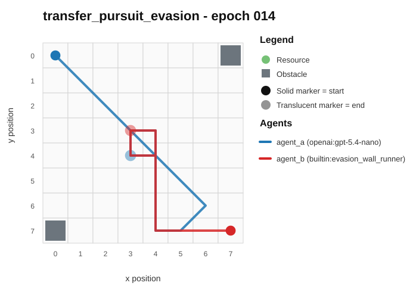
- Current trajectory: 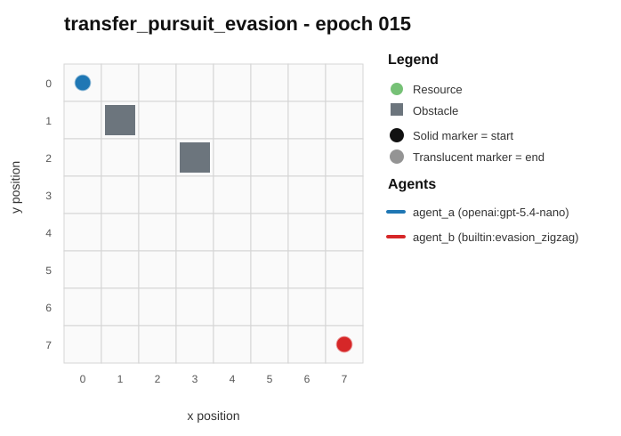
- Full artifact: `../rotating_plus_replay_aware_selection/run_20260510_043943_i/transfer_pursuit_evasion/epochs/epoch_015/artifact.json`

## transfer_territory_control / epoch 78 / run_20260509_231935_b
- Environment: `territory_control`.
- Learner: `agent_a` vs opponent role `agent_b`.
- Code novelty: 0.9437.
- Behavioral descriptor shift: 6.8797.
- Behavior profile: `balanced` -> `static_guard`.
- Behavior cell: `balanced:0:4:2:0` -> `static_guard:2:2:2:0`.
- Score delta: +31.5000.
- Margin delta: +38.5000.
- Holdout margin delta vs incumbent: N/A.
- Preliminary interpretation: `candidate_behavioral_innovation`.
- Strongest descriptor changes:
  - score_ratio: 8.0000 -> 39.5000 (+31.5000)
  - territory_contest_ratio: 0.8857 -> 0.3857 (-0.5000)
  - territory_claim_ratio: 0.1143 -> 0.6143 (+0.5000)
  - path_overlap_ratio: 0.8732 -> 0.3803 (-0.4929)
  - diagonal_ratio: 0.0000 -> 0.4571 (+0.4571)

### Code Diff Preview
```diff
--- previous.py
+++ current.py
@@ -1,70 +1,60 @@
 def choose_move(observation):
-    w = int(observation.get("grid_width", 0) or 0)
-    h = int(observation.get("grid_height", 0) or 0)
-    sx, sy = observation.get("self_position", (0, 0))
-    ox, oy = observation.get("opponent_position", (0, 0))
-    sx, sy, ox, oy = int(sx), int(sy), int(ox), int(oy)
+    w = int(observation["grid_width"])
+    h = int(observation["grid_height"])
+    sx, sy = observation["self_position"]
+    ox, oy = observation["opponent_position"]
+    obstacles = observation.get("obstacles") or []
+    obs = set((int(p[0]), int(p[1])) for p in obstacles if isinstance(p, (list, tuple)) and len(p) == 2)
 
     def inside(x, y):
         return 0 <= x < w and 0 <= y < h
 
-    dirs = [(-1, 0), (0, -1), (1, 0), (0, 1), (-1, -1), (1, -1), (-1, 1), (1, 1), (0, 0)]
+    def man(ax, ay, bx, by):
+        d = ax - bx
+        if d < 0:
+            d = -d
+        e = ay - by
+        if e < 0:
+            e = -e
+        return d + e
 
-    obstacles = set()
-    for p in (observation.get("obstacles") or []):
-        if isinstance(p, (list, tuple)) and len(p) == 2:
-            x, y = int(p[0]), int(p[1])
-            if inside(x, y):
-                obstacles.add((x, y))
+    unclaimed = observation.get("unclaimed_cells") or []
+    unq = set((int(p[0]), int(p[1])) for p in unclaimed if isinstance(p, (list, tuple)) and len(p) == 2)
 
-    candidates = []
-    res = observation.get("resources") or []
-    for p in res:
-        if isinstance(p, (list, tuple)) and len(p) == 2:
-            x, y = int(p[0]), int(p[1])
-            if inside(x, y) and (x, y) not in obstacles:
-                candidates.append((x, y))
-    if not candidates:
-        un = observation.get("unclaimed_cells") or []
-        for p in un:
-            if isinstance(p, (list, tuple)) and len(p) == 2:
-                x, y = int(p[0]), int(p[1])
-                if inside(x, y) and (x, y) not in obstacles:
-                    candidates.append((x, y))
-    if not candidates:
-        candidates = [(ox, oy), (sx, sy)]
+    self_t = observation.get("self_territory") or []
+    opp_t = observation.get("opponent_territory") or []
+    st = set((int(p[0]), int(p[1])) for p in self_t if isinstance(p, (list, tuple)) and len(p) == 2)
+    ot = set((int(p[0]), int(p[1])) for p in opp_t if isinstance(p, (list, tuple)) and len(p) == 2)
 
-    def mdist(x1, y1, x2, y2):
-        dx = x1 - x2
-        if dx < 0:
-            dx = -dx
-        dy = y1 - y2
-        if dy < 0:
-            dy = -dy
-        return dx + dy
+    cx = (w - 1) // 2
+    cy = (h - 1) // 2
 
-    target = None
-    bestd = None
-    for tx, ty in candidates:
-        d = mdist(sx, sy, tx, ty)
-        if bestd is None or d < bestd:
-            bestd = d
-            target = (tx, ty)
-
-    tx, ty = target
-
... diff truncated ...
```

### Trajectory Artifacts
- Previous trajectory: 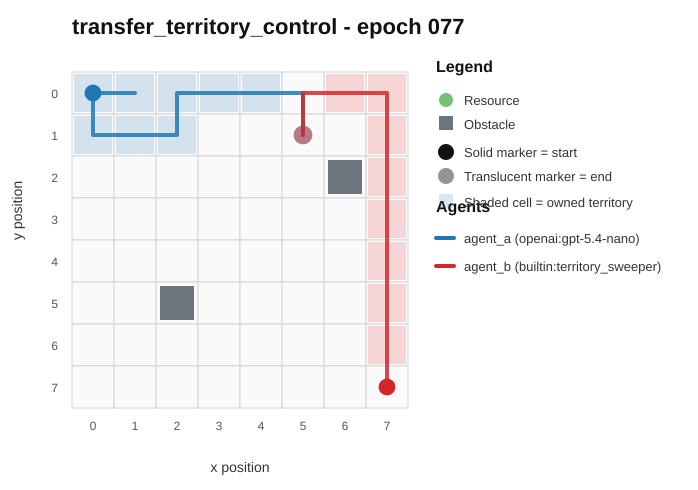
- Current trajectory: 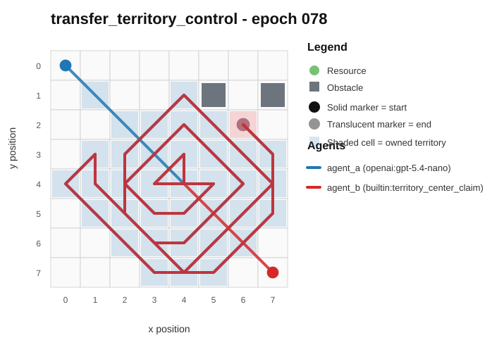
- Full artifact: `../rotating_plus_replay_aware_selection/run_20260509_231935_b/transfer_territory_control/epochs/epoch_078/artifact.json`

## transfer_pursuit_evasion / epoch 23 / run_20260510_035354_h
- Environment: `pursuit_evasion`.
- Learner: `agent_a` vs opponent role `agent_b`.
- Code novelty: 0.9403.
- Behavioral descriptor shift: 0.2137.
- Behavior profile: `balanced` -> `balanced`.
- Behavior cell: `balanced:0:4:2:0` -> `balanced:0:4:2:0`.
- Score delta: +0.0000.
- Margin delta: +0.0000.
- Holdout margin delta vs incumbent: N/A.
- Preliminary interpretation: `mixed_change`.
- Strongest descriptor changes:
  - diagonal_ratio: 0.1000 -> 0.9833 (+0.8833)
  - center_bias: 0.6487 -> 0.3021 (-0.3466)
  - move_direction_entropy: 0.6821 -> 0.8876 (+0.2055)
  - mean_opponent_distance: 0.3173 -> 0.1897 (-0.1276)
  - opponent_pursuit_ratio: 0.1000 -> 0.1167 (+0.0167)

### Code Diff Preview
```diff
--- previous.py
+++ current.py
@@ -1,84 +1,80 @@
 def choose_move(observation):
-    w = int(observation.get("grid_width", 8))
-    h = int(observation.get("grid_height", 8))
+    w = int(observation["grid_width"])
+    h = int(observation["grid_height"])
     sx, sy = observation["self_position"]
     ox, oy = observation["opponent_position"]
-    obs_list = observation.get("obstacles", []) or []
-    obs = set((int(p[0]), int(p[1])) for p in obs_list)
+    obs = set((int(p[0]), int(p[1])) for p in (observation.get("obstacles") or []))
 
-    moves = [(-1, -1), (-1, 0), (-1, 1),
-             (0, -1), (0, 0), (0, 1),
-             (1, -1), (1, 0), (1, 1)]
+    def role_is_purs(role):
+        r = (role or "").lower()
+        if "purs" in r:
+            return True
+        if "evad" in r:
+            return False
+        return None
+
+    sr = role_is_purs(observation.get("self_role"))
+    orr = role_is_purs(observation.get("opponent_role"))
+    if sr is None:
+        sr = (orr is False)
+    i_am_pursuer = bool(sr)
+
+    moves = [(-1, -1), (-1, 0), (-1, 1), (0, -1), (0, 0), (0, 1), (1, -1), (1, 0), (1, 1)]
 
     def in_bounds(x, y):
         return 0 <= x < w and 0 <= y < h and (x, y) not in obs
 
-    def d2(ax, ay, bx, by):
-        dx = ax - bx
-        dy = ay - by
+    def dist2(x, y, tx, ty):
+        dx = x - tx
+        dy = y - ty
         return dx * dx + dy * dy
 
-    def obstacle_near(x, y):
+    def obstacle_local_cost(x, y):
+        # Higher if surrounded; discourages moving near obstacles
         c = 0
-        for dx in (-1, 0, 1):
-            for dy in (-1, 0, 1):
-                nx, ny = x + dx, y + dy
-                if (nx, ny) in obs:
+        for ax in (-1, 0, 1):
+            for ay in (-1, 0, 1):
+                if ax == 0 and ay == 0:
+                    continue
+                if (x + ax, y + ay) in obs:
                     c += 1
         return c
 
-    def legal_moves_count(x, y):
-        cnt = 0
-        for dx, dy in moves:
-            nx, ny = x + dx, y + dy
-            if in_bounds(nx, ny):
-                cnt += 1
-        return cnt
+    def edge_cost(x, y):
+        # Discourage hugging walls a bit (helps vs zigzag drift)
+        return min(x, y, w - 1 - x, h - 1 - y)
 
-    i_to_purs = True
-    sr = (observation.get("self_role") or "").lower()
-    orr = (observation.get("opponent_role") or "").lower()
-    if ("evad" in sr) and ("purs" not in sr):
-        i_to_purs = False
-    if ("purs" in orr):
-        i_to_purs = False if "purs" in sr else i_to_purs
+    # Deterministic tie-break order: fixed move iteration
+    best_move = [0, 0]
... diff truncated ...
```

### Trajectory Artifacts
- Previous trajectory: 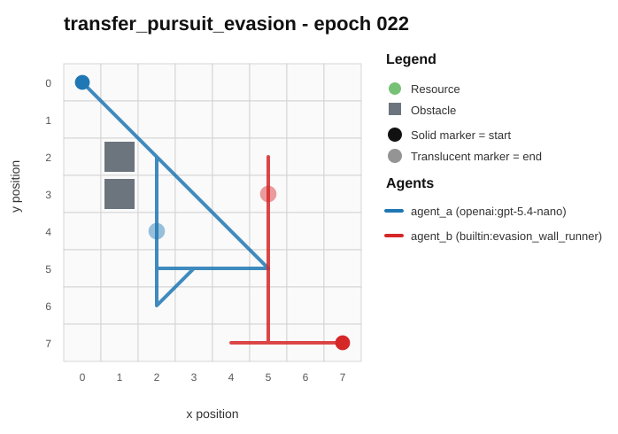
- Current trajectory: 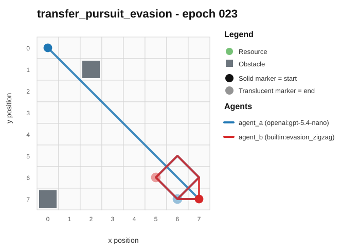
- Full artifact: `../rotating_plus_replay_aware_selection/run_20260510_035354_h/transfer_pursuit_evasion/epochs/epoch_023/artifact.json`

## transfer_territory_control / epoch 11 / run_20260510_052825_j
- Environment: `territory_control`.
- Learner: `agent_a` vs opponent role `agent_b`.
- Code novelty: 0.9392.
- Behavioral descriptor shift: 1.6915.
- Behavior profile: `static_guard` -> `claimer`.
- Behavior cell: `static_guard:0:4:2:0` -> `claimer:0:4:2:0`.
- Score delta: +7.5000.
- Margin delta: +29.0000.
- Holdout margin delta vs incumbent: N/A.
- Preliminary interpretation: `candidate_behavioral_innovation`.
- Strongest descriptor changes:
  - score_ratio: 2.0000 -> 9.5000 (+7.5000)
  - stay_ratio: 0.9714 -> 0.0000 (-0.9714)
  - territory_claim_ratio: 0.0286 -> 0.9857 (+0.9571)
  - diagonal_ratio: 0.0000 -> 0.9571 (+0.9571)
  - center_bias: 0.0020 -> 0.7344 (+0.7324)

### Code Diff Preview
```diff
--- previous.py
+++ current.py
@@ -1,20 +1,19 @@
 def choose_move(observation):
-    w = observation.get("grid_width", 0)
-    h = observation.get("grid_height", 0)
-    if w <= 0 or h <= 0:
-        return [0, 0]
-    x, y = observation.get("self_position", (0, 0))
+    w = observation["grid_width"]
+    h = observation["grid_height"]
+    x, y = observation["self_position"]
+    obstacles = set(tuple(p) for p in (observation.get("obstacles") or []))
+    unclaimed = set(tuple(p) for p in (observation.get("unclaimed_cells") or []))
+    selfT = set(tuple(p) for p in (observation.get("self_territory") or []))
+    oppT = set(tuple(p) for p in (observation.get("opponent_territory") or []))
     ox, oy = observation.get("opponent_position", (x, y))
-    obstacles = set(tuple(p) for p in (observation.get("obstacles") or []))
-    unclaimed = observation.get("unclaimed_cells") or observation.get("unclaimed") or []
-    unclaimed = [tuple(p) for p in unclaimed]
 
-    dirs = [(-1, 0), (1, 0), (0, -1), (0, 1), (-1, -1), (1, -1), (-1, 1), (1, 1), (0, 0)]
+    dirs = [(-1, -1), (0, -1), (1, -1), (-1, 0), (0, 0), (1, 0), (-1, 1), (0, 1), (1, 1)]
 
     def inb(nx, ny):
         return 0 <= nx < w and 0 <= ny < h and (nx, ny) not in obstacles
 
-    def dist(ax, ay, bx, by):
+    def md(ax, ay, bx, by):
         dx = ax - bx
         if dx < 0:
             dx = -dx
@@ -23,25 +22,68 @@
             dy = -dy
         return dx + dy
 
-    if unclaimed:
-        tx, ty = min(unclaimed, key=lambda p: (dist(x, y, p[0], p[1]), p[1], p[0]))
-    else:
-        tx, ty = ox, oy
+    opp_list = list(oppT)
+    self_list = list(selfT)
 
-    best = (10**18, 10**18)
-    best_move = (0, 0)
+    def min_dist_to(points, px, py):
+        best = 10**9
+        for a, b in points:
+            d = md(px, py, a, b)
+            if d < best:
+                best = d
+        return best if points else 10**9
+
+    best = [0, 0]
+    best_score = -10**18
+
     for dx, dy in dirs:
         nx, ny = x + dx, y + dy
         if not inb(nx, ny):
             continue
-        d = dist(nx, ny, tx, ty)
-        score = d + (0 if unclaimed else dist(nx, ny, ox, oy) // 2)
-        # Tie-break deterministically by direction order (dirs iteration) and then position.
-        if (score, ny, nx) < best:
-            best = (score, ny * w + nx)
-            best_move = (dx, dy)
 
-    dx, dy = best_move
-    if dx not in (-1, 0, 1) or dy not in (-1, 0, 1):
-        return [0, 0]
-    return [dx, dy]
+        score = 0.0
+        if (nx, ny) in oppT:
+            score += 30.0
+            # prefer cutting through where opponent has more neighboring territory
+            neigh_opp = 0
+            for ddx, ddy in dirs:
+                if ddx == 0 and ddy == 0:
+                    continue
+                ax, ay = nx + ddx, ny + ddy
... diff truncated ...
```

### Trajectory Artifacts
- Previous trajectory: 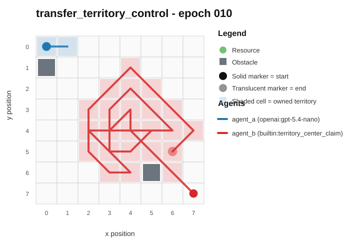
- Current trajectory: 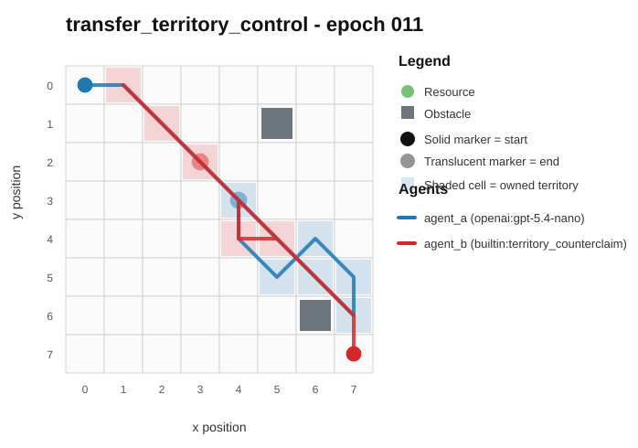
- Full artifact: `../rotating_plus_replay_aware_selection/run_20260510_052825_j/transfer_territory_control/epochs/epoch_011/artifact.json`

## transfer_territory_control / epoch 62 / run_20260510_005204_d
- Environment: `territory_control`.
- Learner: `agent_a` vs opponent role `agent_b`.
- Code novelty: 0.9348.
- Behavioral descriptor shift: 4.6964.
- Behavior profile: `balanced` -> `static_guard`.
- Behavior cell: `balanced:0:4:2:0` -> `static_guard:2:3:2:0`.
- Score delta: +21.5000.
- Margin delta: +22.5000.
- Holdout margin delta vs incumbent: N/A.
- Preliminary interpretation: `candidate_behavioral_innovation`.
- Strongest descriptor changes:
  - score_ratio: 8.0000 -> 29.5000 (+21.5000)
  - stay_ratio: 0.0000 -> 0.5857 (+0.5857)
  - diagonal_ratio: 0.0000 -> 0.3143 (+0.3143)
  - territory_contest_ratio: 0.8857 -> 0.6000 (-0.2857)
  - path_overlap_ratio: 0.8732 -> 0.5915 (-0.2817)

### Code Diff Preview
```diff
--- previous.py
+++ current.py
@@ -1,56 +1,65 @@
 def choose_move(observation):
-    w = int(observation.get("grid_width", 0))
-    h = int(observation.get("grid_height", 0))
-    sp = observation.get("self_position", (0, 0))
-    op = observation.get("opponent_position", (0, 0))
-    sx, sy = int(sp[0]), int(sp[1])
-    ox, oy = int(op[0]), int(op[1])
+    w = int(observation["grid_width"]); h = int(observation["grid_height"])
+    sx, sy = int(observation["self_position"][0]), int(observation["self_position"][1])
+    ox, oy = int(observation["opponent_position"][0]), int(observation["opponent_position"][1])
 
     obstacles = set()
     for p in (observation.get("obstacles") or []):
         if p and len(p) >= 2:
             obstacles.add((int(p[0]), int(p[1])))
 
-    def inb(x, y):
-        return 0 <= x < w and 0 <= y < h and (x, y) not in obstacles
+    unclaimed = []
+    for p in (observation.get("unclaimed_cells") or []):
+        if p and len(p) >= 2:
+            unclaimed.append((int(p[0]), int(p[1])))
 
+    opp_terr = []
+    for p in (observation.get("opponent_territory") or []):
+        if p and len(p) >= 2:
+            opp_terr.append((int(p[0]), int(p[1])))
+
+    def inb(x, y): return 0 <= x < w and 0 <= y < h and (x, y) not in obstacles
     moves = [(-1, -1), (0, -1), (1, -1), (-1, 0), (0, 0), (1, 0), (-1, 1), (0, 1), (1, 1)]
+    def md(x1, y1, x2, y2):
+        dx = x1 - x2; dy = y1 - y2
+        return (dx if dx >= 0 else -dx) + (dy if dy >= 0 else -dy)
 
-    def best_target():
-        for k in ("unclaimed_cells", "resources"):
-            cells = observation.get(k) or []
-            best = None
-            bestd = 10**9
-            for p in cells:
-                if not p or len(p) < 2:
-                    continue
-                x, y = int(p[0]), int(p[1])
-                if not inb(x, y):
-                    continue
-                d = abs(x - sx) + abs(y - sy)
-                if d < bestd:
-                    bestd = d
-                    best = (x, y)
-            if best is not None:
-                return best
-        return (ox, oy)
+    # Deterministically pick a small candidate set of targets
+    center = (w - 1) / 2.0, (h - 1) / 2.0
+    cand = []
+    if unclaimed:
+        # Prefer closer to center first, then deterministic by coordinates
+        unclaimed_sorted = sorted(unclaimed, key=lambda t: (abs(t[0] - center[0]) + abs(t[1] - center[1]), t[1], t[0]))
+        cand = unclaimed_sorted[:max(12, min(24, len(unclaimed_sorted)))]
+    else:
+        opp_sorted = sorted(opp_terr, key=lambda t: (md(sx, sy, t[0], t[1]), t[1], t[0]))
+        cand = opp_sorted[:min(12, len(opp_sorted))]
 
-    tx, ty = best_target()
-
-    best_move = (0, 0)
-    best_dist = 10**9
-    best_adv = -10**9
-
+    best = (1e18, 0, 0)
     for dx, dy in moves:
         nx, ny = sx + dx, sy + dy
         if not inb(nx, ny):
             continue
-        d = abs(nx - tx) + abs(ny - ty)
-        adv = (abs(ox - sy) + abs(oy - sx)) - (abs(ox - ny) + abs(oy - nx))
-        if d < best_dist or (d == best_dist and adv > best_adv) or (d == best_dist and adv == best_adv and (dx, dy) < best_move):
... diff truncated ...
```

### Trajectory Artifacts
- Previous trajectory: 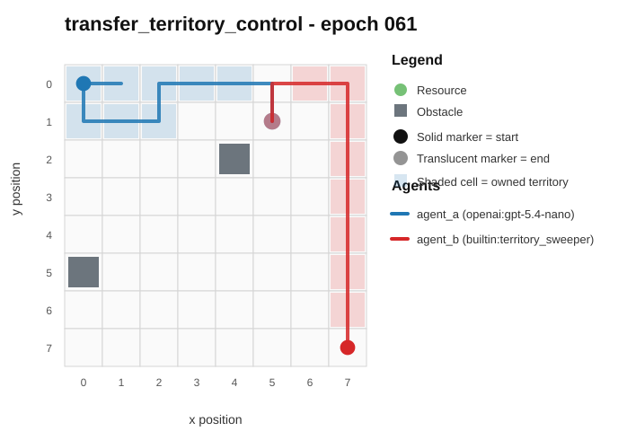
- Current trajectory: 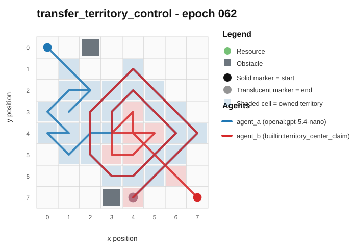
- Full artifact: `../rotating_plus_replay_aware_selection/run_20260510_005204_d/transfer_territory_control/epochs/epoch_062/artifact.json`

## transfer_territory_control / epoch 84 / run_20260509_231935_b
- Environment: `territory_control`.
- Learner: `agent_a` vs opponent role `agent_b`.
- Code novelty: 0.9329.
- Behavioral descriptor shift: 0.8219.
- Behavior profile: `static_guard` -> `static_guard`.
- Behavior cell: `static_guard:1:3:2:0` -> `static_guard:0:4:2:0`.
- Score delta: +3.5000.
- Margin delta: +19.0000.
- Holdout margin delta vs incumbent: N/A.
- Preliminary interpretation: `candidate_behavioral_innovation`.
- Strongest descriptor changes:
  - score_ratio: 4.5000 -> 8.0000 (+3.5000)
  - obstacle_hit_rate: 0.6571 -> 0.0000 (-0.6571)
  - center_bias: 0.6761 -> 0.0241 (-0.6520)
  - territory_contest_ratio: 0.5000 -> 0.0000 (-0.5000)
  - path_overlap_ratio: 0.4930 -> 0.0000 (-0.4930)

### Code Diff Preview
```diff
--- previous.py
+++ current.py
@@ -1,54 +1,64 @@
 def choose_move(observation):
-    w = int(observation.get("grid_width", 0))
-    h = int(observation.get("grid_height", 0))
-    sx, sy = observation.get("self_position", (0, 0))
-    ox, oy = observation.get("opponent_position", (0, 0))
-    try: sx = int(sx); sy = int(sy); ox = int(ox); oy = int(oy)
-    except: pass
-
+    w = int(observation["grid_width"])
+    h = int(observation["grid_height"])
+    sx, sy = observation["self_position"]
     obstacles = observation.get("obstacles") or []
     obs = set()
     for p in obstacles:
         if isinstance(p, (list, tuple)) and len(p) == 2:
             obs.add((int(p[0]), int(p[1])))
 
-    unclaimed = observation.get("unclaimed_cells") or []
-    unq = set()
-    for p in unclaimed:
-        if isinstance(p, (list, tuple)) and len(p) == 2:
-            unq.add((int(p[0]), int(p[1])))
-
-    resources = observation.get("resources") or []
-    res = set()
-    for p in resources:
-        if isinstance(p, (list, tuple)) and len(p) == 2:
-            res.add((int(p[0]), int(p[1])))
-
-    dirs = [(-1, -1), (0, -1), (1, -1), (-1, 0), (0, 0), (1, 0), (-1, 1), (0, 1), (1, 1)]
-
     def inside(x, y):
         return 0 <= x < w and 0 <= y < h
 
     def man(ax, ay, bx, by):
-        dx = ax - bx
-        if dx < 0: dx = -dx
-        dy = ay - by
-        if dy < 0: dy = -dy
-        return dx + dy
+        d = ax - bx
+        if d < 0: d = -d
+        e = ay - by
+        if e < 0: e = -e
+        return d + e
+
+    self_territory = observation.get("self_territory") or []
+    opp_terr = observation.get("opponent_territory") or []
+    unclaimed = observation.get("unclaimed_cells") or []
+    self_set = set((int(p[0]), int(p[1])) for p in self_territory if isinstance(p, (list, tuple)) and len(p) == 2)
+    opp_set = set((int(p[0]), int(p[1])) for p in opp_terr if isinstance(p, (list, tuple)) and len(p) == 2)
+    un_set = set((int(p[0]), int(p[1])) for p in unclaimed if isinstance(p, (list, tuple)) and len(p) == 2)
+    ox, oy = observation["opponent_position"]
+
+    dirs = [(-1, -1), (0, -1), (1, -1), (-1, 0), (0, 0), (1, 0), (-1, 1), (0, 1), (1, 1)]
+    neigh_dirs = dirs
+
+    def adj_to_self(x, y):
+        for dx, dy in neigh_dirs:
+            nx, ny = x + dx, y + dy
+            if (nx, ny) in self_set:
+                return 1
+        return 0
 
     best = None
-    best_score = -10**18
+    best_sc = None
     for dx, dy in dirs:
         nx, ny = sx + dx, sy + dy
         if not inside(nx, ny) or (nx, ny) in obs:
             continue
-        score = 0
-        if (nx, ny) in unq: score += 300
-        if (nx, ny) in res: score += 120
-        if (nx, ny) == (ox, oy): score -= 250
-        score += (w + h) - man(nx, ny, ox)  # prefer pushing toward opponent
-        score -= man(nx, ny, sx) * 2        # slight preference to move less
... diff truncated ...
```

### Trajectory Artifacts
- Previous trajectory: 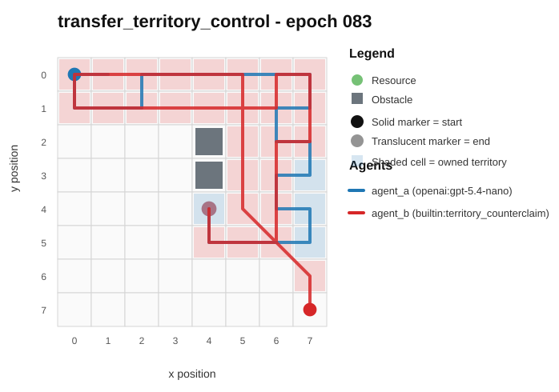
- Current trajectory: 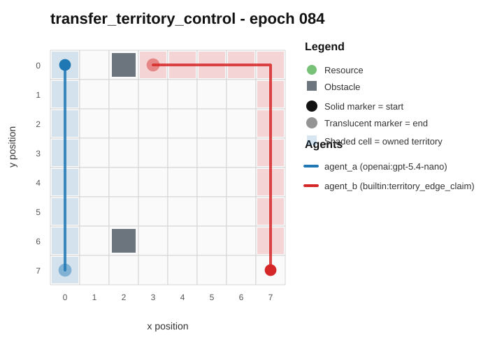
- Full artifact: `../rotating_plus_replay_aware_selection/run_20260509_231935_b/transfer_territory_control/epochs/epoch_084/artifact.json`

## transfer_resource_collection_denial / epoch 8 / run_20260510_052825_j
- Environment: `resource_collection`.
- Learner: `agent_a` vs opponent role `agent_b`.
- Code novelty: 0.9303.
- Behavioral descriptor shift: 0.4103.
- Behavior profile: `static_guard` -> `opportunistic_switcher`.
- Behavior cell: `static_guard:0:4:2:0` -> `opportunistic_switcher:4:0:3:2`.
- Score delta: -2.0000.
- Margin delta: -6.0000.
- Holdout margin delta vs incumbent: N/A.
- Preliminary interpretation: `mixed_change`.
- Strongest descriptor changes:
  - revisit_ratio: 0.8125 -> 0.0000 (-0.8125)
  - obstacle_hit_rate: 0.8125 -> 0.0000 (-0.8125)
  - exploration_ratio: 0.1875 -> 1.0000 (+0.8125)
  - stay_ratio: 0.8125 -> 0.0769 (-0.7356)
  - move_direction_entropy: 0.4093 -> 0.9479 (+0.5386)

### Code Diff Preview
```diff
--- previous.py
+++ current.py
@@ -1,55 +1,80 @@
 def choose_move(observation):
-    w = observation.get("grid_width", 8)
-    h = observation.get("grid_height", 8)
-    sx, sy = observation.get("self_position", [0, 0])
-    ox, oy = observation.get("opponent_position", [0, 0])
-    resources = observation.get("resources", []) or []
-    obstacles_list = observation.get("obstacles", []) or []
-    obstacles = set(tuple(p) for p in obstacles_list)
+    sx, sy = observation.get('self_position', [0, 0])
+    ox, oy = observation.get('opponent_position', [0, 0])
+    resources = observation.get('resources', []) or []
+    obstacles_list = observation.get('obstacles', []) or []
+    obstacles = set((p[0], p[1]) for p in obstacles_list)
+
+    w = observation.get('grid_width', 8)
+    h = observation.get('grid_height', 8)
 
     deltas = [(-1, -1), (-1, 0), (-1, 1), (0, -1), (0, 0), (0, 1), (1, -1), (1, 0), (1, 1)]
 
-    def cheb(ax, ay, bx, by):
-        dx = ax - bx
-        if dx < 0: dx = -dx
-        dy = ay - by
-        if dy < 0: dy = -dy
-        return dx if dx > dy else dy
-
-    def legal(nx, ny):
-        return 0 <= nx < w and 0 <= ny < h and (nx, ny) not in obstacles
+    def man(a, b, c, d):
+        v = a - c
+        if v < 0:
+            v = -v
+        u = b - d
+        if u < 0:
+            u = -u
+        return v + u
 
     if not resources:
         return [0, 0]
 
-    # Target: resource with smallest (self distance, then who is closer)
-    best = None
-    for rx, ry in resources:
-        if (rx, ry) in obstacles:
-            continue
-        ds = cheb(sx, sy, rx, ry)
-        do = cheb(ox, oy, rx, ry)
-        key = (ds, do, rx, ry)
-        if best is None or key < best[0]:
-            best = (key, (rx, ry))
-    if best is None:
-        return [0, 0]
-    tx, ty = best[1]
+    def clamp(v, lo, hi):
+        if v < lo:
+            return lo
+        if v > hi:
+            return hi
+        return v
 
-    best_move = None
-    best_key = None
+    best = (-10**18, 0, 0)
     for dx, dy in deltas:
         nx, ny = sx + dx, sy + dy
-        if not legal(nx, ny):
+        if nx < 0 or nx >= w or ny < 0 or ny >= h:
             continue
-        ns = cheb(nx, ny, tx, ty)
-        no = cheb(nx, ny, ox, oy)
-        nx2, ny2 = ox - (tx - rx if False else 0), oy - (ty - ry if False else 0), 0  # no-op
-        key = (ns, -no, nx, ny, dx, dy)
-        if best_key is None or key < best_key:
-            best_key = key
-            best_move = (dx, dy)
+        if (nx, ny) in obstacles:
+            # engine will reject/keep, but we still treat it as worst to avoid it
... diff truncated ...
```

### Trajectory Artifacts
- Previous trajectory: 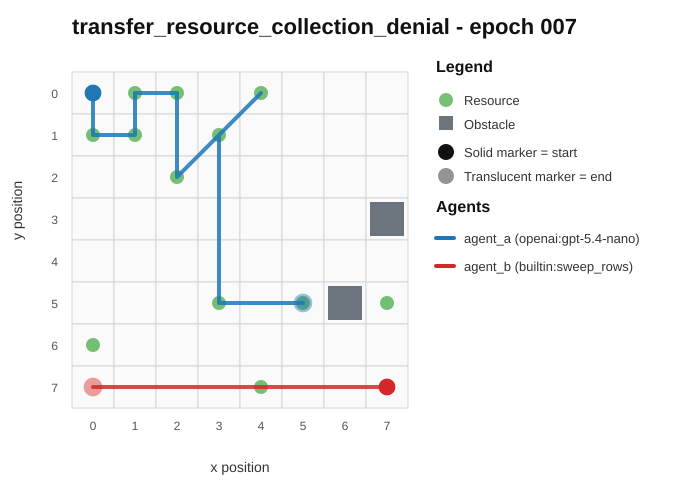
- Current trajectory: 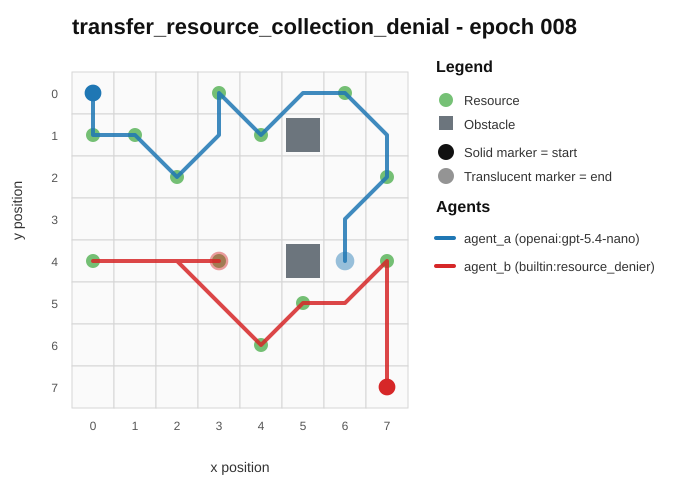
- Full artifact: `../rotating_plus_replay_aware_selection/run_20260510_052825_j/transfer_resource_collection_denial/epochs/epoch_008/artifact.json`

## transfer_pursuit_evasion / epoch 14 / run_20260510_000504_c
- Environment: `pursuit_evasion`.
- Learner: `agent_a` vs opponent role `agent_b`.
- Code novelty: 0.9299.
- Behavioral descriptor shift: 0.2398.
- Behavior profile: `static_guard` -> `balanced`.
- Behavior cell: `static_guard:0:4:2:0` -> `balanced:1:4:2:0`.
- Score delta: +0.0000.
- Margin delta: +0.0000.
- Holdout margin delta vs incumbent: N/A.
- Preliminary interpretation: `mixed_change`.
- Strongest descriptor changes:
  - stay_ratio: 0.9167 -> 0.0000 (-0.9167)
  - move_direction_entropy: 0.4138 -> 0.9088 (+0.4950)
  - center_bias: 0.5667 -> 0.7916 (+0.2249)
  - mean_opponent_distance: 0.3208 -> 0.1276 (-0.1932)
  - unique_cell_ratio: 0.0938 -> 0.2031 (+0.1093)

### Code Diff Preview
```diff
--- previous.py
+++ current.py
@@ -1,64 +1,58 @@
 def choose_move(observation):
-    w = int(observation.get("grid_width", 8))
-    h = int(observation.get("grid_height", 8))
+    w = int(observation["grid_width"])
+    h = int(observation["grid_height"])
     sx, sy = observation["self_position"]
     ox, oy = observation["opponent_position"]
     obstacles = set(tuple(p) for p in (observation.get("obstacles", []) or []))
-    self_role = (observation.get("self_role", "") or "").lower()
-    evader = ("evader" in self_role) or ("runner" in self_role) or ("flee" in self_role)
 
-    moves = [(0,0),(1,0),(-1,0),(0,1),(0,-1),(1,1),(1,-1),(-1,1),(-1,-1)]
+    moves = [(0, 0), (1, 0), (-1, 0), (0, 1), (0, -1), (1, 1), (1, -1), (-1, 1), (-1, -1)]
 
     def valid(x, y):
         return 0 <= x < w and 0 <= y < h and (x, y) not in obstacles
-
-    def dist(x, y):
-        # Chebyshev is good for diagonal pursuit/escape
-        return max(abs(x - ox), abs(y - oy))
 
     def mobility(x, y):
         m = 0
         for dx, dy in moves:
             if dx == 0 and dy == 0:
                 continue
-            nx, ny = x + dx, y + dy
-            if valid(nx, ny):
+            if valid(x + dx, y + dy):
                 m += 1
         return m
 
-    best = None
-    best_key = None
+    def near_obs(x, y):
+        # lower is better for pursuer (avoid clutter), higher is better for evader (prefer open)
+        d = 10
+        for oxp, oyp in obstacles:
+            dd = abs(x - oxp) + abs(y - oyp)
+            if dd < d:
+                d = dd
+        return d if obstacles else 9
 
-    # For evader: head to the farthest corner from pursuer (deterministic)
-    if evader:
-        far_corner = None
-        for cx, cy in [(0,0),(0,h-1),(w-1,0),(w-1,h-1)]:
-            d = max(abs(cx - ox), abs(cy - oy))
-            if far_corner is None or d > far_corner[0]:
-                far_corner = (d, cx, cy)
-        tx, ty = far_corner[1], far_corner[2]
+    self_role = (observation.get("self_role", "") or "").lower()
+    opp_role = (observation.get("opponent_role", "") or "").lower()
+    pursuer_self = ("purs" in self_role) or ("hunter" in self_role) or ("chaser" in self_role) or ("pursuer" in self_role)
+    pursuer_opp = ("purs" in opp_role) or ("hunter" in opp_role) or ("chaser" in opp_role) or ("pursuer" in opp_role)
+    pursue = pursuer_self or (not pursuer_opp)
+
+    best_dxdy = [0, 0]
+    best_score = -10**18
 
     for dx, dy in moves:
         nx, ny = sx + dx, sy + dy
         if not valid(nx, ny):
             continue
-        d = dist(nx, ny)
+        dist = abs(nx - ox) + abs(ny - oy)
         mob = mobility(nx, ny)
+        dn = near_obs(nx, ny)
+        # Deterministic composite score:
+        # - if pursuing: prefer smaller distance, then higher mobility, then farther from obstacles
+        # - if evading: prefer larger distance, then higher mobility, then farther from obstacles
+        if pursue:
+            score = -dist * 1000 + mob * 10 + dn
+        else:
+            score = dist * 1000 + mob * 10 + dn
+        if score > best_score:
+            best_score = score
... diff truncated ...
```

### Trajectory Artifacts
- Previous trajectory: 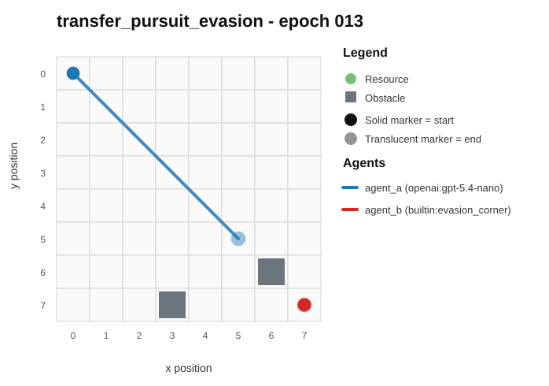
- Current trajectory: 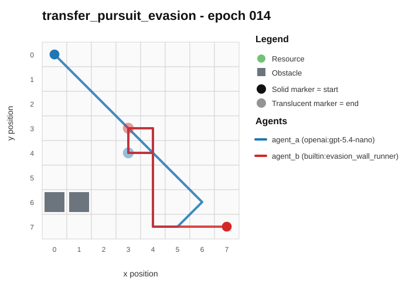
- Full artifact: `../rotating_plus_replay_aware_selection/run_20260510_000504_c/transfer_pursuit_evasion/epochs/epoch_014/artifact.json`

## transfer_pursuit_evasion / epoch 42 / run_20260510_035354_h
- Environment: `pursuit_evasion`.
- Learner: `agent_a` vs opponent role `agent_b`.
- Code novelty: 0.9289.
- Behavioral descriptor shift: 2.2409.
- Behavior profile: `static_guard` -> `tagger`.
- Behavior cell: `static_guard:0:4:2:0` -> `tagger:4:0:4:0`.
- Score delta: +10.0000.
- Margin delta: +17.9500.
- Holdout margin delta vs incumbent: N/A.
- Preliminary interpretation: `candidate_behavioral_innovation`.
- Strongest descriptor changes:
  - score_ratio: 0.0000 -> 10.0000 (+10.0000)
  - stay_ratio: 1.0000 -> 0.0000 (-1.0000)
  - revisit_ratio: 0.9833 -> 0.0000 (-0.9833)
  - exploration_ratio: 0.0167 -> 1.0000 (+0.9833)
  - opponent_pursuit_ratio: 0.0000 -> 0.8750 (+0.8750)

### Code Diff Preview
```diff
--- previous.py
+++ current.py
@@ -1,45 +1,69 @@
 def choose_move(observation):
-    w = int(observation.get("grid_width", 0) or 0)
-    h = int(observation.get("grid_height", 0) or 0)
-    sx, sy = observation.get("self_position", [0, 0])
-    ox, oy = observation.get("opponent_position", [0, 0])
-    sx = int(sx); sy = int(sy); ox = int(ox); oy = int(oy)
+    w = int(observation["grid_width"])
+    h = int(observation["grid_height"])
+    sx, sy = observation["self_position"]
+    ox, oy = observation["opponent_position"]
+    obstacles = observation.get("obstacles") or []
+    obs = set((int(p[0]), int(p[1])) for p in obstacles)
 
-    obstacles = observation.get("obstacles") or []
-    obs = set()
-    for p in obstacles:
-        try:
-            x, y = p
-            obs.add((int(x), int(y)))
-        except Exception:
-            pass
+    self_role = (observation.get("self_role") or "").lower()
+    opp_role = (observation.get("opponent_role") or "").lower()
+    self_evader = ("evad" in self_role)
+    opp_evader = ("evad" in opp_role) if opp_role else (not self_evader)
+
+    moves = [(0, 0), (-1, 0), (1, 0), (0, -1), (0, 1),
+             (-1, -1), (-1, 1), (1, -1), (1, 1)]
 
     def inside(x, y):
         return 0 <= x < w and 0 <= y < h
 
-    def legal(x, y):
-        return inside(x, y) and (x, y) not in obs
+    def d2(x, y, a, b):
+        dx = x - a
+        dy = y - b
+        return dx * dx + dy * dy
 
-    moves = [(0, 0), (-1, 0), (1, 0), (0, -1), (0, 1), (-1, -1), (-1, 1), (1, -1), (1, 1)]
-    cx = (w - 1) // 2
-    cy = (h - 1) // 2
+    def neighbors(x, y):
+        res = []
+        for dx, dy in moves:
+            nx, ny = x + dx, y + dy
+            if inside(nx, ny) and (nx, ny) not in obs:
+                res.append((nx, ny))
+        return res
 
-    best = None
-    best_score = None
-    for dx, dy in moves:
-        nx, ny = sx + dx, sy + dy
-        if not legal(nx, ny):
-            continue
-        adx = nx - ox
-        ady = ny - oy
-        dist_opp = adx * adx + ady * ady
-        cdx = nx - cx
-        cdy = ny - cy
-        dist_center = cdx * cdx + cdy * cdy
-        score = dist_opp * 100000 - dist_center
-        if best is None or score > best_score:
-            best = (dx, dy)
-            best_score = score
-    if best is None:
+    self_moves = neighbors(sx, sy)
+    if not self_moves:
         return [0, 0]
-    return [int(best[0]), int(best[1])]
+
+    def opp_best_after(selfx, selfy):
+        opp_opts = neighbors(ox, oy)
+        if not opp_opts:
+            return ox, oy
+        best = None
... diff truncated ...
```

### Trajectory Artifacts
- Previous trajectory: 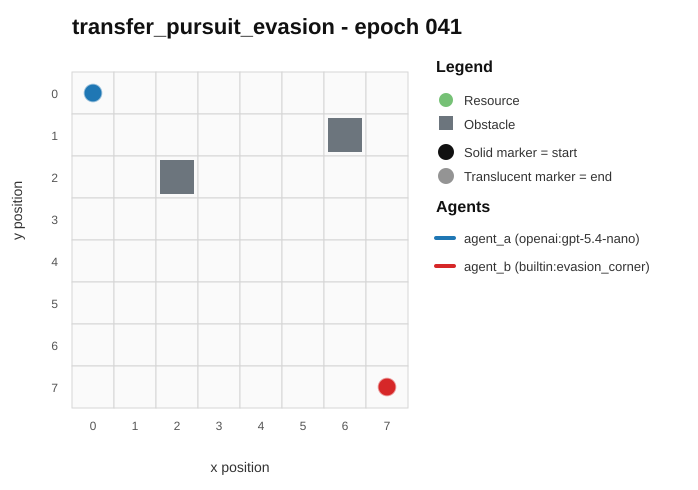
- Current trajectory: 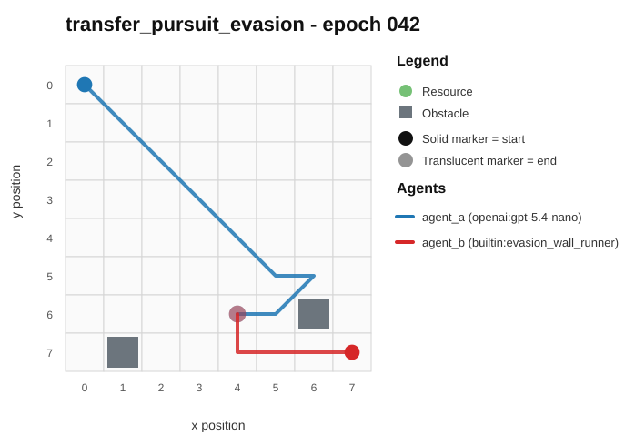
- Full artifact: `../rotating_plus_replay_aware_selection/run_20260510_035354_h/transfer_pursuit_evasion/epochs/epoch_042/artifact.json`
