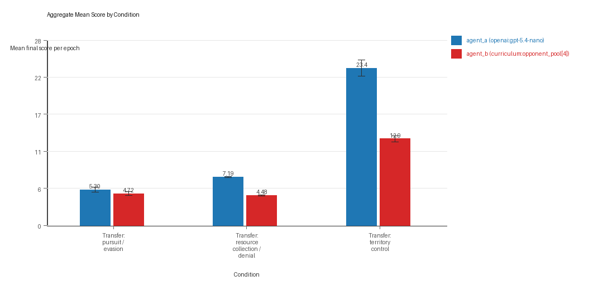
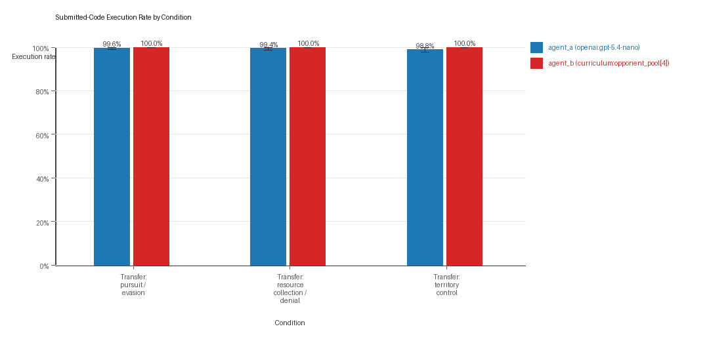
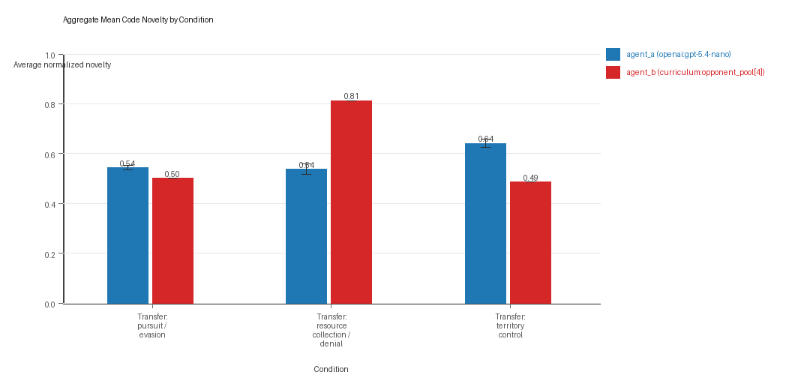
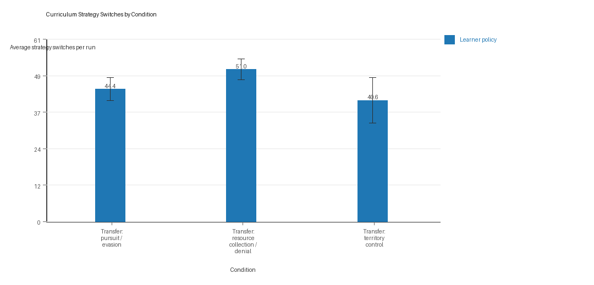
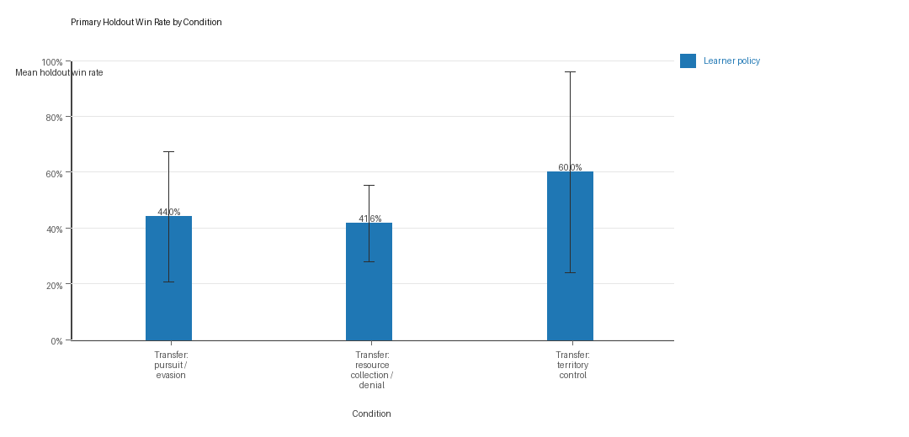

# Aggregate Research Report

## Included Runs
- Run count: 5.
- Conditions aggregated: 3.
- Runs: `run_20260507_201051_a`, `run_20260507_210350_b`, `run_20260507_220338_c`, `run_20260507_225407_d`, `run_20260507_234515_e`.

## Cross-Run Summary
- This aggregate uses curriculum-style learner-versus-opponent-pool conditions, so same-model versus cross-model summaries are secondary.
- Curriculum loop count mean 0.0 (std 0.0, 95% CI 0.0 to 0.0).
- Curriculum strategy switches mean 45.3333 (std 3.118, 95% CI 42.6003 to 48.0664).
- Curriculum post-loss novelty spikes mean 33.2667 (std 1.3622, 95% CI 32.0727 to 34.4607).
- Curriculum specific adaptation count mean 18.8 (std 0.9888, 95% CI 17.9333 to 19.6667).
- Curriculum behavior-cell coverage mean 15.8 (std 1.4453, 95% CI 14.5332 to 17.0669).
- Primary holdout win rate mean 0.4853 (std 0.2258, 95% CI 0.2874 to 0.6832).
- Primary holdout score margin mean 3.832 (std 8.4285, 95% CI -3.5559 to 11.2199).

## Aggregate Charts
### Mean Score by Condition

- Each bar shows the mean final score per epoch for one agent role in that condition.
- Error bars show the 95% confidence interval across the included runs.

### Submitted-Code Execution Rate by Condition

- The y-axis is the percentage of epochs where submitted code executed instead of a fallback policy.
- Values near 100% indicate the infrastructure stayed reliable across the included runs.

### Mean Code Novelty by Condition

- Novelty is the average normalized code-change score across epochs for that agent role and condition.
- Higher bars indicate more code variation across repeated runs, not necessarily better performance.

### Curriculum Loop Signals

- Higher bars indicate more repeated motifs or unchanged-policy loops under the curriculum conditions.

### Curriculum Strategy Switches

- Higher bars indicate more switches between heuristic or behavior classes across epochs.

### Primary Holdout Win Rate

- This is the main evaluation endpoint for holdout-first ablation studies.
- Higher bars mean the accepted learner policy won more often against opponents that were not used as the training objective.

## Condition Results
### transfer_pursuit_evasion
- Curriculum roles: learner = agent_a (openai:gpt-5.4-nano); opponent role = agent_b (curriculum:opponent_pool[4]).
- Environment: pursuit_evasion.
- Fully clean run count: 4/5.
- Primary endpoint: held-out win rate mean 0.44 (std 0.265, 95% CI 0.2077 to 0.6723); held-out score margin mean -0.996 (std 4.8168, 95% CI -5.2181 to 3.2261).
- Research tags: environment_family=multi_environment_transfer, factorial_goal=generalizable_adaptation, primary_endpoint=holdout_win_rate, recipe=rotating_opponents, recipe_source_condition=rotating_opponents_holdout_endpoint, replicate_label=a, seed_offset=0, study_phase=phase_3, suite_family=transfer_suite, transfer_environment=pursuit_evasion; environment_family=multi_environment_transfer, factorial_goal=generalizable_adaptation, primary_endpoint=holdout_win_rate, recipe=rotating_opponents, recipe_source_condition=rotating_opponents_holdout_endpoint, replicate_label=b, seed_offset=1000, study_phase=phase_3, suite_family=transfer_suite, transfer_environment=pursuit_evasion; environment_family=multi_environment_transfer, factorial_goal=generalizable_adaptation, primary_endpoint=holdout_win_rate, recipe=rotating_opponents, recipe_source_condition=rotating_opponents_holdout_endpoint, replicate_label=c, seed_offset=2000, study_phase=phase_3, suite_family=transfer_suite, transfer_environment=pursuit_evasion; environment_family=multi_environment_transfer, factorial_goal=generalizable_adaptation, primary_endpoint=holdout_win_rate, recipe=rotating_opponents, recipe_source_condition=rotating_opponents_holdout_endpoint, replicate_label=d, seed_offset=3000, study_phase=phase_3, suite_family=transfer_suite, transfer_environment=pursuit_evasion; environment_family=multi_environment_transfer, factorial_goal=generalizable_adaptation, primary_endpoint=holdout_win_rate, recipe=rotating_opponents, recipe_source_condition=rotating_opponents_holdout_endpoint, replicate_label=e, seed_offset=4000, study_phase=phase_3, suite_family=transfer_suite, transfer_environment=pursuit_evasion.
- agent_a (openai:gpt-5.4-nano) average score: agent_a (openai:gpt-5.4-nano) mean 5.3 (std 0.4062, 95% CI 4.9439 to 5.6561).
- agent_a (openai:gpt-5.4-nano) generation success rate: agent_a (openai:gpt-5.4-nano) mean 0.996 (std 0.0089, 95% CI 0.9882 to 1.0).
- agent_a (openai:gpt-5.4-nano) submitted-code execution rate: agent_a (openai:gpt-5.4-nano) mean 0.996 (std 0.0089, 95% CI 0.9882 to 1.0).
- agent_a (openai:gpt-5.4-nano) novelty: agent_a (openai:gpt-5.4-nano) mean 0.5428 (std 0.0102, 95% CI 0.5339 to 0.5517).
- agent_a (openai:gpt-5.4-nano) rule-boundary indicator count: agent_a (openai:gpt-5.4-nano) mean 0.6 (std 0.8944, 95% CI 0.0 to 1.384).
- agent_b (curriculum:opponent_pool[4]) average score: agent_b (curriculum:opponent_pool[4]) mean 4.7202 (std 0.3237, 95% CI 4.4364 to 5.004).
- agent_b (curriculum:opponent_pool[4]) generation success rate: agent_b (curriculum:opponent_pool[4]) mean 1.0 (std 0.0, 95% CI 1.0 to 1.0).
- agent_b (curriculum:opponent_pool[4]) submitted-code execution rate: agent_b (curriculum:opponent_pool[4]) mean 1.0 (std 0.0, 95% CI 1.0 to 1.0).
- agent_b (curriculum:opponent_pool[4]) novelty: agent_b (curriculum:opponent_pool[4]) mean 0.5014 (std 0.0, 95% CI 0.5014 to 0.5014).
- agent_b (curriculum:opponent_pool[4]) rule-boundary indicator count: agent_b (curriculum:opponent_pool[4]) mean 0.0 (std 0.0, 95% CI 0.0 to 0.0).
- Learner loop count: learner mean 0.0 (std 0.0, 95% CI 0.0 to 0.0).
- Learner stable strategy switches: learner mean 44.4 (std 4.3932, 95% CI 40.5492 to 48.2508).
- Learner post-loss novelty spikes: learner mean 46.6 (std 4.219, 95% CI 42.9019 to 50.2981).
- Learner same-opponent adaptation count: learner mean 16.4 (std 2.9665, 95% CI 13.7998 to 19.0002).
- Learner behavior-cell coverage: learner mean 7.6 (std 1.3416, 95% CI 6.424 to 8.776).
- Elite archive coverage: elite archive coverage mean 0.0 (std 0.0, 95% CI 0.0 to 0.0).
- agent_a win share: agent_a mean 0.53 (std 0.0406, 95% CI 0.4944 to 0.5656).
- agent_b win share: agent_b mean 0.47 (std 0.0406, 95% CI 0.4344 to 0.5056).
- draw win share: draw mean 0.0 (std 0.0, 95% CI 0.0 to 0.0).
- Holdout evaluation was enabled in 5/5 runs for this condition.
- Holdout `evasion_axis_flip` mean margin: evasion_axis_flip mean 1.848 (std 9.9029, 95% CI -6.8322 to 10.5282).
- Holdout `evasion_axis_flip` win rate: evasion_axis_flip mean 0.6 (std 0.5477, 95% CI 0.1199 to 1.0).
- Holdout `evasion_center_weave` mean margin: evasion_center_weave mean -0.168 (std 7.631, 95% CI -6.8569 to 6.5209).
- Holdout `evasion_center_weave` win rate: evasion_center_weave mean 0.48 (std 0.4147, 95% CI 0.1165 to 0.8435).
- Holdout `evasion_midline_dodge` mean margin: evasion_midline_dodge mean -4.668 (std 3.9547, 95% CI -8.1344 to -1.2016).
- Holdout `evasion_midline_dodge` win rate: evasion_midline_dodge mean 0.24 (std 0.2191, 95% CI 0.048 to 0.432).
- Qualitative follow-up candidates:
- Follow-up candidate from `run_20260507_201051_a`, epoch 1: largest score margin: agent_a (openai:gpt-5.4-nano) 10.0 vs agent_b (curriculum:opponent_pool[4]) 0.75.
- Follow-up candidate from `run_20260507_201051_a`, epoch 8: most runtime issues in one epoch: 60.
- Follow-up candidate from `run_20260507_201051_a`, epoch 16: largest average code shift between consecutive epochs: 0.7516.
- Follow-up candidate from `run_20260507_210350_b`, epoch 1: largest score margin: agent_a (openai:gpt-5.4-nano) 10.0 vs agent_b (curriculum:opponent_pool[4]) 0.75.

### transfer_resource_collection_denial
- Curriculum roles: learner = agent_a (openai:gpt-5.4-nano); opponent role = agent_b (curriculum:opponent_pool[4]).
- Environment: resource_collection.
- Fully clean run count: 3/5.
- Primary endpoint: held-out win rate mean 0.416 (std 0.1565, 95% CI 0.2789 to 0.5531); held-out score margin mean 0.552 (std 1.5337, 95% CI -0.7924 to 1.8964).
- Research tags: environment_family=multi_environment_transfer, factorial_goal=generalizable_adaptation, primary_endpoint=holdout_win_rate, recipe=rotating_opponents, recipe_source_condition=rotating_opponents_holdout_endpoint, replicate_label=a, seed_offset=0, study_phase=phase_3, suite_family=transfer_suite, transfer_environment=resource_collection; environment_family=multi_environment_transfer, factorial_goal=generalizable_adaptation, primary_endpoint=holdout_win_rate, recipe=rotating_opponents, recipe_source_condition=rotating_opponents_holdout_endpoint, replicate_label=b, seed_offset=1000, study_phase=phase_3, suite_family=transfer_suite, transfer_environment=resource_collection; environment_family=multi_environment_transfer, factorial_goal=generalizable_adaptation, primary_endpoint=holdout_win_rate, recipe=rotating_opponents, recipe_source_condition=rotating_opponents_holdout_endpoint, replicate_label=c, seed_offset=2000, study_phase=phase_3, suite_family=transfer_suite, transfer_environment=resource_collection; environment_family=multi_environment_transfer, factorial_goal=generalizable_adaptation, primary_endpoint=holdout_win_rate, recipe=rotating_opponents, recipe_source_condition=rotating_opponents_holdout_endpoint, replicate_label=d, seed_offset=3000, study_phase=phase_3, suite_family=transfer_suite, transfer_environment=resource_collection; environment_family=multi_environment_transfer, factorial_goal=generalizable_adaptation, primary_endpoint=holdout_win_rate, recipe=rotating_opponents, recipe_source_condition=rotating_opponents_holdout_endpoint, replicate_label=e, seed_offset=4000, study_phase=phase_3, suite_family=transfer_suite, transfer_environment=resource_collection.
- agent_a (openai:gpt-5.4-nano) average score: agent_a (openai:gpt-5.4-nano) mean 7.189 (std 0.1167, 95% CI 7.0867 to 7.2913).
- agent_a (openai:gpt-5.4-nano) generation success rate: agent_a (openai:gpt-5.4-nano) mean 0.994 (std 0.0089, 95% CI 0.9862 to 1.0).
- agent_a (openai:gpt-5.4-nano) submitted-code execution rate: agent_a (openai:gpt-5.4-nano) mean 0.994 (std 0.0089, 95% CI 0.9862 to 1.0).
- agent_a (openai:gpt-5.4-nano) novelty: agent_a (openai:gpt-5.4-nano) mean 0.5372 (std 0.0244, 95% CI 0.5158 to 0.5586).
- agent_a (openai:gpt-5.4-nano) rule-boundary indicator count: agent_a (openai:gpt-5.4-nano) mean 0.0 (std 0.0, 95% CI 0.0 to 0.0).
- agent_b (curriculum:opponent_pool[4]) average score: agent_b (curriculum:opponent_pool[4]) mean 4.483 (std 0.0955, 95% CI 4.3993 to 4.5667).
- agent_b (curriculum:opponent_pool[4]) generation success rate: agent_b (curriculum:opponent_pool[4]) mean 1.0 (std 0.0, 95% CI 1.0 to 1.0).
- agent_b (curriculum:opponent_pool[4]) submitted-code execution rate: agent_b (curriculum:opponent_pool[4]) mean 1.0 (std 0.0, 95% CI 1.0 to 1.0).
- agent_b (curriculum:opponent_pool[4]) novelty: agent_b (curriculum:opponent_pool[4]) mean 0.8125 (std 0.0, 95% CI 0.8125 to 0.8125).
- agent_b (curriculum:opponent_pool[4]) rule-boundary indicator count: agent_b (curriculum:opponent_pool[4]) mean 0.0 (std 0.0, 95% CI 0.0 to 0.0).
- Learner loop count: learner mean 0.0 (std 0.0, 95% CI 0.0 to 0.0).
- Learner stable strategy switches: learner mean 51.0 (std 4.0, 95% CI 47.4938 to 54.5062).
- Learner post-loss novelty spikes: learner mean 24.6 (std 2.6077, 95% CI 22.3143 to 26.8857).
- Learner same-opponent adaptation count: learner mean 19.0 (std 2.1213, 95% CI 17.1406 to 20.8594).
- Learner behavior-cell coverage: learner mean 21.8 (std 3.9623, 95% CI 18.3269 to 25.2731).
- Elite archive coverage: elite archive coverage mean 0.0 (std 0.0, 95% CI 0.0 to 0.0).
- agent_a win share: agent_a mean 0.56 (std 0.0332, 95% CI 0.5309 to 0.5891).
- agent_b win share: agent_b mean 0.25 (std 0.0245, 95% CI 0.2285 to 0.2715).
- draw win share: draw mean 0.19 (std 0.0283, 95% CI 0.1652 to 0.2148).
- Holdout evaluation was enabled in 5/5 runs for this condition.
- Holdout `center_rush` mean margin: center_rush mean -0.32 (std 2.1288, 95% CI -2.186 to 1.546).
- Holdout `center_rush` win rate: center_rush mean 0.32 (std 0.228, 95% CI 0.1201 to 0.5199).
- Holdout `corner_guard` mean margin: corner_guard mean 0.04 (std 2.4552, 95% CI -2.1121 to 2.1921).
- Holdout `corner_guard` win rate: corner_guard mean 0.4 (std 0.3162, 95% CI 0.1228 to 0.6772).
- Holdout `diagonal_probe` mean margin: diagonal_probe mean -0.32 (std 1.8033, 95% CI -1.9007 to 1.2607).
- Holdout `diagonal_probe` win rate: diagonal_probe mean 0.4 (std 0.2, 95% CI 0.2247 to 0.5753).
- Holdout `edge_patrol` mean margin: edge_patrol mean 4.68 (std 1.4805, 95% CI 3.3822 to 5.9778).
- Holdout `edge_patrol` win rate: edge_patrol mean 0.84 (std 0.2608, 95% CI 0.6114 to 1.0).
- Holdout `safe_collector` mean margin: safe_collector mean -1.32 (std 1.4043, 95% CI -2.5509 to -0.0891).
- Holdout `safe_collector` win rate: safe_collector mean 0.12 (std 0.1095, 95% CI 0.024 to 0.216).
- Qualitative follow-up candidates:
- Follow-up candidate from `run_20260507_201051_a`, epoch 39: largest score margin: agent_a (openai:gpt-5.4-nano) 12.0 vs agent_b (curriculum:opponent_pool[4]) 0.0.
- Follow-up candidate from `run_20260507_201051_a`, epoch 95: most runtime issues in one epoch: 80.
- Follow-up candidate from `run_20260507_201051_a`, epoch 4: first fallback/default-code epoch for agent_a (openai:gpt-5.4-nano).
- Follow-up candidate from `run_20260507_201051_a`, epoch 29: largest average code shift between consecutive epochs: 0.8139.

### transfer_territory_control
- Curriculum roles: learner = agent_a (openai:gpt-5.4-nano); opponent role = agent_b (curriculum:opponent_pool[4]).
- Environment: territory_control.
- Fully clean run count: 2/5.
- Primary endpoint: held-out win rate mean 0.6 (std 0.411, 95% CI 0.2398 to 0.9602); held-out score margin mean 11.94 (std 21.1864, 95% CI -6.6307 to 30.5107).
- Research tags: environment_family=multi_environment_transfer, factorial_goal=generalizable_adaptation, primary_endpoint=holdout_win_rate, recipe=rotating_opponents, recipe_source_condition=rotating_opponents_holdout_endpoint, replicate_label=a, seed_offset=0, study_phase=phase_3, suite_family=transfer_suite, transfer_environment=territory_control; environment_family=multi_environment_transfer, factorial_goal=generalizable_adaptation, primary_endpoint=holdout_win_rate, recipe=rotating_opponents, recipe_source_condition=rotating_opponents_holdout_endpoint, replicate_label=b, seed_offset=1000, study_phase=phase_3, suite_family=transfer_suite, transfer_environment=territory_control; environment_family=multi_environment_transfer, factorial_goal=generalizable_adaptation, primary_endpoint=holdout_win_rate, recipe=rotating_opponents, recipe_source_condition=rotating_opponents_holdout_endpoint, replicate_label=c, seed_offset=2000, study_phase=phase_3, suite_family=transfer_suite, transfer_environment=territory_control; environment_family=multi_environment_transfer, factorial_goal=generalizable_adaptation, primary_endpoint=holdout_win_rate, recipe=rotating_opponents, recipe_source_condition=rotating_opponents_holdout_endpoint, replicate_label=d, seed_offset=3000, study_phase=phase_3, suite_family=transfer_suite, transfer_environment=territory_control; environment_family=multi_environment_transfer, factorial_goal=generalizable_adaptation, primary_endpoint=holdout_win_rate, recipe=rotating_opponents, recipe_source_condition=rotating_opponents_holdout_endpoint, replicate_label=e, seed_offset=4000, study_phase=phase_3, suite_family=transfer_suite, transfer_environment=territory_control.
- agent_a (openai:gpt-5.4-nano) average score: agent_a (openai:gpt-5.4-nano) mean 23.424 (std 1.3752, 95% CI 22.2185 to 24.6295).
- agent_a (openai:gpt-5.4-nano) generation success rate: agent_a (openai:gpt-5.4-nano) mean 0.988 (std 0.011, 95% CI 0.9784 to 0.9976).
- agent_a (openai:gpt-5.4-nano) submitted-code execution rate: agent_a (openai:gpt-5.4-nano) mean 0.988 (std 0.011, 95% CI 0.9784 to 0.9976).
- agent_a (openai:gpt-5.4-nano) novelty: agent_a (openai:gpt-5.4-nano) mean 0.6408 (std 0.0186, 95% CI 0.6244 to 0.6571).
- agent_a (openai:gpt-5.4-nano) rule-boundary indicator count: agent_a (openai:gpt-5.4-nano) mean 0.6 (std 0.5477, 95% CI 0.1199 to 1.0801).
- agent_b (curriculum:opponent_pool[4]) average score: agent_b (curriculum:opponent_pool[4]) mean 12.885 (std 0.5263, 95% CI 12.4237 to 13.3463).
- agent_b (curriculum:opponent_pool[4]) generation success rate: agent_b (curriculum:opponent_pool[4]) mean 1.0 (std 0.0, 95% CI 1.0 to 1.0).
- agent_b (curriculum:opponent_pool[4]) submitted-code execution rate: agent_b (curriculum:opponent_pool[4]) mean 1.0 (std 0.0, 95% CI 1.0 to 1.0).
- agent_b (curriculum:opponent_pool[4]) novelty: agent_b (curriculum:opponent_pool[4]) mean 0.4857 (std 0.0, 95% CI 0.4857 to 0.4857).
- agent_b (curriculum:opponent_pool[4]) rule-boundary indicator count: agent_b (curriculum:opponent_pool[4]) mean 0.0 (std 0.0, 95% CI 0.0 to 0.0).
- Learner loop count: learner mean 0.0 (std 0.0, 95% CI 0.0 to 0.0).
- Learner stable strategy switches: learner mean 40.6 (std 8.6776, 95% CI 32.9938 to 48.2062).
- Learner post-loss novelty spikes: learner mean 28.6 (std 1.8166, 95% CI 27.0077 to 30.1923).
- Learner same-opponent adaptation count: learner mean 21.0 (std 2.3452, 95% CI 18.9443 to 23.0557).
- Learner behavior-cell coverage: learner mean 18.0 (std 1.7321, 95% CI 16.4818 to 19.5182).
- Elite archive coverage: elite archive coverage mean 0.0 (std 0.0, 95% CI 0.0 to 0.0).
- agent_a win share: agent_a mean 0.62 (std 0.0255, 95% CI 0.5977 to 0.6423).
- agent_b win share: agent_b mean 0.286 (std 0.0182, 95% CI 0.2701 to 0.3019).
- draw win share: draw mean 0.094 (std 0.0207, 95% CI 0.0758 to 0.1122).
- Holdout evaluation was enabled in 5/5 runs for this condition.
- Holdout `territory_diagonal_claim` mean margin: territory_diagonal_claim mean 16.56 (std 23.8231, 95% CI -4.3218 to 37.4418).
- Holdout `territory_diagonal_claim` win rate: territory_diagonal_claim mean 0.68 (std 0.4604, 95% CI 0.2764 to 1.0).
- Holdout `territory_far_corner_claim` mean margin: territory_far_corner_claim mean 3.02 (std 19.7304, 95% CI -14.2744 to 20.3144).
- Holdout `territory_far_corner_claim` win rate: territory_far_corner_claim mean 0.4 (std 0.469, 95% CI 0.0 to 0.8111).
- Holdout `territory_quadrant_claim` mean margin: territory_quadrant_claim mean 16.24 (std 23.704, 95% CI -4.5374 to 37.0174).
- Holdout `territory_quadrant_claim` win rate: territory_quadrant_claim mean 0.72 (std 0.4382, 95% CI 0.3359 to 1.0).
- Qualitative follow-up candidates:
- Follow-up candidate from `run_20260507_201051_a`, epoch 33: largest score margin: agent_a (openai:gpt-5.4-nano) 63.5 vs agent_b (curriculum:opponent_pool[4]) 2.0.
- Follow-up candidate from `run_20260507_201051_a`, epoch 82: most runtime issues in one epoch: 138.
- Follow-up candidate from `run_20260507_201051_a`, epoch 57: first fallback/default-code epoch for agent_a (openai:gpt-5.4-nano).
- Follow-up candidate from `run_20260507_201051_a`, epoch 11: largest average code shift between consecutive epochs: 0.8511.

## Interpretation Caveats
- Aggregate results are only as strong as the included run set. If the input runs mix different prompts, environments, or suite definitions, treat the summary as descriptive rather than causal.
- Confidence intervals here summarize variation across run-level condition summaries; they are not substitutes for careful experimental design.
- Use this aggregate report together with per-run reports and the research checklist before making strong claims.

## Aggregate Conclusions
- Data quality summary: 0/3 conditions were fully clean, 2/3 were near-clean, and 1/3 remained higher-noise.
- This aggregate includes curriculum conditions, so the learner policy is the primary unit of analysis and opponent-role metrics are contextual.

### Best-Supported Findings
- On the primary endpoint, Transfer: territory control led with mean held-out win rate 0.6 and mean held-out margin 11.94.
- This aggregate is organized around learner-versus-opponent-pool curriculum conditions, so same-model versus cross-model novelty is not the main comparison axis.
- Rule-boundary indicators should be interpreted condition by condition here, because these curriculum families compare opponent-pool recipes rather than same-model versus cross-model matchups.
- Curriculum loop pressure produced an average loop count of 0.0 and an average strategy-switch count of 45.3333 across enabled conditions.
- Specific same-opponent adaptation signals averaged 18.8 across enabled curriculum conditions.
- Holdout-panel evidence: Transfer: pursuit / evasion vs evasion_axis_flip: mean margin 1.848, win rate 0.6; Transfer: pursuit / evasion vs evasion_center_weave: mean margin -0.168, win rate 0.48; Transfer: pursuit / evasion vs evasion_midline_dodge: mean margin -4.668, win rate 0.24; Transfer: resource collection / denial vs center_rush: mean margin -0.32, win rate 0.32; Transfer: resource collection / denial vs corner_guard: mean margin 0.04, win rate 0.4; Transfer: resource collection / denial vs diagonal_probe: mean margin -0.32, win rate 0.4; Transfer: resource collection / denial vs edge_patrol: mean margin 4.68, win rate 0.84; Transfer: resource collection / denial vs safe_collector: mean margin -1.32, win rate 0.12; Transfer: territory control vs territory_diagonal_claim: mean margin 16.56, win rate 0.68; Transfer: territory control vs territory_far_corner_claim: mean margin 3.02, win rate 0.4; Transfer: territory control vs territory_quadrant_claim: mean margin 16.24, win rate 0.72.

### Directional Or Uncertain Findings
- Conditions classified as higher-noise should be treated as exploratory unless the same direction reappears in cleaner replicate runs.

### Claims Not Supported Yet
- The aggregate does not by itself establish causality; the strongest causal interpretations should come from replicated ablation conditions rather than from mixed-condition summaries alone.
- Code novelty is not equivalent to strategic innovation. Notable epochs and behavior traces require qualitative review.
