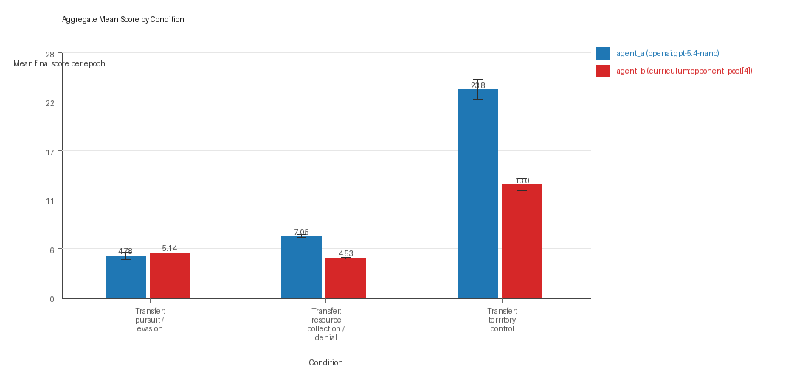
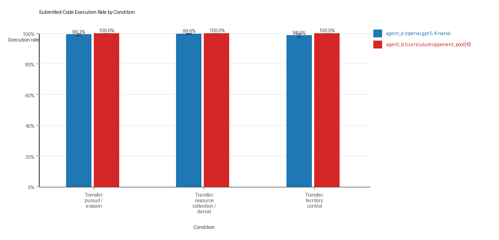
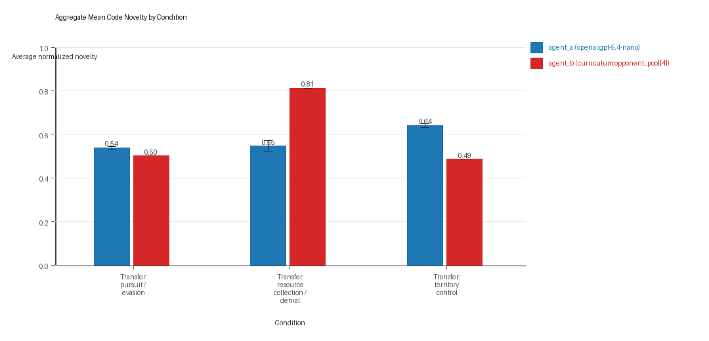
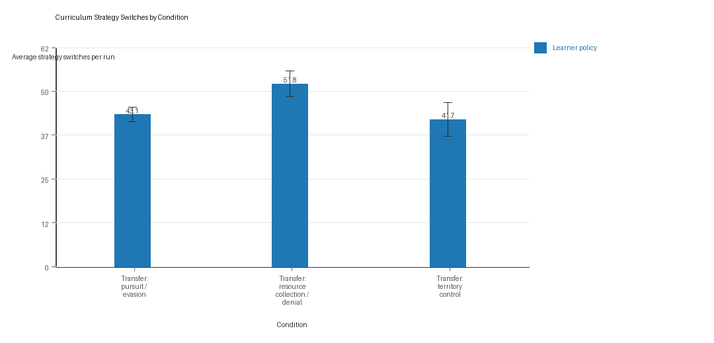
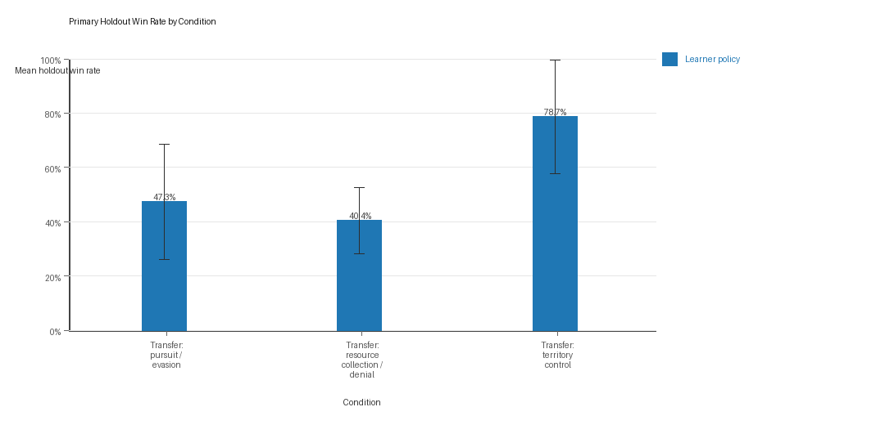

# Aggregate Research Report

## Included Runs
- Run count: 10.
- Conditions aggregated: 3.
- Runs: `run_20260507_201051_a`, `run_20260507_210350_b`, `run_20260507_220338_c`, `run_20260507_225407_d`, `run_20260507_234515_e`, `run_20260508_205712_g`, `run_20260508_224455_h`, `run_20260509_002410_i`, `run_20260509_020516_j`, `run_20260509_094819_f`.

## Cross-Run Summary
- This aggregate uses curriculum-style learner-versus-opponent-pool conditions, so same-model versus cross-model summaries are intentionally de-emphasized.
- Curriculum loop count mean 0.0 (std 0.0, 95% CI 0.0 to 0.0).
- Curriculum strategy switches mean 45.5333 (std 3.104, 95% CI 43.6095 to 47.4572).
- Curriculum post-loss novelty spikes mean 34.8 (std 2.4047, 95% CI 33.3095 to 36.2905).
- Curriculum specific adaptation count mean 18.8667 (std 1.4159, 95% CI 17.989 to 19.7443).
- Curriculum behavior-cell coverage mean 15.4667 (std 1.2881, 95% CI 14.6683 to 16.2651).
- Primary holdout win rate mean 0.5547 (std 0.1953, 95% CI 0.4336 to 0.6757).
- Primary holdout score margin mean 5.9663 (std 7.2313, 95% CI 1.4843 to 10.4483).

## Aggregate Charts
### Mean Score by Condition

- Each bar shows the mean final score per epoch for one agent role in that condition.
- Error bars show the 95% confidence interval across the included runs.

### Submitted-Code Execution Rate by Condition

- The y-axis is the percentage of epochs where submitted code executed instead of a fallback policy.
- Values near 100% indicate the infrastructure stayed reliable across the included runs.

### Mean Code Novelty by Condition

- Novelty is the average normalized code-change score across epochs for that agent role and condition.
- Higher bars indicate more code variation across repeated runs, not necessarily better performance.

### Curriculum Loop Signals

- Higher bars indicate more repeated motifs or unchanged-policy loops under the curriculum conditions.

### Curriculum Strategy Switches

- Higher bars indicate more switches between heuristic or behavior classes across epochs.

### Primary Holdout Win Rate

- This is the main evaluation endpoint for holdout-first ablation studies.
- Higher bars mean the accepted learner policy won more often against opponents that were not used as the training objective.

## Condition Results
### transfer_pursuit_evasion
- Curriculum roles: learner = agent_a (openai:gpt-5.4-nano); opponent role = agent_b (curriculum:opponent_pool[4]).
- Environment: pursuit_evasion.
- Fully clean run count: 6/10.
- Primary endpoint: held-out win rate mean 0.4733 (std 0.3435, 95% CI 0.2604 to 0.6862); held-out score margin mean -0.4177 (std 6.2198, 95% CI -4.2727 to 3.4374).
- Research tags: environment_family=multi_environment_transfer, factorial_goal=generalizable_adaptation, primary_endpoint=holdout_win_rate, recipe=rotating_opponents, recipe_source_condition=rotating_opponents_holdout_endpoint, replicate_label=a, seed_offset=0, study_phase=phase_3, suite_family=transfer_suite, transfer_environment=pursuit_evasion; environment_family=multi_environment_transfer, factorial_goal=generalizable_adaptation, primary_endpoint=holdout_win_rate, recipe=rotating_opponents, recipe_source_condition=rotating_opponents_holdout_endpoint, replicate_label=b, seed_offset=1000, study_phase=phase_3, suite_family=transfer_suite, transfer_environment=pursuit_evasion; environment_family=multi_environment_transfer, factorial_goal=generalizable_adaptation, primary_endpoint=holdout_win_rate, recipe=rotating_opponents, recipe_source_condition=rotating_opponents_holdout_endpoint, replicate_label=c, seed_offset=2000, study_phase=phase_3, suite_family=transfer_suite, transfer_environment=pursuit_evasion; environment_family=multi_environment_transfer, factorial_goal=generalizable_adaptation, primary_endpoint=holdout_win_rate, recipe=rotating_opponents, recipe_source_condition=rotating_opponents_holdout_endpoint, replicate_label=d, seed_offset=3000, study_phase=phase_3, suite_family=transfer_suite, transfer_environment=pursuit_evasion; environment_family=multi_environment_transfer, factorial_goal=generalizable_adaptation, primary_endpoint=holdout_win_rate, recipe=rotating_opponents, recipe_source_condition=rotating_opponents_holdout_endpoint, replicate_label=e, seed_offset=4000, study_phase=phase_3, suite_family=transfer_suite, transfer_environment=pursuit_evasion; environment_family=multi_environment_transfer, factorial_goal=generalizable_adaptation, primary_endpoint=holdout_win_rate, recipe=rotating_opponents, recipe_source_condition=rotating_opponents_holdout_endpoint, replicate_label=f, seed_offset=5000, study_phase=phase_4, suite_family=transfer_suite, transfer_environment=pursuit_evasion; environment_family=multi_environment_transfer, factorial_goal=generalizable_adaptation, primary_endpoint=holdout_win_rate, recipe=rotating_opponents, recipe_source_condition=rotating_opponents_holdout_endpoint, replicate_label=g, seed_offset=6000, study_phase=phase_4, suite_family=transfer_suite, transfer_environment=pursuit_evasion; environment_family=multi_environment_transfer, factorial_goal=generalizable_adaptation, primary_endpoint=holdout_win_rate, recipe=rotating_opponents, recipe_source_condition=rotating_opponents_holdout_endpoint, replicate_label=h, seed_offset=7000, study_phase=phase_4, suite_family=transfer_suite, transfer_environment=pursuit_evasion; environment_family=multi_environment_transfer, factorial_goal=generalizable_adaptation, primary_endpoint=holdout_win_rate, recipe=rotating_opponents, recipe_source_condition=rotating_opponents_holdout_endpoint, replicate_label=i, seed_offset=8000, study_phase=phase_4, suite_family=transfer_suite, transfer_environment=pursuit_evasion; environment_family=multi_environment_transfer, factorial_goal=generalizable_adaptation, primary_endpoint=holdout_win_rate, recipe=rotating_opponents, recipe_source_condition=rotating_opponents_holdout_endpoint, replicate_label=j, seed_offset=9000, study_phase=phase_4, suite_family=transfer_suite, transfer_environment=pursuit_evasion.
- agent_a (openai:gpt-5.4-nano) average score: agent_a (openai:gpt-5.4-nano) mean 4.78 (std 0.6812, 95% CI 4.3578 to 5.2022).
- agent_a (openai:gpt-5.4-nano) generation success rate: agent_a (openai:gpt-5.4-nano) mean 0.991 (std 0.012, 95% CI 0.9836 to 0.9984).
- agent_a (openai:gpt-5.4-nano) submitted-code execution rate: agent_a (openai:gpt-5.4-nano) mean 0.991 (std 0.012, 95% CI 0.9836 to 0.9984).
- agent_a (openai:gpt-5.4-nano) novelty: agent_a (openai:gpt-5.4-nano) mean 0.5378 (std 0.0117, 95% CI 0.5305 to 0.5451).
- agent_a (openai:gpt-5.4-nano) rule-boundary indicator count: agent_a (openai:gpt-5.4-nano) mean 1.1 (std 1.1005, 95% CI 0.4179 to 1.7821).
- agent_b (curriculum:opponent_pool[4]) average score: agent_b (curriculum:opponent_pool[4]) mean 5.1368 (std 0.545, 95% CI 4.799 to 5.4746).
- agent_b (curriculum:opponent_pool[4]) generation success rate: agent_b (curriculum:opponent_pool[4]) mean 1.0 (std 0.0, 95% CI 1.0 to 1.0).
- agent_b (curriculum:opponent_pool[4]) submitted-code execution rate: agent_b (curriculum:opponent_pool[4]) mean 1.0 (std 0.0, 95% CI 1.0 to 1.0).
- agent_b (curriculum:opponent_pool[4]) novelty: agent_b (curriculum:opponent_pool[4]) mean 0.5014 (std 0.0, 95% CI 0.5014 to 0.5014).
- agent_b (curriculum:opponent_pool[4]) rule-boundary indicator count: agent_b (curriculum:opponent_pool[4]) mean 0.0 (std 0.0, 95% CI 0.0 to 0.0).
- Learner loop count: learner mean 0.0 (std 0.0, 95% CI 0.0 to 0.0).
- Learner stable strategy switches: learner mean 43.1 (std 3.414, 95% CI 40.984 to 45.216).
- Learner post-loss novelty spikes: learner mean 51.9 (std 6.8872, 95% CI 47.6313 to 56.1687).
- Learner same-opponent adaptation count: learner mean 16.6 (std 3.5024, 95% CI 14.4292 to 18.7708).
- Learner behavior-cell coverage: learner mean 7.4 (std 1.5055, 95% CI 6.4669 to 8.3331).
- Elite archive coverage: elite archive coverage mean 0.0 (std 0.0, 95% CI 0.0 to 0.0).
- agent_a win share: agent_a mean 0.478 (std 0.0681, 95% CI 0.4358 to 0.5202).
- agent_b win share: agent_b mean 0.522 (std 0.0681, 95% CI 0.4798 to 0.5642).
- draw win share: draw mean 0.0 (std 0.0, 95% CI 0.0 to 0.0).
- Holdout evaluation was enabled in 10/10 runs for this condition.
- Holdout `evasion_axis_flip` mean margin: evasion_axis_flip mean 1.848 (std 9.3365, 95% CI -3.9388 to 7.6348).
- Holdout `evasion_axis_flip` win rate: evasion_axis_flip mean 0.6 (std 0.5164, 95% CI 0.2799 to 0.9201).
- Holdout `evasion_center_weave` mean margin: evasion_center_weave mean 0.532 (std 7.5938, 95% CI -4.1747 to 5.2387).
- Holdout `evasion_center_weave` win rate: evasion_center_weave mean 0.52 (std 0.4131, 95% CI 0.2639 to 0.7761).
- Holdout `evasion_midline_dodge` mean margin: evasion_midline_dodge mean -3.633 (std 5.0989, 95% CI -6.7933 to -0.4727).
- Holdout `evasion_midline_dodge` win rate: evasion_midline_dodge mean 0.3 (std 0.2867, 95% CI 0.1223 to 0.4777).
- Qualitative follow-up candidates:
- Follow-up candidate from `run_20260507_201051_a`, epoch 1: largest score margin: agent_a (openai:gpt-5.4-nano) 10.0 vs agent_b (curriculum:opponent_pool[4]) 0.75.
- Follow-up candidate from `run_20260507_201051_a`, epoch 8: most runtime issues in one epoch: 60.
- Follow-up candidate from `run_20260507_201051_a`, epoch 16: largest average code shift between consecutive epochs: 0.7516.
- Follow-up candidate from `run_20260507_210350_b`, epoch 1: largest score margin: agent_a (openai:gpt-5.4-nano) 10.0 vs agent_b (curriculum:opponent_pool[4]) 0.75.

### transfer_resource_collection_denial
- Curriculum roles: learner = agent_a (openai:gpt-5.4-nano); opponent role = agent_b (curriculum:opponent_pool[4]).
- Environment: resource_collection.
- Fully clean run count: 7/10.
- Primary endpoint: held-out win rate mean 0.404 (std 0.1982, 95% CI 0.2812 to 0.5268); held-out score margin mean -0.22 (std 3.2083, 95% CI -2.2085 to 1.7685).
- Research tags: environment_family=multi_environment_transfer, factorial_goal=generalizable_adaptation, primary_endpoint=holdout_win_rate, recipe=rotating_opponents, recipe_source_condition=rotating_opponents_holdout_endpoint, replicate_label=a, seed_offset=0, study_phase=phase_3, suite_family=transfer_suite, transfer_environment=resource_collection; environment_family=multi_environment_transfer, factorial_goal=generalizable_adaptation, primary_endpoint=holdout_win_rate, recipe=rotating_opponents, recipe_source_condition=rotating_opponents_holdout_endpoint, replicate_label=b, seed_offset=1000, study_phase=phase_3, suite_family=transfer_suite, transfer_environment=resource_collection; environment_family=multi_environment_transfer, factorial_goal=generalizable_adaptation, primary_endpoint=holdout_win_rate, recipe=rotating_opponents, recipe_source_condition=rotating_opponents_holdout_endpoint, replicate_label=c, seed_offset=2000, study_phase=phase_3, suite_family=transfer_suite, transfer_environment=resource_collection; environment_family=multi_environment_transfer, factorial_goal=generalizable_adaptation, primary_endpoint=holdout_win_rate, recipe=rotating_opponents, recipe_source_condition=rotating_opponents_holdout_endpoint, replicate_label=d, seed_offset=3000, study_phase=phase_3, suite_family=transfer_suite, transfer_environment=resource_collection; environment_family=multi_environment_transfer, factorial_goal=generalizable_adaptation, primary_endpoint=holdout_win_rate, recipe=rotating_opponents, recipe_source_condition=rotating_opponents_holdout_endpoint, replicate_label=e, seed_offset=4000, study_phase=phase_3, suite_family=transfer_suite, transfer_environment=resource_collection; environment_family=multi_environment_transfer, factorial_goal=generalizable_adaptation, primary_endpoint=holdout_win_rate, recipe=rotating_opponents, recipe_source_condition=rotating_opponents_holdout_endpoint, replicate_label=f, seed_offset=5000, study_phase=phase_4, suite_family=transfer_suite, transfer_environment=resource_collection; environment_family=multi_environment_transfer, factorial_goal=generalizable_adaptation, primary_endpoint=holdout_win_rate, recipe=rotating_opponents, recipe_source_condition=rotating_opponents_holdout_endpoint, replicate_label=g, seed_offset=6000, study_phase=phase_4, suite_family=transfer_suite, transfer_environment=resource_collection; environment_family=multi_environment_transfer, factorial_goal=generalizable_adaptation, primary_endpoint=holdout_win_rate, recipe=rotating_opponents, recipe_source_condition=rotating_opponents_holdout_endpoint, replicate_label=h, seed_offset=7000, study_phase=phase_4, suite_family=transfer_suite, transfer_environment=resource_collection; environment_family=multi_environment_transfer, factorial_goal=generalizable_adaptation, primary_endpoint=holdout_win_rate, recipe=rotating_opponents, recipe_source_condition=rotating_opponents_holdout_endpoint, replicate_label=i, seed_offset=8000, study_phase=phase_4, suite_family=transfer_suite, transfer_environment=resource_collection; environment_family=multi_environment_transfer, factorial_goal=generalizable_adaptation, primary_endpoint=holdout_win_rate, recipe=rotating_opponents, recipe_source_condition=rotating_opponents_holdout_endpoint, replicate_label=j, seed_offset=9000, study_phase=phase_4, suite_family=transfer_suite, transfer_environment=resource_collection.
- agent_a (openai:gpt-5.4-nano) average score: agent_a (openai:gpt-5.4-nano) mean 7.05 (std 0.2591, 95% CI 6.8894 to 7.2106).
- agent_a (openai:gpt-5.4-nano) generation success rate: agent_a (openai:gpt-5.4-nano) mean 0.996 (std 0.007, 95% CI 0.9917 to 1.0).
- agent_a (openai:gpt-5.4-nano) submitted-code execution rate: agent_a (openai:gpt-5.4-nano) mean 0.996 (std 0.007, 95% CI 0.9917 to 1.0).
- agent_a (openai:gpt-5.4-nano) novelty: agent_a (openai:gpt-5.4-nano) mean 0.5461 (std 0.0404, 95% CI 0.5211 to 0.5712).
- agent_a (openai:gpt-5.4-nano) rule-boundary indicator count: agent_a (openai:gpt-5.4-nano) mean 0.2 (std 0.4216, 95% CI 0.0 to 0.4613).
- agent_b (curriculum:opponent_pool[4]) average score: agent_b (curriculum:opponent_pool[4]) mean 4.528 (std 0.1745, 95% CI 4.4199 to 4.6361).
- agent_b (curriculum:opponent_pool[4]) generation success rate: agent_b (curriculum:opponent_pool[4]) mean 1.0 (std 0.0, 95% CI 1.0 to 1.0).
- agent_b (curriculum:opponent_pool[4]) submitted-code execution rate: agent_b (curriculum:opponent_pool[4]) mean 1.0 (std 0.0, 95% CI 1.0 to 1.0).
- agent_b (curriculum:opponent_pool[4]) novelty: agent_b (curriculum:opponent_pool[4]) mean 0.8125 (std 0.0, 95% CI 0.8125 to 0.8125).
- agent_b (curriculum:opponent_pool[4]) rule-boundary indicator count: agent_b (curriculum:opponent_pool[4]) mean 0.0 (std 0.0, 95% CI 0.0 to 0.0).
- Learner loop count: learner mean 0.0 (std 0.0, 95% CI 0.0 to 0.0).
- Learner stable strategy switches: learner mean 51.8 (std 5.9217, 95% CI 48.1297 to 55.4703).
- Learner post-loss novelty spikes: learner mean 24.6 (std 4.8808, 95% CI 21.5748 to 27.6252).
- Learner same-opponent adaptation count: learner mean 19.2 (std 2.8597, 95% CI 17.4276 to 20.9724).
- Learner behavior-cell coverage: learner mean 21.8 (std 3.3267, 95% CI 19.7381 to 23.8619).
- Elite archive coverage: elite archive coverage mean 0.0 (std 0.0, 95% CI 0.0 to 0.0).
- agent_a win share: agent_a mean 0.556 (std 0.0401, 95% CI 0.5312 to 0.5808).
- agent_b win share: agent_b mean 0.249 (std 0.0475, 95% CI 0.2196 to 0.2784).
- draw win share: draw mean 0.195 (std 0.0232, 95% CI 0.1806 to 0.2094).
- Holdout evaluation was enabled in 10/10 runs for this condition.
- Holdout `center_rush` mean margin: center_rush mean -0.54 (std 4.8836, 95% CI -3.5669 to 2.4869).
- Holdout `center_rush` win rate: center_rush mean 0.36 (std 0.3098, 95% CI 0.168 to 0.552).
- Holdout `corner_guard` mean margin: corner_guard mean -0.9 (std 2.9878, 95% CI -2.7518 to 0.9518).
- Holdout `corner_guard` win rate: corner_guard mean 0.36 (std 0.2459, 95% CI 0.2076 to 0.5124).
- Holdout `diagonal_probe` mean margin: diagonal_probe mean -1.6 (std 3.1749, 95% CI -3.5678 to 0.3678).
- Holdout `diagonal_probe` win rate: diagonal_probe mean 0.36 (std 0.2459, 95% CI 0.2076 to 0.5124).
- Holdout `edge_patrol` mean margin: edge_patrol mean 4.12 (std 3.007, 95% CI 2.2563 to 5.9837).
- Holdout `edge_patrol` win rate: edge_patrol mean 0.82 (std 0.3458, 95% CI 0.6057 to 1.0).
- Holdout `safe_collector` mean margin: safe_collector mean -2.18 (std 3.4595, 95% CI -4.3242 to -0.0358).
- Holdout `safe_collector` win rate: safe_collector mean 0.12 (std 0.1033, 95% CI 0.056 to 0.184).
- Qualitative follow-up candidates:
- Follow-up candidate from `run_20260507_201051_a`, epoch 39: largest score margin: agent_a (openai:gpt-5.4-nano) 12.0 vs agent_b (curriculum:opponent_pool[4]) 0.0.
- Follow-up candidate from `run_20260507_201051_a`, epoch 95: most runtime issues in one epoch: 80.
- Follow-up candidate from `run_20260507_201051_a`, epoch 4: first fallback/default-code epoch for agent_a (openai:gpt-5.4-nano).
- Follow-up candidate from `run_20260507_201051_a`, epoch 29: largest average code shift between consecutive epochs: 0.8139.

### transfer_territory_control
- Curriculum roles: learner = agent_a (openai:gpt-5.4-nano); opponent role = agent_b (curriculum:opponent_pool[4]).
- Environment: territory_control.
- Fully clean run count: 4/10.
- Primary endpoint: held-out win rate mean 0.7867 (std 0.3382, 95% CI 0.5771 to 0.9963); held-out score margin mean 18.5367 (std 17.3351, 95% CI 7.7923 to 29.2811).
- Research tags: environment_family=multi_environment_transfer, factorial_goal=generalizable_adaptation, primary_endpoint=holdout_win_rate, recipe=rotating_opponents, recipe_source_condition=rotating_opponents_holdout_endpoint, replicate_label=a, seed_offset=0, study_phase=phase_3, suite_family=transfer_suite, transfer_environment=territory_control; environment_family=multi_environment_transfer, factorial_goal=generalizable_adaptation, primary_endpoint=holdout_win_rate, recipe=rotating_opponents, recipe_source_condition=rotating_opponents_holdout_endpoint, replicate_label=b, seed_offset=1000, study_phase=phase_3, suite_family=transfer_suite, transfer_environment=territory_control; environment_family=multi_environment_transfer, factorial_goal=generalizable_adaptation, primary_endpoint=holdout_win_rate, recipe=rotating_opponents, recipe_source_condition=rotating_opponents_holdout_endpoint, replicate_label=c, seed_offset=2000, study_phase=phase_3, suite_family=transfer_suite, transfer_environment=territory_control; environment_family=multi_environment_transfer, factorial_goal=generalizable_adaptation, primary_endpoint=holdout_win_rate, recipe=rotating_opponents, recipe_source_condition=rotating_opponents_holdout_endpoint, replicate_label=d, seed_offset=3000, study_phase=phase_3, suite_family=transfer_suite, transfer_environment=territory_control; environment_family=multi_environment_transfer, factorial_goal=generalizable_adaptation, primary_endpoint=holdout_win_rate, recipe=rotating_opponents, recipe_source_condition=rotating_opponents_holdout_endpoint, replicate_label=e, seed_offset=4000, study_phase=phase_3, suite_family=transfer_suite, transfer_environment=territory_control; environment_family=multi_environment_transfer, factorial_goal=generalizable_adaptation, primary_endpoint=holdout_win_rate, recipe=rotating_opponents, recipe_source_condition=rotating_opponents_holdout_endpoint, replicate_label=f, seed_offset=5000, study_phase=phase_4, suite_family=transfer_suite, transfer_environment=territory_control; environment_family=multi_environment_transfer, factorial_goal=generalizable_adaptation, primary_endpoint=holdout_win_rate, recipe=rotating_opponents, recipe_source_condition=rotating_opponents_holdout_endpoint, replicate_label=g, seed_offset=6000, study_phase=phase_4, suite_family=transfer_suite, transfer_environment=territory_control; environment_family=multi_environment_transfer, factorial_goal=generalizable_adaptation, primary_endpoint=holdout_win_rate, recipe=rotating_opponents, recipe_source_condition=rotating_opponents_holdout_endpoint, replicate_label=h, seed_offset=7000, study_phase=phase_4, suite_family=transfer_suite, transfer_environment=territory_control; environment_family=multi_environment_transfer, factorial_goal=generalizable_adaptation, primary_endpoint=holdout_win_rate, recipe=rotating_opponents, recipe_source_condition=rotating_opponents_holdout_endpoint, replicate_label=i, seed_offset=8000, study_phase=phase_4, suite_family=transfer_suite, transfer_environment=territory_control; environment_family=multi_environment_transfer, factorial_goal=generalizable_adaptation, primary_endpoint=holdout_win_rate, recipe=rotating_opponents, recipe_source_condition=rotating_opponents_holdout_endpoint, replicate_label=j, seed_offset=9000, study_phase=phase_4, suite_family=transfer_suite, transfer_environment=territory_control.
- agent_a (openai:gpt-5.4-nano) average score: agent_a (openai:gpt-5.4-nano) mean 23.8415 (std 1.9357, 95% CI 22.6417 to 25.0413).
- agent_a (openai:gpt-5.4-nano) generation success rate: agent_a (openai:gpt-5.4-nano) mean 0.985 (std 0.0158, 95% CI 0.9752 to 0.9948).
- agent_a (openai:gpt-5.4-nano) submitted-code execution rate: agent_a (openai:gpt-5.4-nano) mean 0.985 (std 0.0158, 95% CI 0.9752 to 0.9948).
- agent_a (openai:gpt-5.4-nano) novelty: agent_a (openai:gpt-5.4-nano) mean 0.6405 (std 0.0151, 95% CI 0.6312 to 0.6499).
- agent_a (openai:gpt-5.4-nano) rule-boundary indicator count: agent_a (openai:gpt-5.4-nano) mean 1.0 (std 1.0541, 95% CI 0.3467 to 1.6533).
- agent_b (curriculum:opponent_pool[4]) average score: agent_b (curriculum:opponent_pool[4]) mean 12.9635 (std 1.0824, 95% CI 12.2926 to 13.6344).
- agent_b (curriculum:opponent_pool[4]) generation success rate: agent_b (curriculum:opponent_pool[4]) mean 1.0 (std 0.0, 95% CI 1.0 to 1.0).
- agent_b (curriculum:opponent_pool[4]) submitted-code execution rate: agent_b (curriculum:opponent_pool[4]) mean 1.0 (std 0.0, 95% CI 1.0 to 1.0).
- agent_b (curriculum:opponent_pool[4]) novelty: agent_b (curriculum:opponent_pool[4]) mean 0.4857 (std 0.0, 95% CI 0.4857 to 0.4857).
- agent_b (curriculum:opponent_pool[4]) rule-boundary indicator count: agent_b (curriculum:opponent_pool[4]) mean 0.0 (std 0.0, 95% CI 0.0 to 0.0).
- Learner loop count: learner mean 0.0 (std 0.0, 95% CI 0.0 to 0.0).
- Learner stable strategy switches: learner mean 41.7 (std 7.7467, 95% CI 36.8986 to 46.5014).
- Learner post-loss novelty spikes: learner mean 27.9 (std 3.573, 95% CI 25.6854 to 30.1146).
- Learner same-opponent adaptation count: learner mean 20.8 (std 2.201, 95% CI 19.4358 to 22.1642).
- Learner behavior-cell coverage: learner mean 17.2 (std 1.6193, 95% CI 16.1963 to 18.2037).
- Elite archive coverage: elite archive coverage mean 0.0 (std 0.0, 95% CI 0.0 to 0.0).
- agent_a win share: agent_a mean 0.627 (std 0.035, 95% CI 0.6053 to 0.6487).
- agent_b win share: agent_b mean 0.28 (std 0.0333, 95% CI 0.2593 to 0.3007).
- draw win share: draw mean 0.093 (std 0.0142, 95% CI 0.0842 to 0.1018).
- Holdout evaluation was enabled in 10/10 runs for this condition.
- Holdout `territory_diagonal_claim` mean margin: territory_diagonal_claim mean 22.27 (std 18.0107, 95% CI 11.1069 to 33.4331).
- Holdout `territory_diagonal_claim` win rate: territory_diagonal_claim mean 0.82 (std 0.3458, 95% CI 0.6057 to 1.0).
- Holdout `territory_far_corner_claim` mean margin: territory_far_corner_claim mean 13.41 (std 19.5809, 95% CI 1.2736 to 25.5464).
- Holdout `territory_far_corner_claim` win rate: territory_far_corner_claim mean 0.68 (std 0.4341, 95% CI 0.4109 to 0.9491).
- Holdout `territory_quadrant_claim` mean margin: territory_quadrant_claim mean 19.93 (std 18.9965, 95% CI 8.1559 to 31.7041).
- Holdout `territory_quadrant_claim` win rate: territory_quadrant_claim mean 0.86 (std 0.3273, 95% CI 0.6572 to 1.0).
- Qualitative follow-up candidates:
- Follow-up candidate from `run_20260507_201051_a`, epoch 33: largest score margin: agent_a (openai:gpt-5.4-nano) 63.5 vs agent_b (curriculum:opponent_pool[4]) 2.0.
- Follow-up candidate from `run_20260507_201051_a`, epoch 82: most runtime issues in one epoch: 138.
- Follow-up candidate from `run_20260507_201051_a`, epoch 57: first fallback/default-code epoch for agent_a (openai:gpt-5.4-nano).
- Follow-up candidate from `run_20260507_201051_a`, epoch 11: largest average code shift between consecutive epochs: 0.8511.

## Interpretation Caveats
- Aggregate results are only as strong as the included run set. If the input runs mix different prompts, environments, or suite definitions, treat the summary as descriptive rather than causal.
- Confidence intervals here summarize variation across run-level condition summaries; they are not substitutes for careful experimental design.
- Use this aggregate report together with per-run reports and the research checklist before making strong claims.

## Aggregate Conclusions
- Data quality summary: 0/3 conditions were fully clean, 2/3 were near-clean, and 1/3 remained higher-noise.
- This aggregate includes curriculum conditions, so the learner policy is the primary unit of analysis and opponent-role metrics are contextual.

### Best-Supported Findings
- On the primary endpoint, Transfer: territory control led with mean held-out win rate 0.7867 and mean held-out margin 18.5367.
- This aggregate is organized around learner-versus-opponent-pool curriculum conditions, so same-model versus cross-model novelty is not the main comparison axis.
- Rule-boundary indicators should be interpreted condition by condition here, because these curriculum families compare opponent-pool recipes rather than same-model versus cross-model matchups.
- Curriculum loop pressure produced an average loop count of 0.0 and an average strategy-switch count of 45.5333 across enabled conditions.
- Specific same-opponent adaptation signals averaged 18.8667 across enabled curriculum conditions.
- Holdout-panel evidence: Transfer: pursuit / evasion vs evasion_axis_flip: mean margin 1.848, win rate 0.6; Transfer: pursuit / evasion vs evasion_center_weave: mean margin 0.532, win rate 0.52; Transfer: pursuit / evasion vs evasion_midline_dodge: mean margin -3.633, win rate 0.3; Transfer: resource collection / denial vs center_rush: mean margin -0.54, win rate 0.36; Transfer: resource collection / denial vs corner_guard: mean margin -0.9, win rate 0.36; Transfer: resource collection / denial vs diagonal_probe: mean margin -1.6, win rate 0.36; Transfer: resource collection / denial vs edge_patrol: mean margin 4.12, win rate 0.82; Transfer: resource collection / denial vs safe_collector: mean margin -2.18, win rate 0.12; Transfer: territory control vs territory_diagonal_claim: mean margin 22.27, win rate 0.82; Transfer: territory control vs territory_far_corner_claim: mean margin 13.41, win rate 0.68; Transfer: territory control vs territory_quadrant_claim: mean margin 19.93, win rate 0.86.

### Directional Or Uncertain Findings
- Conditions classified as higher-noise should be treated as exploratory unless the same direction reappears in cleaner replicate runs.

### Claims Not Supported Yet
- The aggregate does not by itself establish causality; the strongest causal interpretations should come from replicated ablation conditions rather than from mixed-condition summaries alone.
- Code novelty should not be treated as equivalent to strategic innovation without qualitative review of notable epochs and behavior traces.
