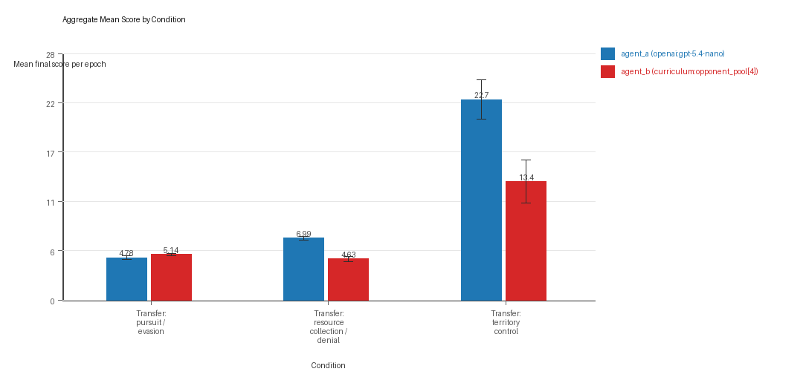
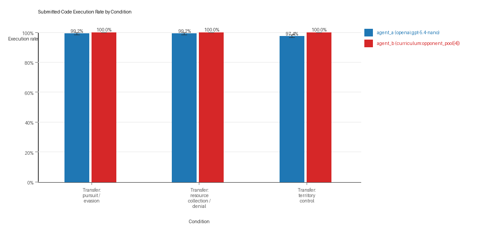
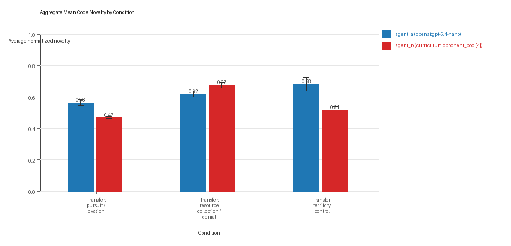
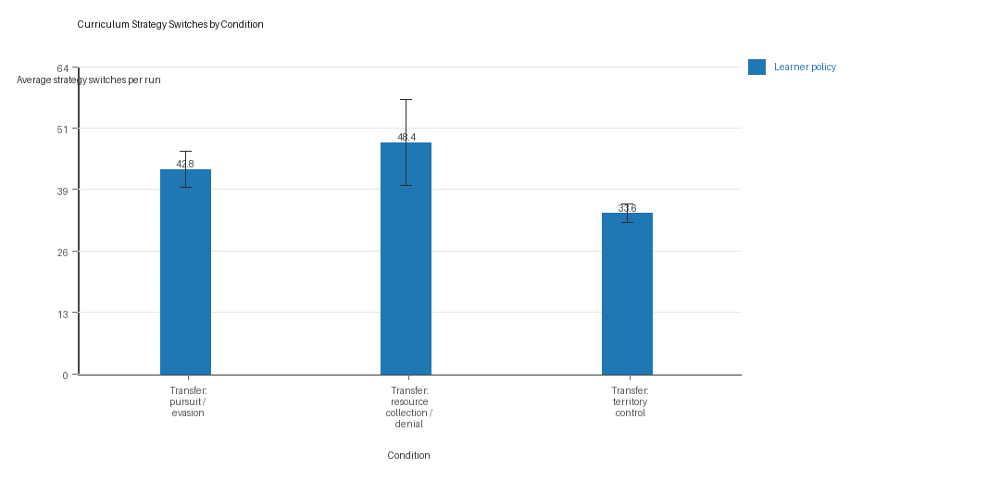
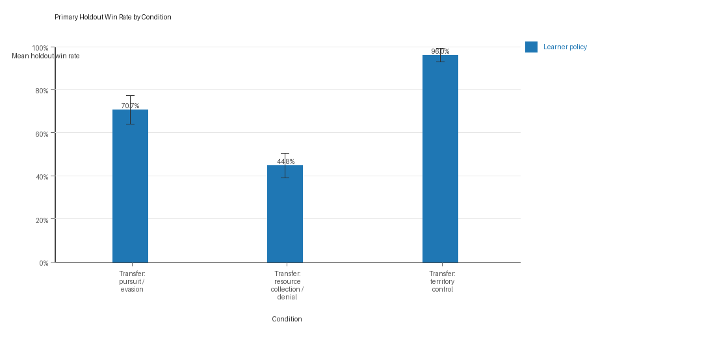

# Aggregate Research Report

## Included Runs
- Run count: 5.
- Conditions aggregated: 3.
- Runs: `run_20260507_134529_a`, `run_20260507_145614_b`, `run_20260507_155959_c`, `run_20260507_170441_d`, `run_20260507_181002_e`.

## Cross-Run Summary
- This aggregate uses curriculum-style learner-versus-opponent-pool conditions, so same-model versus cross-model summaries are secondary.
- Curriculum loop count mean 0.0 (std 0.0, 95% CI 0.0 to 0.0).
- Curriculum strategy switches mean 41.6 (std 3.0037, 95% CI 38.9672 to 44.2328).
- Curriculum post-loss novelty spikes mean 36.0 (std 2.2361, 95% CI 34.04 to 37.96).
- Curriculum specific adaptation count mean 19.3333 (std 1.2248, 95% CI 18.2598 to 20.4069).
- Curriculum behavior-cell coverage mean 16.8 (std 0.9603, 95% CI 15.9583 to 17.6417).
- Primary holdout win rate mean 0.7049 (std 0.0296, 95% CI 0.679 to 0.7308).
- Primary holdout score margin mean 10.3604 (std 3.6034, 95% CI 7.202 to 13.5189).

## Aggregate Charts
### Mean Score by Condition

- Each bar shows the mean final score per epoch for one agent role in that condition.
- Error bars show the 95% confidence interval across the included runs.

### Submitted-Code Execution Rate by Condition

- The y-axis is the percentage of epochs where submitted code executed instead of a fallback policy.
- Values near 100% indicate the infrastructure stayed reliable across the included runs.

### Mean Code Novelty by Condition

- Novelty is the average normalized code-change score across epochs for that agent role and condition.
- Higher bars indicate more code variation across repeated runs, not necessarily better performance.

### Curriculum Loop Signals

- Higher bars indicate more repeated motifs or unchanged-policy loops under the curriculum conditions.

### Curriculum Strategy Switches

- Higher bars indicate more switches between heuristic or behavior classes across epochs.

### Primary Holdout Win Rate

- This is the main evaluation endpoint for holdout-first ablation studies.
- Higher bars mean the accepted learner policy won more often against opponents that were not used as the training objective.

## Condition Results
### transfer_pursuit_evasion
- Curriculum roles: learner = agent_a (openai:gpt-5.4-nano); opponent role = agent_b (curriculum:opponent_pool[4]).
- Environment: pursuit_evasion.
- Fully clean run count: 2/5.
- Primary endpoint: held-out win rate mean 0.7067 (std 0.076, 95% CI 0.64 to 0.7733); held-out score margin mean 3.8667 (std 1.3984, 95% CI 2.6409 to 5.0924).
- Research tags: environment_family=multi_environment_transfer, factorial_goal=generalizable_adaptation, primary_endpoint=holdout_win_rate, recipe=rotating+nemesis+novelty+replay, recipe_source_condition=rotating_plus_nemesis_novelty_replay, replicate_label=a, seed_offset=0, study_phase=phase_3, suite_family=transfer_suite, transfer_environment=pursuit_evasion; environment_family=multi_environment_transfer, factorial_goal=generalizable_adaptation, primary_endpoint=holdout_win_rate, recipe=rotating+nemesis+novelty+replay, recipe_source_condition=rotating_plus_nemesis_novelty_replay, replicate_label=b, seed_offset=1000, study_phase=phase_3, suite_family=transfer_suite, transfer_environment=pursuit_evasion; environment_family=multi_environment_transfer, factorial_goal=generalizable_adaptation, primary_endpoint=holdout_win_rate, recipe=rotating+nemesis+novelty+replay, recipe_source_condition=rotating_plus_nemesis_novelty_replay, replicate_label=c, seed_offset=2000, study_phase=phase_3, suite_family=transfer_suite, transfer_environment=pursuit_evasion; environment_family=multi_environment_transfer, factorial_goal=generalizable_adaptation, primary_endpoint=holdout_win_rate, recipe=rotating+nemesis+novelty+replay, recipe_source_condition=rotating_plus_nemesis_novelty_replay, replicate_label=d, seed_offset=3000, study_phase=phase_3, suite_family=transfer_suite, transfer_environment=pursuit_evasion; environment_family=multi_environment_transfer, factorial_goal=generalizable_adaptation, primary_endpoint=holdout_win_rate, recipe=rotating+nemesis+novelty+replay, recipe_source_condition=rotating_plus_nemesis_novelty_replay, replicate_label=e, seed_offset=4000, study_phase=phase_3, suite_family=transfer_suite, transfer_environment=pursuit_evasion.
- agent_a (openai:gpt-5.4-nano) average score: agent_a (openai:gpt-5.4-nano) mean 4.78 (std 0.2168, 95% CI 4.59 to 4.97).
- agent_a (openai:gpt-5.4-nano) generation success rate: agent_a (openai:gpt-5.4-nano) mean 0.992 (std 0.0084, 95% CI 0.9847 to 0.9993).
- agent_a (openai:gpt-5.4-nano) submitted-code execution rate: agent_a (openai:gpt-5.4-nano) mean 0.992 (std 0.0084, 95% CI 0.9847 to 0.9993).
- agent_a (openai:gpt-5.4-nano) novelty: agent_a (openai:gpt-5.4-nano) mean 0.5628 (std 0.0217, 95% CI 0.5438 to 0.5819).
- agent_a (openai:gpt-5.4-nano) rule-boundary indicator count: agent_a (openai:gpt-5.4-nano) mean 0.6 (std 0.8944, 95% CI 0.0 to 1.384).
- agent_b (curriculum:opponent_pool[4]) average score: agent_b (curriculum:opponent_pool[4]) mean 5.1356 (std 0.1778, 95% CI 4.9797 to 5.2915).
- agent_b (curriculum:opponent_pool[4]) generation success rate: agent_b (curriculum:opponent_pool[4]) mean 1.0 (std 0.0, 95% CI 1.0 to 1.0).
- agent_b (curriculum:opponent_pool[4]) submitted-code execution rate: agent_b (curriculum:opponent_pool[4]) mean 1.0 (std 0.0, 95% CI 1.0 to 1.0).
- agent_b (curriculum:opponent_pool[4]) novelty: agent_b (curriculum:opponent_pool[4]) mean 0.4677 (std 0.0073, 95% CI 0.4613 to 0.4742).
- agent_b (curriculum:opponent_pool[4]) rule-boundary indicator count: agent_b (curriculum:opponent_pool[4]) mean 0.0 (std 0.0, 95% CI 0.0 to 0.0).
- Learner loop count: learner mean 0.0 (std 0.0, 95% CI 0.0 to 0.0).
- Learner stable strategy switches: learner mean 42.8 (std 4.3243, 95% CI 39.0095 to 46.5905).
- Learner post-loss novelty spikes: learner mean 51.6 (std 1.8166, 95% CI 50.0077 to 53.1923).
- Learner same-opponent adaptation count: learner mean 14.2 (std 3.3466, 95% CI 11.2665 to 17.1335).
- Learner behavior-cell coverage: learner mean 7.4 (std 1.3416, 95% CI 6.224 to 8.576).
- Elite archive coverage: elite archive coverage mean 4.0 (std 1.0, 95% CI 3.1235 to 4.8765).
- agent_a win share: agent_a mean 0.478 (std 0.0217, 95% CI 0.459 to 0.497).
- agent_b win share: agent_b mean 0.522 (std 0.0217, 95% CI 0.503 to 0.541).
- draw win share: draw mean 0.0 (std 0.0, 95% CI 0.0 to 0.0).
- Holdout evaluation was enabled in 5/5 runs for this condition.
- Holdout `evasion_axis_flip` mean margin: evasion_axis_flip mean 9.082 (std 0.0268, 95% CI 9.0585 to 9.1055).
- Holdout `evasion_axis_flip` win rate: evasion_axis_flip mean 1.0 (std 0.0, 95% CI 1.0 to 1.0).
- Holdout `evasion_center_weave` mean margin: evasion_center_weave mean 6.45 (std 4.7993, 95% CI 2.2432 to 10.6568).
- Holdout `evasion_center_weave` win rate: evasion_center_weave mean 0.84 (std 0.2608, 95% CI 0.6114 to 1.0).
- Holdout `evasion_midline_dodge` mean margin: evasion_midline_dodge mean -3.932 (std 3.2296, 95% CI -6.7629 to -1.1011).
- Holdout `evasion_midline_dodge` win rate: evasion_midline_dodge mean 0.28 (std 0.1789, 95% CI 0.1232 to 0.4368).
- Qualitative follow-up candidates:
- Follow-up candidate from `run_20260507_134529_a`, epoch 1: largest score margin: agent_a (openai:gpt-5.4-nano) 10.0 vs agent_b (curriculum:opponent_pool[4]) 0.75.
- Follow-up candidate from `run_20260507_134529_a`, epoch 70: most runtime issues in one epoch: 120.
- Follow-up candidate from `run_20260507_134529_a`, epoch 8: first fallback/default-code epoch for agent_a (openai:gpt-5.4-nano).
- Follow-up candidate from `run_20260507_134529_a`, epoch 4: largest average code shift between consecutive epochs: 0.7622.

### transfer_resource_collection_denial
- Curriculum roles: learner = agent_a (openai:gpt-5.4-nano); opponent role = agent_b (curriculum:opponent_pool[4]).
- Environment: resource_collection.
- Fully clean run count: 2/5.
- Primary endpoint: held-out win rate mean 0.448 (std 0.0657, 95% CI 0.3904 to 0.5056); held-out score margin mean 1.048 (std 0.6773, 95% CI 0.4543 to 1.6417).
- Research tags: environment_family=multi_environment_transfer, factorial_goal=generalizable_adaptation, primary_endpoint=holdout_win_rate, recipe=rotating+nemesis+novelty+replay, recipe_source_condition=rotating_plus_nemesis_novelty_replay, replicate_label=a, seed_offset=0, study_phase=phase_3, suite_family=transfer_suite, transfer_environment=resource_collection; environment_family=multi_environment_transfer, factorial_goal=generalizable_adaptation, primary_endpoint=holdout_win_rate, recipe=rotating+nemesis+novelty+replay, recipe_source_condition=rotating_plus_nemesis_novelty_replay, replicate_label=b, seed_offset=1000, study_phase=phase_3, suite_family=transfer_suite, transfer_environment=resource_collection; environment_family=multi_environment_transfer, factorial_goal=generalizable_adaptation, primary_endpoint=holdout_win_rate, recipe=rotating+nemesis+novelty+replay, recipe_source_condition=rotating_plus_nemesis_novelty_replay, replicate_label=c, seed_offset=2000, study_phase=phase_3, suite_family=transfer_suite, transfer_environment=resource_collection; environment_family=multi_environment_transfer, factorial_goal=generalizable_adaptation, primary_endpoint=holdout_win_rate, recipe=rotating+nemesis+novelty+replay, recipe_source_condition=rotating_plus_nemesis_novelty_replay, replicate_label=d, seed_offset=3000, study_phase=phase_3, suite_family=transfer_suite, transfer_environment=resource_collection; environment_family=multi_environment_transfer, factorial_goal=generalizable_adaptation, primary_endpoint=holdout_win_rate, recipe=rotating+nemesis+novelty+replay, recipe_source_condition=rotating_plus_nemesis_novelty_replay, replicate_label=e, seed_offset=4000, study_phase=phase_3, suite_family=transfer_suite, transfer_environment=resource_collection.
- agent_a (openai:gpt-5.4-nano) average score: agent_a (openai:gpt-5.4-nano) mean 6.991 (std 0.212, 95% CI 6.8052 to 7.1768).
- agent_a (openai:gpt-5.4-nano) generation success rate: agent_a (openai:gpt-5.4-nano) mean 0.992 (std 0.0084, 95% CI 0.9847 to 0.9993).
- agent_a (openai:gpt-5.4-nano) submitted-code execution rate: agent_a (openai:gpt-5.4-nano) mean 0.992 (std 0.0084, 95% CI 0.9847 to 0.9993).
- agent_a (openai:gpt-5.4-nano) novelty: agent_a (openai:gpt-5.4-nano) mean 0.6176 (std 0.0218, 95% CI 0.5985 to 0.6367).
- agent_a (openai:gpt-5.4-nano) rule-boundary indicator count: agent_a (openai:gpt-5.4-nano) mean 0.4 (std 0.5477, 95% CI 0.0 to 0.8801).
- agent_b (curriculum:opponent_pool[4]) average score: agent_b (curriculum:opponent_pool[4]) mean 4.631 (std 0.335, 95% CI 4.3374 to 4.9246).
- agent_b (curriculum:opponent_pool[4]) generation success rate: agent_b (curriculum:opponent_pool[4]) mean 1.0 (std 0.0, 95% CI 1.0 to 1.0).
- agent_b (curriculum:opponent_pool[4]) submitted-code execution rate: agent_b (curriculum:opponent_pool[4]) mean 1.0 (std 0.0, 95% CI 1.0 to 1.0).
- agent_b (curriculum:opponent_pool[4]) novelty: agent_b (curriculum:opponent_pool[4]) mean 0.6744 (std 0.0199, 95% CI 0.657 to 0.6919).
- agent_b (curriculum:opponent_pool[4]) rule-boundary indicator count: agent_b (curriculum:opponent_pool[4]) mean 0.0 (std 0.0, 95% CI 0.0 to 0.0).
- Learner loop count: learner mean 0.0 (std 0.0, 95% CI 0.0 to 0.0).
- Learner stable strategy switches: learner mean 48.4 (std 10.2859, 95% CI 39.384 to 57.416).
- Learner post-loss novelty spikes: learner mean 29.0 (std 5.7879, 95% CI 23.9267 to 34.0733).
- Learner same-opponent adaptation count: learner mean 21.8 (std 4.6583, 95% CI 17.7168 to 25.8832).
- Learner behavior-cell coverage: learner mean 25.6 (std 1.6733, 95% CI 24.1333 to 27.0667).
- Elite archive coverage: elite archive coverage mean 7.6 (std 1.5166, 95% CI 6.2707 to 8.9293).
- agent_a win share: agent_a mean 0.534 (std 0.0713, 95% CI 0.4715 to 0.5965).
- agent_b win share: agent_b mean 0.29 (std 0.0579, 95% CI 0.2393 to 0.3407).
- draw win share: draw mean 0.176 (std 0.0391, 95% CI 0.1417 to 0.2103).
- Holdout evaluation was enabled in 5/5 runs for this condition.
- Holdout `center_rush` mean margin: center_rush mean -0.44 (std 1.0621, 95% CI -1.3709 to 0.4909).
- Holdout `center_rush` win rate: center_rush mean 0.28 (std 0.1789, 95% CI 0.1232 to 0.4368).
- Holdout `corner_guard` mean margin: corner_guard mean 0.12 (std 0.6573, 95% CI -0.4561 to 0.6961).
- Holdout `corner_guard` win rate: corner_guard mean 0.28 (std 0.228, 95% CI 0.0801 to 0.4799).
- Holdout `diagonal_probe` mean margin: diagonal_probe mean 0.32 (std 1.4601, 95% CI -0.9599 to 1.5999).
- Holdout `diagonal_probe` win rate: diagonal_probe mean 0.44 (std 0.2191, 95% CI 0.248 to 0.632).
- Holdout `edge_patrol` mean margin: edge_patrol mean 5.36 (std 0.7403, 95% CI 4.7111 to 6.0089).
- Holdout `edge_patrol` win rate: edge_patrol mean 0.88 (std 0.1095, 95% CI 0.784 to 0.976).
- Holdout `safe_collector` mean margin: safe_collector mean -0.12 (std 1.4255, 95% CI -1.3695 to 1.1295).
- Holdout `safe_collector` win rate: safe_collector mean 0.36 (std 0.3286, 95% CI 0.0719 to 0.6481).
- Qualitative follow-up candidates:
- Follow-up candidate from `run_20260507_134529_a`, epoch 22: largest score margin: agent_a (openai:gpt-5.4-nano) 0.0 vs agent_b (curriculum:opponent_pool[4]) 12.0.
- Follow-up candidate from `run_20260507_134529_a`, epoch 21: most runtime issues in one epoch: 77.
- Follow-up candidate from `run_20260507_134529_a`, epoch 7: largest average code shift between consecutive epochs: 0.8983.
- Follow-up candidate from `run_20260507_134529_a`, epoch 3: first curriculum rejection by robustness checks: rejected_by_replay_checks.

### transfer_territory_control
- Curriculum roles: learner = agent_a (openai:gpt-5.4-nano); opponent role = agent_b (curriculum:opponent_pool[4]).
- Environment: territory_control.
- Fully clean run count: 0/5.
- Primary endpoint: held-out win rate mean 0.96 (std 0.0365, 95% CI 0.928 to 0.992); held-out score margin mean 26.1666 (std 10.02, 95% CI 17.3837 to 34.9496).
- Research tags: environment_family=multi_environment_transfer, factorial_goal=generalizable_adaptation, primary_endpoint=holdout_win_rate, recipe=rotating+nemesis+novelty+replay, recipe_source_condition=rotating_plus_nemesis_novelty_replay, replicate_label=a, seed_offset=0, study_phase=phase_3, suite_family=transfer_suite, transfer_environment=territory_control; environment_family=multi_environment_transfer, factorial_goal=generalizable_adaptation, primary_endpoint=holdout_win_rate, recipe=rotating+nemesis+novelty+replay, recipe_source_condition=rotating_plus_nemesis_novelty_replay, replicate_label=b, seed_offset=1000, study_phase=phase_3, suite_family=transfer_suite, transfer_environment=territory_control; environment_family=multi_environment_transfer, factorial_goal=generalizable_adaptation, primary_endpoint=holdout_win_rate, recipe=rotating+nemesis+novelty+replay, recipe_source_condition=rotating_plus_nemesis_novelty_replay, replicate_label=c, seed_offset=2000, study_phase=phase_3, suite_family=transfer_suite, transfer_environment=territory_control; environment_family=multi_environment_transfer, factorial_goal=generalizable_adaptation, primary_endpoint=holdout_win_rate, recipe=rotating+nemesis+novelty+replay, recipe_source_condition=rotating_plus_nemesis_novelty_replay, replicate_label=d, seed_offset=3000, study_phase=phase_3, suite_family=transfer_suite, transfer_environment=territory_control; environment_family=multi_environment_transfer, factorial_goal=generalizable_adaptation, primary_endpoint=holdout_win_rate, recipe=rotating+nemesis+novelty+replay, recipe_source_condition=rotating_plus_nemesis_novelty_replay, replicate_label=e, seed_offset=4000, study_phase=phase_3, suite_family=transfer_suite, transfer_environment=territory_control.
- agent_a (openai:gpt-5.4-nano) average score: agent_a (openai:gpt-5.4-nano) mean 22.696 (std 2.5457, 95% CI 20.4646 to 24.9274).
- agent_a (openai:gpt-5.4-nano) generation success rate: agent_a (openai:gpt-5.4-nano) mean 0.974 (std 0.0114, 95% CI 0.964 to 0.984).
- agent_a (openai:gpt-5.4-nano) submitted-code execution rate: agent_a (openai:gpt-5.4-nano) mean 0.974 (std 0.0114, 95% CI 0.964 to 0.984).
- agent_a (openai:gpt-5.4-nano) novelty: agent_a (openai:gpt-5.4-nano) mean 0.6808 (std 0.0488, 95% CI 0.638 to 0.7236).
- agent_a (openai:gpt-5.4-nano) rule-boundary indicator count: agent_a (openai:gpt-5.4-nano) mean 1.8 (std 1.3038, 95% CI 0.6571 to 2.9429).
- agent_b (curriculum:opponent_pool[4]) average score: agent_b (curriculum:opponent_pool[4]) mean 13.404 (std 2.767, 95% CI 10.9786 to 15.8294).
- agent_b (curriculum:opponent_pool[4]) generation success rate: agent_b (curriculum:opponent_pool[4]) mean 1.0 (std 0.0, 95% CI 1.0 to 1.0).
- agent_b (curriculum:opponent_pool[4]) submitted-code execution rate: agent_b (curriculum:opponent_pool[4]) mean 1.0 (std 0.0, 95% CI 1.0 to 1.0).
- agent_b (curriculum:opponent_pool[4]) novelty: agent_b (curriculum:opponent_pool[4]) mean 0.514 (std 0.0266, 95% CI 0.4907 to 0.5372).
- agent_b (curriculum:opponent_pool[4]) rule-boundary indicator count: agent_b (curriculum:opponent_pool[4]) mean 0.0 (std 0.0, 95% CI 0.0 to 0.0).
- Learner loop count: learner mean 0.0 (std 0.0, 95% CI 0.0 to 0.0).
- Learner stable strategy switches: learner mean 33.6 (std 2.3022, 95% CI 31.5821 to 35.6179).
- Learner post-loss novelty spikes: learner mean 27.4 (std 4.219, 95% CI 23.7019 to 31.0981).
- Learner same-opponent adaptation count: learner mean 22.0 (std 1.5811, 95% CI 20.6141 to 23.3859).
- Learner behavior-cell coverage: learner mean 17.4 (std 2.7928, 95% CI 14.952 to 19.848).
- Elite archive coverage: elite archive coverage mean 7.4 (std 1.9494, 95% CI 5.6913 to 9.1087).
- agent_a win share: agent_a mean 0.606 (std 0.0351, 95% CI 0.5753 to 0.6367).
- agent_b win share: agent_b mean 0.276 (std 0.0428, 95% CI 0.2385 to 0.3135).
- draw win share: draw mean 0.118 (std 0.0432, 95% CI 0.0801 to 0.1559).
- Holdout evaluation was enabled in 5/5 runs for this condition.
- Holdout `territory_diagonal_claim` mean margin: territory_diagonal_claim mean 28.58 (std 7.0294, 95% CI 22.4185 to 34.7415).
- Holdout `territory_diagonal_claim` win rate: territory_diagonal_claim mean 0.96 (std 0.0894, 95% CI 0.8816 to 1.0).
- Holdout `territory_far_corner_claim` mean margin: territory_far_corner_claim mean 25.84 (std 10.1197, 95% CI 16.9697 to 34.7103).
- Holdout `territory_far_corner_claim` win rate: territory_far_corner_claim mean 0.96 (std 0.0894, 95% CI 0.8816 to 1.0).
- Holdout `territory_quadrant_claim` mean margin: territory_quadrant_claim mean 24.08 (std 21.9716, 95% CI 4.821 to 43.339).
- Holdout `territory_quadrant_claim` win rate: territory_quadrant_claim mean 0.96 (std 0.0894, 95% CI 0.8816 to 1.0).
- Qualitative follow-up candidates:
- Follow-up candidate from `run_20260507_134529_a`, epoch 50: largest score margin: agent_a (openai:gpt-5.4-nano) 64.5 vs agent_b (curriculum:opponent_pool[4]) 1.0.
- Follow-up candidate from `run_20260507_134529_a`, epoch 94: most runtime issues in one epoch: 106.
- Follow-up candidate from `run_20260507_134529_a`, epoch 1: first fallback/default-code epoch for agent_a (openai:gpt-5.4-nano).
- Follow-up candidate from `run_20260507_134529_a`, epoch 5: largest average code shift between consecutive epochs: 0.8299.

## Interpretation Caveats
- Aggregate results are only as strong as the included run set. If the input runs mix different prompts, environments, or suite definitions, treat the summary as descriptive rather than causal.
- Confidence intervals here summarize variation across run-level condition summaries; they are not substitutes for careful experimental design.
- Use this aggregate report together with per-run reports and the research checklist before making strong claims.

## Aggregate Conclusions
- Data quality summary: 0/3 conditions were fully clean, 2/3 were near-clean, and 1/3 remained higher-noise.
- This aggregate includes curriculum conditions, so the learner policy is the primary unit of analysis and opponent-role metrics are contextual.

### Best-Supported Findings
- On the primary endpoint, Transfer: territory control led with mean held-out win rate 0.96 and mean held-out margin 26.1666.
- This aggregate is organized around learner-versus-opponent-pool curriculum conditions, so same-model versus cross-model novelty is not the main comparison axis.
- Rule-boundary indicators should be interpreted condition by condition here, because these curriculum families compare opponent-pool recipes rather than same-model versus cross-model matchups.
- Curriculum loop pressure produced an average loop count of 0.0 and an average strategy-switch count of 41.6 across enabled conditions.
- Specific same-opponent adaptation signals averaged 19.3333 across enabled curriculum conditions.
- Holdout-panel evidence: Transfer: pursuit / evasion vs evasion_axis_flip: mean margin 9.082, win rate 1.0; Transfer: pursuit / evasion vs evasion_center_weave: mean margin 6.45, win rate 0.84; Transfer: pursuit / evasion vs evasion_midline_dodge: mean margin -3.932, win rate 0.28; Transfer: resource collection / denial vs center_rush: mean margin -0.44, win rate 0.28; Transfer: resource collection / denial vs corner_guard: mean margin 0.12, win rate 0.28; Transfer: resource collection / denial vs diagonal_probe: mean margin 0.32, win rate 0.44; Transfer: resource collection / denial vs edge_patrol: mean margin 5.36, win rate 0.88; Transfer: resource collection / denial vs safe_collector: mean margin -0.12, win rate 0.36; Transfer: territory control vs territory_diagonal_claim: mean margin 28.58, win rate 0.96; Transfer: territory control vs territory_far_corner_claim: mean margin 25.84, win rate 0.96; Transfer: territory control vs territory_quadrant_claim: mean margin 24.08, win rate 0.96.

### Directional Or Uncertain Findings
- Conditions classified as higher-noise should be treated as exploratory unless the same direction reappears in cleaner replicate runs.

### Claims Not Supported Yet
- The aggregate does not by itself establish causality; the strongest causal interpretations should come from replicated ablation conditions rather than from mixed-condition summaries alone.
- Code novelty is not equivalent to strategic innovation. Notable epochs and behavior traces require qualitative review.
