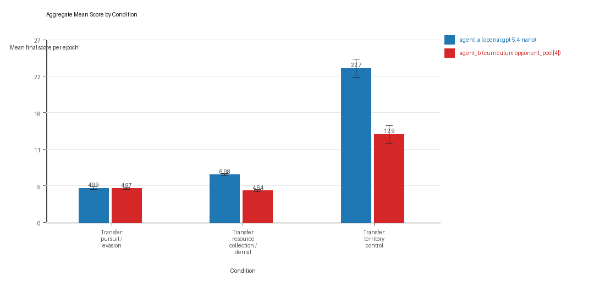
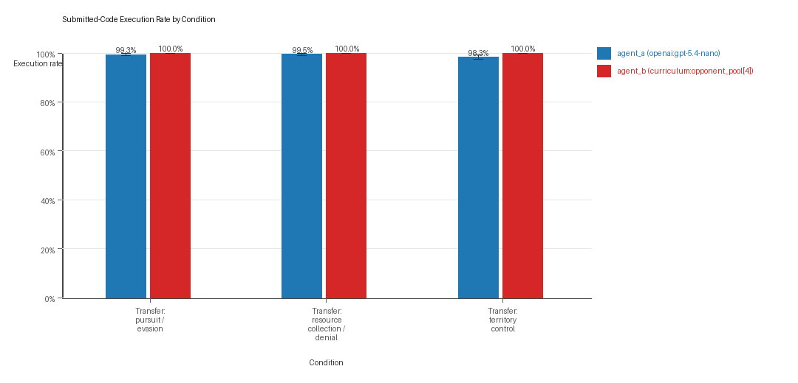
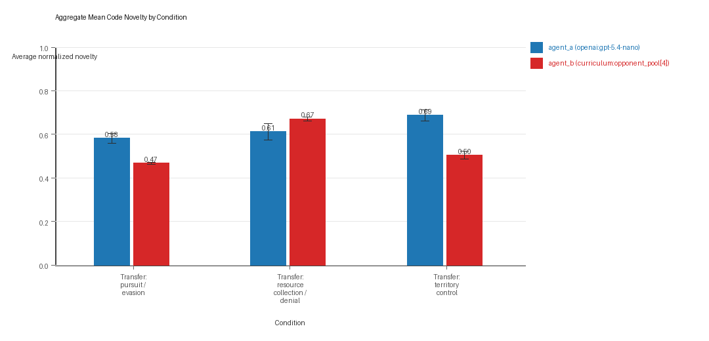
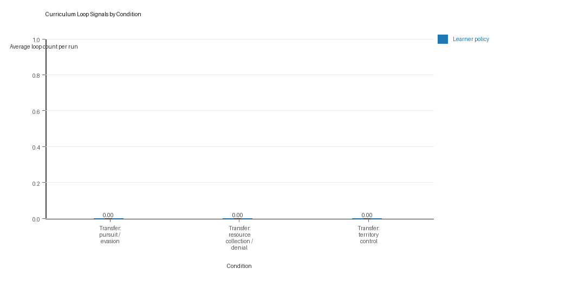
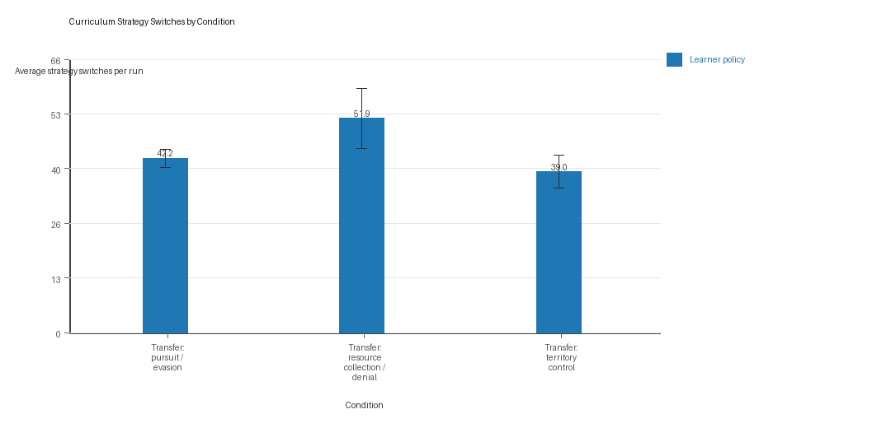
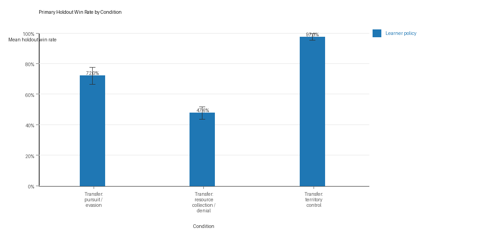

# Aggregate Research Report

## Included Runs
- Run count: 10.
- Conditions aggregated: 3.
- Runs: `run_20260507_134529_a`, `run_20260507_145614_b`, `run_20260507_155959_c`, `run_20260507_170441_d`, `run_20260507_181002_e`, `run_20260508_195738_f`, `run_20260508_214930_g`, `run_20260508_233016_h`, `run_20260509_011052_i`, `run_20260509_103847_j`.

## Cross-Run Summary
- This aggregate uses curriculum-style learner-versus-opponent-pool conditions, so same-model versus cross-model summaries are intentionally de-emphasized.
- Curriculum loop count mean 0.0 (std 0.0, 95% CI 0.0 to 0.0).
- Curriculum strategy switches mean 44.3667 (std 4.4651, 95% CI 41.5992 to 47.1341).
- Curriculum post-loss novelty spikes mean 33.9333 (std 2.8363, 95% CI 32.1754 to 35.6912).
- Curriculum specific adaptation count mean 19.2333 (std 1.8193, 95% CI 18.1057 to 20.3609).
- Curriculum behavior-cell coverage mean 16.0 (std 1.5555, 95% CI 15.0359 to 16.9641).
- Primary holdout win rate mean 0.7231 (std 0.0313, 95% CI 0.7037 to 0.7425).
- Primary holdout score margin mean 11.6271 (std 3.4704, 95% CI 9.4761 to 13.7781).

## Aggregate Charts
### Mean Score by Condition

- Each bar shows the mean final score per epoch for one agent role in that condition.
- Error bars show the 95% confidence interval across the included runs.

### Submitted-Code Execution Rate by Condition

- The y-axis is the percentage of epochs where submitted code executed instead of a fallback policy.
- Values near 100% indicate the infrastructure stayed reliable across the included runs.

### Mean Code Novelty by Condition

- Novelty is the average normalized code-change score across epochs for that agent role and condition.
- Higher bars indicate more code variation across repeated runs, not necessarily better performance.

### Curriculum Loop Signals

- Higher bars indicate more repeated motifs or unchanged-policy loops under the curriculum conditions.

### Curriculum Strategy Switches

- Higher bars indicate more switches between heuristic or behavior classes across epochs.

### Primary Holdout Win Rate

- This is the main evaluation endpoint for holdout-first ablation studies.
- Higher bars mean the accepted learner policy won more often against opponents that were not used as the training objective.

## Condition Results
### transfer_pursuit_evasion
- Curriculum roles: learner = agent_a (openai:gpt-5.4-nano); opponent role = agent_b (curriculum:opponent_pool[4]).
- Environment: pursuit_evasion.
- Fully clean run count: 4/10.
- Primary endpoint: held-out win rate mean 0.72 (std 0.0878, 95% CI 0.6656 to 0.7744); held-out score margin mean 4.074 (std 1.5806, 95% CI 3.0943 to 5.0537).
- Research tags: environment_family=multi_environment_transfer, factorial_goal=generalizable_adaptation, primary_endpoint=holdout_win_rate, recipe=rotating+nemesis+novelty+replay, recipe_source_condition=rotating_plus_nemesis_novelty_replay, replicate_label=a, seed_offset=0, study_phase=phase_3, suite_family=transfer_suite, transfer_environment=pursuit_evasion; environment_family=multi_environment_transfer, factorial_goal=generalizable_adaptation, primary_endpoint=holdout_win_rate, recipe=rotating+nemesis+novelty+replay, recipe_source_condition=rotating_plus_nemesis_novelty_replay, replicate_label=b, seed_offset=1000, study_phase=phase_3, suite_family=transfer_suite, transfer_environment=pursuit_evasion; environment_family=multi_environment_transfer, factorial_goal=generalizable_adaptation, primary_endpoint=holdout_win_rate, recipe=rotating+nemesis+novelty+replay, recipe_source_condition=rotating_plus_nemesis_novelty_replay, replicate_label=c, seed_offset=2000, study_phase=phase_3, suite_family=transfer_suite, transfer_environment=pursuit_evasion; environment_family=multi_environment_transfer, factorial_goal=generalizable_adaptation, primary_endpoint=holdout_win_rate, recipe=rotating+nemesis+novelty+replay, recipe_source_condition=rotating_plus_nemesis_novelty_replay, replicate_label=d, seed_offset=3000, study_phase=phase_3, suite_family=transfer_suite, transfer_environment=pursuit_evasion; environment_family=multi_environment_transfer, factorial_goal=generalizable_adaptation, primary_endpoint=holdout_win_rate, recipe=rotating+nemesis+novelty+replay, recipe_source_condition=rotating_plus_nemesis_novelty_replay, replicate_label=e, seed_offset=4000, study_phase=phase_3, suite_family=transfer_suite, transfer_environment=pursuit_evasion; environment_family=multi_environment_transfer, factorial_goal=generalizable_adaptation, primary_endpoint=holdout_win_rate, recipe=rotating+nemesis+novelty+replay, recipe_source_condition=rotating_plus_nemesis_novelty_replay, replicate_label=f, seed_offset=5000, study_phase=phase_4, suite_family=transfer_suite, transfer_environment=pursuit_evasion; environment_family=multi_environment_transfer, factorial_goal=generalizable_adaptation, primary_endpoint=holdout_win_rate, recipe=rotating+nemesis+novelty+replay, recipe_source_condition=rotating_plus_nemesis_novelty_replay, replicate_label=g, seed_offset=6000, study_phase=phase_4, suite_family=transfer_suite, transfer_environment=pursuit_evasion; environment_family=multi_environment_transfer, factorial_goal=generalizable_adaptation, primary_endpoint=holdout_win_rate, recipe=rotating+nemesis+novelty+replay, recipe_source_condition=rotating_plus_nemesis_novelty_replay, replicate_label=h, seed_offset=7000, study_phase=phase_4, suite_family=transfer_suite, transfer_environment=pursuit_evasion; environment_family=multi_environment_transfer, factorial_goal=generalizable_adaptation, primary_endpoint=holdout_win_rate, recipe=rotating+nemesis+novelty+replay, recipe_source_condition=rotating_plus_nemesis_novelty_replay, replicate_label=i, seed_offset=8000, study_phase=phase_4, suite_family=transfer_suite, transfer_environment=pursuit_evasion; environment_family=multi_environment_transfer, factorial_goal=generalizable_adaptation, primary_endpoint=holdout_win_rate, recipe=rotating+nemesis+novelty+replay, recipe_source_condition=rotating_plus_nemesis_novelty_replay, replicate_label=j, seed_offset=9000, study_phase=phase_4, suite_family=transfer_suite, transfer_environment=pursuit_evasion.
- agent_a (openai:gpt-5.4-nano) average score: agent_a (openai:gpt-5.4-nano) mean 4.99 (std 0.3213, 95% CI 4.7909 to 5.1891).
- agent_a (openai:gpt-5.4-nano) generation success rate: agent_a (openai:gpt-5.4-nano) mean 0.993 (std 0.0067, 95% CI 0.9888 to 0.9972).
- agent_a (openai:gpt-5.4-nano) submitted-code execution rate: agent_a (openai:gpt-5.4-nano) mean 0.993 (std 0.0067, 95% CI 0.9888 to 0.9972).
- agent_a (openai:gpt-5.4-nano) novelty: agent_a (openai:gpt-5.4-nano) mean 0.5814 (std 0.0359, 95% CI 0.5592 to 0.6037).
- agent_a (openai:gpt-5.4-nano) rule-boundary indicator count: agent_a (openai:gpt-5.4-nano) mean 0.4 (std 0.6992, 95% CI 0.0 to 0.8334).
- agent_b (curriculum:opponent_pool[4]) average score: agent_b (curriculum:opponent_pool[4]) mean 4.9717 (std 0.2569, 95% CI 4.8125 to 5.1309).
- agent_b (curriculum:opponent_pool[4]) generation success rate: agent_b (curriculum:opponent_pool[4]) mean 1.0 (std 0.0, 95% CI 1.0 to 1.0).
- agent_b (curriculum:opponent_pool[4]) submitted-code execution rate: agent_b (curriculum:opponent_pool[4]) mean 1.0 (std 0.0, 95% CI 1.0 to 1.0).
- agent_b (curriculum:opponent_pool[4]) novelty: agent_b (curriculum:opponent_pool[4]) mean 0.467 (std 0.0083, 95% CI 0.4618 to 0.4721).
- agent_b (curriculum:opponent_pool[4]) rule-boundary indicator count: agent_b (curriculum:opponent_pool[4]) mean 0.0 (std 0.0, 95% CI 0.0 to 0.0).
- Learner loop count: learner mean 0.0 (std 0.0, 95% CI 0.0 to 0.0).
- Learner stable strategy switches: learner mean 42.2 (std 3.5528, 95% CI 39.998 to 44.402).
- Learner post-loss novelty spikes: learner mean 49.6 (std 3.0258, 95% CI 47.7246 to 51.4754).
- Learner same-opponent adaptation count: learner mean 15.9 (std 4.3063, 95% CI 13.2309 to 18.5691).
- Learner behavior-cell coverage: learner mean 7.3 (std 1.4181, 95% CI 6.421 to 8.179).
- Elite archive coverage: elite archive coverage mean 4.3 (std 1.0593, 95% CI 3.6434 to 4.9566).
- agent_a win share: agent_a mean 0.499 (std 0.0321, 95% CI 0.4791 to 0.5189).
- agent_b win share: agent_b mean 0.501 (std 0.0321, 95% CI 0.4811 to 0.5209).
- draw win share: draw mean 0.0 (std 0.0, 95% CI 0.0 to 0.0).
- Holdout evaluation was enabled in 10/10 runs for this condition.
- Holdout `evasion_axis_flip` mean margin: evasion_axis_flip mean 9.07 (std 0.0346, 95% CI 9.0485 to 9.0915).
- Holdout `evasion_axis_flip` win rate: evasion_axis_flip mean 1.0 (std 0.0, 95% CI 1.0 to 1.0).
- Holdout `evasion_center_weave` mean margin: evasion_center_weave mean 6.061 (std 4.0528, 95% CI 3.5491 to 8.5729).
- Holdout `evasion_center_weave` win rate: evasion_center_weave mean 0.82 (std 0.2201, 95% CI 0.6836 to 0.9564).
- Holdout `evasion_midline_dodge` mean margin: evasion_midline_dodge mean -2.909 (std 3.7277, 95% CI -5.2195 to -0.5985).
- Holdout `evasion_midline_dodge` win rate: evasion_midline_dodge mean 0.34 (std 0.2119, 95% CI 0.2087 to 0.4713).
- Qualitative follow-up candidates:
- Follow-up candidate from `run_20260507_134529_a`, epoch 1: largest score margin: agent_a (openai:gpt-5.4-nano) 10.0 vs agent_b (curriculum:opponent_pool[4]) 0.75.
- Follow-up candidate from `run_20260507_134529_a`, epoch 70: most runtime issues in one epoch: 120.
- Follow-up candidate from `run_20260507_134529_a`, epoch 8: first fallback/default-code epoch for agent_a (openai:gpt-5.4-nano).
- Follow-up candidate from `run_20260507_134529_a`, epoch 4: largest average code shift between consecutive epochs: 0.7622.

### transfer_resource_collection_denial
- Curriculum roles: learner = agent_a (openai:gpt-5.4-nano); opponent role = agent_b (curriculum:opponent_pool[4]).
- Environment: resource_collection.
- Fully clean run count: 6/10.
- Primary endpoint: held-out win rate mean 0.476 (std 0.0665, 95% CI 0.4348 to 0.5172); held-out score margin mean 1.184 (std 0.7439, 95% CI 0.723 to 1.645).
- Research tags: environment_family=multi_environment_transfer, factorial_goal=generalizable_adaptation, primary_endpoint=holdout_win_rate, recipe=rotating+nemesis+novelty+replay, recipe_source_condition=rotating_plus_nemesis_novelty_replay, replicate_label=a, seed_offset=0, study_phase=phase_3, suite_family=transfer_suite, transfer_environment=resource_collection; environment_family=multi_environment_transfer, factorial_goal=generalizable_adaptation, primary_endpoint=holdout_win_rate, recipe=rotating+nemesis+novelty+replay, recipe_source_condition=rotating_plus_nemesis_novelty_replay, replicate_label=b, seed_offset=1000, study_phase=phase_3, suite_family=transfer_suite, transfer_environment=resource_collection; environment_family=multi_environment_transfer, factorial_goal=generalizable_adaptation, primary_endpoint=holdout_win_rate, recipe=rotating+nemesis+novelty+replay, recipe_source_condition=rotating_plus_nemesis_novelty_replay, replicate_label=c, seed_offset=2000, study_phase=phase_3, suite_family=transfer_suite, transfer_environment=resource_collection; environment_family=multi_environment_transfer, factorial_goal=generalizable_adaptation, primary_endpoint=holdout_win_rate, recipe=rotating+nemesis+novelty+replay, recipe_source_condition=rotating_plus_nemesis_novelty_replay, replicate_label=d, seed_offset=3000, study_phase=phase_3, suite_family=transfer_suite, transfer_environment=resource_collection; environment_family=multi_environment_transfer, factorial_goal=generalizable_adaptation, primary_endpoint=holdout_win_rate, recipe=rotating+nemesis+novelty+replay, recipe_source_condition=rotating_plus_nemesis_novelty_replay, replicate_label=e, seed_offset=4000, study_phase=phase_3, suite_family=transfer_suite, transfer_environment=resource_collection; environment_family=multi_environment_transfer, factorial_goal=generalizable_adaptation, primary_endpoint=holdout_win_rate, recipe=rotating+nemesis+novelty+replay, recipe_source_condition=rotating_plus_nemesis_novelty_replay, replicate_label=f, seed_offset=5000, study_phase=phase_4, suite_family=transfer_suite, transfer_environment=resource_collection; environment_family=multi_environment_transfer, factorial_goal=generalizable_adaptation, primary_endpoint=holdout_win_rate, recipe=rotating+nemesis+novelty+replay, recipe_source_condition=rotating_plus_nemesis_novelty_replay, replicate_label=g, seed_offset=6000, study_phase=phase_4, suite_family=transfer_suite, transfer_environment=resource_collection; environment_family=multi_environment_transfer, factorial_goal=generalizable_adaptation, primary_endpoint=holdout_win_rate, recipe=rotating+nemesis+novelty+replay, recipe_source_condition=rotating_plus_nemesis_novelty_replay, replicate_label=h, seed_offset=7000, study_phase=phase_4, suite_family=transfer_suite, transfer_environment=resource_collection; environment_family=multi_environment_transfer, factorial_goal=generalizable_adaptation, primary_endpoint=holdout_win_rate, recipe=rotating+nemesis+novelty+replay, recipe_source_condition=rotating_plus_nemesis_novelty_replay, replicate_label=i, seed_offset=8000, study_phase=phase_4, suite_family=transfer_suite, transfer_environment=resource_collection; environment_family=multi_environment_transfer, factorial_goal=generalizable_adaptation, primary_endpoint=holdout_win_rate, recipe=rotating+nemesis+novelty+replay, recipe_source_condition=rotating_plus_nemesis_novelty_replay, replicate_label=j, seed_offset=9000, study_phase=phase_4, suite_family=transfer_suite, transfer_environment=resource_collection.
- agent_a (openai:gpt-5.4-nano) average score: agent_a (openai:gpt-5.4-nano) mean 6.9825 (std 0.2548, 95% CI 6.8245 to 7.1405).
- agent_a (openai:gpt-5.4-nano) generation success rate: agent_a (openai:gpt-5.4-nano) mean 0.995 (std 0.0071, 95% CI 0.9906 to 0.9994).
- agent_a (openai:gpt-5.4-nano) submitted-code execution rate: agent_a (openai:gpt-5.4-nano) mean 0.995 (std 0.0071, 95% CI 0.9906 to 0.9994).
- agent_a (openai:gpt-5.4-nano) novelty: agent_a (openai:gpt-5.4-nano) mean 0.6118 (std 0.0591, 95% CI 0.5752 to 0.6485).
- agent_a (openai:gpt-5.4-nano) rule-boundary indicator count: agent_a (openai:gpt-5.4-nano) mean 0.3 (std 0.483, 95% CI 0.0006 to 0.5994).
- agent_b (curriculum:opponent_pool[4]) average score: agent_b (curriculum:opponent_pool[4]) mean 4.6435 (std 0.2577, 95% CI 4.4838 to 4.8032).
- agent_b (curriculum:opponent_pool[4]) generation success rate: agent_b (curriculum:opponent_pool[4]) mean 1.0 (std 0.0, 95% CI 1.0 to 1.0).
- agent_b (curriculum:opponent_pool[4]) submitted-code execution rate: agent_b (curriculum:opponent_pool[4]) mean 1.0 (std 0.0, 95% CI 1.0 to 1.0).
- agent_b (curriculum:opponent_pool[4]) novelty: agent_b (curriculum:opponent_pool[4]) mean 0.6715 (std 0.0146, 95% CI 0.6625 to 0.6806).
- agent_b (curriculum:opponent_pool[4]) rule-boundary indicator count: agent_b (curriculum:opponent_pool[4]) mean 0.0 (std 0.0, 95% CI 0.0 to 0.0).
- Learner loop count: learner mean 0.0 (std 0.0, 95% CI 0.0 to 0.0).
- Learner stable strategy switches: learner mean 51.9 (std 11.6852, 95% CI 44.6574 to 59.1426).
- Learner post-loss novelty spikes: learner mean 25.8 (std 5.7697, 95% CI 22.2239 to 29.3761).
- Learner same-opponent adaptation count: learner mean 20.3 (std 3.8887, 95% CI 17.8897 to 22.7103).
- Learner behavior-cell coverage: learner mean 23.8 (std 3.3599, 95% CI 21.7175 to 25.8825).
- Elite archive coverage: elite archive coverage mean 8.3 (std 1.4944, 95% CI 7.3737 to 9.2263).
- agent_a win share: agent_a mean 0.548 (std 0.0577, 95% CI 0.5122 to 0.5838).
- agent_b win share: agent_b mean 0.259 (std 0.057, 95% CI 0.2236 to 0.2944).
- draw win share: draw mean 0.193 (std 0.038, 95% CI 0.1694 to 0.2166).
- Holdout evaluation was enabled in 10/10 runs for this condition.
- Holdout `center_rush` mean margin: center_rush mean 0.86 (std 2.1603, 95% CI -0.479 to 2.199).
- Holdout `center_rush` win rate: center_rush mean 0.5 (std 0.2708, 95% CI 0.3322 to 0.6678).
- Holdout `corner_guard` mean margin: corner_guard mean 0.16 (std 0.6096, 95% CI -0.2178 to 0.5378).
- Holdout `corner_guard` win rate: corner_guard mean 0.28 (std 0.1687, 95% CI 0.1755 to 0.3845).
- Holdout `diagonal_probe` mean margin: diagonal_probe mean -0.02 (std 1.8268, 95% CI -1.1523 to 1.1123).
- Holdout `diagonal_probe` win rate: diagonal_probe mean 0.4 (std 0.2108, 95% CI 0.2693 to 0.5307).
- Holdout `edge_patrol` mean margin: edge_patrol mean 5.3 (std 0.7789, 95% CI 4.8172 to 5.7828).
- Holdout `edge_patrol` win rate: edge_patrol mean 0.92 (std 0.1033, 95% CI 0.856 to 0.984).
- Holdout `safe_collector` mean margin: safe_collector mean -0.38 (std 1.0973, 95% CI -1.0601 to 0.3001).
- Holdout `safe_collector` win rate: safe_collector mean 0.28 (std 0.253, 95% CI 0.1232 to 0.4368).
- Qualitative follow-up candidates:
- Follow-up candidate from `run_20260507_134529_a`, epoch 22: largest score margin: agent_a (openai:gpt-5.4-nano) 0.0 vs agent_b (curriculum:opponent_pool[4]) 12.0.
- Follow-up candidate from `run_20260507_134529_a`, epoch 21: most runtime issues in one epoch: 77.
- Follow-up candidate from `run_20260507_134529_a`, epoch 7: largest average code shift between consecutive epochs: 0.8983.
- Follow-up candidate from `run_20260507_134529_a`, epoch 3: first curriculum rejection by robustness checks: rejected_by_replay_checks.

### transfer_territory_control
- Curriculum roles: learner = agent_a (openai:gpt-5.4-nano); opponent role = agent_b (curriculum:opponent_pool[4]).
- Environment: territory_control.
- Fully clean run count: 2/10.
- Primary endpoint: held-out win rate mean 0.9733 (std 0.0344, 95% CI 0.952 to 0.9947); held-out score margin mean 29.6233 (std 9.5808, 95% CI 23.6851 to 35.5615).
- Research tags: environment_family=multi_environment_transfer, factorial_goal=generalizable_adaptation, primary_endpoint=holdout_win_rate, recipe=rotating+nemesis+novelty+replay, recipe_source_condition=rotating_plus_nemesis_novelty_replay, replicate_label=a, seed_offset=0, study_phase=phase_3, suite_family=transfer_suite, transfer_environment=territory_control; environment_family=multi_environment_transfer, factorial_goal=generalizable_adaptation, primary_endpoint=holdout_win_rate, recipe=rotating+nemesis+novelty+replay, recipe_source_condition=rotating_plus_nemesis_novelty_replay, replicate_label=b, seed_offset=1000, study_phase=phase_3, suite_family=transfer_suite, transfer_environment=territory_control; environment_family=multi_environment_transfer, factorial_goal=generalizable_adaptation, primary_endpoint=holdout_win_rate, recipe=rotating+nemesis+novelty+replay, recipe_source_condition=rotating_plus_nemesis_novelty_replay, replicate_label=c, seed_offset=2000, study_phase=phase_3, suite_family=transfer_suite, transfer_environment=territory_control; environment_family=multi_environment_transfer, factorial_goal=generalizable_adaptation, primary_endpoint=holdout_win_rate, recipe=rotating+nemesis+novelty+replay, recipe_source_condition=rotating_plus_nemesis_novelty_replay, replicate_label=d, seed_offset=3000, study_phase=phase_3, suite_family=transfer_suite, transfer_environment=territory_control; environment_family=multi_environment_transfer, factorial_goal=generalizable_adaptation, primary_endpoint=holdout_win_rate, recipe=rotating+nemesis+novelty+replay, recipe_source_condition=rotating_plus_nemesis_novelty_replay, replicate_label=e, seed_offset=4000, study_phase=phase_3, suite_family=transfer_suite, transfer_environment=territory_control; environment_family=multi_environment_transfer, factorial_goal=generalizable_adaptation, primary_endpoint=holdout_win_rate, recipe=rotating+nemesis+novelty+replay, recipe_source_condition=rotating_plus_nemesis_novelty_replay, replicate_label=f, seed_offset=5000, study_phase=phase_4, suite_family=transfer_suite, transfer_environment=territory_control; environment_family=multi_environment_transfer, factorial_goal=generalizable_adaptation, primary_endpoint=holdout_win_rate, recipe=rotating+nemesis+novelty+replay, recipe_source_condition=rotating_plus_nemesis_novelty_replay, replicate_label=g, seed_offset=6000, study_phase=phase_4, suite_family=transfer_suite, transfer_environment=territory_control; environment_family=multi_environment_transfer, factorial_goal=generalizable_adaptation, primary_endpoint=holdout_win_rate, recipe=rotating+nemesis+novelty+replay, recipe_source_condition=rotating_plus_nemesis_novelty_replay, replicate_label=h, seed_offset=7000, study_phase=phase_4, suite_family=transfer_suite, transfer_environment=territory_control; environment_family=multi_environment_transfer, factorial_goal=generalizable_adaptation, primary_endpoint=holdout_win_rate, recipe=rotating+nemesis+novelty+replay, recipe_source_condition=rotating_plus_nemesis_novelty_replay, replicate_label=i, seed_offset=8000, study_phase=phase_4, suite_family=transfer_suite, transfer_environment=territory_control; environment_family=multi_environment_transfer, factorial_goal=generalizable_adaptation, primary_endpoint=holdout_win_rate, recipe=rotating+nemesis+novelty+replay, recipe_source_condition=rotating_plus_nemesis_novelty_replay, replicate_label=j, seed_offset=9000, study_phase=phase_4, suite_family=transfer_suite, transfer_environment=territory_control.
- agent_a (openai:gpt-5.4-nano) average score: agent_a (openai:gpt-5.4-nano) mean 22.685 (std 2.1761, 95% CI 21.3362 to 24.0338).
- agent_a (openai:gpt-5.4-nano) generation success rate: agent_a (openai:gpt-5.4-nano) mean 0.983 (std 0.0134, 95% CI 0.9747 to 0.9913).
- agent_a (openai:gpt-5.4-nano) submitted-code execution rate: agent_a (openai:gpt-5.4-nano) mean 0.983 (std 0.0134, 95% CI 0.9747 to 0.9913).
- agent_a (openai:gpt-5.4-nano) novelty: agent_a (openai:gpt-5.4-nano) mean 0.6869 (std 0.0399, 95% CI 0.6622 to 0.7117).
- agent_a (openai:gpt-5.4-nano) rule-boundary indicator count: agent_a (openai:gpt-5.4-nano) mean 1.2 (std 1.1353, 95% CI 0.4963 to 1.9037).
- agent_b (curriculum:opponent_pool[4]) average score: agent_b (curriculum:opponent_pool[4]) mean 12.937 (std 2.0914, 95% CI 11.6408 to 14.2332).
- agent_b (curriculum:opponent_pool[4]) generation success rate: agent_b (curriculum:opponent_pool[4]) mean 1.0 (std 0.0, 95% CI 1.0 to 1.0).
- agent_b (curriculum:opponent_pool[4]) submitted-code execution rate: agent_b (curriculum:opponent_pool[4]) mean 1.0 (std 0.0, 95% CI 1.0 to 1.0).
- agent_b (curriculum:opponent_pool[4]) novelty: agent_b (curriculum:opponent_pool[4]) mean 0.5043 (std 0.028, 95% CI 0.4869 to 0.5216).
- agent_b (curriculum:opponent_pool[4]) rule-boundary indicator count: agent_b (curriculum:opponent_pool[4]) mean 0.0 (std 0.0, 95% CI 0.0 to 0.0).
- Learner loop count: learner mean 0.0 (std 0.0, 95% CI 0.0 to 0.0).
- Learner stable strategy switches: learner mean 39.0 (std 6.4464, 95% CI 35.0045 to 42.9955).
- Learner post-loss novelty spikes: learner mean 26.4 (std 3.2042, 95% CI 24.414 to 28.386).
- Learner same-opponent adaptation count: learner mean 21.5 (std 1.9003, 95% CI 20.3222 to 22.6778).
- Learner behavior-cell coverage: learner mean 16.9 (std 2.1833, 95% CI 15.5468 to 18.2532).
- Elite archive coverage: elite archive coverage mean 7.4 (std 1.8974, 95% CI 6.224 to 8.576).
- agent_a win share: agent_a mean 0.615 (std 0.0284, 95% CI 0.5974 to 0.6326).
- agent_b win share: agent_b mean 0.266 (std 0.0334, 95% CI 0.2453 to 0.2867).
- draw win share: draw mean 0.119 (std 0.0367, 95% CI 0.0963 to 0.1417).
- Holdout evaluation was enabled in 10/10 runs for this condition.
- Holdout `territory_diagonal_claim` mean margin: territory_diagonal_claim mean 31.34 (std 11.5203, 95% CI 24.1996 to 38.4804).
- Holdout `territory_diagonal_claim` win rate: territory_diagonal_claim mean 0.98 (std 0.0632, 95% CI 0.9408 to 1.0).
- Holdout `territory_far_corner_claim` mean margin: territory_far_corner_claim mean 27.92 (std 13.6922, 95% CI 19.4335 to 36.4065).
- Holdout `territory_far_corner_claim` win rate: territory_far_corner_claim mean 0.96 (std 0.0843, 95% CI 0.9077 to 1.0).
- Holdout `territory_quadrant_claim` mean margin: territory_quadrant_claim mean 29.61 (std 18.0645, 95% CI 18.4135 to 40.8065).
- Holdout `territory_quadrant_claim` win rate: territory_quadrant_claim mean 0.98 (std 0.0632, 95% CI 0.9408 to 1.0).
- Qualitative follow-up candidates:
- Follow-up candidate from `run_20260507_134529_a`, epoch 50: largest score margin: agent_a (openai:gpt-5.4-nano) 64.5 vs agent_b (curriculum:opponent_pool[4]) 1.0.
- Follow-up candidate from `run_20260507_134529_a`, epoch 94: most runtime issues in one epoch: 106.
- Follow-up candidate from `run_20260507_134529_a`, epoch 1: first fallback/default-code epoch for agent_a (openai:gpt-5.4-nano).
- Follow-up candidate from `run_20260507_134529_a`, epoch 5: largest average code shift between consecutive epochs: 0.8299.

## Interpretation Caveats
- Aggregate results are only as strong as the included run set. If the input runs mix different prompts, environments, or suite definitions, treat the summary as descriptive rather than causal.
- Confidence intervals here summarize variation across run-level condition summaries; they are not substitutes for careful experimental design.
- Use this aggregate report together with per-run reports and the research checklist before making strong claims.

## Aggregate Conclusions
- Data quality summary: 0/3 conditions were fully clean, 2/3 were near-clean, and 1/3 remained higher-noise.
- This aggregate includes curriculum conditions, so the learner policy is the primary unit of analysis and opponent-role metrics are contextual.

### Best-Supported Findings
- On the primary endpoint, Transfer: territory control led with mean held-out win rate 0.9733 and mean held-out margin 29.6233.
- This aggregate is organized around learner-versus-opponent-pool curriculum conditions, so same-model versus cross-model novelty is not the main comparison axis.
- Rule-boundary indicators should be interpreted condition by condition here, because these curriculum families compare opponent-pool recipes rather than same-model versus cross-model matchups.
- Curriculum loop pressure produced an average loop count of 0.0 and an average strategy-switch count of 44.3667 across enabled conditions.
- Specific same-opponent adaptation signals averaged 19.2333 across enabled curriculum conditions.
- Holdout-panel evidence: Transfer: pursuit / evasion vs evasion_axis_flip: mean margin 9.07, win rate 1.0; Transfer: pursuit / evasion vs evasion_center_weave: mean margin 6.061, win rate 0.82; Transfer: pursuit / evasion vs evasion_midline_dodge: mean margin -2.909, win rate 0.34; Transfer: resource collection / denial vs center_rush: mean margin 0.86, win rate 0.5; Transfer: resource collection / denial vs corner_guard: mean margin 0.16, win rate 0.28; Transfer: resource collection / denial vs diagonal_probe: mean margin -0.02, win rate 0.4; Transfer: resource collection / denial vs edge_patrol: mean margin 5.3, win rate 0.92; Transfer: resource collection / denial vs safe_collector: mean margin -0.38, win rate 0.28; Transfer: territory control vs territory_diagonal_claim: mean margin 31.34, win rate 0.98; Transfer: territory control vs territory_far_corner_claim: mean margin 27.92, win rate 0.96; Transfer: territory control vs territory_quadrant_claim: mean margin 29.61, win rate 0.98.

### Directional Or Uncertain Findings
- Conditions classified as higher-noise should be treated as exploratory unless the same direction reappears in cleaner replicate runs.

### Claims Not Supported Yet
- The aggregate does not by itself establish causality; the strongest causal interpretations should come from replicated ablation conditions rather than from mixed-condition summaries alone.
- Code novelty should not be treated as equivalent to strategic innovation without qualitative review of notable epochs and behavior traces.
