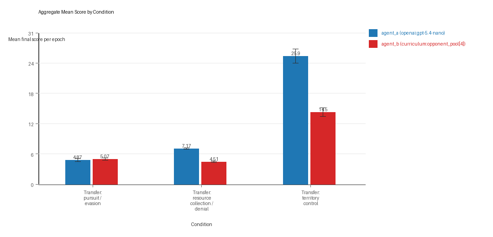
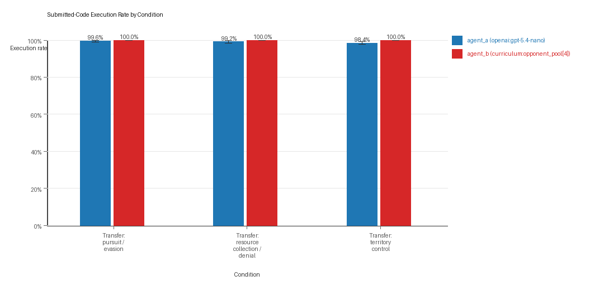
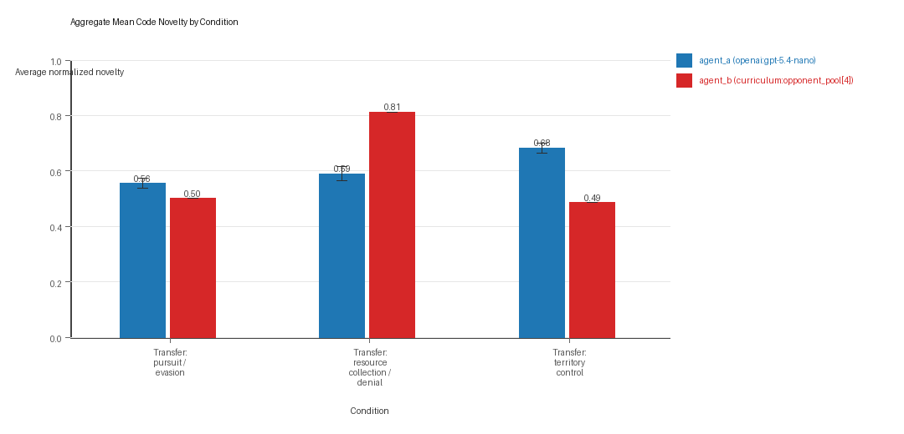
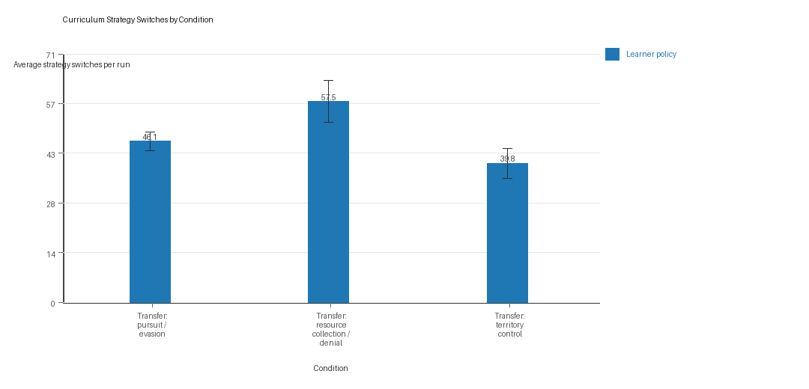
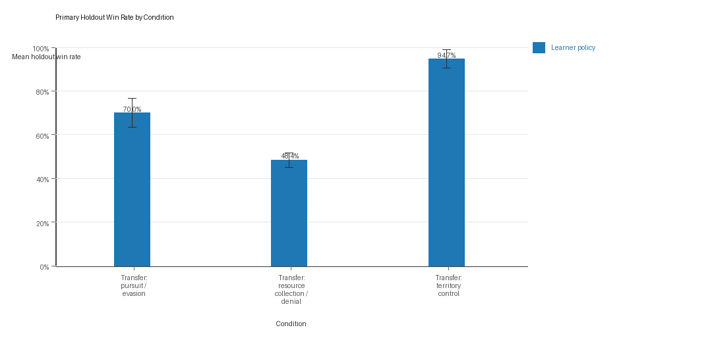

# Aggregate Research Report

## Included Runs
- Run count: 10.
- Conditions aggregated: 3.
- Runs: `run_20260509_222914_a`, `run_20260509_231935_b`, `run_20260510_000504_c`, `run_20260510_005204_d`, `run_20260510_013729_e`, `run_20260510_022236_f`, `run_20260510_031004_g`, `run_20260510_035354_h`, `run_20260510_043943_i`, `run_20260510_052825_j`.

## Cross-Run Summary
- This aggregate uses curriculum-style learner-versus-opponent-pool conditions, so same-model versus cross-model summaries are secondary.
- Curriculum loop count mean 0.0 (std 0.0, 95% CI 0.0 to 0.0).
- Curriculum strategy switches mean 47.8 (std 4.4199, 95% CI 45.0605 to 50.5395).
- Curriculum post-loss novelty spikes mean 33.9 (std 2.6437, 95% CI 32.2614 to 35.5386).
- Curriculum specific adaptation count mean 18.0 (std 2.0488, 95% CI 16.7302 to 19.2699).
- Curriculum behavior-cell coverage mean 15.4667 (std 1.4504, 95% CI 14.5677 to 16.3656).
- Primary holdout win rate mean 0.7102 (std 0.049, 95% CI 0.6798 to 0.7406).
- Primary holdout score margin mean 13.0733 (std 3.7341, 95% CI 10.7589 to 15.3878).

## Aggregate Charts
### Mean Score by Condition

- Each bar shows the mean final score per epoch for one agent role in that condition.
- Error bars show the 95% confidence interval across the included runs.

### Submitted-Code Execution Rate by Condition

- The y-axis is the percentage of epochs where submitted code executed instead of a fallback policy.
- Values near 100% indicate the infrastructure stayed reliable across the included runs.

### Mean Code Novelty by Condition

- Novelty is the average normalized code-change score across epochs for that agent role and condition.
- Higher bars indicate more code variation across repeated runs, not necessarily better performance.

### Curriculum Loop Signals

- Higher bars indicate more repeated motifs or unchanged-policy loops under the curriculum conditions.

### Curriculum Strategy Switches

- Higher bars indicate more switches between heuristic or behavior classes across epochs.

### Primary Holdout Win Rate

- This is the main evaluation endpoint for holdout-first ablation studies.
- Higher bars mean the accepted learner policy won more often against opponents that were not used as the training objective.

## Condition Results
### transfer_pursuit_evasion
- Curriculum roles: learner = agent_a (openai:gpt-5.4-nano); opponent role = agent_b (curriculum:opponent_pool[4]).
- Environment: pursuit_evasion.
- Fully clean run count: 8/10.
- Primary endpoint: held-out win rate mean 0.7 (std 0.1054, 95% CI 0.6347 to 0.7653); held-out score margin mean 3.702 (std 1.9133, 95% CI 2.5161 to 4.8879).
- Research tags: environment_family=multi_environment_transfer, factorial_goal=generalizable_adaptation, primary_endpoint=holdout_win_rate, recipe=rotating+replay_aware, recipe_source_condition=rotating_plus_replay_aware_selection, replicate_label=a, seed_offset=0, study_phase=phase_4, suite_family=transfer_suite, transfer_environment=pursuit_evasion; environment_family=multi_environment_transfer, factorial_goal=generalizable_adaptation, primary_endpoint=holdout_win_rate, recipe=rotating+replay_aware, recipe_source_condition=rotating_plus_replay_aware_selection, replicate_label=b, seed_offset=1000, study_phase=phase_4, suite_family=transfer_suite, transfer_environment=pursuit_evasion; environment_family=multi_environment_transfer, factorial_goal=generalizable_adaptation, primary_endpoint=holdout_win_rate, recipe=rotating+replay_aware, recipe_source_condition=rotating_plus_replay_aware_selection, replicate_label=c, seed_offset=2000, study_phase=phase_4, suite_family=transfer_suite, transfer_environment=pursuit_evasion; environment_family=multi_environment_transfer, factorial_goal=generalizable_adaptation, primary_endpoint=holdout_win_rate, recipe=rotating+replay_aware, recipe_source_condition=rotating_plus_replay_aware_selection, replicate_label=d, seed_offset=3000, study_phase=phase_4, suite_family=transfer_suite, transfer_environment=pursuit_evasion; environment_family=multi_environment_transfer, factorial_goal=generalizable_adaptation, primary_endpoint=holdout_win_rate, recipe=rotating+replay_aware, recipe_source_condition=rotating_plus_replay_aware_selection, replicate_label=e, seed_offset=4000, study_phase=phase_4, suite_family=transfer_suite, transfer_environment=pursuit_evasion; environment_family=multi_environment_transfer, factorial_goal=generalizable_adaptation, primary_endpoint=holdout_win_rate, recipe=rotating+replay_aware, recipe_source_condition=rotating_plus_replay_aware_selection, replicate_label=f, seed_offset=5000, study_phase=phase_4, suite_family=transfer_suite, transfer_environment=pursuit_evasion; environment_family=multi_environment_transfer, factorial_goal=generalizable_adaptation, primary_endpoint=holdout_win_rate, recipe=rotating+replay_aware, recipe_source_condition=rotating_plus_replay_aware_selection, replicate_label=g, seed_offset=6000, study_phase=phase_4, suite_family=transfer_suite, transfer_environment=pursuit_evasion; environment_family=multi_environment_transfer, factorial_goal=generalizable_adaptation, primary_endpoint=holdout_win_rate, recipe=rotating+replay_aware, recipe_source_condition=rotating_plus_replay_aware_selection, replicate_label=h, seed_offset=7000, study_phase=phase_4, suite_family=transfer_suite, transfer_environment=pursuit_evasion; environment_family=multi_environment_transfer, factorial_goal=generalizable_adaptation, primary_endpoint=holdout_win_rate, recipe=rotating+replay_aware, recipe_source_condition=rotating_plus_replay_aware_selection, replicate_label=i, seed_offset=8000, study_phase=phase_4, suite_family=transfer_suite, transfer_environment=pursuit_evasion; environment_family=multi_environment_transfer, factorial_goal=generalizable_adaptation, primary_endpoint=holdout_win_rate, recipe=rotating+replay_aware, recipe_source_condition=rotating_plus_replay_aware_selection, replicate_label=j, seed_offset=9000, study_phase=phase_4, suite_family=transfer_suite, transfer_environment=pursuit_evasion.
- agent_a (openai:gpt-5.4-nano) average score: agent_a (openai:gpt-5.4-nano) mean 4.87 (std 0.5122, 95% CI 4.5525 to 5.1875).
- agent_a (openai:gpt-5.4-nano) generation success rate: agent_a (openai:gpt-5.4-nano) mean 0.996 (std 0.0097, 95% CI 0.99 to 1.0).
- agent_a (openai:gpt-5.4-nano) submitted-code execution rate: agent_a (openai:gpt-5.4-nano) mean 0.996 (std 0.0097, 95% CI 0.99 to 1.0).
- agent_a (openai:gpt-5.4-nano) novelty: agent_a (openai:gpt-5.4-nano) mean 0.5553 (std 0.029, 95% CI 0.5373 to 0.5733).
- agent_a (openai:gpt-5.4-nano) rule-boundary indicator count: agent_a (openai:gpt-5.4-nano) mean 0.0 (std 0.0, 95% CI 0.0 to 0.0).
- agent_b (curriculum:opponent_pool[4]) average score: agent_b (curriculum:opponent_pool[4]) mean 5.0672 (std 0.4076, 95% CI 4.8145 to 5.3199).
- agent_b (curriculum:opponent_pool[4]) generation success rate: agent_b (curriculum:opponent_pool[4]) mean 1.0 (std 0.0, 95% CI 1.0 to 1.0).
- agent_b (curriculum:opponent_pool[4]) submitted-code execution rate: agent_b (curriculum:opponent_pool[4]) mean 1.0 (std 0.0, 95% CI 1.0 to 1.0).
- agent_b (curriculum:opponent_pool[4]) novelty: agent_b (curriculum:opponent_pool[4]) mean 0.5014 (std 0.0, 95% CI 0.5014 to 0.5014).
- agent_b (curriculum:opponent_pool[4]) rule-boundary indicator count: agent_b (curriculum:opponent_pool[4]) mean 0.0 (std 0.0, 95% CI 0.0 to 0.0).
- Learner loop count: learner mean 0.0 (std 0.0, 95% CI 0.0 to 0.0).
- Learner stable strategy switches: learner mean 46.1 (std 4.4083, 95% CI 43.3677 to 48.8323).
- Learner post-loss novelty spikes: learner mean 51.1 (std 5.087, 95% CI 47.947 to 54.253).
- Learner same-opponent adaptation count: learner mean 16.3 (std 3.1287, 95% CI 14.3608 to 18.2392).
- Learner behavior-cell coverage: learner mean 7.4 (std 1.3499, 95% CI 6.5633 to 8.2367).
- Elite archive coverage: elite archive coverage mean 0.0 (std 0.0, 95% CI 0.0 to 0.0).
- agent_a win share: agent_a mean 0.487 (std 0.0512, 95% CI 0.4553 to 0.5187).
- agent_b win share: agent_b mean 0.513 (std 0.0512, 95% CI 0.4813 to 0.5447).
- draw win share: draw mean 0.0 (std 0.0, 95% CI 0.0 to 0.0).
- Holdout evaluation was enabled in 10/10 runs for this condition.
- Holdout `evasion_axis_flip` mean margin: evasion_axis_flip mean 8.711 (std 1.1463, 95% CI 8.0005 to 9.4215).
- Holdout `evasion_axis_flip` win rate: evasion_axis_flip mean 0.98 (std 0.0632, 95% CI 0.9408 to 1.0).
- Holdout `evasion_center_weave` mean margin: evasion_center_weave mean 5.687 (std 4.9169, 95% CI 2.6395 to 8.7345).
- Holdout `evasion_center_weave` win rate: evasion_center_weave mean 0.8 (std 0.2667, 95% CI 0.6347 to 0.9653).
- Holdout `evasion_midline_dodge` mean margin: evasion_midline_dodge mean -3.292 (std 2.9281, 95% CI -5.1069 to -1.4771).
- Holdout `evasion_midline_dodge` win rate: evasion_midline_dodge mean 0.32 (std 0.1687, 95% CI 0.2155 to 0.4245).
- Qualitative follow-up candidates:
- Follow-up candidate from `run_20260509_222914_a`, epoch 1: largest score margin: agent_a (openai:gpt-5.4-nano) 10.0 vs agent_b (curriculum:opponent_pool[4]) 0.75.
- Follow-up candidate from `run_20260509_222914_a`, epoch 72: most runtime issues in one epoch: 120.
- Follow-up candidate from `run_20260509_222914_a`, epoch 1: first fallback/default-code epoch for agent_a (openai:gpt-5.4-nano).
- Follow-up candidate from `run_20260509_222914_a`, epoch 44: largest average code shift between consecutive epochs: 0.7616.

### transfer_resource_collection_denial
- Curriculum roles: learner = agent_a (openai:gpt-5.4-nano); opponent role = agent_b (curriculum:opponent_pool[4]).
- Environment: resource_collection.
- Fully clean run count: 6/10.
- Primary endpoint: held-out win rate mean 0.484 (std 0.0548, 95% CI 0.45 to 0.518); held-out score margin mean 1.348 (std 0.5843, 95% CI 0.9859 to 1.7101).
- Research tags: environment_family=multi_environment_transfer, factorial_goal=generalizable_adaptation, primary_endpoint=holdout_win_rate, recipe=rotating+replay_aware, recipe_source_condition=rotating_plus_replay_aware_selection, replicate_label=a, seed_offset=0, study_phase=phase_4, suite_family=transfer_suite, transfer_environment=resource_collection; environment_family=multi_environment_transfer, factorial_goal=generalizable_adaptation, primary_endpoint=holdout_win_rate, recipe=rotating+replay_aware, recipe_source_condition=rotating_plus_replay_aware_selection, replicate_label=b, seed_offset=1000, study_phase=phase_4, suite_family=transfer_suite, transfer_environment=resource_collection; environment_family=multi_environment_transfer, factorial_goal=generalizable_adaptation, primary_endpoint=holdout_win_rate, recipe=rotating+replay_aware, recipe_source_condition=rotating_plus_replay_aware_selection, replicate_label=c, seed_offset=2000, study_phase=phase_4, suite_family=transfer_suite, transfer_environment=resource_collection; environment_family=multi_environment_transfer, factorial_goal=generalizable_adaptation, primary_endpoint=holdout_win_rate, recipe=rotating+replay_aware, recipe_source_condition=rotating_plus_replay_aware_selection, replicate_label=d, seed_offset=3000, study_phase=phase_4, suite_family=transfer_suite, transfer_environment=resource_collection; environment_family=multi_environment_transfer, factorial_goal=generalizable_adaptation, primary_endpoint=holdout_win_rate, recipe=rotating+replay_aware, recipe_source_condition=rotating_plus_replay_aware_selection, replicate_label=e, seed_offset=4000, study_phase=phase_4, suite_family=transfer_suite, transfer_environment=resource_collection; environment_family=multi_environment_transfer, factorial_goal=generalizable_adaptation, primary_endpoint=holdout_win_rate, recipe=rotating+replay_aware, recipe_source_condition=rotating_plus_replay_aware_selection, replicate_label=f, seed_offset=5000, study_phase=phase_4, suite_family=transfer_suite, transfer_environment=resource_collection; environment_family=multi_environment_transfer, factorial_goal=generalizable_adaptation, primary_endpoint=holdout_win_rate, recipe=rotating+replay_aware, recipe_source_condition=rotating_plus_replay_aware_selection, replicate_label=g, seed_offset=6000, study_phase=phase_4, suite_family=transfer_suite, transfer_environment=resource_collection; environment_family=multi_environment_transfer, factorial_goal=generalizable_adaptation, primary_endpoint=holdout_win_rate, recipe=rotating+replay_aware, recipe_source_condition=rotating_plus_replay_aware_selection, replicate_label=h, seed_offset=7000, study_phase=phase_4, suite_family=transfer_suite, transfer_environment=resource_collection; environment_family=multi_environment_transfer, factorial_goal=generalizable_adaptation, primary_endpoint=holdout_win_rate, recipe=rotating+replay_aware, recipe_source_condition=rotating_plus_replay_aware_selection, replicate_label=i, seed_offset=8000, study_phase=phase_4, suite_family=transfer_suite, transfer_environment=resource_collection; environment_family=multi_environment_transfer, factorial_goal=generalizable_adaptation, primary_endpoint=holdout_win_rate, recipe=rotating+replay_aware, recipe_source_condition=rotating_plus_replay_aware_selection, replicate_label=j, seed_offset=9000, study_phase=phase_4, suite_family=transfer_suite, transfer_environment=resource_collection.
- agent_a (openai:gpt-5.4-nano) average score: agent_a (openai:gpt-5.4-nano) mean 7.1735 (std 0.2087, 95% CI 7.0441 to 7.3029).
- agent_a (openai:gpt-5.4-nano) generation success rate: agent_a (openai:gpt-5.4-nano) mean 0.992 (std 0.0155, 95% CI 0.9824 to 1.0).
- agent_a (openai:gpt-5.4-nano) submitted-code execution rate: agent_a (openai:gpt-5.4-nano) mean 0.992 (std 0.0155, 95% CI 0.9824 to 1.0).
- agent_a (openai:gpt-5.4-nano) novelty: agent_a (openai:gpt-5.4-nano) mean 0.59 (std 0.0428, 95% CI 0.5635 to 0.6165).
- agent_a (openai:gpt-5.4-nano) rule-boundary indicator count: agent_a (openai:gpt-5.4-nano) mean 0.0 (std 0.0, 95% CI 0.0 to 0.0).
- agent_b (curriculum:opponent_pool[4]) average score: agent_b (curriculum:opponent_pool[4]) mean 4.5135 (std 0.174, 95% CI 4.4057 to 4.6213).
- agent_b (curriculum:opponent_pool[4]) generation success rate: agent_b (curriculum:opponent_pool[4]) mean 1.0 (std 0.0, 95% CI 1.0 to 1.0).
- agent_b (curriculum:opponent_pool[4]) submitted-code execution rate: agent_b (curriculum:opponent_pool[4]) mean 1.0 (std 0.0, 95% CI 1.0 to 1.0).
- agent_b (curriculum:opponent_pool[4]) novelty: agent_b (curriculum:opponent_pool[4]) mean 0.8125 (std 0.0, 95% CI 0.8125 to 0.8125).
- agent_b (curriculum:opponent_pool[4]) rule-boundary indicator count: agent_b (curriculum:opponent_pool[4]) mean 0.0 (std 0.0, 95% CI 0.0 to 0.0).
- Learner loop count: learner mean 0.0 (std 0.0, 95% CI 0.0 to 0.0).
- Learner stable strategy switches: learner mean 57.5 (std 9.7553, 95% CI 51.4536 to 63.5464).
- Learner post-loss novelty spikes: learner mean 22.8 (std 3.9101, 95% CI 20.3765 to 25.2235).
- Learner same-opponent adaptation count: learner mean 17.8 (std 2.6162, 95% CI 16.1785 to 19.4215).
- Learner behavior-cell coverage: learner mean 20.8 (std 3.084, 95% CI 18.8885 to 22.7115).
- Elite archive coverage: elite archive coverage mean 0.0 (std 0.0, 95% CI 0.0 to 0.0).
- agent_a win share: agent_a mean 0.568 (std 0.0346, 95% CI 0.5466 to 0.5894).
- agent_b win share: agent_b mean 0.233 (std 0.0392, 95% CI 0.2087 to 0.2573).
- draw win share: draw mean 0.199 (std 0.0341, 95% CI 0.1778 to 0.2202).
- Holdout evaluation was enabled in 10/10 runs for this condition.
- Holdout `center_rush` mean margin: center_rush mean 0.98 (std 2.3083, 95% CI -0.4507 to 2.4107).
- Holdout `center_rush` win rate: center_rush mean 0.46 (std 0.2319, 95% CI 0.3163 to 0.6037).
- Holdout `corner_guard` mean margin: corner_guard mean 0.38 (std 1.0304, 95% CI -0.2587 to 1.0187).
- Holdout `corner_guard` win rate: corner_guard mean 0.36 (std 0.1578, 95% CI 0.2622 to 0.4578).
- Holdout `diagonal_probe` mean margin: diagonal_probe mean 0.26 (std 1.4968, 95% CI -0.6677 to 1.1877).
- Holdout `diagonal_probe` win rate: diagonal_probe mean 0.38 (std 0.1751, 95% CI 0.2715 to 0.4885).
- Holdout `edge_patrol` mean margin: edge_patrol mean 5.42 (std 0.7208, 95% CI 4.9732 to 5.8668).
- Holdout `edge_patrol` win rate: edge_patrol mean 0.92 (std 0.1033, 95% CI 0.856 to 0.984).
- Holdout `safe_collector` mean margin: safe_collector mean -0.3 (std 0.9809, 95% CI -0.908 to 0.308).
- Holdout `safe_collector` win rate: safe_collector mean 0.3 (std 0.216, 95% CI 0.1661 to 0.4339).
- Qualitative follow-up candidates:
- Follow-up candidate from `run_20260509_222914_a`, epoch 39: largest score margin: agent_a (openai:gpt-5.4-nano) 12.0 vs agent_b (curriculum:opponent_pool[4]) 0.0.
- Follow-up candidate from `run_20260509_222914_a`, epoch 6: most runtime issues in one epoch: 160.
- Follow-up candidate from `run_20260509_222914_a`, epoch 86: largest average code shift between consecutive epochs: 0.8405.
- Follow-up candidate from `run_20260509_231935_b`, epoch 14: largest score margin: agent_a (openai:gpt-5.4-nano) 0.0 vs agent_b (curriculum:opponent_pool[4]) 12.0.

### transfer_territory_control
- Curriculum roles: learner = agent_a (openai:gpt-5.4-nano); opponent role = agent_b (curriculum:opponent_pool[4]).
- Environment: territory_control.
- Fully clean run count: 3/10.
- Primary endpoint: held-out win rate mean 0.9467 (std 0.0689, 95% CI 0.904 to 0.9893); held-out score margin mean 34.17 (std 10.6222, 95% CI 27.5863 to 40.7537).
- Research tags: environment_family=multi_environment_transfer, factorial_goal=generalizable_adaptation, primary_endpoint=holdout_win_rate, recipe=rotating+replay_aware, recipe_source_condition=rotating_plus_replay_aware_selection, replicate_label=a, seed_offset=0, study_phase=phase_4, suite_family=transfer_suite, transfer_environment=territory_control; environment_family=multi_environment_transfer, factorial_goal=generalizable_adaptation, primary_endpoint=holdout_win_rate, recipe=rotating+replay_aware, recipe_source_condition=rotating_plus_replay_aware_selection, replicate_label=b, seed_offset=1000, study_phase=phase_4, suite_family=transfer_suite, transfer_environment=territory_control; environment_family=multi_environment_transfer, factorial_goal=generalizable_adaptation, primary_endpoint=holdout_win_rate, recipe=rotating+replay_aware, recipe_source_condition=rotating_plus_replay_aware_selection, replicate_label=c, seed_offset=2000, study_phase=phase_4, suite_family=transfer_suite, transfer_environment=territory_control; environment_family=multi_environment_transfer, factorial_goal=generalizable_adaptation, primary_endpoint=holdout_win_rate, recipe=rotating+replay_aware, recipe_source_condition=rotating_plus_replay_aware_selection, replicate_label=d, seed_offset=3000, study_phase=phase_4, suite_family=transfer_suite, transfer_environment=territory_control; environment_family=multi_environment_transfer, factorial_goal=generalizable_adaptation, primary_endpoint=holdout_win_rate, recipe=rotating+replay_aware, recipe_source_condition=rotating_plus_replay_aware_selection, replicate_label=e, seed_offset=4000, study_phase=phase_4, suite_family=transfer_suite, transfer_environment=territory_control; environment_family=multi_environment_transfer, factorial_goal=generalizable_adaptation, primary_endpoint=holdout_win_rate, recipe=rotating+replay_aware, recipe_source_condition=rotating_plus_replay_aware_selection, replicate_label=f, seed_offset=5000, study_phase=phase_4, suite_family=transfer_suite, transfer_environment=territory_control; environment_family=multi_environment_transfer, factorial_goal=generalizable_adaptation, primary_endpoint=holdout_win_rate, recipe=rotating+replay_aware, recipe_source_condition=rotating_plus_replay_aware_selection, replicate_label=g, seed_offset=6000, study_phase=phase_4, suite_family=transfer_suite, transfer_environment=territory_control; environment_family=multi_environment_transfer, factorial_goal=generalizable_adaptation, primary_endpoint=holdout_win_rate, recipe=rotating+replay_aware, recipe_source_condition=rotating_plus_replay_aware_selection, replicate_label=h, seed_offset=7000, study_phase=phase_4, suite_family=transfer_suite, transfer_environment=territory_control; environment_family=multi_environment_transfer, factorial_goal=generalizable_adaptation, primary_endpoint=holdout_win_rate, recipe=rotating+replay_aware, recipe_source_condition=rotating_plus_replay_aware_selection, replicate_label=i, seed_offset=8000, study_phase=phase_4, suite_family=transfer_suite, transfer_environment=territory_control; environment_family=multi_environment_transfer, factorial_goal=generalizable_adaptation, primary_endpoint=holdout_win_rate, recipe=rotating+replay_aware, recipe_source_condition=rotating_plus_replay_aware_selection, replicate_label=j, seed_offset=9000, study_phase=phase_4, suite_family=transfer_suite, transfer_environment=territory_control.
- agent_a (openai:gpt-5.4-nano) average score: agent_a (openai:gpt-5.4-nano) mean 25.8915 (std 2.3268, 95% CI 24.4493 to 27.3337).
- agent_a (openai:gpt-5.4-nano) generation success rate: agent_a (openai:gpt-5.4-nano) mean 0.984 (std 0.0126, 95% CI 0.9762 to 0.9918).
- agent_a (openai:gpt-5.4-nano) submitted-code execution rate: agent_a (openai:gpt-5.4-nano) mean 0.984 (std 0.0126, 95% CI 0.9762 to 0.9918).
- agent_a (openai:gpt-5.4-nano) novelty: agent_a (openai:gpt-5.4-nano) mean 0.6823 (std 0.0271, 95% CI 0.6656 to 0.6991).
- agent_a (openai:gpt-5.4-nano) rule-boundary indicator count: agent_a (openai:gpt-5.4-nano) mean 0.6 (std 0.6992, 95% CI 0.1666 to 1.0334).
- agent_b (curriculum:opponent_pool[4]) average score: agent_b (curriculum:opponent_pool[4]) mean 14.5455 (std 1.434, 95% CI 13.6567 to 15.4343).
- agent_b (curriculum:opponent_pool[4]) generation success rate: agent_b (curriculum:opponent_pool[4]) mean 1.0 (std 0.0, 95% CI 1.0 to 1.0).
- agent_b (curriculum:opponent_pool[4]) submitted-code execution rate: agent_b (curriculum:opponent_pool[4]) mean 1.0 (std 0.0, 95% CI 1.0 to 1.0).
- agent_b (curriculum:opponent_pool[4]) novelty: agent_b (curriculum:opponent_pool[4]) mean 0.4857 (std 0.0, 95% CI 0.4857 to 0.4857).
- agent_b (curriculum:opponent_pool[4]) rule-boundary indicator count: agent_b (curriculum:opponent_pool[4]) mean 0.0 (std 0.0, 95% CI 0.0 to 0.0).
- Learner loop count: learner mean 0.0 (std 0.0, 95% CI 0.0 to 0.0).
- Learner stable strategy switches: learner mean 39.8 (std 6.973, 95% CI 35.4781 to 44.1219).
- Learner post-loss novelty spikes: learner mean 27.8 (std 6.4601, 95% CI 23.796 to 31.804).
- Learner same-opponent adaptation count: learner mean 19.9 (std 4.1753, 95% CI 17.3121 to 22.4879).
- Learner behavior-cell coverage: learner mean 18.2 (std 1.3984, 95% CI 17.3333 to 19.0667).
- Elite archive coverage: elite archive coverage mean 0.0 (std 0.0, 95% CI 0.0 to 0.0).
- agent_a win share: agent_a mean 0.635 (std 0.0685, 95% CI 0.5925 to 0.6775).
- agent_b win share: agent_b mean 0.28 (std 0.0655, 95% CI 0.2394 to 0.3206).
- draw win share: draw mean 0.085 (std 0.0306, 95% CI 0.066 to 0.104).
- Holdout evaluation was enabled in 10/10 runs for this condition.
- Holdout `territory_diagonal_claim` mean margin: territory_diagonal_claim mean 35.99 (std 9.2598, 95% CI 30.2507 to 41.7293).
- Holdout `territory_diagonal_claim` win rate: territory_diagonal_claim mean 0.98 (std 0.0632, 95% CI 0.9408 to 1.0).
- Holdout `territory_far_corner_claim` mean margin: territory_far_corner_claim mean 22.8 (std 18.9984, 95% CI 11.0247 to 34.5753).
- Holdout `territory_far_corner_claim` win rate: territory_far_corner_claim mean 0.86 (std 0.2119, 95% CI 0.7287 to 0.9913).
- Holdout `territory_quadrant_claim` mean margin: territory_quadrant_claim mean 43.72 (std 10.1747, 95% CI 37.4137 to 50.0263).
- Holdout `territory_quadrant_claim` win rate: territory_quadrant_claim mean 1.0 (std 0.0, 95% CI 1.0 to 1.0).
- Qualitative follow-up candidates:
- Follow-up candidate from `run_20260509_222914_a`, epoch 28: largest score margin: agent_a (openai:gpt-5.4-nano) 64.5 vs agent_b (curriculum:opponent_pool[4]) 1.0.
- Follow-up candidate from `run_20260509_222914_a`, epoch 49: most runtime issues in one epoch: 137.
- Follow-up candidate from `run_20260509_222914_a`, epoch 24: first fallback/default-code epoch for agent_a (openai:gpt-5.4-nano).
- Follow-up candidate from `run_20260509_222914_a`, epoch 87: largest average code shift between consecutive epochs: 0.8662.

## Interpretation Caveats
- Aggregate results are only as strong as the included run set. If the input runs mix different prompts, environments, or suite definitions, treat the summary as descriptive rather than causal.
- Confidence intervals here summarize variation across run-level condition summaries; they are not substitutes for careful experimental design.
- Use this aggregate report together with per-run reports and the research checklist before making strong claims.

## Aggregate Conclusions
- Data quality summary: 0/3 conditions were fully clean, 2/3 were near-clean, and 1/3 remained higher-noise.
- This aggregate includes curriculum conditions, so the learner policy is the primary unit of analysis and opponent-role metrics are contextual.

### Best-Supported Findings
- On the primary endpoint, Transfer: territory control led with mean held-out win rate 0.9467 and mean held-out margin 34.17.
- This aggregate is organized around learner-versus-opponent-pool curriculum conditions, so same-model versus cross-model novelty is not the main comparison axis.
- Rule-boundary indicators should be interpreted condition by condition here, because these curriculum families compare opponent-pool recipes rather than same-model versus cross-model matchups.
- Curriculum loop pressure produced an average loop count of 0.0 and an average strategy-switch count of 47.8 across enabled conditions.
- Specific same-opponent adaptation signals averaged 18.0 across enabled curriculum conditions.
- Holdout-panel evidence: Transfer: pursuit / evasion vs evasion_axis_flip: mean margin 8.711, win rate 0.98; Transfer: pursuit / evasion vs evasion_center_weave: mean margin 5.687, win rate 0.8; Transfer: pursuit / evasion vs evasion_midline_dodge: mean margin -3.292, win rate 0.32; Transfer: resource collection / denial vs center_rush: mean margin 0.98, win rate 0.46; Transfer: resource collection / denial vs corner_guard: mean margin 0.38, win rate 0.36; Transfer: resource collection / denial vs diagonal_probe: mean margin 0.26, win rate 0.38; Transfer: resource collection / denial vs edge_patrol: mean margin 5.42, win rate 0.92; Transfer: resource collection / denial vs safe_collector: mean margin -0.3, win rate 0.3; Transfer: territory control vs territory_diagonal_claim: mean margin 35.99, win rate 0.98; Transfer: territory control vs territory_far_corner_claim: mean margin 22.8, win rate 0.86; Transfer: territory control vs territory_quadrant_claim: mean margin 43.72, win rate 1.0.

### Directional Or Uncertain Findings
- Conditions classified as higher-noise should be treated as exploratory unless the same direction reappears in cleaner replicate runs.

### Claims Not Supported Yet
- The aggregate does not by itself establish causality; the strongest causal interpretations should come from replicated ablation conditions rather than from mixed-condition summaries alone.
- Code novelty is not equivalent to strategic innovation. Notable epochs and behavior traces require qualitative review.
